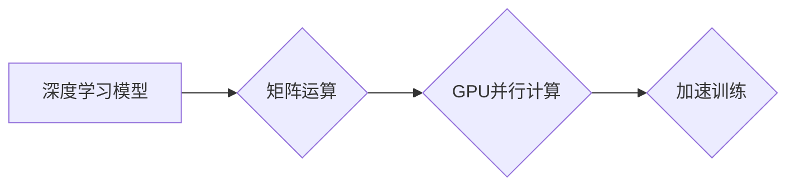

## GPU在AI算力中的作用

> 关键词：GPU、AI、深度学习、并行计算、算力、CUDA、TensorFlow、PyTorch

## 1. 背景介绍

人工智能（AI）近年来发展迅速，深度学习作为其重要分支，在图像识别、自然语言处理、语音识别等领域取得了突破性进展。深度学习模型的训练需要大量的计算资源，传统的CPU架构难以满足其需求。GPU（图形处理单元）凭借其强大的并行计算能力，成为深度学习训练的理想选择。

早期，CPU主要用于处理顺序计算，而GPU擅长处理大量并行计算。深度学习模型的训练本质上是大量的矩阵运算，GPU的并行架构能够显著加速这些运算，从而大幅提升训练效率。

## 2. 核心概念与联系

### 2.1  CPU与GPU架构差异

* **CPU（中央处理器）**：采用串行处理架构，每个核心处理一个任务，效率高但并行能力有限。
* **GPU（图形处理单元）**：采用并行处理架构，拥有大量较简单的核心，能够同时处理多个任务，并行能力强但单核性能相对较弱。

### 2.2  深度学习与GPU的结合

深度学习模型的训练主要依赖于矩阵运算，而GPU的并行架构能够高效处理这些运算。将深度学习模型移植到GPU上，可以大幅提升训练速度。

**Mermaid 流程图**



## 3. 核心算法原理 & 具体操作步骤

### 3.1  算法原理概述

深度学习算法的核心是神经网络，它由多个层组成，每层包含多个神经元。神经元之间通过连接权重进行信息传递，通过训练调整这些权重，使模型能够学习数据中的模式。

GPU加速深度学习训练主要依赖于以下算法：

* **卷积神经网络（CNN）**：用于图像识别等任务，通过卷积操作提取图像特征。
* **循环神经网络（RNN）**：用于自然语言处理等任务，能够处理序列数据。
* **反向传播算法（Backpropagation）**：用于训练神经网络，通过计算误差反向传播，更新神经元权重。

### 3.2  算法步骤详解

1. **数据预处理**：将原始数据转换为模型可处理的格式。
2. **模型构建**：定义神经网络结构，包括层数、神经元数量、激活函数等。
3. **模型训练**：使用训练数据训练模型，通过反向传播算法更新神经元权重。
4. **模型评估**：使用测试数据评估模型性能，例如准确率、召回率等。
5. **模型部署**：将训练好的模型部署到实际应用场景中。

### 3.3  算法优缺点

**优点：**

* **高并行性**：GPU能够并行处理大量数据，显著加速训练速度。
* **高计算效率**：GPU拥有大量的计算单元，能够高效执行矩阵运算。
* **广泛应用**：深度学习算法在图像识别、自然语言处理、语音识别等领域都有广泛应用。

**缺点：**

* **内存限制**：GPU的内存容量相对较小，难以处理超大规模数据。
* **编程复杂性**：使用GPU进行深度学习开发需要掌握CUDA等编程语言和框架。
* **成本较高**：高性能GPU的成本相对较高。

### 3.4  算法应用领域

* **图像识别**：人脸识别、物体检测、图像分类等。
* **自然语言处理**：机器翻译、文本摘要、情感分析等。
* **语音识别**：语音转文本、语音助手等。
* **推荐系统**：商品推荐、内容推荐等。
* **医疗诊断**：疾病诊断、影像分析等。

## 4. 数学模型和公式 & 详细讲解 & 举例说明

### 4.1  数学模型构建

深度学习模型的核心是神经网络，它可以看作一个复杂的函数映射。输入数据经过多个层的神经元处理，最终输出预测结果。

**神经网络模型**

$$
y = f(W_L \cdot a_{L-1} + b_L)
$$

其中：

* $y$：输出结果
* $f$：激活函数
* $W_L$：第L层的权重矩阵
* $a_{L-1}$：第L-1层的激活值
* $b_L$：第L层的偏置向量

### 4.2  公式推导过程

反向传播算法用于训练神经网络，其核心思想是通过计算误差反向传播，更新神经元权重。

**误差函数**

$$
E = \frac{1}{2} \sum_{i=1}^{N} (y_i - \hat{y}_i)^2
$$

其中：

* $E$：误差
* $N$：样本数量
* $y_i$：真实值
* $\hat{y}_i$：预测值

**权重更新公式**

$$
\Delta W = -\eta \frac{\partial E}{\partial W}
$$

其中：

* $\Delta W$：权重更新量
* $\eta$：学习率

### 4.3  案例分析与讲解

以图像分类为例，假设我们使用CNN模型训练一个识别猫狗的分类器。训练过程中，模型会不断调整权重，使得输出结果与真实标签尽可能接近。

通过反向传播算法，我们可以计算出每个神经元的误差，并根据误差更新其权重。经过多次迭代训练，模型最终能够准确识别猫狗图像。

## 5. 项目实践：代码实例和详细解释说明

### 5.1  开发环境搭建

* **操作系统**：Linux、Windows、macOS
* **CUDA Toolkit**：用于开发GPU加速应用程序
* **深度学习框架**：TensorFlow、PyTorch

### 5.2  源代码详细实现

```python
import tensorflow as tf

# 定义模型结构
model = tf.keras.models.Sequential([
    tf.keras.layers.Conv2D(32, (3, 3), activation='relu', input_shape=(28, 28, 1)),
    tf.keras.layers.MaxPooling2D((2, 2)),
    tf.keras.layers.Conv2D(64, (3, 3), activation='relu'),
    tf.keras.layers.MaxPooling2D((2, 2)),
    tf.keras.layers.Flatten(),
    tf.keras.layers.Dense(10, activation='softmax')
])

# 编译模型
model.compile(optimizer='adam',
              loss='sparse_categorical_crossentropy',
              metrics=['accuracy'])

# 训练模型
model.fit(x_train, y_train, epochs=10)

# 评估模型
loss, accuracy = model.evaluate(x_test, y_test)
print('Test loss:', loss)
print('Test accuracy:', accuracy)
```

### 5.3  代码解读与分析

* **模型定义**：使用TensorFlow框架定义一个简单的CNN模型，包含卷积层、池化层和全连接层。
* **模型编译**：选择优化器、损失函数和评估指标。
* **模型训练**：使用训练数据训练模型，指定训练轮数。
* **模型评估**：使用测试数据评估模型性能。

### 5.4  运行结果展示

训练完成后，模型会输出测试集上的损失值和准确率。

## 6. 实际应用场景

* **图像识别**：自动驾驶、人脸识别、物体检测、医疗影像分析等。
* **自然语言处理**：机器翻译、文本摘要、情感分析、聊天机器人等。
* **语音识别**：语音转文本、语音助手、语音搜索等。
* **推荐系统**：商品推荐、内容推荐、个性化服务等。

### 6.4  未来应用展望

* **边缘计算**：将深度学习模型部署到边缘设备，实现实时推理。
* **增强现实/虚拟现实**：利用深度学习技术增强现实和虚拟现实体验。
* **科学研究**：加速药物研发、材料科学研究等。

## 7. 工具和资源推荐

### 7.1  学习资源推荐

* **书籍**：
    * Deep Learning by Ian Goodfellow, Yoshua Bengio, and Aaron Courville
    * Hands-On Machine Learning with Scikit-Learn, Keras & TensorFlow by Aurélien Géron
* **在线课程**：
    * Coursera: Deep Learning Specialization
    * Udacity: Deep Learning Nanodegree
* **博客和网站**：
    * TensorFlow Blog: https://blog.tensorflow.org/
    * PyTorch Blog: https://pytorch.org/blog/

### 7.2  开发工具推荐

* **深度学习框架**：TensorFlow、PyTorch、Keras
* **GPU加速库**：CUDA、cuDNN
* **IDE**：VS Code、PyCharm

### 7.3  相关论文推荐

* **ImageNet Classification with Deep Convolutional Neural Networks** by Alex Krizhevsky, Ilya Sutskever, and Geoffrey E. Hinton
* **Sequence to Sequence Learning with Neural Networks** by Ilya Sutskever, Oriol Vinyals, and Quoc V. Le

## 8. 总结：未来发展趋势与挑战

### 8.1  研究成果总结

GPU在深度学习领域取得了巨大成功，加速了模型训练速度，推动了深度学习技术的广泛应用。

### 8.2  未来发展趋势

* **更高效的GPU架构**：GPU架构将继续朝着更高效、更高性能的方向发展。
* **混合精度训练**：使用混合精度计算可以进一步提升训练效率。
* **自动机器学习**：自动机器学习技术将简化深度学习模型开发流程。

### 8.3  面临的挑战

* **数据规模和效率**：深度学习模型对数据量的需求不断增加，如何高效获取和处理海量数据是一个挑战。
* **模型可解释性**：深度学习模型的决策过程难以解释，如何提高模型可解释性是一个重要研究方向。
* **伦理和安全问题**：深度学习技术可能带来伦理和安全问题，需要加强相关研究和监管。

### 8.4  研究展望

未来，GPU技术将继续推动深度学习的发展，在更多领域发挥重要作用。研究人员将继续探索更高效的GPU架构、混合精度训练方法、自动机器学习技术等，以解决深度学习面临的挑战，推动人工智能技术的进步。

## 9. 附录：常见问题与解答

* **Q：如何选择合适的GPU？**

A：选择GPU需要考虑计算能力、内存容量、价格等因素。

* **Q：如何使用CUDA进行GPU编程？**

A：CUDA Toolkit提供了丰富的开发工具和文档，可以帮助开发者学习和使用CUDA进行GPU编程。

* **Q：如何优化深度学习模型的训练效率？**

A：可以通过使用混合精度训练、数据并行、模型并行等方法优化深度学习模型的训练效率。


作者：禅与计算机程序设计艺术 / Zen and the Art of Computer Programming 
