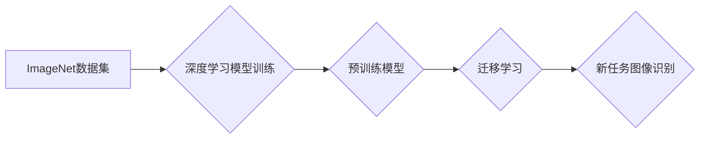

## ImageNet对人工智能的影响

> 关键词：ImageNet, 深度学习, 计算机视觉, 迁移学习, 识别, 分类, 预训练模型

## 1. 背景介绍

20世纪90年代末，随着互联网的快速发展和数据量的激增，计算机视觉领域迎来了新的机遇。然而，当时计算机视觉算法的性能仍然有限，缺乏大规模标注数据集的支撑。2009年，斯坦福大学的研究人员发布了ImageNet数据集，这是一个包含超过1400万张图像的巨大图像识别数据集，涵盖了超过2万个类别。ImageNet的发布标志着计算机视觉领域进入了一个新的时代，为深度学习算法的训练提供了充足的数据支持。

## 2. 核心概念与联系

ImageNet数据集的构建和应用，推动了深度学习在计算机视觉领域的快速发展。

**2.1  ImageNet数据集**

ImageNet数据集是一个由大量图像组成的分类数据集，每个图像都经过人工标注，明确地标记了其所属类别。它涵盖了广泛的主题和场景，例如动物、植物、物体、人物等，并采用层次结构进行组织，方便进行图像分类和识别任务。

**2.2  深度学习**

深度学习是一种机器学习的子领域，它利用多层神经网络来模拟人类大脑的学习过程。深度学习算法能够从海量数据中自动提取特征，并学习复杂的模式，从而实现图像识别、自然语言处理、语音识别等任务。

**2.3  迁移学习**

迁移学习是一种利用预训练模型进行新任务学习的技术。由于ImageNet数据集规模庞大，预训练在ImageNet数据集上的模型已经学习到了丰富的图像特征，这些特征可以迁移到其他图像识别任务中，提高模型的性能。

**2.4  流程图**



## 3. 核心算法原理 & 具体操作步骤

### 3.1  算法原理概述

深度学习算法的核心是多层神经网络。神经网络由多个层组成，每一层包含多个神经元。每个神经元接收来自上一层的输入信号，并通过激活函数进行处理，输出到下一层。通过多层神经网络的叠加，深度学习算法能够学习到图像的抽象特征，最终实现图像识别和分类。

### 3.2  算法步骤详解

1. **数据预处理:** 将图像数据进行预处理，例如调整大小、归一化等，使其适合深度学习模型的输入。
2. **模型构建:** 选择合适的深度学习模型架构，例如卷积神经网络（CNN）。
3. **模型训练:** 使用ImageNet数据集训练深度学习模型，通过反向传播算法调整模型参数，使其能够准确地识别图像类别。
4. **模型评估:** 使用测试数据集评估模型的性能，例如准确率、召回率等。
5. **模型部署:** 将训练好的模型部署到实际应用场景中，例如图像识别系统。

### 3.3  算法优缺点

**优点:**

* **高准确率:** 深度学习算法能够学习到图像的复杂特征，实现高准确率的图像识别。
* **自动化特征提取:** 深度学习算法能够自动提取图像特征，无需人工特征工程。
* **迁移学习能力:** 预训练模型可以迁移到其他图像识别任务中，提高模型性能。

**缺点:**

* **数据依赖:** 深度学习算法需要大量的训练数据，数据质量直接影响模型性能。
* **计算资源消耗:** 训练深度学习模型需要大量的计算资源，训练时间较长。
* **可解释性差:** 深度学习模型的决策过程难以解释，缺乏透明度。

### 3.4  算法应用领域

深度学习算法在图像识别领域有着广泛的应用，例如：

* **图像分类:** 将图像分类到预定义的类别中，例如识别动物、植物、物体等。
* **目标检测:** 在图像中检测到特定目标，并对其进行定位和识别。
* **图像分割:** 将图像分割成不同的区域，例如分割图像中的前景和背景。
* **图像生成:** 生成新的图像，例如生成人脸、风景等。

## 4. 数学模型和公式 & 详细讲解 & 举例说明

### 4.1  数学模型构建

深度学习模型的数学模型通常基于神经网络，每个神经元接收输入信号，并通过激活函数进行处理，输出到下一层。

**4.1.1  神经网络模型**

一个简单的多层感知机（MLP）模型可以表示为：

$$
y = f(W^L x^L + b^L)
$$

其中：

* $y$ 是模型的输出
* $x^L$ 是第 $L$ 层的输入
* $W^L$ 是第 $L$ 层的权重矩阵
* $b^L$ 是第 $L$ 层的偏置向量
* $f$ 是激活函数

**4.1.2  卷积神经网络模型**

卷积神经网络（CNN）是一种专门用于处理图像数据的深度学习模型。CNN模型的核心是卷积层和池化层。

* **卷积层:** 使用卷积核对输入图像进行卷积运算，提取图像特征。
* **池化层:** 对卷积层的输出进行池化操作，例如最大池化，减少特征图的大小，提高模型的鲁棒性。

### 4.2  公式推导过程

深度学习模型的训练过程基于梯度下降算法，通过反向传播算法更新模型参数。

**4.2.1  损失函数**

损失函数用于衡量模型预测结果与真实结果之间的差异。常见的损失函数包括均方误差（MSE）和交叉熵损失（Cross-Entropy Loss）。

**4.2.2  梯度下降算法**

梯度下降算法通过迭代更新模型参数，最小化损失函数的值。

$$
\theta = \theta - \alpha \nabla L(\theta)
$$

其中：

* $\theta$ 是模型参数
* $\alpha$ 是学习率
* $\nabla L(\theta)$ 是损失函数对模型参数的梯度

### 4.3  案例分析与讲解

**4.3.1  ImageNet图像分类任务**

在ImageNet图像分类任务中，深度学习模型通常使用交叉熵损失函数作为损失函数，并使用随机梯度下降算法进行训练。

**4.3.2  迁移学习应用**

在迁移学习应用中，预训练模型的权重可以作为新任务模型的初始值，从而提高新任务模型的性能。

## 5. 项目实践：代码实例和详细解释说明

### 5.1  开发环境搭建

使用Python语言和深度学习框架TensorFlow或PyTorch进行开发。

### 5.2  源代码详细实现

```python
# 使用TensorFlow构建一个简单的CNN模型
import tensorflow as tf

model = tf.keras.models.Sequential([
    tf.keras.layers.Conv2D(32, (3, 3), activation='relu', input_shape=(224, 224, 3)),
    tf.keras.layers.MaxPooling2D((2, 2)),
    tf.keras.layers.Conv2D(64, (3, 3), activation='relu'),
    tf.keras.layers.MaxPooling2D((2, 2)),
    tf.keras.layers.Flatten(),
    tf.keras.layers.Dense(1000, activation='softmax')
])

model.compile(optimizer='adam',
              loss='sparse_categorical_crossentropy',
              metrics=['accuracy'])

# 使用ImageNet数据集训练模型
model.fit(train_images, train_labels, epochs=10)
```

### 5.3  代码解读与分析

* **模型构建:** 使用TensorFlow的Sequential API构建一个简单的CNN模型，包含卷积层、池化层和全连接层。
* **模型编译:** 使用Adam优化器、交叉熵损失函数和准确率作为评估指标编译模型。
* **模型训练:** 使用ImageNet数据集训练模型，训练10个epochs。

### 5.4  运行结果展示

训练完成后，可以使用测试数据集评估模型的性能，例如准确率。

## 6. 实际应用场景

ImageNet数据集和深度学习算法在计算机视觉领域有着广泛的应用场景，例如：

### 6.1  图像识别

* **自动驾驶:** 用于识别道路标志、交通信号灯、行人等。
* **医疗诊断:** 用于识别病变区域、辅助医生诊断疾病。
* **安防监控:** 用于识别嫌疑人、监控异常行为。

### 6.2  图像搜索

* **电商平台:** 用于根据用户上传的图片搜索相似商品。
* **图片分享网站:** 用于根据图片内容进行搜索和分类。

### 6.3  内容推荐

* **社交媒体平台:** 用于根据用户浏览历史推荐相关图片和视频。
* **新闻网站:** 用于根据用户阅读兴趣推荐相关图片新闻。

### 6.4  未来应用展望

随着深度学习算法的不断发展，ImageNet数据集和相关技术将在未来应用领域得到更广泛的应用，例如：

* **增强现实 (AR) 和虚拟现实 (VR):** 用于识别现实世界中的物体，并将其与虚拟世界进行交互。
* **机器人视觉:** 用于帮助机器人理解和感知周围环境。
* **艺术创作:** 用于生成新的图像和艺术作品。

## 7. 工具和资源推荐

### 7.1  学习资源推荐

* **书籍:**
    * Deep Learning by Ian Goodfellow, Yoshua Bengio, and Aaron Courville
    * Computer Vision: Algorithms and Applications by Richard Szeliski
* **在线课程:**
    * Stanford CS231n: Convolutional Neural Networks for Visual Recognition
    * Coursera: Deep Learning Specialization

### 7.2  开发工具推荐

* **深度学习框架:** TensorFlow, PyTorch, Keras
* **图像处理库:** OpenCV, Pillow

### 7.3  相关论文推荐

* **ImageNet Classification with Deep Convolutional Neural Networks** by Alex Krizhevsky, Ilya Sutskever, and Geoffrey E. Hinton
* **Going Deeper with Convolutions** by V. Szegedy et al.
* **ResNet: Deep Residual Learning for Image Recognition** by Kaiming He et al.

## 8. 总结：未来发展趋势与挑战

### 8.1  研究成果总结

ImageNet数据集和深度学习算法的结合，推动了计算机视觉领域取得了巨大进步，例如图像识别准确率大幅提升，应用场景不断扩展。

### 8.2  未来发展趋势

* **模型更深更广:** 研究更深层次、更广阔的深度学习模型，例如Transformer网络，提高模型的表达能力和泛化能力。
* **数据更丰富更多样:** 收集和构建更丰富、更多样化的图像数据集，例如跨语言、跨文化、跨场景的数据集，提高模型的鲁棒性和适应性。
* **解释性更强:** 研究更具解释性的深度学习模型，例如可解释深度学习（XAI），提高模型的透明度和可信度。

### 8.3  面临的挑战

* **数据标注成本高:** 大规模图像数据集的标注成本很高，需要开发更有效的标注方法和工具。
* **计算资源需求大:** 训练大型深度学习模型需要大量的计算资源，需要开发更有效的训练方法和硬件平台。
* **模型安全性与可信度:** 深度学习模型容易受到攻击和操纵，需要研究更安全的模型训练和部署方法。

### 8.4  研究展望

未来，ImageNet数据集和深度学习算法将继续推动计算机视觉领域的发展，并应用于更多领域，例如医疗、教育、娱乐等，为人类社会带来更多福祉。

## 9. 附录：常见问题与解答

### 9.1  ImageNet数据集的规模有多大？

ImageNet数据集包含超过1400万张图像，涵盖超过2万个类别。

### 9.2  ImageNet数据集的获取方式？

ImageNet数据集可以通过官方网站下载。

### 9.3  如何使用ImageNet数据集进行深度学习模型训练？