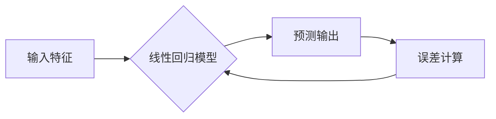

## Python机器学习实战：理解并实现线性回归算法

> 关键词：线性回归，机器学习，Python，scikit-learn，特征工程，模型评估，预测

## 1. 背景介绍

机器学习作为人工智能领域的核心技术之一，在各个领域都取得了令人瞩目的成就。从推荐系统到图像识别，从自然语言处理到医疗诊断，机器学习算法无处不在。其中，线性回归作为机器学习入门级的算法之一，具有简单易懂、易于实现的特点，是理解机器学习基本原理的绝佳起点。

本篇文章将带领读者深入了解线性回归算法，从核心概念到具体实现，再到实际应用场景，全面剖析其原理、步骤、优缺点以及应用领域。通过Python语言和scikit-learn库的实践，读者将能够掌握线性回归算法的应用技巧，并将其应用于实际项目中。

## 2. 核心概念与联系

线性回归是一种监督学习算法，旨在学习输入特征与输出目标变量之间的线性关系。其核心思想是找到一条直线或超平面，能够最佳地拟合训练数据中的样本点。

**2.1 线性关系**

线性关系是指两个变量之间存在一个比例关系，可以用一条直线表示。例如，房屋面积与价格之间可能存在线性关系，即房屋面积越大，价格也越高。

**2.2 监督学习**

监督学习是指利用已知输入输出对的训练数据，学习一个映射关系，从而能够预测新的输入数据的输出。线性回归属于监督学习的一种，因为其需要训练数据中的输入特征和对应的目标变量。

**2.3 拟合**

拟合是指找到一条直线或超平面，能够最佳地逼近训练数据中的样本点。线性回归的目标就是找到一条最佳拟合直线，使得预测值与真实值之间的误差最小。

**2.4 误差**

误差是指预测值与真实值之间的差异。线性回归算法的目标是找到一条直线，使得误差最小。常用的误差指标包括均方误差（MSE）和均方根误差（RMSE）。

**2.5 模型**

模型是指用来描述输入特征与输出目标变量之间关系的数学表达式。线性回归模型的数学表达式为：

```
y = w0 + w1*x1 + w2*x2 +... + wn*xn
```

其中：

* y 是目标变量
* x1, x2,..., xn 是输入特征
* w0, w1, w2,..., wn 是模型参数

**Mermaid 流程图**



## 3. 核心算法原理 & 具体操作步骤

### 3.1 算法原理概述

线性回归算法的核心思想是找到一条直线或超平面，能够最佳地拟合训练数据中的样本点。

**3.1.1 最小二乘法**

线性回归算法通常采用最小二乘法来寻找最佳拟合直线。最小二乘法是指寻找一条直线，使得所有样本点到直线的距离之和最小。

**3.1.2 参数估计**

线性回归模型的参数（w0, w1, w2,..., wn）可以通过最小二乘法进行估计。最小二乘法将误差平方和作为目标函数，利用梯度下降算法或其他优化算法，不断调整参数，直到找到使误差平方和最小的参数值。

### 3.2 算法步骤详解

1. **数据准备:** 首先需要收集和准备训练数据，包括输入特征和对应的目标变量。

2. **特征工程:** 对输入特征进行预处理，例如数据清洗、特征缩放、特征转换等，以提高模型的性能。

3. **模型训练:** 使用最小二乘法或其他优化算法，训练线性回归模型，得到模型参数。

4. **模型评估:** 使用测试数据评估模型的性能，常用的指标包括均方误差（MSE）和均方根误差（RMSE）。

5. **模型预测:** 将训练好的模型应用于新的数据，预测目标变量的值。

### 3.3 算法优缺点

**优点:**

* 简单易懂，易于实现。
* 计算效率高，训练速度快。
* 可解释性强，模型参数的含义易于理解。

**缺点:**

* 只能学习线性关系，对于非线性关系的预测效果较差。
* 对异常值敏感，容易受到异常值的影响。
* 假设误差服从正态分布，实际应用中可能不满足此假设。

### 3.4 算法应用领域

线性回归算法广泛应用于各个领域，例如：

* **预测分析:** 预测销售额、房价、股票价格等。
* **风险评估:** 评估贷款风险、信用风险等。
* **广告投放:** 预测广告点击率、转化率等。
* **医疗诊断:** 预测疾病风险、治疗效果等。

## 4. 数学模型和公式 & 详细讲解 & 举例说明

### 4.1 数学模型构建

线性回归模型的数学表达式为：

$$
y = w0 + w1*x1 + w2*x2 +... + wn*xn
$$

其中：

* y 是目标变量
* x1, x2,..., xn 是输入特征
* w0, w1, w2,..., wn 是模型参数

### 4.2 公式推导过程

最小二乘法目标是找到一条直线，使得所有样本点到直线的距离之和最小。

假设我们有n个样本点，每个样本点都有m个特征，目标变量为y。

则误差平方和为：

$$
SSE = \sum_{i=1}^{n}(y_i - \hat{y}_i)^2
$$

其中：

* $y_i$ 是第i个样本点的真实目标变量值
* $\hat{y}_i$ 是第i个样本点的预测目标变量值

为了最小化SSE，我们需要找到最佳的模型参数w0, w1, w2,..., wn。

可以使用梯度下降算法或其他优化算法，不断调整参数，直到找到使SSE最小的参数值。

### 4.3 案例分析与讲解

**示例:** 假设我们想要预测房屋价格，输入特征包括房屋面积和房间数量。

我们可以收集一些房屋数据，包括房屋面积、房间数量和价格。

然后，使用线性回归算法训练模型，得到模型参数。

最终，我们可以使用训练好的模型预测新的房屋价格。

## 5. 项目实践：代码实例和详细解释说明

### 5.1 开发环境搭建

本项目使用Python语言和scikit-learn库进行实现。

需要安装Python和scikit-learn库。

可以使用pip命令进行安装：

```
pip install scikit-learn
```

### 5.2 源代码详细实现

```python
import pandas as pd
from sklearn.linear_model import LinearRegression
from sklearn.model_selection import train_test_split
from sklearn.metrics import mean_squared_error

# 加载数据
data = pd.read_csv('housing.csv')

# 选择特征和目标变量
X = data[['面积', '房间']]
y = data['价格']

# 将数据分为训练集和测试集
X_train, X_test, y_train, y_test = train_test_split(X, y, test_size=0.2, random_state=42)

# 创建线性回归模型
model = LinearRegression()

# 训练模型
model.fit(X_train, y_train)

# 预测测试集数据
y_pred = model.predict(X_test)

# 计算均方误差
mse = mean_squared_error(y_test, y_pred)

# 打印结果
print('均方误差:', mse)
```

### 5.3 代码解读与分析

1. **数据加载:** 使用pandas库加载数据，并选择特征和目标变量。

2. **数据分割:** 将数据分为训练集和测试集，用于模型训练和评估。

3. **模型创建:** 使用scikit-learn库中的LinearRegression类创建线性回归模型。

4. **模型训练:** 使用模型的fit方法训练模型，输入训练数据和目标变量。

5. **模型预测:** 使用模型的predict方法预测测试集数据。

6. **模型评估:** 使用均方误差（MSE）作为评估指标，计算预测值与真实值之间的误差。

### 5.4 运行结果展示

运行代码后，会输出模型的均方误差值。

均方误差值越小，模型的预测效果越好。

## 6. 实际应用场景

线性回归算法在实际应用中具有广泛的应用场景，例如：

**6.1 房屋价格预测:**

根据房屋面积、房间数量、位置等特征，预测房屋价格。

**6.2 股票价格预测:**

根据股票历史数据、市场指数、公司财务数据等特征，预测股票价格。

**6.3 销售额预测:**

根据历史销售数据、市场趋势、促销活动等特征，预测未来销售额。

**6.4 医疗诊断:**

根据患者症状、检查结果、病史等特征，预测疾病风险或治疗效果。

### 6.4 未来应用展望

随着机器学习技术的不断发展，线性回归算法也将不断得到改进和优化。

未来，线性回归算法可能在以下方面得到应用：

* **更复杂的模型:** 将线性回归与其他机器学习算法结合，构建更复杂的模型，能够处理更复杂的非线性关系。
* **大规模数据处理:** 利用分布式计算技术，处理更大规模的数据，提高模型的精度和泛化能力。
* **实时预测:** 利用云计算技术，实现实时数据处理和预测，满足实时决策的需求。

## 7. 工具和资源推荐

### 7.1 学习资源推荐

* **书籍:**

    * 《Python机器学习实战》
    * 《机器学习》

* **在线课程:**

    * Coursera上的机器学习课程
    * edX上的机器学习课程

### 7.2 开发工具推荐

* **Python:** 

    * Python官网: https://www.python.org/

* **scikit-learn:**

    * scikit-learn官网: https://scikit-learn.org/stable/

* **Jupyter Notebook:**

    * Jupyter Notebook官网: https://jupyter.org/

### 7.3 相关论文推荐

* **The Elements of Statistical Learning:**

    * https://hastie.su.domains/ElemStatLearn/

## 8. 总结：未来发展趋势与挑战

### 8.1 研究成果总结

线性回归算法作为机器学习入门级的算法，在理解机器学习基本原理方面具有重要意义。

其简单易懂、易于实现的特点，使其成为许多机器学习初学者学习的起点。

### 8.2 未来发展趋势

未来，线性回归算法将继续朝着以下方向发展：

* **模型复杂度提升:** 将线性回归与其他机器学习算法结合，构建更复杂的模型，能够处理更复杂的非线性关系。
* **数据处理能力增强:** 利用分布式计算技术，处理更大规模的数据，提高模型的精度和泛化能力。
* **应用场景拓展:** 将线性回归应用于更多新的领域，例如自然语言处理、图像识别等。

### 8.3 面临的挑战

线性回归算法也面临着一些挑战：

* **对异常值敏感:** 线性回归算法容易受到异常值的影响，需要进行数据预处理，降低异常值的影响。
* **只能学习线性关系:** 线性回归算法只能学习线性关系，对于非线性关系的预测效果较差。
* **假设误差服从正态分布:** 线性回归算法假设误差服从正态分布，实际应用中可能不满足此假设。

### 8.4 研究展望

未来，研究人员将继续探索如何改进线性回归算法，使其能够更好地处理非线性关系、异常值和非正态分布的误差。

## 9. 附录：常见问题与解答

**问题 1:** 如何选择合适的特征？

**解答:** 特征选择