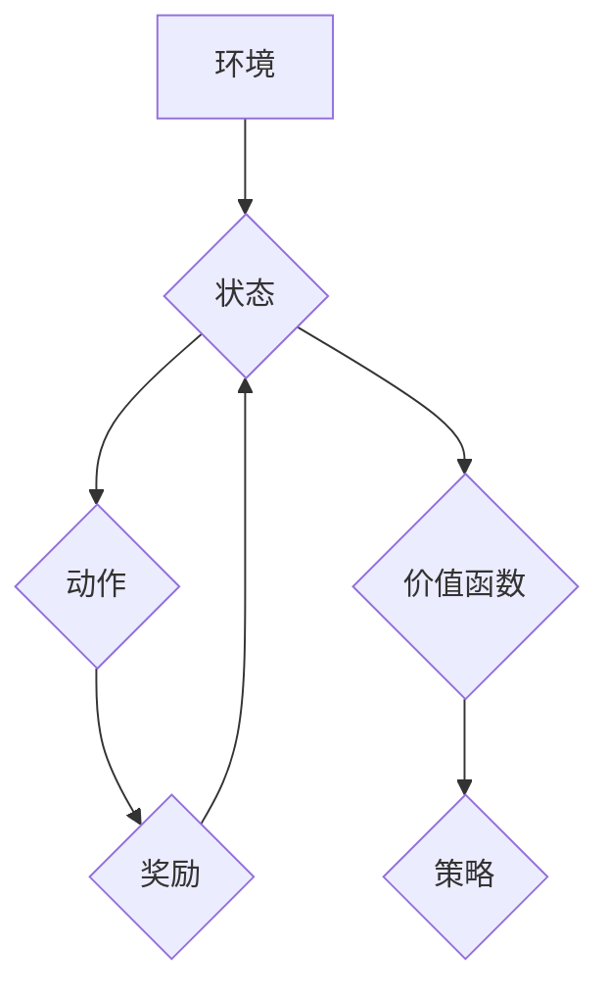

## Q-Learning 原理与代码实例讲解

> 关键词：强化学习，Q-Learning，价值函数，贪婪策略，Bellman方程，深度强化学习

## 1. 背景介绍

强化学习 (Reinforcement Learning, RL) 作为机器学习的一个重要分支，近年来在人工智能领域取得了显著进展。它与监督学习和无监督学习不同，强化学习算法通过与环境的交互学习，通过不断尝试和反馈，最终找到最优的策略来最大化累积奖励。

Q-Learning 作为强化学习中最经典的算法之一，其核心思想是学习一个价值函数，该函数估计在特定状态下采取特定动作所能获得的长期奖励。通过不断更新价值函数，Q-Learning 算法可以逐步逼近最优策略。

## 2. 核心概念与联系

**2.1 核心概念**

* **状态 (State):**  表示系统当前的状况。
* **动作 (Action):**  在特定状态下可以采取的行动。
* **奖励 (Reward):**  系统在采取某个动作后获得的反馈，可以是正向奖励或负向惩罚。
* **价值函数 (Value Function):**  估计在特定状态下采取特定动作所能获得的长期奖励。
* **策略 (Policy):**  决定在特定状态下采取哪个动作的规则。

**2.2  Q-Learning 架构**



**2.3  Q-Learning 的工作原理**

Q-Learning 算法通过不断与环境交互，更新价值函数，最终学习到最优策略。

1.  **初始化:**  价值函数 Q(s, a)  被初始化为一个小的随机值。
2.  **状态选择:**  从当前状态 s 中选择一个动作 a。
3.  **环境交互:**  执行动作 a，进入下一个状态 s'，并获得奖励 r。
4.  **价值更新:**  更新价值函数 Q(s, a)  根据 Bellman 方程:

 $$Q(s, a) \leftarrow Q(s, a) + \alpha [r + \gamma \max_{a'} Q(s', a') - Q(s, a)]$$

其中：

*   $\alpha$ 是学习率，控制着学习速度。
*   $\gamma$ 是折扣因子，控制着未来奖励的权重。
*   $\max_{a'} Q(s', a')$ 是下一个状态 s' 下所有动作的价值函数的最大值。

5.  **策略选择:**  根据更新后的价值函数，选择最优动作。

## 3. 核心算法原理 & 具体操作步骤

**3.1 算法原理概述**

Q-Learning 算法的核心是学习一个价值函数 Q(s, a)，该函数估计在状态 s 下采取动作 a 的长期奖励。通过不断更新价值函数，Q-Learning 算法可以逐步逼近最优策略。

**3.2 算法步骤详解**

1.  **初始化:**  随机初始化价值函数 Q(s, a)  。
2.  **环境交互:**  与环境交互，获取当前状态 s 和奖励 r。
3.  **动作选择:**  根据当前状态 s 和价值函数 Q(s, a)，选择一个动作 a。
4.  **状态更新:**  执行动作 a，进入下一个状态 s'。
5.  **价值更新:**  根据 Bellman 方程更新价值函数 Q(s, a):

 $$Q(s, a) \leftarrow Q(s, a) + \alpha [r + \gamma \max_{a'} Q(s', a') - Q(s, a)]$$

6.  **重复步骤 2-5:**  重复以上步骤，直到达到终止条件。

**3.3 算法优缺点**

**优点:**

*   **相对简单:**  Q-Learning 算法的原理和实现都比较简单。
*   **广泛适用:**  Q-Learning 算法可以应用于各种强化学习问题。
*   **能够学习最优策略:**  Q-Learning 算法可以学习到最优策略，即使环境是动态变化的。

**缺点:**

*   **探索与利用的权衡:**  Q-Learning 算法需要平衡探索新动作和利用已知策略之间的权衡。
*   **状态空间爆炸:**  对于高维状态空间的问题，Q-Learning 算法可能会遇到状态空间爆炸的问题。

**3.4 算法应用领域**

Q-Learning 算法在许多领域都有应用，例如：

*   **游戏 AI:**  训练游戏 AI 玩家，例如 AlphaGo。
*   **机器人控制:**  控制机器人完成各种任务，例如导航、抓取。
*   **推荐系统:**  根据用户的历史行为推荐物品。
*   **金融交易:**  开发自动交易策略。

## 4. 数学模型和公式 & 详细讲解 & 举例说明

**4.1 数学模型构建**

强化学习问题可以建模为一个马尔可夫决策过程 (MDP)，其中包含以下元素：

*   **状态空间 S:**  所有可能的系统状态的集合。
*   **动作空间 A:**  在每个状态下可以采取的所有动作的集合。
*   **转移概率 P(s', r | s, a):**  从状态 s 执行动作 a 后进入状态 s' 并获得奖励 r 的概率。
*   **奖励函数 R(s, a):**  在状态 s 执行动作 a 后获得的奖励。
*   **折扣因子 γ:**  控制着未来奖励的权重，0 ≤ γ ≤ 1。

**4.2 公式推导过程**

Q-Learning 算法的目标是学习一个价值函数 Q(s, a)，该函数估计在状态 s 下采取动作 a 的长期奖励。

Bellman 方程是 Q-Learning 算法的核心公式，它描述了价值函数的更新规则:

$$Q(s, a) \leftarrow Q(s, a) + \alpha [r + \gamma \max_{a'} Q(s', a') - Q(s, a)]$$

其中：

*   $\alpha$ 是学习率，控制着学习速度。
*   $r$ 是从状态 s 执行动作 a 后获得的奖励。
*   $s'$ 是执行动作 a 后进入的下一个状态。
*   $\max_{a'} Q(s', a')$ 是下一个状态 s' 下所有动作的价值函数的最大值。

**4.3 案例分析与讲解**

假设有一个简单的环境，其中有一个机器人需要在两个状态之间移动，每个状态都有两个动作可以选择。

*   状态空间 S = {s1, s2}
*   动作空间 A = {left, right}
*   转移概率和奖励函数如下表所示:

| 状态 | 动作 | 下一个状态 | 奖励 |
|---|---|---|---|
| s1 | left | s2 | 1 |
| s1 | right | s1 | 0 |
| s2 | left | s1 | 0 |
| s2 | right | s2 | 1 |

Q-Learning 算法可以学习到以下价值函数:

*   Q(s1, left) = 1
*   Q(s1, right) = 0
*   Q(s2, left) = 0
*   Q(s2, right) = 1

根据这个价值函数，机器人可以采取最优策略，即从 s1 状态执行 left 动作，从 s2 状态执行 right 动作。

## 5. 项目实践：代码实例和详细解释说明

**5.1 开发环境搭建**

*   Python 3.x
*   OpenAI Gym 库

**5.2 源代码详细实现**

```python
import gym
import numpy as np

# 设置超参数
alpha = 0.1  # 学习率
gamma = 0.9  # 折扣因子
epsilon = 0.1  # 探索率

# 创建环境
env = gym.make('CartPole-v1')

# 初始化 Q-表
q_table = np.zeros((env.observation_space.n, env.action_space.n))

# 训练
for episode in range(1000):
    state = env.reset()
    done = False

    while not done:
        # 探索与利用
        if np.random.uniform(0, 1) < epsilon:
            action = env.action_space.sample()
        else:
            action = np.argmax(q_table[state])

        # 执行动作
        next_state, reward, done, _ = env.step(action)

        # 更新 Q-表
        q_table[state, action] += alpha * (reward + gamma * np.max(q_table[next_state]) - q_table[state, action])

        # 更新状态
        state = next_state

# 测试
state = env.reset()
while True:
    # 选择最优动作
    action = np.argmax(q_table[state])

    # 执行动作
    next_state, reward, done, _ = env.step(action)

    # 显示状态
    env.render()

    # 更新状态
    state = next_state

    # 终止条件
    if done:
        break

env.close()
```

**5.3 代码解读与分析**

*   **超参数设置:**  学习率、折扣因子和探索率是 Q-Learning 算法的关键超参数，需要根据具体问题进行调整。
*   **Q-表初始化:**  Q-表是一个二维数组，用于存储每个状态下每个动作的价值函数。
*   **训练循环:**  训练循环迭代执行多个episode，每个episode中机器人与环境交互，更新 Q-表。
*   **探索与利用:**  在训练过程中，需要平衡探索新动作和利用已知策略之间的权衡。
*   **Q-表更新:**  根据 Bellman 方程更新 Q-表，提高价值函数的准确性。
*   **测试循环:**  测试循环使用训练好的 Q-表，让机器人执行最优策略，观察其表现。

**5.4 运行结果展示**

运行代码后，机器人将在 CartPole 环境中表现出一定的控制能力，能够保持平衡一段时间。

## 6. 实际应用场景

Q-Learning 算法在许多实际应用场景中都有应用，例如：

*   **游戏 AI:**  训练游戏 AI 玩家，例如 AlphaGo。
*   **机器人控制:**  控制机器人完成各种任务，例如导航、抓取。
*   **推荐系统:**  根据用户的历史行为推荐物品。
*   **金融交易:**  开发自动交易策略。

**6.4 未来应用展望**

随着深度学习技术的进步，Q-Learning 算法也得到了发展，例如深度 Q-Learning (Deep Q-Learning)。

深度 Q-Learning 算法使用深度神经网络来估计价值函数，能够处理高维状态空间的问题。

未来，Q-Learning 算法将在更多领域得到应用，例如自动驾驶、医疗诊断、个性化教育等。

## 7. 工具和资源推荐

**7.1 学习资源推荐**

*   **书籍:**
    *   Reinforcement Learning: An Introduction by Richard S. Sutton and Andrew G. Barto
    *   Deep Reinforcement Learning Hands-On by Maxim Lapan

*   **在线课程:**
    *   Deep Reinforcement Learning Specialization by DeepLearning.AI
    *   Reinforcement Learning by David Silver (University of DeepMind)

**7.2 开发工具推荐**

*   **OpenAI Gym:**  一个用于强化学习研究的开源库。
*   **TensorFlow:**  一个用于深度学习的开源库。
*   **PyTorch:**  另一个用于深度学习的开源库。

**7.3 相关论文推荐**

*   Playing Atari with Deep Reinforcement Learning by Mnih et al. (2013)
*   Human-level control through deep reinforcement learning by Mnih et al. (2015)
*   Deep Reinforcement Learning with Double Q-learning by Hasselt et al. (2015