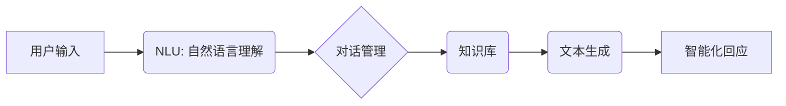

## CUI的上下文记忆与智能化回应

> 关键词：CUI, 上下文记忆, 智能化回应, 自然语言处理, 人机交互, 聊天机器人, 知识图谱

## 1. 背景介绍

随着人工智能技术的飞速发展，人机交互方式也发生了深刻变化。传统的图形用户界面 (GUI) 和命令行界面 (CLI) 逐渐被更自然、更直观的对话式用户界面 (CUI) 所取代。CUI 允许用户使用自然语言与计算机进行交互，更接近人类之间的自然沟通方式。然而，传统的 CUI 系统往往缺乏上下文记忆能力，无法理解用户对话中的隐含信息和语义关联，导致交互体验不够流畅自然。

智能化回应是 CUI 系统的重要功能之一，它要求系统能够理解用户意图，并生成符合语境、逻辑和情感的响应。上下文记忆是实现智能化回应的关键技术，它能够帮助 CUI 系统记住用户之前的对话内容，从而更好地理解当前用户需求，提供更精准、更个性化的服务。

## 2. 核心概念与联系

### 2.1 上下文记忆

上下文记忆是指 CUI 系统能够记住用户之前对话中的信息，并将其用于理解当前用户请求的能力。上下文信息可以包括用户身份、对话历史、用户偏好等。

### 2.2 智能化回应

智能化回应是指 CUI 系统能够根据用户输入和上下文信息，生成符合语境、逻辑和情感的响应。智能化回应需要结合自然语言处理 (NLP)、机器学习 (ML) 和知识图谱 (KG) 等技术。

### 2.3 核心架构

CUI 系统的上下文记忆与智能化回应架构通常包含以下几个模块：

* **自然语言理解 (NLU)** 模块：负责解析用户输入，识别用户意图和实体信息。
* **对话管理 (DM)** 模块：负责管理对话流程，根据用户意图和上下文信息，选择合适的响应策略。
* **知识库 (KB)** 模块：存储系统所掌握的知识，包括常识、领域知识、用户偏好等。
* **文本生成 (TG)** 模块：负责根据对话管理模块的指令，生成符合语境的自然语言响应。

**Mermaid 流程图**



## 3. 核心算法原理 & 具体操作步骤

### 3.1 算法原理概述

上下文记忆与智能化回应的实现通常依赖于以下几种算法：

* **循环神经网络 (RNN)**：RNN 是一种能够处理序列数据的深度学习模型，能够学习对话历史中的上下文信息，并将其用于理解当前用户请求。
* **长短期记忆网络 (LSTM)**：LSTM 是 RNN 的一种改进型，能够更好地处理长序列数据，克服 RNN 的梯度消失问题。
* **Transformer**：Transformer 是一种基于注意力机制的深度学习模型，能够更有效地捕捉对话中的长距离依赖关系。

### 3.2 算法步骤详解

以 LSTM 为例，其用于上下文记忆与智能化回应的具体操作步骤如下：

1. **输入处理**: 将用户输入转换为数字向量，作为 LSTM 的输入。
2. **隐藏状态更新**: LSTM 通过其内部门控机制，根据对话历史中的上下文信息，更新隐藏状态。隐藏状态包含了对话历史中的重要信息。
3. **输出生成**: LSTM 根据当前隐藏状态和用户输入，生成智能化回应的文本序列。

### 3.3 算法优缺点

**RNN 和 LSTM 的优点:**

* 能够处理序列数据，学习对话历史中的上下文信息。
* 在文本生成任务中表现良好。

**RNN 和 LSTM 的缺点:**

* 训练过程复杂，需要大量数据。
* 难以处理长序列数据，存在梯度消失问题。

**Transformer 的优点:**

* 能够更有效地捕捉对话中的长距离依赖关系。
* 训练速度更快，效果更好。

**Transformer 的缺点:**

* 计算量更大，需要更强大的硬件资源。

### 3.4 算法应用领域

上下文记忆与智能化回应算法广泛应用于以下领域:

* **聊天机器人**: 提供更自然、更智能的对话体验。
* **虚拟助理**: 帮助用户完成各种任务，例如设置提醒、查询天气等。
* **客服系统**: 自动处理用户咨询，提高服务效率。
* **教育机器人**: 提供个性化的学习辅导。

## 4. 数学模型和公式 & 详细讲解 & 举例说明

### 4.1 数学模型构建

LSTM 的核心数学模型是其内部门控机制，包括输入门、遗忘门和输出门。这些门控机制通过 sigmoid 函数和 tanh 函数来控制信息的流动。

### 4.2 公式推导过程

LSTM 的公式推导过程比较复杂，涉及到矩阵运算和激活函数。这里只列举一些关键公式：

* **遗忘门**: $f_t = \sigma(W_f \cdot [h_{t-1}, x_t] + b_f)$
* **输入门**: $i_t = \sigma(W_i \cdot [h_{t-1}, x_t] + b_i)$
* **候选细胞状态**: $\tilde{C}_t = \tanh(W_c \cdot [h_{t-1}, x_t] + b_c)$
* **细胞状态**: $C_t = f_t \cdot C_{t-1} + i_t \cdot \tilde{C}_t$
* **输出门**: $o_t = \sigma(W_o \cdot [h_{t-1}, x_t] + b_o)$
* **输出**: $h_t = o_t \cdot \tanh(C_t)$

其中，$h_t$ 是当前时间步的隐藏状态，$C_t$ 是当前时间步的细胞状态，$x_t$ 是当前时间步的输入，$W$ 和 $b$ 分别是权重矩阵和偏置向量，$\sigma$ 是 sigmoid 函数，$\tanh$ 是 tanh 函数。

### 4.3 案例分析与讲解

假设用户输入 "今天天气怎么样"，CUI 系统需要根据上下文信息和知识库，生成智能化回应。

1. NLU 模块识别用户意图为查询天气，实体信息为 "今天"。
2. DM 模块根据用户意图和上下文信息，选择查询当天的天气预报。
3. KB 模块提供当天的天气预报信息。
4. TG 模块根据天气预报信息，生成智能化回应 "今天天气晴朗"。

## 5. 项目实践：代码实例和详细解释说明

### 5.1 开发环境搭建

* Python 3.x
* TensorFlow 或 PyTorch
* NLTK 或 spaCy

### 5.2 源代码详细实现

```python
# 使用 TensorFlow 实现简单的 LSTM 模型

import tensorflow as tf

# 定义模型结构
model = tf.keras.Sequential([
    tf.keras.layers.Embedding(input_dim=vocab_size, output_dim=embedding_dim),
    tf.keras.layers.LSTM(units=128),
    tf.keras.layers.Dense(units=vocab_size, activation='softmax')
])

# 编译模型
model.compile(optimizer='adam', loss='sparse_categorical_crossentropy', metrics=['accuracy'])

# 训练模型
model.fit(x_train, y_train, epochs=10)

# 生成响应
response = model.predict(user_input)
```

### 5.3 代码解读与分析

* **Embedding 层**: 将单词转换为稠密的向量表示。
* **LSTM 层**: 学习对话历史中的上下文信息。
* **Dense 层**: 生成智能化回应的文本序列。
* **编译模型**: 选择优化器、损失函数和评价指标。
* **训练模型**: 使用训练数据训练模型。
* **生成响应**: 使用训练好的模型，根据用户输入生成智能化回应。

### 5.4 运行结果展示

运行代码后，CUI 系统将根据用户输入，生成相应的智能化回应。

## 6. 实际应用场景

### 6.1 聊天机器人

CUI 系统可以用于构建更智能、更自然的聊天机器人，例如客服机器人、陪伴机器人等。

### 6.2 虚拟助理

CUI 系统可以帮助用户完成各种任务，例如设置提醒、查询天气、控制智能家居设备等。

### 6.3 客服系统

CUI 系统可以自动处理用户咨询，提高客服效率，降低人工成本。

### 6.4 未来应用展望

随着人工智能技术的不断发展，CUI 系统的应用场景将更加广泛，例如：

* **个性化教育**: 提供个性化的学习辅导和答疑服务。
* **医疗诊断**: 辅助医生进行疾病诊断和治疗方案制定。
* **金融咨询**: 提供个性化的理财建议和投资方案。

## 7. 工具和资源推荐

### 7.1 学习资源推荐

* **书籍**:
    * "深度学习" by Ian Goodfellow, Yoshua Bengio, and Aaron Courville
    * "自然语言处理入门" by Jacob Eisenstein
* **在线课程**:
    * Coursera: Natural Language Processing Specialization
    * Udacity: Deep Learning Nanodegree

### 7.2 开发工具推荐

* **TensorFlow**: 开源深度学习框架
* **PyTorch**: 开源深度学习框架
* **NLTK**: 自然语言处理工具包
* **spaCy**: 自然语言处理工具包

### 7.3 相关论文推荐

* "Attention Is All You Need" by Vaswani et al.
* "Recurrent Neural Network Based Language Model" by Mikolov et al.
* "Long Short-Term Memory" by Hochreiter and Schmidhuber

## 8. 总结：未来发展趋势与挑战

### 8.1 研究成果总结

近年来，上下文记忆与智能化回应技术取得了显著进展，例如 Transformer 模型的提出，以及基于知识图谱的对话系统。

### 8.2 未来发展趋势

* **更强大的模型**: 研究更强大的深度学习模型，例如 Transformer 的升级版，能够更好地理解复杂对话。
* **多模态交互**: 将文本、语音、图像等多模态信息融合到 CUI 系统中，提供更丰富的交互体验。
* **个性化定制**: 基于用户行为和偏好，提供个性化的对话风格和服务。

### 8.3 面临的挑战

* **数据稀缺**: 训练高质量的 CUI 系统需要大量数据，而真实对话数据往往稀缺。
* **安全性和隐私**: CUI 系统需要保护用户隐私，防止恶意攻击。
* **可解释性**: CUI 系统的决策过程往往难以理解，需要提高模型的可解释性。

### 8.4 研究展望

未来，上下文记忆与智能化回应技术将继续发展，为用户提供更自然、更智能、更个性化的交互体验。


## 9. 附录：常见问题与解答

* **Q: 如何训练 CUI 系统？**

A: 训练 CUI 系统需要准备大量的对话数据，并使用深度学习模型进行训练。

* **Q: 如何评估 CUI 系统的性能？**

A: 可以使用 BLEU、ROUGE 等指标来评估 CUI 系统的性能。

* **Q: CUI 系统有哪些应用场景？**

A: CUI 系统可以应用于聊天机器人、虚拟助理、客服系统等领域。


作者：禅与计算机程序设计艺术 / Zen and the Art of Computer Programming 
