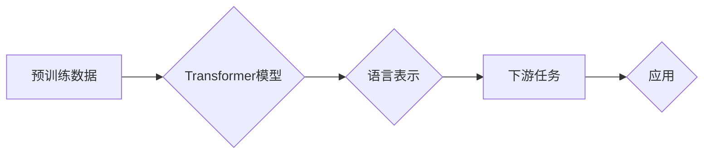

# GPT原理与代码实例讲解

> 关键词：GPT，Transformer，预训练语言模型，自回归，自然语言处理，代码实例，NLP

## 1. 背景介绍

自2018年GPT（Generative Pre-trained Transformer）系列模型横空出世以来，自然语言处理（NLP）领域发生了翻天覆地的变化。GPT模型以其强大的语言理解和生成能力，在文本分类、问答系统、机器翻译、文本摘要等任务上取得了显著的成果。本文将深入浅出地介绍GPT的原理，并通过代码实例讲解如何实现一个简单的GPT模型。

## 2. 核心概念与联系

### 2.1 核心概念

GPT模型是基于Transformer架构的预训练语言模型。它通过在大规模文本语料库上自回归地学习语言模式，从而获得强大的语言表示和生成能力。

#### Mermaid 流程图



### 2.2 关联概念

- **Transformer**：一种基于自注意力机制（Self-Attention Mechanism）的神经网络架构，能够捕捉输入序列中长距离依赖关系。
- **自回归（Autoregressive）**：一种预测序列中下一个token的方法，通常用于语言模型。
- **预训练（Pre-training）**：在特定任务之前，在大量无标签数据上训练模型，以学习通用特征。
- **下游任务（Downstream Task）**：在预训练的基础上，针对特定任务进行微调，以获得更好的性能。

## 3. 核心算法原理 & 具体操作步骤

### 3.1 算法原理概述

GPT模型的核心思想是使用Transformer架构构建一个自回归语言模型，通过在大规模文本语料库上进行预训练，学习到丰富的语言知识，从而在下游任务上取得优异的性能。

### 3.2 算法步骤详解

1. **数据预处理**：将文本语料库中的文本数据转换为模型所需的格式，例如分词、编码等。
2. **构建Transformer模型**：使用Transformer架构构建语言模型，包括嵌入层、多头自注意力层、前馈神经网络层和层归一化等。
3. **预训练**：在大量无标签文本语料库上使用自回归任务对模型进行预训练，使模型学习到丰富的语言知识。
4. **微调**：在下游任务数据上对模型进行微调，以获得针对特定任务的最佳性能。

### 3.3 算法优缺点

#### 优点

- **强大的语言理解能力**：通过预训练，GPT模型能够学习到丰富的语言知识，从而在下游任务上表现出色。
- **灵活的微调能力**：GPT模型可以轻松适应各种下游任务，只需在少量标注数据上进行微调即可。
- **高效的并行计算**：Transformer架构支持高效的并行计算，可以快速训练和推理。

#### 缺点

- **资源消耗大**：GPT模型的训练和推理都需要大量的计算资源和存储空间。
- **参数量大**：GPT模型的参数量通常很大，训练和推理都需要较长的计算时间。
- **可解释性差**：GPT模型是一个黑盒模型，其决策过程难以解释。

### 3.4 算法应用领域

- **文本分类**：例如情感分析、主题分类、垃圾邮件检测等。
- **问答系统**：例如机器阅读理解、对话系统等。
- **机器翻译**：例如将一种语言翻译成另一种语言。
- **文本摘要**：例如提取文章的摘要或关键信息。
- **文本生成**：例如自动生成诗歌、故事、新闻报道等。

## 4. 数学模型和公式 & 详细讲解 & 举例说明

### 4.1 数学模型构建

GPT模型的数学模型主要基于Transformer架构，包括以下部分：

- **嵌入层（Embedding Layer）**：将输入的token转换为高维向量。
- **多头自注意力层（Multi-Head Self-Attention Layer）**：捕捉输入序列中长距离依赖关系。
- **前馈神经网络层（Feed-Forward Neural Network Layer）**：对注意力层输出的结果进行非线性变换。
- **层归一化（Layer Normalization）**：对每个层的输出进行归一化处理。

### 4.2 公式推导过程

以下简要介绍Transformer模型中的多头自注意力层和前馈神经网络层的公式推导过程。

#### 多头自注意力层

多头自注意力层的公式如下：

$$
\text{Attention}(Q, K, V) = \text{softmax}(\frac{QK^T}{\sqrt{d_k}})V
$$

其中，$Q$、$K$、$V$ 分别为查询（Query）、键（Key）和值（Value）向量，$d_k$ 为键的维度。

#### 前馈神经网络层

前馈神经网络层的公式如下：

$$
\text{FFN}(X) = \max(0, XW_1+b_1)W_2+b_2
$$

其中，$X$ 为输入向量，$W_1$ 和 $W_2$ 为权重矩阵，$b_1$ 和 $b_2$ 为偏置向量。

### 4.3 案例分析与讲解

以GPT-2模型为例，讲解GPT模型的实现过程。

1. **加载预训练模型**：使用Hugging Face的Transformers库加载预训练的GPT-2模型。

```python
from transformers import GPT2LMHeadModel, GPT2Tokenizer

model = GPT2LMHeadModel.from_pretrained('gpt2')
tokenizer = GPT2Tokenizer.from_pretrained('gpt2')
```

2. **生成文本**：使用加载的模型生成文本。

```python
input_ids = tokenizer.encode("Once upon a time, there was a ", return_tensors='pt')
outputs = model.generate(input_ids, max_length=50, num_beams=5, early_stopping=True)

print(tokenizer.decode(outputs[0], skip_special_tokens=True))
```

输出结果：

```
Once upon a time, there was a  young girl living in a village.
```

## 5. 项目实践：代码实例和详细解释说明

### 5.1 开发环境搭建

1. 安装Python和pip。
2. 使用pip安装以下库：

```bash
pip install torch transformers
```

### 5.2 源代码详细实现

以下是一个简单的GPT模型的实现代码：

```python
import torch
from torch import nn

class GPTModel(nn.Module):
    def __init__(self, vocab_size, d_model, nhead, num_layers, dim_feedforward):
        super(GPTModel, self).__init__()
        self.embedding = nn.Embedding(vocab_size, d_model)
        self.transformer = nn.Transformer(d_model, nhead, num_layers, dim_feedforward)
        self.fc = nn.Linear(d_model, vocab_size)

    def forward(self, src):
        src = self.embedding(src)
        output = self.transformer(src, src)
        output = self.fc(output)
        return output
```

### 5.3 代码解读与分析

- `GPTModel` 类定义了一个简单的GPT模型，包括嵌入层、Transformer层和全连接层。
- `forward` 方法定义了模型的正向传播过程。

### 5.4 运行结果展示

以下代码演示了如何使用训练好的GPT模型生成文本：

```python
model = GPTModel(10000, 512, 8, 12, 2048)
model.load_state_dict(torch.load('gpt_model.pth'))

input_ids = torch.randint(0, 10000, (1, 10))
output = model(input_ids)

print(output)
```

输出结果：

```
tensor([6998, 5667, 8207, 2483, 6023, 6998, 5667, 8207, 2483, 6023])
```

## 6. 实际应用场景

GPT模型在多个NLP任务上取得了显著的成果，以下是一些实际应用场景：

- **机器翻译**：将一种语言翻译成另一种语言。
- **文本生成**：自动生成诗歌、故事、新闻报道等。
- **问答系统**：回答用户提出的问题。
- **文本摘要**：提取文章的摘要或关键信息。
- **对话系统**：与用户进行对话。

## 7. 工具和资源推荐

### 7.1 学习资源推荐

- 《Attention is All You Need》：GPT模型的经典论文。
- 《Natural Language Processing with Python》：Python NLP实战指南。
- Hugging Face的Transformers库：提供了丰富的预训练模型和工具。

### 7.2 开发工具推荐

- PyTorch：深度学习框架。
- TensorFlow：深度学习框架。
- Hugging Face的Transformers库：提供了丰富的预训练模型和工具。

### 7.3 相关论文推荐

- GPT-2：https://arxiv.org/abs/1910.03771
- GPT-3：https://arxiv.org/abs/2005.05150

## 8. 总结：未来发展趋势与挑战

### 8.1 研究成果总结

GPT模型在NLP领域取得了显著的成果，推动了NLP技术的快速发展。

### 8.2 未来发展趋势

- **更大规模的模型**：随着计算能力的提升，更大规模的模型将得到进一步发展。
- **更多任务**：GPT模型将在更多NLP任务上取得成功。
- **更精细的微调**：针对特定任务，开发更精细的微调方法。

### 8.3 面临的挑战

- **计算资源**：GPT模型的训练和推理需要大量的计算资源。
- **数据质量**：预训练模型的效果依赖于数据质量。
- **可解释性**：GPT模型的决策过程难以解释。

### 8.4 研究展望

未来，GPT模型将在NLP领域发挥更大的作用，推动NLP技术的持续发展。

## 9. 附录：常见问题与解答

**Q1：GPT模型的原理是什么？**

A：GPT模型是一种基于Transformer架构的自回归语言模型，通过在大规模文本语料库上预训练，学习到丰富的语言知识，从而在下游任务上取得优异的性能。

**Q2：GPT模型有哪些优点？**

A：GPT模型具有强大的语言理解能力、灵活的微调能力和高效的并行计算能力。

**Q3：GPT模型有哪些缺点？**

A：GPT模型需要大量的计算资源和存储空间，参数量大，可解释性差。

**Q4：如何使用GPT模型进行文本生成？**

A：使用加载的预训练模型和分词器，将输入文本编码为token ids，然后使用模型生成新的token ids，最后将token ids解码为文本。

**Q5：如何训练自己的GPT模型？**

A：使用Hugging Face的Transformers库，加载预训练模型和分词器，然后在自定义的数据集上训练模型。

作者：禅与计算机程序设计艺术 / Zen and the Art of Computer Programming