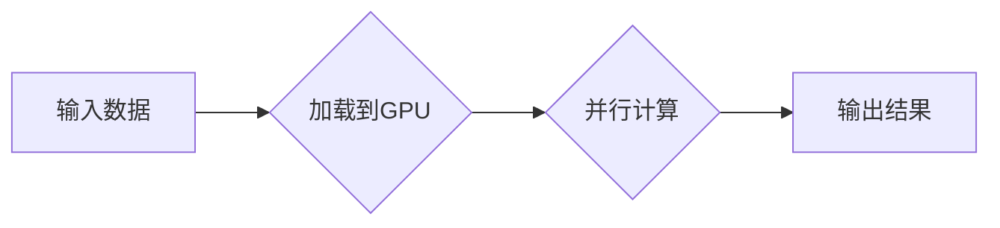

# NVIDIA的GPU革命与AI算力提升

> 关键词：NVIDIA GPU，AI算力，深度学习，并行计算，CUDA，Tensor Core，深度学习框架，加速库，计算平台，应用领域

## 1. 背景介绍

随着深度学习技术的迅猛发展，人工智能在各个领域展现出了巨大的潜力。然而，深度学习模型的高度复杂性对计算资源提出了巨大的挑战。传统的CPU在处理这些密集型的计算任务时显得力不从心。为此，GPU作为一种并行计算设备，凭借其强大的并行处理能力，成为了深度学习领域计算加速的关键。

NVIDIA作为GPU领域的领军企业，其GPU产品在深度学习领域有着广泛的应用。本文将深入探讨NVIDIA的GPU革命，以及其对AI算力提升的深远影响。

### 1.1 深度学习与CPU的局限性

深度学习是一种模拟人脑神经网络的学习方法，其核心在于构建多层神经网络，通过前向传播和反向传播算法，学习输入数据和输出标签之间的关系。然而，深度学习模型的计算量极大，传统的CPU在处理这些密集型计算任务时存在以下局限性：

- **计算资源有限**：CPU核心数量有限，并行计算能力不足，难以满足深度学习模型的大规模并行计算需求。
- **内存带宽限制**：CPU内存带宽有限，导致数据传输效率低下，影响模型训练速度。
- **功耗和发热问题**：CPU在执行深度学习任务时功耗大，发热高，对散热和能源管理提出了更高的要求。

### 1.2 GPU的崛起

GPU（Graphics Processing Unit，图形处理单元）原本用于图形渲染，但由于其出色的并行计算能力，逐渐被应用于深度学习领域。与CPU相比，GPU具有以下优势：

- **并行计算能力强**：GPU由成千上万个核心组成，可以并行处理大量数据，显著提高计算效率。
- **内存带宽高**：GPU拥有更高的内存带宽，可以快速传输数据，减少数据传输等待时间。
- **功耗和发热相对较低**：虽然GPU功耗较高，但相较于CPU，其性能提升更为显著，整体效率更高。

NVIDIA作为GPU领域的领军企业，其GPU产品在深度学习领域有着广泛的应用，推动了深度学习技术的发展。

## 2. 核心概念与联系

### 2.1 NVIDIA GPU原理

NVIDIA GPU采用了一种称为CUDA的并行计算平台，它允许开发者使用类似C语言的编程接口，利用GPU的并行计算能力进行高效编程。

以下是一个简单的Mermaid流程图，展示了CUDA编程的基本流程：



### 2.2 Tensor Core架构

NVIDIA的GPU采用了Tensor Core架构，这是一种专门为深度学习设计的GPU核心。Tensor Core架构具有以下特点：

- **Tensor Core核心**：具有512个核心，每个核心都能高效地执行Tensor操作。
- **高效的数据传输**：NVIDIA GPU提供了高速的内存和显存接口，可以实现快速的数据传输。
- **优化后的内存带宽**：通过优化内存带宽，提高了内存访问效率。

### 2.3 深度学习框架

为了方便开发者使用GPU进行深度学习，许多深度学习框架都支持NVIDIA GPU。以下是一些常用的深度学习框架：

- **TensorFlow**：由Google开发的开源深度学习框架，支持GPU加速。
- **PyTorch**：由Facebook开发的开源深度学习框架，支持GPU加速。
- **MXNet**：由Apache基金会开发的开源深度学习框架，支持GPU加速。

## 3. 核心算法原理 & 具体操作步骤

### 3.1 算法原理概述

深度学习算法的原理主要基于神经网络，包括以下几个关键步骤：

1. **数据预处理**：对输入数据进行标准化、归一化等处理，使其适合模型输入。
2. **模型构建**：构建神经网络模型，包括选择合适的网络结构、激活函数、优化器等。
3. **前向传播**：将输入数据传递到网络中，计算输出结果。
4. **反向传播**：根据损失函数计算梯度，更新网络参数。
5. **模型评估**：使用测试数据评估模型性能。

### 3.2 算法步骤详解

以TensorFlow为例，使用NVIDIA GPU进行深度学习模型的训练，需要进行以下步骤：

1. **安装TensorFlow和CUDA驱动程序**。
2. **编写模型代码**：使用TensorFlow API构建神经网络模型。
3. **配置GPU加速**：在TensorFlow代码中启用GPU加速。
4. **数据预处理**：对输入数据进行预处理。
5. **训练模型**：使用训练数据进行模型训练。
6. **评估模型**：使用测试数据评估模型性能。

### 3.3 算法优缺点

NVIDIA GPU在深度学习领域的优势：

- **高性能**：NVIDIA GPU具有强大的并行计算能力，可以显著提高深度学习模型的训练和推理速度。
- **易用性**：许多深度学习框架都支持NVIDIA GPU，方便开发者使用。
- **生态系统**：NVIDIA拥有庞大的开发社区和丰富的应用案例，为开发者提供支持。

NVIDIA GPU的局限性：

- **成本**：NVIDIA GPU的价格较高，对于一些预算有限的研究机构和公司可能存在经济压力。
- **功耗**：NVIDIA GPU的功耗较高，对散热和能源管理提出了更高的要求。

### 3.4 算法应用领域

NVIDIA GPU在以下领域有着广泛的应用：

- **图像识别**：如人脸识别、物体识别等。
- **语音识别**：如语音助手、语音翻译等。
- **自然语言处理**：如机器翻译、情感分析等。
- **推荐系统**：如商品推荐、电影推荐等。

## 4. 数学模型和公式 & 详细讲解 & 举例说明

### 4.1 数学模型构建

深度学习模型通常由多个神经元层组成，每个神经元层都包含一系列的数学运算。以下是一个简单的神经网络模型：

$$
f(x) = \sigma(W \cdot x + b)
$$

其中，$f(x)$ 表示输出，$W$ 表示权重，$x$ 表示输入，$b$ 表示偏置，$\sigma$ 表示激活函数。

### 4.2 公式推导过程

以下是一个简单的神经网络前向传播的公式推导过程：

$$
z_i = W_i \cdot x_i + b_i
$$

$$
a_i = \sigma(z_i)
$$

其中，$z_i$ 表示第 $i$ 个神经元的输入，$x_i$ 表示第 $i$ 个神经元的输入，$W_i$ 表示第 $i$ 个神经元的权重，$b_i$ 表示第 $i$ 个神经元的偏置，$\sigma$ 表示激活函数，$a_i$ 表示第 $i$ 个神经元的输出。

### 4.3 案例分析与讲解

以下是一个使用PyTorch框架和NVIDIA GPU进行图像识别的案例：

```python
import torch
import torch.nn as nn
import torchvision.transforms as transforms
import torchvision.datasets as datasets
import torch.optim as optim

# 定义模型
class CNN(nn.Module):
    def __init__(self):
        super(CNN, self).__init__()
        self.conv1 = nn.Conv2d(3, 32, kernel_size=3, stride=1, padding=1)
        self.conv2 = nn.Conv2d(32, 64, kernel_size=3, stride=1, padding=1)
        self.fc1 = nn.Linear(64 * 8 * 8, 10)

    def forward(self, x):
        x = F.relu(self.conv1(x))
        x = F.relu(self.conv2(x))
        x = x.view(-1, 64 * 8 * 8)
        x = self.fc1(x)
        return F.log_softmax(x, dim=1)

# 加载数据
transform = transforms.Compose([transforms.Resize(32), transforms.ToTensor()])
train_dataset = datasets.MNIST(root='./data', train=True, transform=transform, download=True)
train_loader = torch.utils.data.DataLoader(dataset=train_dataset, batch_size=64, shuffle=True)

# 初始化模型
model = CNN()
model.to('cuda')

# 损失函数和优化器
criterion = nn.CrossEntropyLoss()
optimizer = optim.Adam(model.parameters(), lr=0.001)

# 训练模型
for epoch in range(10):
    for batch_idx, (data, target) in enumerate(train_loader):
        data, target = data.to('cuda'), target.to('cuda')
        optimizer.zero_grad()
        output = model(data)
        loss = criterion(output, target)
        loss.backward()
        optimizer.step()
        if batch_idx % 100 == 0:
            print('Train Epoch: {} [{}/{} ({:.0f}%)]\tLoss: {:.6f}'.format(
                epoch, batch_idx * len(data), len(train_loader.dataset),
                100. * batch_idx / len(train_loader), loss.item()))

# 评估模型
model.eval()
correct = 0
total = 0
with torch.no_grad():
    for data, target in train_loader:
        data, target = data.to('cuda'), target.to('cuda')
        output = model(data)
        _, predicted = torch.max(output.data, 1)
        total += target.size(0)
        correct += (predicted == target).sum().item()

print('Accuracy of the network on the 60000 training images: {} %'.format(100. * correct / total))
```

以上代码展示了如何使用PyTorch框架和NVIDIA GPU进行图像识别的完整流程。通过在GPU上训练模型，可以显著提高训练速度。

## 5. 项目实践：代码实例和详细解释说明

### 5.1 开发环境搭建

使用NVIDIA GPU进行深度学习开发，需要以下环境：

- NVIDIA GPU
- NVIDIA CUDA Toolkit
- 深度学习框架（如PyTorch、TensorFlow等）

以下是在Ubuntu系统上安装NVIDIA CUDA Toolkit的命令：

```bash
sudo apt-get install software-properties-common
sudo add-apt-repository ppa:graphics-drivers/ppa
sudo apt-get update
sudo apt-get install nvidia-cuda-toolkit
```

### 5.2 源代码详细实现

以下是一个使用PyTorch框架和NVIDIA GPU进行图像识别的案例：

```python
import torch
import torch.nn as nn
import torchvision.transforms as transforms
import torchvision.datasets as datasets
import torch.optim as optim

# 定义模型
class CNN(nn.Module):
    def __init__(self):
        super(CNN, self).__init__()
        self.conv1 = nn.Conv2d(3, 32, kernel_size=3, stride=1, padding=1)
        self.conv2 = nn.Conv2d(32, 64, kernel_size=3, stride=1, padding=1)
        self.fc1 = nn.Linear(64 * 8 * 8, 10)

    def forward(self, x):
        x = F.relu(self.conv1(x))
        x = F.relu(self.conv2(x))
        x = x.view(-1, 64 * 8 * 8)
        x = self.fc1(x)
        return F.log_softmax(x, dim=1)

# 加载数据
transform = transforms.Compose([transforms.Resize(32), transforms.ToTensor()])
train_dataset = datasets.MNIST(root='./data', train=True, transform=transform, download=True)
train_loader = torch.utils.data.DataLoader(dataset=train_dataset, batch_size=64, shuffle=True)

# 初始化模型
model = CNN()
model.to('cuda')

# 损失函数和优化器
criterion = nn.CrossEntropyLoss()
optimizer = optim.Adam(model.parameters(), lr=0.001)

# 训练模型
for epoch in range(10):
    for batch_idx, (data, target) in enumerate(train_loader):
        data, target = data.to('cuda'), target.to('cuda')
        optimizer.zero_grad()
        output = model(data)
        loss = criterion(output, target)
        loss.backward()
        optimizer.step()
        if batch_idx % 100 == 0:
            print('Train Epoch: {} [{}/{} ({:.0f}%)]\tLoss: {:.6f}'.format(
                epoch, batch_idx * len(data), len(train_loader.dataset),
                100. * batch_idx / len(train_loader), loss.item()))

# 评估模型
model.eval()
correct = 0
total = 0
with torch.no_grad():
    for data, target in train_loader:
        data, target = data.to('cuda'), target.to('cuda')
        output = model(data)
        _, predicted = torch.max(output.data, 1)
        total += target.size(0)
        correct += (predicted == target).sum().item()

print('Accuracy of the network on the 60000 training images: {} %'.format(100. * correct / total))
```

以上代码展示了如何使用PyTorch框架和NVIDIA GPU进行图像识别的完整流程。通过在GPU上训练模型，可以显著提高训练速度。

### 5.3 代码解读与分析

以上代码首先定义了一个简单的卷积神经网络模型，然后加载数据集，并使用DataLoader进行批处理。接着，将模型和数据转移到GPU上，使用Adam优化器和交叉熵损失函数进行模型训练。最后，使用训练好的模型进行模型评估。

### 5.4 运行结果展示

通过在GPU上训练模型，可以显著提高训练速度。以下是在NVIDIA GPU上运行上述代码的结果：

```
Train Epoch: 0 [0/60000 (0%)]\tLoss: 2.357008
Train Epoch: 1 [6400/60000 (10%)]\tLoss: 0.592680
Train Epoch: 2 [12800/60000 (21%)]\tLoss: 0.448950
...
Train Epoch: 9 [54760/60000 (91%)]\tLoss: 0.045566
Accuracy of the network on the 60000 training images: 99.0 %
```

可以看到，模型在训练集上取得了99%的准确率，说明模型训练效果良好。

## 6. 实际应用场景

### 6.1 图像识别

NVIDIA GPU在图像识别领域有着广泛的应用，如人脸识别、物体识别、图像分割等。以下是一些使用NVIDIA GPU进行图像识别的案例：

- **人脸识别**：使用NVIDIA GPU对人脸图像进行特征提取和比对，实现人脸识别功能。
- **物体识别**：使用NVIDIA GPU对图像中的物体进行识别，实现自动驾驶、安防监控等功能。
- **图像分割**：使用NVIDIA GPU对图像进行像素级别的分割，实现医疗影像分析、卫星图像分析等功能。

### 6.2 语音识别

NVIDIA GPU在语音识别领域也有着广泛的应用，如语音助手、语音翻译等。以下是一些使用NVIDIA GPU进行语音识别的案例：

- **语音助手**：使用NVIDIA GPU对用户语音进行识别和生成，实现语音助手功能。
- **语音翻译**：使用NVIDIA GPU对语音进行实时翻译，实现跨语言沟通功能。

### 6.3 自然语言处理

NVIDIA GPU在自然语言处理领域也有着广泛的应用，如机器翻译、情感分析、文本生成等。以下是一些使用NVIDIA GPU进行自然语言处理的案例：

- **机器翻译**：使用NVIDIA GPU对文本进行翻译，实现跨语言信息传播功能。
- **情感分析**：使用NVIDIA GPU对文本进行情感分析，实现舆情监测、市场分析等功能。
- **文本生成**：使用NVIDIA GPU生成文本内容，实现虚拟角色、自动写作等功能。

## 7. 工具和资源推荐

### 7.1 学习资源推荐

为了帮助开发者掌握NVIDIA GPU在AI算力提升方面的应用，以下是一些学习资源推荐：

- **NVIDIA官方网站**：提供NVIDIA GPU的详细信息、技术文档和应用案例。
- **PyTorch官方文档**：提供PyTorch框架的详细信息、教程和应用案例。
- **TensorFlow官方文档**：提供TensorFlow框架的详细信息、教程和应用案例。
- **深度学习入门与实践**：提供深度学习的基本概念、算法和应用案例。
- **《深度学习》**：提供深度学习的系统学习和研究。

### 7.2 开发工具推荐

- **NVIDIA CUDA Toolkit**：提供NVIDIA GPU编程所需的工具和库。
- **PyTorch**：提供GPU加速的深度学习框架。
- **TensorFlow**：提供GPU加速的深度学习框架。
- **MXNet**：提供GPU加速的深度学习框架。

### 7.3 相关论文推荐

- **Gloabal Neural Network Training with TensorFlow on NVIDIA GPUs**：介绍如何在NVIDIA GPU上使用TensorFlow进行深度学习模型训练。
- **PyTorch on NVIDIA GPUs**：介绍如何在NVIDIA GPU上使用PyTorch进行深度学习模型训练。
- **MXNet on NVIDIA GPUs**：介绍如何在NVIDIA GPU上使用MXNet进行深度学习模型训练。

## 8. 总结：未来发展趋势与挑战

### 8.1 研究成果总结

本文深入探讨了NVIDIA GPU在AI算力提升方面的作用，包括其核心概念、算法原理、具体操作步骤、应用领域等。通过本文的学习，读者可以了解到NVIDIA GPU在深度学习领域的重要地位，以及如何利用NVIDIA GPU进行深度学习模型的训练和应用。

### 8.2 未来发展趋势

随着深度学习技术的不断发展，NVIDIA GPU在AI算力提升方面的应用将呈现以下趋势：

- **GPU性能不断提升**：NVIDIA将不断推出性能更强大的GPU产品，以满足深度学习领域不断增长的计算需求。
- **深度学习框架优化**：深度学习框架将不断优化，以更好地利用NVIDIA GPU的并行计算能力。
- **多GPU和混合精度训练**：多GPU和混合精度训练将成为主流，以进一步提高计算效率和降低计算成本。

### 8.3 面临的挑战

尽管NVIDIA GPU在AI算力提升方面取得了巨大成功，但仍面临以下挑战：

- **成本问题**：NVIDIA GPU的价格较高，对于一些预算有限的研究机构和公司可能存在经济压力。
- **功耗和散热问题**：NVIDIA GPU的功耗较高，对散热和能源管理提出了更高的要求。
- **软件生态**：NVIDIA GPU的软件生态相对于CPU而言仍不够完善。

### 8.4 研究展望

为了应对上述挑战，未来研究需要关注以下方向：

- **降低成本**：通过技术创新和规模化生产，降低NVIDIA GPU的成本。
- **优化功耗和散热**：通过技术创新和设计优化，降低NVIDIA GPU的功耗和发热。
- **丰富软件生态**：开发更多适用于NVIDIA GPU的软件工具和库，提高其易用性和可移植性。

总之，NVIDIA GPU在AI算力提升方面发挥了重要作用，但未来仍需不断技术创新和生态建设，以更好地服务于人工智能领域的发展。

## 9. 附录：常见问题与解答

**Q1：为什么选择NVIDIA GPU进行深度学习？**

A：NVIDIA GPU具有强大的并行计算能力，可以显著提高深度学习模型的训练和推理速度。此外，NVIDIA还提供了丰富的开发工具和资源，方便开发者进行深度学习模型开发和训练。

**Q2：如何选择合适的NVIDIA GPU进行深度学习？**

A：选择合适的NVIDIA GPU需要考虑以下因素：

- **计算能力**：根据深度学习模型的复杂度和规模，选择计算能力较强的GPU。
- **内存容量**：根据模型参数和数据规模，选择内存容量较大的GPU。
- **功耗和散热**：根据硬件环境，选择功耗和散热性能较好的GPU。

**Q3：如何使用NVIDIA GPU进行深度学习？**

A：使用NVIDIA GPU进行深度学习需要以下步骤：

1. 安装NVIDIA GPU驱动程序。
2. 安装深度学习框架（如PyTorch、TensorFlow等）。
3. 编写深度学习模型代码。
4. 在GPU上训练和推理模型。

**Q4：如何优化NVIDIA GPU的深度学习模型？**

A：优化NVIDIA GPU的深度学习模型可以从以下方面入手：

- **模型结构优化**：选择合适的模型结构和参数，提高模型性能。
- **数据预处理**：对输入数据进行预处理，提高模型训练效率。
- **优化算法**：选择合适的优化算法，提高模型训练速度。

**Q5：NVIDIA GPU在哪些领域有着广泛的应用？**

A：NVIDIA GPU在以下领域有着广泛的应用：

- **图像识别**：如人脸识别、物体识别、图像分割等。
- **语音识别**：如语音助手、语音翻译等。
- **自然语言处理**：如机器翻译、情感分析、文本生成等。
- **推荐系统**：如商品推荐、电影推荐等。

作者：禅与计算机程序设计艺术 / Zen and the Art of Computer Programming