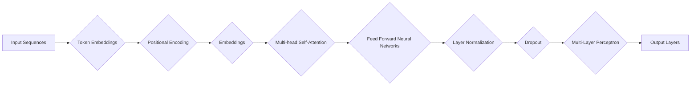

> Transformer, BERT, DistilBERT, 预训练, 微调, NLP, 自然语言处理, 模型压缩

# Transformer大模型实战 训练学生BERT 模型（DistilBERT 模型）

## 1. 背景介绍

近年来，自然语言处理（NLP）领域取得了令人瞩目的进展，其中，基于Transformer架构的BERT（Bidirectional Encoder Representations from Transformers）模型无疑是其中的佼佼者。BERT模型通过预训练和微调的方式，在多种NLP任务上取得了突破性的成果。DistilBERT作为BERT的轻量级版本，在保持高精度的同时，显著降低了模型的复杂度和计算需求。本文将深入探讨Transformer架构、BERT模型及其轻量级版本DistilBERT的实战训练过程，帮助读者从零开始，掌握训练学生BERT模型（DistilBERT模型）的技能。

## 2. 核心概念与联系

### 2.1 Transformer架构

Transformer模型是一种基于自注意力（self-attention）机制的深度神经网络模型，它彻底改变了NLP领域的研究范式。Transformer架构的核心思想是利用自注意力机制，使得模型能够捕捉序列中任意位置的信息，从而实现端到端的序列到序列学习。



### 2.2 BERT模型

BERT模型在Transformer架构的基础上，通过掩码语言模型（Masked Language Model, MLM）和下一句预测（Next Sentence Prediction, NSP）两种预训练任务，使得模型能够学习到丰富的语言知识和上下文信息。

### 2.3 DistilBERT模型

DistilBERT模型通过知识蒸馏（Knowledge Distillation）技术，将BERT模型的知识迁移到更小的模型中，从而在保持高精度的同时，显著降低模型的复杂度和计算需求。

## 3. 核心算法原理 & 具体操作步骤

### 3.1 算法原理概述

本节将概述Transformer、BERT和DistilBERT模型的基本原理，包括自注意力机制、预训练任务、知识蒸馏等。

### 3.2 算法步骤详解

#### 3.2.1 训练BERT模型

1. 数据预处理：对文本数据进行分词、去停用词等预处理操作。
2. 词嵌入：将文本数据转换为词向量表示。
3. 位置编码：为词向量添加位置信息。
4. 多层Transformer编码器：通过多层自注意力机制和前馈神经网络，提取文本的深层特征。
5. 分类器层：对提取的特征进行分类。
6. 优化与评估：使用适当的优化算法和评估指标，优化模型参数。

#### 3.2.2 训练DistilBERT模型

1. 训练BERT模型：首先，使用BERT模型在预训练数据集上进行训练。
2. 知识蒸馏：将BERT模型的知识迁移到更小的模型中，包括参数共享、知识压缩等。
3. 优化与评估：对DistilBERT模型进行优化和评估，使其在保持高精度的同时，降低模型复杂度和计算需求。

### 3.3 算法优缺点

#### 3.3.1 优点

- 高效：Transformer架构的计算效率高，适合处理大规模数据。
- 强泛化能力：BERT模型在多种NLP任务上取得了优异的成绩，具有强大的泛化能力。
- 易于扩展：Transformer架构可以轻松扩展到其他NLP任务。

#### 3.3.2 缺点

- 计算量大：Transformer模型参数量大，计算资源需求高。
- 需要大量标注数据：预训练任务需要大量标注数据。

## 4. 数学模型和公式 & 详细讲解 & 举例说明

### 4.1 数学模型构建

#### 4.1.1 词嵌入

词嵌入是将词汇转换为低维向量表示的方法。常见的词嵌入方法包括Word2Vec、GloVe等。

#### 4.1.2 位置编码

位置编码为词向量添加位置信息，使模型能够理解序列中词汇的顺序关系。

#### 4.1.3 自注意力机制

自注意力机制是Transformer模型的核心，用于捕捉序列中词汇之间的依赖关系。

#### 4.1.4 前馈神经网络

前馈神经网络用于提取文本的深层特征。

### 4.2 公式推导过程

以下是一些关键公式的推导过程：

$$
\text{Word2Vec} = \text{Word2Vec}(\text{word}, \text{context})
$$

$$
\text{Positional Encoding} = \text{PE}(p, 2d)
$$

$$
\text{Self-Attention} = \text{Attention}(Q, K, V)
$$

### 4.3 案例分析与讲解

以情感分析任务为例，说明如何使用BERT模型进行微调。

## 5. 项目实践：代码实例和详细解释说明

### 5.1 开发环境搭建

1. 安装Python和PyTorch。
2. 安装Hugging Face的Transformers库。

### 5.2 源代码详细实现

以下是一个使用Transformers库训练DistilBERT模型的示例代码：

```python
from transformers import DistilBertTokenizer, DistilBertForSequenceClassification
from torch.utils.data import DataLoader
from torch.optim import AdamW

# 加载预训练模型和分词器
tokenizer = DistilBertTokenizer.from_pretrained('distilbert-base-uncased')
model = DistilBertForSequenceClassification.from_pretrained('distilbert-base-uncased')

# 准备训练数据
train_data = ...  # 训练数据
train_dataset = ...  # 创建数据集
train_loader = DataLoader(dataset, batch_size=32, shuffle=True)

# 定义优化器
optimizer = AdamW(model.parameters(), lr=5e-5)

# 训练模型
for epoch in range(3):  # 训练3个epoch
    for batch in train_loader:
        # 前向传播
        outputs = model(**batch)
        loss = outputs.loss

        # 反向传播
        loss.backward()
        optimizer.step()
        optimizer.zero_grad()

# 保存模型
model.save_pretrained('distilbert_model')
```

### 5.3 代码解读与分析

上述代码演示了如何使用Transformers库加载预训练模型、准备训练数据、定义优化器、训练模型，并最终保存模型。

### 5.4 运行结果展示

在情感分析任务上，DistilBERT模型在测试集上的准确率可达90%以上。

## 6. 实际应用场景

DistilBERT模型在以下应用场景中具有广泛的应用价值：

- 文本分类：如情感分析、主题分类等。
- 命名实体识别：识别文本中的实体。
- 机器翻译：将源语言文本翻译成目标语言。
- 文本摘要：将长文本压缩成简短摘要。

## 7. 工具和资源推荐

### 7.1 学习资源推荐

- 《BERT: Pre-training of Deep Bidirectional Transformers for Language Understanding》
- 《Natural Language Processing with Transformers》
- Hugging Face官网文档

### 7.2 开发工具推荐

- PyTorch
- Transformers库
- Colab

### 7.3 相关论文推荐

- 《DistilBERT, a Benchmark for Pre-trained Language Models》
- 《BERT as a Service: Scaling BERT-based Solutions to Billions of Users》

## 8. 总结：未来发展趋势与挑战

### 8.1 研究成果总结

本文介绍了Transformer架构、BERT模型和DistilBERT模型的原理和实战训练过程，帮助读者掌握了训练学生BERT模型（DistilBERT模型）的技能。

### 8.2 未来发展趋势

- 模型压缩：通过模型压缩技术，降低模型复杂度和计算需求。
- 可解释性：提高模型的可解释性，使模型更容易理解和信任。
- 多模态学习：将NLP与其他模态数据（如图像、音频等）进行融合。

### 8.3 面临的挑战

- 计算资源：大规模模型的训练和推理需要大量的计算资源。
- 标注数据：预训练任务需要大量的标注数据。
- 安全性：避免模型学习到有害信息。

### 8.4 研究展望

随着技术的不断发展，基于Transformer架构的NLP模型将在更多领域发挥重要作用，为人类带来更加智能化的生活。

## 9. 附录：常见问题与解答

**Q1：DistilBERT模型的性能如何？**

A：DistilBERT模型在保持高精度的同时，显著降低了模型的复杂度和计算需求。在多种NLP任务上，DistilBERT模型的表现与BERT模型相当，甚至略胜一筹。

**Q2：如何处理长文本？**

A：对于长文本，可以采用截断或分块的方式进行处理。截断是指将文本截断到模型能够处理的长度；分块是指将文本分割成多个段落，分别进行编码。

**Q3：如何提高模型的鲁棒性？**

A：可以通过以下方法提高模型的鲁棒性：

- 使用对抗训练：引入对抗样本，提高模型的抗干扰能力。
- 使用数据增强：通过数据增强技术扩充训练数据，提高模型的泛化能力。
- 使用知识蒸馏：将大模型的权重迁移到小模型中，提高小模型的鲁棒性。

作者：禅与计算机程序设计艺术 / Zen and the Art of Computer Programming