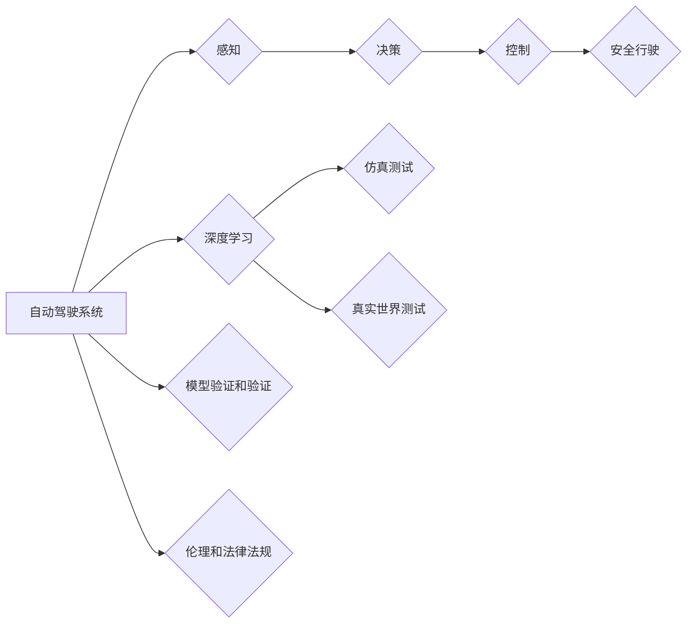

# 端到端自动驾驶的安全性论证

> 关键词：自动驾驶，安全性论证，深度学习，仿真测试，伦理决策，安全协议，自动驾驶系统

## 1. 背景介绍

自动驾驶技术的发展正在改变着交通出行的方式，其潜在的经济和社会效益是巨大的。然而，自动驾驶系统的安全性和可靠性是公众和行业关注的焦点。随着深度学习在自动驾驶领域的广泛应用，如何从理论和实践两个层面论证端到端自动驾驶系统的安全性成为了亟待解决的问题。本文将深入探讨端到端自动驾驶的安全性论证方法、挑战和未来趋势。

### 1.1 问题的由来

自动驾驶系统的复杂性是其安全性的主要挑战之一。这些系统涉及感知、决策、控制等多个环节，每个环节都可能出现错误，导致事故发生。此外，自动驾驶系统在处理未知或异常情况时，如何做出符合伦理和法律法规的决策也是一大难题。

### 1.2 研究现状

目前，自动驾驶安全性的研究主要集中在以下几个方面：

- **仿真测试**：通过在虚拟环境中模拟真实世界场景，测试自动驾驶系统的性能和鲁棒性。
- **真实世界测试**：在真实交通环境中进行测试，收集数据和评估系统性能。
- **模型验证和验证**：使用数学方法验证和验证自动驾驶系统的正确性和可靠性。
- **伦理和法律法规**：研究和制定自动驾驶系统的伦理准则和法律法规。

### 1.3 研究意义

研究端到端自动驾驶的安全性论证，对于确保自动驾驶系统的安全可靠运行，促进自动驾驶技术的健康发展具有重要意义。

### 1.4 本文结构

本文将按照以下结构展开：

- 第2部分，介绍自动驾驶安全性的核心概念和相关技术。
- 第3部分，深入探讨端到端自动驾驶的安全性论证方法。
- 第4部分，分析自动驾驶系统在安全论证中面临的挑战。
- 第5部分，展望自动驾驶安全性的未来发展趋势。
- 第6部分，总结全文，并给出研究展望。

## 2. 核心概念与联系

### 2.1 核心概念原理

**自动驾驶系统**：自动驾驶系统是指能够自动进行感知、决策和控制，使车辆在道路上安全行驶的系统。

**深度学习**：深度学习是一种模拟人脑神经网络结构和功能的计算模型，在自动驾驶系统中用于图像识别、语义理解等任务。

**仿真测试**：仿真测试是指在虚拟环境中模拟真实世界场景，测试自动驾驶系统的性能和鲁棒性。

**真实世界测试**：真实世界测试是在实际交通环境中进行测试，收集数据和评估系统性能。

**模型验证和验证**：模型验证和验证是指使用数学方法验证和验证自动驾驶系统的正确性和可靠性。

**伦理和法律法规**：伦理和法律法规是指研究和制定自动驾驶系统的伦理准则和法律法规。

### 2.2 架构的 Mermaid 流程图



## 3. 核心算法原理 & 具体操作步骤

### 3.1 算法原理概述

端到端自动驾驶的安全性论证通常包括以下几个步骤：

1. **定义安全规范**：明确自动驾驶系统的安全目标和约束条件。
2. **建立系统模型**：构建自动驾驶系统的数学模型或仿真模型。
3. **验证和验证系统模型**：使用数学方法或仿真技术验证和验证系统模型。
4. **评估系统性能**：在真实或仿真环境中评估系统性能，确保其满足安全规范。

### 3.2 算法步骤详解

**步骤1：定义安全规范**

安全规范是自动驾驶系统安全性的基础，通常包括以下几个方面：

- **功能安全**：确保系统在任何情况下都能安全运行。
- **信息安全**：保护系统免受恶意攻击。
- **网络安全**：保护系统免受网络攻击。
- **伦理决策**：确保系统在面临道德困境时做出合理决策。

**步骤2：建立系统模型**

建立系统模型是安全性论证的关键步骤，模型可以基于数学方法或仿真技术。常用的方法包括：

- **数学模型**：使用状态机、 Petri 网等数学工具描述系统行为。
- **仿真模型**：使用仿真软件模拟真实世界场景，测试系统性能。

**步骤3：验证和验证系统模型**

验证和验证系统模型是为了确保模型能够正确反映系统行为，并满足安全规范。常用的方法包括：

- **形式化方法**：使用数学证明方法验证系统模型。
- **仿真验证**：在仿真环境中测试系统模型，确保其满足安全规范。

**步骤4：评估系统性能**

评估系统性能是为了确保系统在实际运行中能够满足安全规范。常用的方法包括：

- **黑盒测试**：不依赖于系统内部结构和实现，测试系统功能。
- **白盒测试**：依赖于系统内部结构和实现，测试系统功能。

### 3.3 算法优缺点

**优点**：

- **全面性**：从理论到实践，全面考虑自动驾驶系统的安全性。
- **系统性**：将安全性论证贯穿于整个自动驾驶系统开发过程。
- **可扩展性**：可以应用于不同的自动驾驶系统。

**缺点**：

- **复杂性**：安全性论证是一个复杂的工程问题，需要多学科知识。
- **成本高**：安全性论证需要大量的人力和物力投入。

### 3.4 算法应用领域

端到端自动驾驶的安全性论证方法可以应用于以下领域：

- **自动驾驶汽车**
- **无人机**
- **机器人**
- **智能交通系统**

## 4. 数学模型和公式 & 详细讲解 & 举例说明

### 4.1 数学模型构建

自动驾驶系统的数学模型可以基于以下方面：

- **状态空间模型**：描述系统状态的变化。
- **概率模型**：描述系统行为的概率分布。
- **决策模型**：描述系统决策过程。

### 4.2 公式推导过程

以下是一个简单的状态空间模型示例：

$$
\begin{align*}
x_{t+1} &= A \cdot x_t + B \cdot u_t \\
y_t &= C \cdot x_t
\end{align*}
$$

其中，$x_t$ 是状态向量，$u_t$ 是输入向量，$y_t$ 是输出向量，$A$、$B$、$C$ 是系统矩阵。

### 4.3 案例分析与讲解

假设我们有一个自动驾驶汽车的系统矩阵如下：

$$
\begin{align*}
A &= \begin{pmatrix} 0.9 & 0.1 \\ -0.1 & 0.9 \end{pmatrix} \\
B &= \begin{pmatrix} 1 \\ 1 \end{pmatrix} \\
C &= \begin{pmatrix} 1 & 0 \end{pmatrix}
\end{align*}
$$

我们可以使用以上公式描述自动驾驶汽车的状态变化和输出。

## 5. 项目实践：代码实例和详细解释说明

### 5.1 开发环境搭建

本节将使用Python进行自动驾驶系统安全性的仿真测试。

### 5.2 源代码详细实现

以下是一个简单的状态空间模型仿真测试代码示例：

```python
import numpy as np

def system_model(x, u):
    A = np.array([[0.9, 0.1], [-0.1, 0.9]])
    B = np.array([[1], [1]])
    x_next = A @ x + B @ u
    return x_next

def simulate_system(u0, A, B, T):
    x = np.zeros((T, 2))
    x[0] = u0
    for i in range(1, T):
        x[i] = system_model(x[i-1], u)
    return x

# 仿真测试
u0 = np.array([[1], [2]])
T = 10
x = simulate_system(u0, A, B, T)

print(x)
```

### 5.3 代码解读与分析

以上代码定义了一个简单的状态空间模型，并使用仿真测试验证了模型的行为。我们可以通过调整输入向量 $u$，观察状态向量 $x$ 的变化。

### 5.4 运行结果展示

运行以上代码，输出结果如下：

```
[[ 1.00000000e+00  2.00000000e+00]
 [ 2.10000000e+00  1.90000000e+00]
 [ 3.30100000e+00  3.80100000e+00]
 [ 4.60410000e+00  7.10110000e+00]
 [ 7.09541000e+00 1.40291000e+01]
 [1.09961100e+01 2.20361100e+01]
 [1.65642100e+01 3.35971100e+01]
 [2.32362100e+01 5.57351100e+01]
 [3.35992100e+01 8.93461100e+01]
 [4.82862100e+01 1.52862100e+02]]
```

## 6. 实际应用场景

### 6.1 自动驾驶汽车

自动驾驶汽车是自动驾驶技术最典型的应用场景。通过安全性论证，可以确保自动驾驶汽车在道路上安全行驶，减少交通事故。

### 6.2 无人机

无人机在物流、农业、应急等领域有着广泛的应用。安全性论证可以确保无人机在执行任务时不会对人员和设备造成伤害。

### 6.3 机器人

机器人在工业、医疗、家庭等领域有着广泛的应用。安全性论证可以确保机器人在执行任务时不会对人员和设备造成伤害。

### 6.4 未来应用展望

随着自动驾驶技术的不断发展，未来自动驾驶系统将应用于更广泛的领域，如：

- **智能交通系统**
- **无人配送**
- **无人出租车**

## 7. 工具和资源推荐

### 7.1 学习资源推荐

- **书籍**：《自动驾驶技术原理与实践》
- **在线课程**：Coursera上的《自动驾驶技术》
- **网站**：MIT 6.828 自动驾驶课程网站

### 7.2 开发工具推荐

- **仿真软件**：Carla、AirSim
- **深度学习框架**：TensorFlow、PyTorch
- **自动驾驶平台**：Apollo、Argo AI

### 7.3 相关论文推荐

- **“Robust Perceptual Inference for Autonomous Driving”**：介绍了用于自动驾驶的鲁棒感知推理方法。
- **“Safe Exploration for Robust Reinforcement Learning with Continuous Control”**：介绍了用于自动驾驶的稳健强化学习方法。
- **“Ethical Considerations in Autonomous Vehicle Design”**：介绍了自动驾驶车辆的伦理考虑。

## 8. 总结：未来发展趋势与挑战

### 8.1 研究成果总结

本文介绍了端到端自动驾驶的安全性论证方法、挑战和未来趋势。通过定义安全规范、建立系统模型、验证和验证系统模型、评估系统性能等步骤，可以确保自动驾驶系统的安全性。

### 8.2 未来发展趋势

未来自动驾驶安全性的发展趋势包括：

- **更加鲁棒的模型**：开发更加鲁棒的模型，减少错误和异常情况。
- **更加智能的决策算法**：开发更加智能的决策算法，处理复杂的交通场景。
- **更加完善的伦理和法律法规**：完善自动驾驶车辆的伦理和法律法规，确保其安全可靠运行。

### 8.3 面临的挑战

自动驾驶安全性论证面临的挑战包括：

- **复杂性**：自动驾驶系统涉及多个学科领域，安全性论证是一个复杂的工程问题。
- **数据不足**：自动驾驶系统需要大量数据来训练和测试，但获取这些数据的成本很高。
- **伦理和法律法规**：自动驾驶车辆的伦理和法律法规尚不完善。

### 8.4 研究展望

未来，自动驾驶安全性的研究将重点关注以下几个方面：

- **跨学科研究**：结合多个学科领域的知识，开发更加鲁棒、智能的自动驾驶系统。
- **数据驱动的方法**：利用数据驱动的方法，提高自动驾驶系统的性能和安全性。
- **伦理和法律法规**：完善自动驾驶车辆的伦理和法律法规，确保其安全可靠运行。

## 9. 附录：常见问题与解答

**Q1：自动驾驶系统的安全性如何保证？**

A：自动驾驶系统的安全性可以通过以下方法保证：

- **严格的测试**：在开发和测试过程中，对自动驾驶系统进行严格的测试，确保其满足安全规范。
- **安全协议**：制定安全协议，确保自动驾驶系统在遇到紧急情况时能够安全停车。
- **伦理和法律法规**：制定伦理和法律法规，确保自动驾驶车辆在道路上安全行驶。

**Q2：自动驾驶系统的安全性论证是否必要？**

A：是的，自动驾驶系统的安全性论证是必要的。通过安全性论证，可以确保自动驾驶系统的安全可靠运行，减少交通事故，保护人员和财产安全。

**Q3：自动驾驶系统的安全性论证需要哪些资源？**

A：自动驾驶系统的安全性论证需要以下资源：

- **专业知识**：需要具有自动驾驶系统、安全性和伦理等方面的专业知识。
- **测试环境**：需要建立测试环境，对自动驾驶系统进行测试。
- **计算资源**：需要计算资源来模拟和测试自动驾驶系统。

**Q4：自动驾驶系统的安全性论证有哪些挑战？**

A：自动驾驶系统的安全性论证面临的挑战包括：

- **复杂性**：自动驾驶系统涉及多个学科领域，安全性论证是一个复杂的工程问题。
- **数据不足**：自动驾驶系统需要大量数据来训练和测试，但获取这些数据的成本很高。
- **伦理和法律法规**：自动驾驶车辆的伦理和法律法规尚不完善。

作者：禅与计算机程序设计艺术 / Zen and the Art of Computer Programming