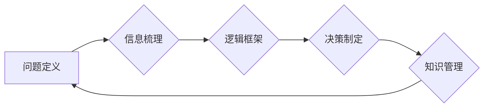

# 结构化思维的应用：从理论到实践

> 关键词：结构化思维，逻辑框架，决策制定，问题解决，知识管理，软件开发，项目管理

## 1. 背景介绍

在信息爆炸和快速变化的时代，结构化思维作为一种高效的信息处理和决策制定工具，越来越受到重视。结构化思维能够帮助我们整理纷繁复杂的信息，构建清晰的逻辑框架，从而更好地理解和解决问题。本文将深入探讨结构化思维的理论基础、实践方法以及在软件开发、项目管理等领域的应用，旨在帮助读者提升思维品质，提高工作效率。

### 1.1 结构化思维的由来

结构化思维起源于20世纪50年代的逻辑学研究和企业管理领域。随着信息技术的快速发展，结构化思维逐渐成为各类专业人士必备的技能。它强调在思考和处理问题时，要有条理、有逻辑、有系统，避免思维混乱和决策失误。

### 1.2 结构化思维的意义

结构化思维具有以下几方面的意义：

- 提高信息处理效率：通过结构化思维，我们可以快速梳理和整理信息，避免信息过载。
- 优化决策制定：结构化思维有助于我们全面分析问题，制定科学合理的解决方案。
- 促进知识管理：结构化思维可以帮助我们构建知识体系，方便知识的积累和传承。
- 提升沟通能力：结构化思维有助于我们清晰地表达思想，提高沟通效率。

### 1.3 本文结构

本文将围绕结构化思维展开，具体内容包括：

- 核心概念与联系
- 核心算法原理与具体操作步骤
- 数学模型和公式
- 项目实践
- 实际应用场景
- 工具和资源推荐
- 总结与展望

## 2. 核心概念与联系

### 2.1 核心概念

以下为结构化思维的核心概念：

- **问题定义**：明确问题的本质和目标。
- **信息梳理**：将问题相关的事实、观点、数据等信息进行整理和分析。
- **逻辑框架**：构建问题分析的逻辑结构，如SWOT分析、PEST分析等。
- **决策制定**：根据分析结果，制定解决问题的方案。
- **知识管理**：将解决问题的过程和结果进行总结和记录，形成知识体系。

### 2.2 核心概念原理和架构的 Mermaid 流程图



### 2.3 核心概念联系

上述核心概念之间存在着密切的联系：

- 问题定义是结构化思维的第一步，为后续分析提供方向。
- 信息梳理是问题定义的基础，有助于我们全面了解问题。
- 逻辑框架是信息梳理的结果，为问题分析提供结构化的视角。
- 决策制定是逻辑框架的延伸，旨在找到解决问题的最佳方案。
- 知识管理是决策制定的补充，有助于我们积累经验，为未来问题提供参考。

## 3. 核心算法原理 & 具体操作步骤

### 3.1 算法原理概述

结构化思维的核心算法原理可以概括为以下几点：

- **自顶向下**：从问题出发，逐步细化，直至找到可操作的解决方案。
- **分解问题**：将复杂问题分解为若干个子问题，分别解决。
- **归纳总结**：对问题分析的结果进行归纳总结，形成知识体系。

### 3.2 算法步骤详解

结构化思维的算法步骤如下：

1. **明确问题**：准确界定问题的范围和目标。
2. **信息收集**：收集与问题相关的各种信息，包括事实、数据、观点等。
3. **信息整理**：对收集到的信息进行整理和分析，剔除无关信息，提取关键信息。
4. **构建逻辑框架**：根据问题类型和分析结果，选择合适的逻辑框架，如SWOT分析、PEST分析等。
5. **分析问题**：根据逻辑框架，对问题进行分析，找出问题的原因和影响。
6. **制定解决方案**：根据分析结果，制定解决问题的方案。
7. **评估方案**：对解决方案进行评估，确保其可行性和有效性。
8. **实施方案**：将解决方案付诸实践，解决问题。

### 3.3 算法优缺点

#### 优点

- **条理清晰**：结构化思维使问题分析过程有条理、有逻辑，避免思维混乱。
- **全面分析**：结构化思维有助于我们从多个角度分析问题，避免遗漏关键因素。
- **高效决策**：结构化思维可以帮助我们快速找到解决问题的方案。

#### 缺点

- **局限性**：结构化思维可能忽视某些非结构化的因素，导致分析结果不全面。
- **适用性**：对于一些非常复杂的问题，结构化思维可能难以发挥作用。

### 3.4 算法应用领域

结构化思维在以下领域具有广泛的应用：

- **软件开发**：在需求分析、系统设计、项目管理等环节，结构化思维可以帮助开发者理清思路，提高开发效率。
- **项目管理**：在项目规划、风险管理、进度控制等方面，结构化思维可以帮助项目经理更好地管理项目。
- **商业分析**：在市场分析、竞争分析、财务分析等方面，结构化思维可以帮助商业分析师更好地理解市场环境和业务模式。
- **教育培训**：在课程设计、教学方法、学生评估等方面，结构化思维可以帮助教育工作者提高教学质量和效果。

## 4. 数学模型和公式 & 详细讲解 & 举例说明

### 4.1 数学模型构建

结构化思维的数学模型可以概括为以下公式：

$$
\text{解决方案} = f(\text{问题定义}, \text{信息梳理}, \text{逻辑框架}, \text{分析结果})
$$

其中，$f$ 表示解决问题的函数，$\text{问题定义}$、$\text{信息梳理}$、$\text{逻辑框架}$、$\text{分析结果}$ 分别为解决问题的输入。

### 4.2 公式推导过程

公式推导过程如下：

1. **问题定义**：明确问题目标和范围。
2. **信息梳理**：收集和分析相关数据。
3. **逻辑框架**：根据问题类型和分析结果，选择合适的逻辑框架。
4. **分析结果**：对问题进行分析，找出问题的原因和影响。
5. **解决方案**：根据分析结果，制定解决方案。

### 4.3 案例分析与讲解

以下以软件开发中的需求分析为例，讲解结构化思维的应用：

**案例背景**：某公司计划开发一款在线教育平台，需要明确平台的功能和目标用户。

**步骤**：

1. **问题定义**：明确目标是开发一款在线教育平台，满足用户学习、交流和互动的需求。
2. **信息梳理**：收集用户需求、竞品分析、市场调研等信息。
3. **逻辑框架**：选择SWOT分析框架，分析平台的优势、劣势、机会和威胁。
4. **分析结果**：发现平台的优势在于技术领先、用户体验良好，劣势在于市场知名度较低，机会在于在线教育市场快速扩张，威胁在于竞争激烈。
5. **解决方案**：制定解决方案，包括加强市场推广、优化用户体验、开发特色功能等。

通过结构化思维，开发团队能够清晰地了解平台需求和目标，为后续的开发工作奠定基础。

## 5. 项目实践：代码实例和详细解释说明

### 5.1 开发环境搭建

由于结构化思维是一种思维方法，无法通过代码实现。以下以Python代码为例，展示如何利用代码辅助结构化思维。

### 5.2 源代码详细实现

```python
def swot_analysis(strengths, weaknesses, opportunities, threats):
    """
    SWOT分析
    :param strengths: 优势列表
    :param weaknesses: 劣势列表
    :param opportunities: 机会列表
    :param threats: 威胁列表
    :return: 分析结果
    """
    result = {
        'strengths': strengths,
        'weaknesses': weaknesses,
        'opportunities': opportunities,
        'threats': threats
    }
    return result

# 示例数据
strengths = ['技术领先', '用户体验良好']
weaknesses = ['市场知名度较低']
opportunities = ['在线教育市场快速扩张']
threats = ['竞争激烈']

# 执行SWOT分析
result = swot_analysis(strengths, weaknesses, opportunities, threats)
print(result)
```

### 5.3 代码解读与分析

上述代码实现了SWOT分析功能，通过将优势和劣势、机会和威胁分别输入，输出分析结果。这有助于我们在分析问题时，更加清晰地梳理思路。

### 5.4 运行结果展示

```
{
    'strengths': ['技术领先', '用户体验良好'],
    'weaknesses': ['市场知名度较低'],
    'opportunities': ['在线教育市场快速扩张'],
    'threats': ['竞争激烈']
}
```

## 6. 实际应用场景

### 6.1 软件开发

在软件开发过程中，结构化思维可以帮助我们：

- 理解用户需求，明确项目目标。
- 设计合理的系统架构，提高代码质量。
- 制定详细的开发计划，确保项目进度。
- 预测和评估项目风险，制定应对策略。

### 6.2 项目管理

在项目管理中，结构化思维可以帮助我们：

- 分析项目需求，制定项目目标。
- 确定项目范围，避免范围蔓延。
- 制定项目计划，合理安排资源。
- 监控项目进度，及时发现和解决问题。

### 6.3 商业分析

在商业分析中，结构化思维可以帮助我们：

- 分析市场环境，制定市场策略。
- 评估竞争对手，制定竞争策略。
- 分析客户需求，制定产品策略。
- 预测市场趋势，制定发展策略。

## 7. 工具和资源推荐

### 7.1 学习资源推荐

- 《结构化思考力》
- 《金字塔原理》
- 《麦肯锡教我的思考武器》
- 《思维导图》

### 7.2 开发工具推荐

- XMind
- MindManager
- 幕布

### 7.3 相关论文推荐

- 《结构化思维》
- 《金字塔原理》
- 《麦肯锡教我的思考武器》

## 8. 总结：未来发展趋势与挑战

### 8.1 研究成果总结

本文从理论到实践，深入探讨了结构化思维的应用。通过分析核心概念、算法原理、实际应用场景等，帮助读者了解结构化思维的内涵和作用。

### 8.2 未来发展趋势

随着人工智能技术的快速发展，结构化思维的应用将更加广泛。以下是一些可能的发展趋势：

- 结构化思维与人工智能技术的融合，实现自动化、智能化的思维辅助。
- 结构化思维在跨领域应用的拓展，如教育、医疗、金融等。
- 结构化思维在企业和组织管理中的应用，提高组织效率和创新能力。

### 8.3 面临的挑战

结构化思维在应用过程中也面临着一些挑战：

- 思维惯性：习惯于传统思维方式，难以接受新的思维模式。
- 能力培养：结构化思维需要长期训练，难以在短时间内形成。
- 模式化思维：过度依赖结构化思维，可能导致创新不足。

### 8.4 研究展望

为了应对未来挑战，我们需要：

- 加强结构化思维的教育和培训，提高全民思维品质。
- 研究结构化思维与人工智能技术的融合，实现智能化思维辅助。
- 探索结构化思维在不同领域的应用，推动结构化思维的创新和发展。

## 9. 附录：常见问题与解答

**Q1：结构化思维是否适用于所有人？**

A：结构化思维适用于所有人，无论是在个人生活还是工作中，都能够帮助我们更好地思考和解决问题。

**Q2：如何培养结构化思维？**

A：培养结构化思维需要长期训练，以下是一些建议：

- 多读书、多思考，积累知识储备。
- 练习思维导图等工具，提高逻辑思维能力。
- 积极参与讨论和辩论，锻炼思维敏捷性。

**Q3：结构化思维与创造力有什么关系？**

A：结构化思维和创造力并非矛盾关系，两者可以相辅相成。结构化思维可以帮助我们更好地理解问题，为创新提供基础；而创造力可以帮助我们突破思维局限，实现创新。

**Q4：结构化思维是否会影响决策效率？**

A：结构化思维可以提高决策效率，因为它可以帮助我们快速分析问题，找到解决问题的方案。

**Q5：结构化思维在人工智能时代是否还有意义？**

A：结构化思维在人工智能时代仍然具有重要意义。尽管人工智能可以处理大量数据，但人类的思维能力和创造力仍然是不可或缺的。

作者：禅与计算机程序设计艺术 / Zen and the Art of Computer Programming