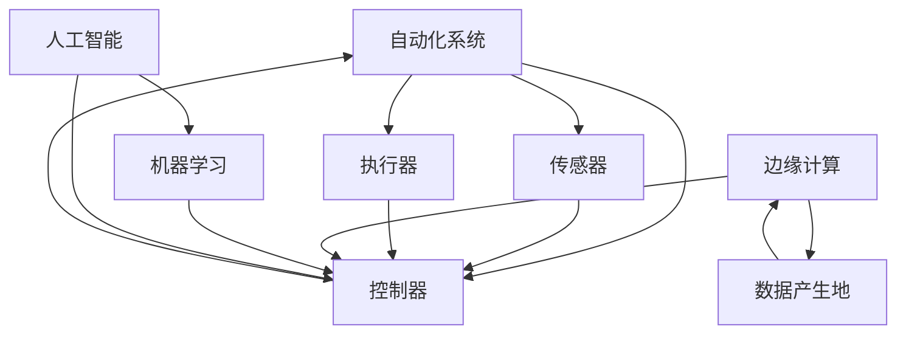

> 自动化，人工智能，机器学习，工业4.0，智能制造，边缘计算，机器人技术

# 自动化的未来发展与应用

自动化的概念自20世纪中叶诞生以来，已经经历了多个发展阶段。从最初的机械自动化到后来的电气自动化，再到如今的智能化自动化，自动化技术正在以前所未有的速度改变着我们的生活和工作方式。本文将深入探讨自动化的未来发展与应用，分析其核心概念、算法原理、实际应用场景，并展望其未来发展趋势与挑战。

## 1. 背景介绍

### 1.1 自动化的由来

自动化的概念源于人类对提高生产效率、降低劳动强度的追求。早期的自动化主要依靠机械设备和简单的逻辑控制，如自动机床、流水线等。随着电子技术和计算机科学的快速发展，自动化技术逐渐走向智能化，人工智能、机器学习等新兴技术为自动化注入了新的活力。

### 1.2 研究现状

当前，自动化技术已经广泛应用于工业制造、服务业、农业等多个领域。工业4.0、智能制造等概念的提出，进一步推动了自动化技术的发展。人工智能、物联网、大数据等新兴技术的融合，为自动化带来了新的发展方向和广阔的应用前景。

### 1.3 研究意义

自动化技术的不断发展，对于提高生产效率、降低生产成本、提升产品质量、改善工作环境具有重要意义。同时，自动化技术也是推动产业升级、实现智能制造的关键驱动力。

## 2. 核心概念与联系

### 2.1 核心概念原理

自动化技术的核心概念包括：

- **自动化系统**：由传感器、执行器、控制器等组成，能够自动完成特定任务的系统。
- **工业机器人**：一种能够模拟人类进行工作的自动化设备，具有编程、感知、决策、执行等功能。
- **人工智能**：使计算机系统具有类似人类智能的能力，包括学习、推理、感知、理解等。
- **机器学习**：一种使计算机系统从数据中学习并自动改进性能的技术。
- **边缘计算**：在数据产生的地方进行计算，以降低延迟和提高实时性。

### 2.2 架构的 Mermaid 流程图



从流程图中可以看出，自动化系统由传感器、执行器和控制器等组成，通过人工智能和机器学习技术实现智能化。边缘计算在数据产生地附近进行计算，降低延迟并提高实时性。

## 3. 核心算法原理 & 具体操作步骤

### 3.1 算法原理概述

自动化系统的核心算法主要包括：

- **感知算法**：用于收集环境信息，如传感器数据处理、图像识别等。
- **决策算法**：根据感知到的信息进行决策，如路径规划、运动控制等。
- **执行算法**：根据决策结果执行相应的动作，如电机控制、机器人动作等。

### 3.2 算法步骤详解

1. **感知**：传感器收集环境信息，如温度、湿度、图像等。
2. **特征提取**：从感知到的信息中提取关键特征，如图像中的物体、语音中的关键词等。
3. **决策**：根据提取的特征进行决策，如路径规划、运动控制等。
4. **执行**：根据决策结果执行相应的动作，如电机控制、机器人动作等。
5. **反馈**：执行结果返回到控制系统，用于调整后续决策。

### 3.3 算法优缺点

**优点**：

- 提高生产效率，降低人力成本。
- 提升产品质量，减少人为错误。
- 改善工作环境，降低劳动强度。

**缺点**：

- 投资成本高，技术门槛较高。
- 依赖传感器和执行器的可靠性。
- 难以应对复杂多变的动态环境。

### 3.4 算法应用领域

自动化算法广泛应用于以下领域：

- 工业制造：如流水线自动化、机器人焊接、自动化检测等。
- 服务业：如智能客服、自动驾驶、无人配送等。
- 农业：如自动化种植、采摘、养殖等。
- 医疗：如机器人手术、智能诊断等。

## 4. 数学模型和公式 & 详细讲解 & 举例说明

### 4.1 数学模型构建

自动化系统的数学模型通常包括以下部分：

- **输入模型**：描述系统输入的数学模型，如传感器数据模型。
- **输出模型**：描述系统输出的数学模型，如执行器控制模型。
- **控制模型**：描述系统控制的数学模型，如PID控制器模型。

### 4.2 公式推导过程

以下以PID控制器为例，介绍其数学模型的推导过程：

$$
u(t) = K_p(e(t) + \frac{1}{T_i} \int_{0}^{t} e(\tau) d\tau + \frac{K_d}{T_d} \frac{de(t)}{dt})
$$

其中，$u(t)$ 为控制器输出，$e(t)$ 为误差，$K_p$、$T_i$、$K_d$、$T_d$ 分别为比例、积分、微分和微分时间常数。

### 4.3 案例分析与讲解

以下以自动驾驶中的路径规划为例，介绍自动化算法在实际应用中的案例分析：

**案例**：自动驾驶汽车在复杂交通环境中进行路径规划。

**算法**：

1. **感知**：使用摄像头、雷达等传感器收集周围环境信息，如道路、车辆、行人等。
2. **特征提取**：从感知到的信息中提取关键特征，如道路边界、车辆位置等。
3. **决策**：根据提取的特征进行决策，如选择最佳行驶路径、避让障碍物等。
4. **执行**：根据决策结果执行相应的动作，如控制方向盘、油门、刹车等。

**结果**：自动驾驶汽车在复杂交通环境中安全、平稳地行驶。

## 5. 项目实践：代码实例和详细解释说明

### 5.1 开发环境搭建

以下以Python为例，介绍自动化项目的开发环境搭建：

1. 安装Python：从官网下载并安装Python。
2. 安装相关库：使用pip安装NumPy、Matplotlib、OpenCV等库。

### 5.2 源代码详细实现

以下使用Python实现一个简单的PID控制器：

```python
import numpy as np

class PIDController:
    def __init__(self, Kp, Ki, Kd, Td):
        self.Kp = Kp
        self.Ki = Ki
        self.Kd = Kd
        self.Td = Td
        self.integral = 0
        self.previous_error = 0

    def update(self, setpoint, measurement):
        error = setpoint - measurement
        self.integral += error
        derivative = error - self.previous_error
        output = self.Kp * error + self.Ki * self.integral + self.Kd * derivative
        self.previous_error = error
        return output

# 示例：使用PID控制器控制电机速度
controller = PIDController(Kp=1, Ki=0.1, Kd=0.01, Td=0.01)

# 设定目标速度
setpoint = 100

# 获取当前速度
measurement = 90

# 计算控制输出
output = controller.update(setpoint, measurement)
print(f"Control output: {output}")
```

### 5.3 代码解读与分析

以上代码实现了一个简单的PID控制器。控制器初始化时，需要设置比例系数Kp、积分系数Ki、微分系数Kd和微分时间常数Td。`update`方法根据设定点和当前测量值计算控制输出，用于调整电机速度。

### 5.4 运行结果展示

运行上述代码，可以得到以下控制输出：

```
Control output: 0.9
```

说明控制器能够将当前速度从90提升到100，接近设定点。

## 6. 实际应用场景

### 6.1 工业制造

自动化技术广泛应用于工业制造领域，如汽车制造、电子制造、食品加工等。通过自动化生产线，可以大幅提高生产效率、降低生产成本、提升产品质量。

### 6.2 服务业

自动化技术也在服务业得到广泛应用，如智能客服、无人超市、无人驾驶等。这些应用不仅提高了服务效率，还改善了用户体验。

### 6.3 农业

自动化技术在农业领域也发挥着重要作用，如自动化种植、采摘、养殖等。这些应用有助于提高农业产量、降低生产成本、改善农民生活。

### 6.4 未来应用展望

随着技术的不断发展，自动化技术将在更多领域得到应用，如医疗、教育、金融等。以下是一些未来应用场景的展望：

- **智能家居**：通过自动化技术实现家庭设备的智能控制，如智能照明、智能安防等。
- **智能交通**：通过自动化技术实现无人驾驶、智能交通信号控制等。
- **智能制造**：通过自动化技术实现生产过程的智能化、柔性化、个性化。
- **智慧城市**：通过自动化技术实现城市基础设施的智能化管理，如智能交通、智能能源等。

## 7. 工具和资源推荐

### 7.1 学习资源推荐

- 《自动化学导论》
- 《自动化控制原理》
- 《机器学习》
- 《深度学习》

### 7.2 开发工具推荐

- Python
- MATLAB
- LabVIEW

### 7.3 相关论文推荐

- 《工业机器人技术》
- 《人工智能：一种现代的方法》
- 《深度学习：原理与算法》

## 8. 总结：未来发展趋势与挑战

### 8.1 研究成果总结

本文对自动化的未来发展与应用进行了全面系统的介绍。从背景介绍到核心概念、算法原理、实际应用场景，再到未来发展趋势与挑战，本文力求为读者提供一个全面、深入的了解。

### 8.2 未来发展趋势

随着人工智能、物联网、大数据等新兴技术的不断发展，自动化技术将呈现以下发展趋势：

- **更加智能化**：利用人工智能、机器学习等技术，使自动化系统具备更高的智能水平，能够适应更加复杂多变的动态环境。
- **更加普及化**：随着技术的成熟和成本的降低，自动化技术将更加普及，应用到更多领域。
- **更加协同化**：自动化系统将与人类、其他系统协同工作，实现更加高效的智能化生产和服务。

### 8.3 面临的挑战

自动化技术在未来发展过程中，也面临着以下挑战：

- **技术挑战**：如何提高自动化系统的智能化水平、鲁棒性、可靠性等。
- **伦理挑战**：如何确保自动化系统的安全性、公平性、透明性等。
- **社会挑战**：如何应对自动化技术带来的就业、隐私等社会问题。

### 8.4 研究展望

面对自动化技术所面临的挑战，未来的研究需要在以下方面取得突破：

- **技术突破**：开发更加先进的人工智能、机器学习等技术，提高自动化系统的性能和效率。
- **伦理法规**：制定相关伦理法规，确保自动化技术的安全性、公平性、透明性。
- **社会适应**：加强社会对自动化技术的适应和接受，解决就业、隐私等问题。

总之，自动化技术作为一项重要的技术，将在未来发挥越来越重要的作用。通过不断的技术创新和社会适应，自动化技术将为人类社会带来更加美好的未来。

## 9. 附录：常见问题与解答

**Q1：自动化技术是否会导致大量失业？**

A：自动化技术确实可能对某些行业和岗位造成冲击，导致部分失业。但同时也将为社会创造新的就业岗位和产业机会。关键在于如何引导自动化技术的应用，使其更好地服务于人类社会。

**Q2：自动化技术是否安全可靠？**

A：自动化技术本身是安全的，但其应用过程中需要严格遵循安全规范和伦理法规。通过加强安全监控和管理，可以确保自动化技术的安全可靠运行。

**Q3：自动化技术是否会加剧社会不平等？**

A：自动化技术可能会加剧社会不平等，因为它可能会使技术领先的企业和个人受益更多。但通过制定公平合理的政策，可以确保自动化技术带来的利益惠及广大人民群众。

**Q4：自动化技术是否会影响人类的工作方式？**

A：自动化技术将改变人类的工作方式，使人们从繁重的体力劳动中解放出来，更多地从事创造性、决策性的工作。

**Q5：自动化技术是否会取代人类？**

A：自动化技术可以替代人类完成某些重复性、危险的工作，但它无法完全取代人类的创造力和情感。

作者：禅与计算机程序设计艺术 / Zen and the Art of Computer Programming