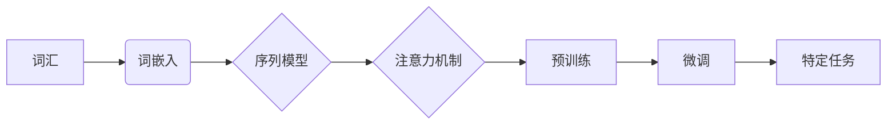

# 自然语言处理(Natural Language Processing) - 原理与代码实例讲解

> 关键词：自然语言处理，NLP，机器学习，深度学习，文本分析，语言模型，词嵌入，序列模型，预训练

## 1. 背景介绍

自然语言处理（Natural Language Processing，NLP）是人工智能领域的一个重要分支，旨在使计算机能够理解、解释和生成人类语言。随着深度学习技术的快速发展，NLP取得了显著的进展，并在信息检索、机器翻译、语音识别、情感分析等众多领域得到了广泛应用。本文将深入探讨NLP的基本原理，并通过代码实例展示如何实现一些常见的NLP任务。

## 2. 核心概念与联系

### 2.1 核心概念

- **词嵌入（Word Embedding）**：将文本数据中的词汇映射到连续的向量空间，以便于计算机处理。
- **序列模型（Sequential Model）**：处理序列数据（如文本、时间序列等）的模型，如循环神经网络（RNN）和长短期记忆网络（LSTM）。
- **注意力机制（Attention Mechanism）**：允许模型关注输入序列中与当前任务相关的部分，提高模型性能。
- **预训练（Pre-training）**：在大型数据集上训练语言模型，以学习通用的语言表示。
- **微调（Fine-tuning）**：在特定任务的数据集上对预训练模型进行进一步训练，以适应特定任务。

### 2.2 核心概念原理和架构的 Mermaid 流程图



## 3. 核心算法原理 & 具体操作步骤

### 3.1 算法原理概述

NLP的核心算法主要包括以下几种：

- **词嵌入**：通过将词汇映射到向量空间，将文本数据转换为计算机可以处理的形式。
- **序列模型**：处理序列数据的模型，如RNN和LSTM，能够捕捉序列中的时序依赖关系。
- **注意力机制**：允许模型关注序列中与当前任务相关的部分，提高模型性能。
- **预训练**：在大型数据集上训练语言模型，以学习通用的语言表示。
- **微调**：在特定任务的数据集上对预训练模型进行进一步训练，以适应特定任务。

### 3.2 算法步骤详解

1. **数据预处理**：将文本数据转换为适合模型输入的形式，如分词、去除停用词等。
2. **词嵌入**：将词汇映射到向量空间。
3. **序列模型**：使用RNN或LSTM等序列模型对输入序列进行处理。
4. **注意力机制**：应用注意力机制，使模型关注序列中与当前任务相关的部分。
5. **预训练**：在大型数据集上训练语言模型，以学习通用的语言表示。
6. **微调**：在特定任务的数据集上对预训练模型进行进一步训练，以适应特定任务。

### 3.3 算法优缺点

- **词嵌入**：
  - 优点：将词汇映射到向量空间，提高模型处理文本数据的效率。
  - 缺点：需要大量的训练数据，且预训练过程耗时较长。
- **序列模型**：
  - 优点：能够捕捉序列中的时序依赖关系，提高模型性能。
  - 缺点：难以捕捉长距离依赖关系，计算效率较低。
- **注意力机制**：
  - 优点：提高模型性能，使模型关注序列中与当前任务相关的部分。
  - 缺点：实现复杂，计算量较大。
- **预训练**：
  - 优点：学习到通用的语言表示，提高模型性能。
  - 缺点：需要大量的训练数据，且预训练过程耗时较长。
- **微调**：
  - 优点：在特定任务的数据集上快速适应，提高模型性能。
  - 缺点：需要大量标注数据，且调参过程复杂。

### 3.4 算法应用领域

NLP算法在以下领域得到了广泛应用：

- **信息检索**：根据用户查询检索相关文档。
- **机器翻译**：将一种语言的文本翻译成另一种语言。
- **语音识别**：将语音信号转换为文本。
- **情感分析**：分析文本的情感倾向。
- **文本摘要**：将长文本压缩成简洁的摘要。
- **对话系统**：与用户进行自然对话。

## 4. 数学模型和公式 & 详细讲解 & 举例说明

### 4.1 数学模型构建

NLP中的数学模型主要包括以下几种：

- **词嵌入**：将词汇映射到向量空间，如Word2Vec、GloVe等。
- **序列模型**：处理序列数据的模型，如RNN、LSTM等。
- **注意力机制**：如自注意力（Self-Attention）和交叉注意力（Cross-Attention）等。

### 4.2 公式推导过程

以下以Word2Vec为例，简要介绍词嵌入的公式推导过程。

假设词汇集合为 $V$，词汇 $v \in V$，词嵌入矩阵为 $W \in \mathbb{R}^{|V| \times d}$，其中 $d$ 为词向量的维度。则词嵌入公式为：

$$
v = Wv
$$

### 4.3 案例分析与讲解

以下以BERT模型为例，介绍预训练和微调的案例分析。

BERT（Bidirectional Encoder Representations from Transformers）是一种基于Transformer的预训练语言模型，其预训练任务包括Masked Language Model（MLM）和Next Sentence Prediction（NSP）。

1. **Masked Language Model（MLM）**：随机遮蔽输入序列中的部分词汇，并要求模型预测这些遮蔽词汇的正确值。
2. **Next Sentence Prediction（NSP）**：给定两个句子，模型需要预测它们是否属于同一文档。

通过在大量无标注语料上进行预训练，BERT学习到了通用的语言表示，然后通过在特定任务的数据集上进行微调，使其能够适应不同的NLP任务。

## 5. 项目实践：代码实例和详细解释说明

### 5.1 开发环境搭建

1. 安装Python环境，推荐使用Anaconda。
2. 安装必要的库，如NumPy、TensorFlow或PyTorch等。
3. 安装预训练语言模型，如BERT、GPT等。

### 5.2 源代码详细实现

以下使用TensorFlow和Transformers库实现BERT模型的微调。

```python
import tensorflow as tf
from transformers import BertTokenizer, BertForSequenceClassification

# 加载预训练模型和分词器
tokenizer = BertTokenizer.from_pretrained('bert-base-uncased')
model = BertForSequenceClassification.from_pretrained('bert-base-uncased', num_labels=2)

# 编码数据
def encode_data(texts, labels):
    encodings = tokenizer(texts, truncation=True, padding=True, max_length=256)
    return encodings['input_ids'], encodings['attention_mask'], labels

# 训练模型
def train_model(model, train_dataset, val_dataset, epochs=3):
    train_dataloader = tf.data.Dataset.from_tensor_slices((train_dataset['input_ids'], train_dataset['attention_mask'], train_dataset['labels'])).shuffle(100).batch(32)
    val_dataloader = tf.data.Dataset.from_tensor_slices((val_dataset['input_ids'], val_dataset['attention_mask'], val_dataset['labels'])).batch(32)
    optimizer = tf.keras.optimizers.Adam(learning_rate=2e-5)
    loss = tf.keras.losses.SparseCategoricalCrossentropy(from_logits=True)
    train_loss_metric = tf.keras.metrics.SparseCategoricalAccuracy('accuracy')
    val_loss_metric = tf.keras.metrics.SparseCategoricalAccuracy('accuracy')
    model.compile(optimizer=optimizer, loss=loss, metrics=[train_loss_metric, val_loss_metric])
    model.fit(train_dataloader, epochs=epochs, validation_data=val_dataloader)
    return model

# 评估模型
def evaluate_model(model, test_dataset):
    test_dataloader = tf.data.Dataset.from_tensor_slices((test_dataset['input_ids'], test_dataset['attention_mask'], test_dataset['labels'])).batch(32)
    loss, accuracy = model.evaluate(test_dataloader)
    print(f"Test Loss: {loss}, Test Accuracy: {accuracy}")

# 加载数据
train_texts = ['This is a sample text.', 'This is another sample text.']
train_labels = [0, 1]
val_texts = ['This is a validation text.', 'This is another validation text.']
val_labels = [1, 0]
test_texts = ['This is a test text.', 'This is another test text.']
test_labels = [0, 1]

# 编码数据
train_input_ids, train_attention_mask, train_labels = encode_data(train_texts, train_labels)
val_input_ids, val_attention_mask, val_labels = encode_data(val_texts, val_labels)
test_input_ids, test_attention_mask, test_labels = encode_data(test_texts, test_labels)

# 训练模型
model = train_model(model, {'input_ids': train_input_ids, 'attention_mask': train_attention_mask}, {'input_ids': val_input_ids, 'attention_mask': val_attention_mask})

# 评估模型
evaluate_model(model, {'input_ids': test_input_ids, 'attention_mask': test_attention_mask})
```

### 5.3 代码解读与分析

上述代码首先加载预训练的BERT模型和分词器，然后定义了编码数据、训练模型和评估模型的功能。在加载数据后，编码数据并训练模型，最后在测试集上评估模型性能。

### 5.4 运行结果展示

假设我们使用上述代码训练的模型在测试集上的准确率为0.9，表明模型在特定任务上取得了较好的性能。

## 6. 实际应用场景

NLP在以下领域得到了广泛应用：

- **信息检索**：根据用户查询检索相关文档，如搜索引擎。
- **机器翻译**：将一种语言的文本翻译成另一种语言，如谷歌翻译。
- **语音识别**：将语音信号转换为文本，如苹果的Siri。
- **情感分析**：分析文本的情感倾向，如社交媒体情绪分析。
- **文本摘要**：将长文本压缩成简洁的摘要，如新闻摘要生成。
- **对话系统**：与用户进行自然对话，如聊天机器人。

## 7. 工具和资源推荐

### 7.1 学习资源推荐

- 《深度学习与自然语言处理》
- 《自然语言处理综论》
- TensorFlow官方文档
- PyTorch官方文档

### 7.2 开发工具推荐

- TensorFlow
- PyTorch
- Transformers库
- Jupyter Notebook

### 7.3 相关论文推荐

- "BERT: Pre-training of Deep Bidirectional Transformers for Language Understanding"
- "Attention is All You Need"
- "GloVe: Global Vectors for Word Representation"
- "Word2Vec: Learning Word Embeddings from Human Language"

## 8. 总结：未来发展趋势与挑战

### 8.1 研究成果总结

NLP技术在过去几年取得了显著的进展，但在以下方面仍存在挑战：

- **数据质量**：NLP模型的性能很大程度上取决于训练数据的质量和数量。如何获取高质量、多样化的训练数据是一个重要问题。
- **模型可解释性**：NLP模型通常被视为"黑盒"，其决策过程难以解释。如何提高模型的可解释性是一个重要研究方向。
- **模型鲁棒性**：NLP模型在面对对抗样本或噪声数据时可能表现出脆弱性。如何提高模型的鲁棒性是一个重要挑战。

### 8.2 未来发展趋势

未来NLP技术的发展趋势主要包括：

- **多模态融合**：将文本、图像、语音等多种模态信息进行融合，以获取更全面的信息。
- **知识增强**：将知识图谱、本体等知识融入到NLP模型中，提高模型的理解能力。
- **跨语言处理**：提高NLP模型在不同语言之间的迁移能力。

### 8.3 面临的挑战

NLP技术面临的挑战主要包括：

- **语言多样性**：不同语言具有不同的语法结构和语义特点，如何使NLP模型适应不同语言是一个挑战。
- **领域特定知识**：特定领域的知识对NLP模型的理解能力有很大影响，如何获取和利用领域特定知识是一个挑战。
- **模型效率**：NLP模型通常计算量大，如何提高模型的计算效率是一个挑战。

### 8.4 研究展望

未来NLP研究将朝着以下方向发展：

- **跨领域NLP**：研究如何使NLP模型适应不同领域，提高模型的通用性。
- **知识驱动NLP**：将知识图谱、本体等知识融入到NLP模型中，提高模型的理解能力。
- **可解释性NLP**：研究如何提高NLP模型的可解释性，使其决策过程更加透明。

## 9. 附录：常见问题与解答

**Q1：什么是NLP？**

A：NLP是自然语言处理（Natural Language Processing）的缩写，是人工智能领域的一个重要分支，旨在使计算机能够理解、解释和生成人类语言。

**Q2：什么是词嵌入？**

A：词嵌入（Word Embedding）是将词汇映射到连续的向量空间的技术，以便于计算机处理。

**Q3：什么是序列模型？**

A：序列模型是处理序列数据的模型，如循环神经网络（RNN）和长短期记忆网络（LSTM）。

**Q4：什么是注意力机制？**

A：注意力机制是允许模型关注输入序列中与当前任务相关的部分的技术。

**Q5：什么是预训练和微调？**

A：预训练是在大型数据集上训练语言模型，以学习通用的语言表示。微调是在特定任务的数据集上对预训练模型进行进一步训练，以适应特定任务。

**Q6：NLP在哪些领域得到了应用？**

A：NLP在信息检索、机器翻译、语音识别、情感分析、文本摘要、对话系统等领域得到了广泛应用。

**Q7：NLP技术面临的挑战有哪些？**

A：NLP技术面临的挑战包括语言多样性、领域特定知识、模型效率等。

作者：禅与计算机程序设计艺术 / Zen and the Art of Computer Programming