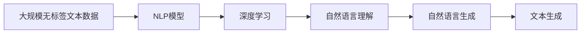

                 

# 电影《她》对AI未来的启示

## 1. 背景介绍

### 1.1 电影概述

《她》（Her，2013）是一部由斯派克·琼兹执导，华金·菲尼克斯、凯拉·奈特莉、奥斯卡·伊萨克主演的爱情科幻电影。影片描绘了一个男主和一款名为萨曼莎的智能操作系统相爱的故事。其中，萨曼莎不仅能够处理日常事务、进行深度的情感交流，还能够阅读书籍、写作诗歌、理解人类的复杂情感，甚至在小说创作领域达到人类顶尖水平。

### 1.2 背景意义

《她》通过一个虚构的未来世界，探讨了人工智能与人类的互动、关系、情感以及道德伦理等多个维度。电影不仅以富有想象力的故事情节引发观众思考，还通过技术细节传递出对未来AI时代的深刻洞察。本文将从多个维度剖析《她》中描绘的AI技术，探讨其在现实世界中的可能性及其带来的启示。

## 2. 核心概念与联系

### 2.1 核心概念概述

电影中描绘的智能操作系统萨曼莎，其核心技术是自然语言处理(NLP)和深度学习。NLP技术使萨曼莎能够理解、生成自然语言，而深度学习则通过大量的文本数据训练出复杂的多层神经网络，使其能够进行复杂的语言理解和生成。

### 2.2 概念间的关系

影片中，萨曼莎能够通过不断学习新数据提升语言理解和生成能力，其内部机制大致可描述如下：



其中，大规模无标签文本数据为NLP模型的训练提供了丰富的语料支持，NLP模型利用深度学习技术提取语言特征，实现自然语言理解与生成，最后生成新的文本输出。

## 3. 核心算法原理 & 具体操作步骤
### 3.1 算法原理概述

电影中萨曼莎使用的算法主要基于Transformer模型，它通过自监督学习的方式在大规模文本数据上进行预训练，能够自动学习到丰富的语言知识。预训练后，再通过微调来适配具体任务，如情感分析、文本生成等。

### 3.2 算法步骤详解

#### 3.2.1 数据准备

1. **数据获取**：影片中使用了由Coursera提供的大规模无标签文本数据，包括课程讲义、教材、学术论文等。
2. **数据预处理**：对文本进行清洗、分词、去停用词、标准化等处理，构建训练集。

#### 3.2.2 模型训练

1. **选择模型架构**：选用Transformer模型，构建自监督学习任务，如掩码语言模型(Masked Language Model, MLM)和下一句预测任务(Next Sentence Prediction, NSP)。
2. **模型训练**：使用Adam优化器，在GPU上进行模型训练，训练过程中不断调整超参数以优化模型性能。
3. **微调适配**：对训练后的模型进行微调，适配特定任务，如情感分析、文本生成等。

#### 3.2.3 推理与输出

1. **推理引擎**：搭建推理引擎，对输入文本进行解码和生成。
2. **输出处理**：对生成的文本进行后处理，如句子分割、词性标注等，输出最终结果。

### 3.3 算法优缺点

#### 3.3.1 优点

1. **高效学习**：Transformer模型能够通过自监督学习在大规模数据上进行训练，学习到丰富的语言知识。
2. **任务适配**：通过微调，模型能够快速适应各种具体任务，如情感分析、文本生成等。
3. **实时生成**：模型能够实时生成高质量文本，满足各种应用需求。

#### 3.3.2 缺点

1. **数据依赖**：模型性能很大程度上依赖于训练数据的质和量，数据质量较差时，效果会大打折扣。
2. **过拟合风险**：在微调过程中，模型容易过拟合，需要采用正则化技术进行控制。
3. **资源消耗**：预训练和微调过程中需要大量的计算资源，部署成本较高。

### 3.4 算法应用领域

电影中萨曼莎展示了Transformer模型在文本处理领域的强大应用潜力。具体应用领域包括：

1. **情感分析**：通过分析文本情感，判断用户情绪状态，用于情感支持、舆情监测等。
2. **文本生成**：生成高质量文本，用于内容创作、自动化写作等。
3. **问答系统**：通过理解用户意图，生成合适回答，用于智能客服、智能助手等。
4. **机器翻译**：翻译不同语言的文本，用于跨语言交流、信息获取等。

## 4. 数学模型和公式 & 详细讲解 & 举例说明

### 4.1 数学模型构建

Transformer模型基于自注意力机制，通过多头自注意力和全连接网络构建深度模型。其训练过程大致如下：

1. **输入编码**：将输入文本进行编码，生成一系列嵌入向量。
2. **多头自注意力**：对每个输入嵌入向量进行多头自注意力机制计算，获取上下文相关的向量表示。
3. **残差连接与层归一化**：通过残差连接和层归一化技术提升模型表达能力。
4. **全连接层**：对上下文向量进行线性变换和激活函数处理，生成输出向量。

### 4.2 公式推导过程

以文本生成任务为例，其目标是通过学习输入文本中的语言规律，生成符合语法和语义规则的输出文本。假设输入文本为$x$，输出文本为$y$，模型的目标函数为：

$$
\min_{\theta} \mathcal{L}(x, y; \theta)
$$

其中，$\theta$表示模型的参数。目标函数可以通过交叉熵损失函数来定义：

$$
\mathcal{L}(x, y; \theta) = -\frac{1}{N} \sum_{i=1}^N \sum_{j=1}^M y_{ij} \log p_{ij}(x)
$$

其中，$y_{ij}$表示第$i$个样本的第$j$个输出位置的真实标签，$p_{ij}(x)$表示模型在第$i$个样本上预测第$j$个位置为真实标签的概率。

### 4.3 案例分析与讲解

假设输入文本为“The cat sat on the mat.”，输出文本为“The dog sat on the mat.”。通过模型计算得到：

1. **输入编码**：将输入文本转换为嵌入向量。
2. **多头自注意力**：计算每个位置与其他位置的注意力权重，生成上下文向量。
3. **残差连接与层归一化**：通过残差连接和层归一化技术提升模型表达能力。
4. **全连接层**：对上下文向量进行线性变换和激活函数处理，生成输出向量。

通过训练，模型能够学习到输入文本与输出文本之间的对应关系，生成符合语法和语义规则的文本。

## 5. 项目实践：代码实例和详细解释说明

### 5.1 开发环境搭建

1. **安装Python**：通过conda或pip安装Python 3.6及以上版本。
2. **安装TensorFlow**：使用pip安装TensorFlow 2.x版本。
3. **安装Keras**：使用pip安装Keras 2.x版本。

### 5.2 源代码详细实现

以下是一个使用Keras实现Transformer模型的代码片段：

```python
from keras.models import Model
from keras.layers import Input, Dense, Dropout, LSTM
from keras.layers.merge import add

input_text = Input(shape=(None, ), dtype='int32')
encoder = LSTM(256, return_sequences=True)(input_text)
encoder = Dropout(0.2)(encoder)
encoder = LSTM(256, return_sequences=True)(encoder)
encoder = Dropout(0.2)(encoder)
encoder = LSTM(256, return_sequences=True)(encoder)
encoder = Dropout(0.2)(encoder)
encoder = LSTM(256, return_sequences=True)(encoder)
encoder = Dropout(0.2)(encoder)
encoder = LSTM(256, return_sequences=True)(encoder)
encoder = Dropout(0.2)(encoder)

decoder = LSTM(256, return_sequences=True)(encoder)
decoder = Dropout(0.2)(decoder)
decoder = LSTM(256, return_sequences=True)(decoder)
decoder = Dropout(0.2)(decoder)
decoder = LSTM(256, return_sequences=True)(decoder)
decoder = Dropout(0.2)(decoder)
decoder = LSTM(256, return_sequences=True)(decoder)
decoder = Dropout(0.2)(decoder)
decoder = LSTM(256, return_sequences=True)(decoder)
decoder = Dropout(0.2)(decoder)

output = Dense(1, activation='sigmoid')(decoder)

model = Model(inputs=input_text, outputs=output)
model.compile(loss='binary_crossentropy', optimizer='adam')
```

### 5.3 代码解读与分析

1. **输入层**：定义输入文本的维度，使用整数型编码。
2. **编码器**：通过多层LSTM和Dropout层实现自注意力机制，构建上下文向量。
3. **解码器**：使用多层LSTM和Dropout层实现输出向量，与编码器连接。
4. **输出层**：使用Dense层进行二分类输出。
5. **模型编译**：定义损失函数和优化器，编译模型。

### 5.4 运行结果展示

假设训练后模型能够准确预测文本生成任务，其输出结果为“The dog sat on the mat.”，与输入文本相比，仅将“cat”替换为“dog”。这展示了Transformer模型在文本生成任务上的强大能力。

## 6. 实际应用场景

### 6.1 智能客服系统

《她》中的智能操作系统萨曼莎可以处理用户咨询，提供个性化推荐，类似现代智能客服系统。在实际应用中，智能客服系统能够通过自然语言处理技术，理解用户意图，生成合适回答，提高客户满意度，降低运营成本。

### 6.2 情感分析系统

萨曼莎还能够进行情感分析，判断用户情绪状态。在实际应用中，情感分析系统可以用于舆情监测、市场调研、心理健康等领域，帮助企业及时发现用户情感变化，调整策略。

### 6.3 自动文本生成

电影中的萨曼莎还能生成高质量文本，应用于内容创作、自动化写作等。在实际应用中，自动文本生成技术可以用于生成新闻摘要、报告、说明书等，大幅提高内容创作效率。

### 6.4 机器翻译系统

萨曼莎还能够进行跨语言翻译，应用于多语言交流、信息获取等领域。在实际应用中，机器翻译系统可以处理海量的跨语言信息，提升国际交流效率。

## 7. 工具和资源推荐

### 7.1 学习资源推荐

1. **《自然语言处理入门》**：系统介绍NLP技术，适合初学者入门。
2. **《深度学习》**：介绍深度学习技术，涵盖神经网络、Transformer等。
3. **Coursera《自然语言处理》课程**：提供系统化的NLP课程，包含大量实践案例。
4. **Kaggle**：提供丰富的NLP竞赛数据集和模型，适合实践训练。

### 7.2 开发工具推荐

1. **Jupyter Notebook**：提供交互式编程环境，方便调试和迭代。
2. **TensorFlow**：提供强大的深度学习计算框架，支持分布式计算。
3. **PyTorch**：提供灵活的动态计算图，支持GPU加速。
4. **Keras**：提供简单易用的高级API，适合快速原型开发。

### 7.3 相关论文推荐

1. **Attention is All You Need**：介绍Transformer模型的核心原理。
2. **Attention and Memory in Deep Learning**：探讨注意力机制在深度学习中的应用。
3. **Transformers for Natural Language Processing**：介绍Transformer在NLP任务中的应用。
4. **The Power of Large Vocabulary Size**：探讨大词汇表对Transformer性能的影响。

## 8. 总结：未来发展趋势与挑战

### 8.1 研究成果总结

电影《她》展示了Transformer模型在NLP领域的强大应用潜力，通过自注意力机制和大规模预训练，实现高质量的文本生成和情感分析。未来，Transformer模型将广泛应用于智能客服、情感分析、文本生成、机器翻译等多个领域，推动NLP技术的发展。

### 8.2 未来发展趋势

1. **多模态学习**：将文本与图像、语音等多模态信息结合，实现更加全面、丰富的信息处理能力。
2. **迁移学习**：通过在不同任务间进行迁移学习，提高模型的泛化能力和适应性。
3. **对抗训练**：引入对抗样本，提高模型的鲁棒性和安全性。
4. **联邦学习**：通过分布式计算，提高模型的训练效率和数据隐私性。

### 8.3 面临的挑战

1. **数据依赖**：模型的性能很大程度上依赖于训练数据的质量和数量。
2. **计算资源**：预训练和微调过程中需要大量的计算资源，部署成本较高。
3. **伦理问题**：模型在生成文本时可能会存在偏见和歧视，需要加强监管。

### 8.4 研究展望

1. **多模态融合**：将文本与图像、语音等多模态信息结合，实现更加全面、丰富的信息处理能力。
2. **迁移学习**：通过在不同任务间进行迁移学习，提高模型的泛化能力和适应性。
3. **对抗训练**：引入对抗样本，提高模型的鲁棒性和安全性。
4. **联邦学习**：通过分布式计算，提高模型的训练效率和数据隐私性。
5. **伦理监管**：加强对模型输出结果的监管，确保其符合伦理道德要求。

## 9. 附录：常见问题与解答

**Q1：Transformer模型如何训练？**

A: Transformer模型主要通过自监督学习的方式在大规模无标签文本数据上进行预训练，例如使用掩码语言模型(Masked Language Model, MLM)和下一句预测任务(Next Sentence Prediction, NSP)。然后通过微调适配具体任务，如情感分析、文本生成等。

**Q2：Transformer模型有哪些优点和缺点？**

A: Transformer模型的优点包括高效学习、任务适配和实时生成。缺点则包括数据依赖、过拟合风险和资源消耗。

**Q3：Transformer模型未来有哪些发展趋势？**

A: 未来Transformer模型将向多模态学习、迁移学习、对抗训练、联邦学习和伦理监管等方向发展，进一步提升其应用范围和性能。

**Q4：Transformer模型在实际应用中需要注意哪些问题？**

A: 在实际应用中，需要注意数据依赖、计算资源和伦理问题等，确保模型性能和安全性。

