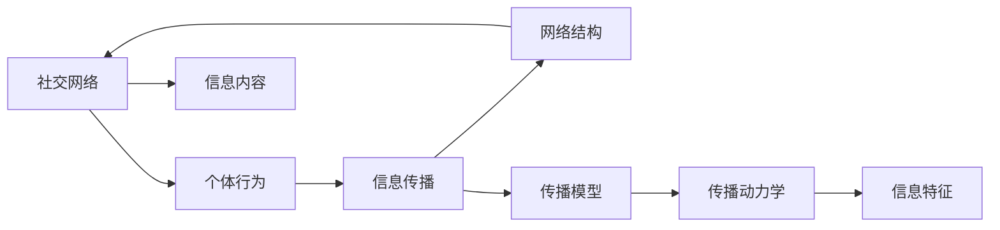
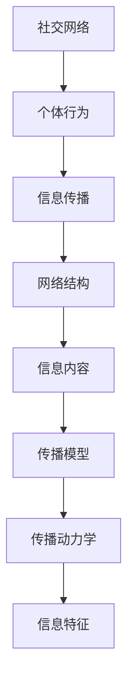

                 

# 社交网络上信息传播行为分析与计算机模拟研究

> 关键词：社交网络, 信息传播, 计算机模拟, 网络科学, 传播动力学

## 1. 背景介绍

### 1.1 问题由来
在社交媒体快速发展的今天，信息的传播速度和范围前所未有。社交网络上每天产生的海量信息，不仅影响了公众对于时事和趋势的认知，还对社会稳定和公共安全构成威胁。然而，现有研究多基于经验或简单的统计模型，难以深入理解信息传播背后的复杂动力学机制。

为了更精确地分析和模拟社交网络中的信息传播行为，亟需一种强大的理论工具和方法。计算机模拟可以模拟大规模网络中的动态过程，为研究提供科学依据。通过计算机模拟，研究人员可以设定不同的传播参数和模型假设，观察并分析信息传播的特征和规律，从而提供更深入的理论基础。

### 1.2 问题核心关键点
本研究聚焦于社交网络中信息传播的动力学机制，结合网络科学和计算机模拟技术，提出了一种综合框架来模拟和分析信息传播的行为。该研究的核心关键点包括：
- 社会网络结构对信息传播的影响。
- 信息传播的速度和范围。
- 个体在传播过程中的行为差异。
- 传播网络中的相变和临界现象。

### 1.3 问题研究意义
本研究有助于深入理解社交网络中信息传播的规律，预测信息传播的趋势，为制定有效的信息管控策略提供理论支持。具有重要的学术价值和社会意义。

1. **学术价值**：揭示信息传播的复杂动力学机制，为网络科学和计算社会科学提供新的研究范式。
2. **社会意义**：帮助政府和组织更好地管理信息传播，减少虚假信息的传播，维护社会稳定。
3. **技术价值**：提升计算机模拟的精度和效率，促进计算机科学的发展。

## 2. 核心概念与联系

### 2.1 核心概念概述

本节将介绍几个关键概念，并阐释它们之间的关系：

- **社交网络（Social Network）**：由人与人之间的关系组成的网络，可以表示为节点（人）和边（关系）的集合。
- **信息传播（Information Diffusion）**：信息在社交网络中通过节点间的交互传播的过程。
- **网络科学（Network Science）**：研究复杂网络结构及其动态行为的一门学科。
- **计算机模拟（Computer Simulation）**：通过计算机程序模拟现实世界的物理、生物或社会过程的方法。

这些概念通过信息传播的动力学机制相联系，共同构成了研究的核心框架。

### 2.2 核心概念的联系

信息传播的动力学机制涉及到多个层次的相互作用，包括个体行为、网络结构、信息内容等。以下Mermaid流程图展示了这些概念之间的联系：



这个流程图展示了社交网络中的信息传播，从个体行为到信息内容，再到传播模型和动力学，最终体现为信息特征的演变。

### 2.3 核心概念的整体架构

在综合框架中，社交网络是基础，个体行为和网络结构共同影响信息传播的动力学过程，信息内容和传播模型决定传播特征，传播动力学最终影响信息特征的演变。以下是一个综合架构图：



在这个架构中，每一个概念都对其他概念有影响，共同推动信息传播的动态过程。

## 3. 核心算法原理 & 具体操作步骤
### 3.1 算法原理概述

本节将从理论层面阐述信息传播的算法原理。

假设社交网络为一个有向图$G(V,E)$，其中$V$为节点集合，$E$为边集合。每个节点$i$的特征向量$\vec{x}_i$表示其在社交网络中的状态，如社交行为、兴趣爱好等。每个节点的状态根据邻居节点的状态进行更新，公式为：

$$
\vec{x}_i(t+1) = f(\vec{x}_i(t), \sum_{j \in \mathcal{N}_i} w_{ij} \vec{x}_j(t))
$$

其中，$\mathcal{N}_i$为节点$i$的邻居节点集合，$w_{ij}$为邻居节点对节点$i$的影响权重，函数$f$为节点状态更新函数。

为了模拟信息传播过程，我们需要引入信息传播模型，如SIR模型、SIS模型、SEIR模型等。这里以SIR模型为例，假设每个节点可以处于易感（Susceptible）、感染（Infected）和康复（Recovered）三个状态，信息传播过程可以用以下微分方程描述：

$$
\begin{cases}
\frac{dS}{dt} = -\beta S(t)I(t) \\
\frac{dI}{dt} = \beta S(t)I(t) - \gamma I(t) \\
\frac{dR}{dt} = \gamma I(t)
\end{cases}
$$

其中，$S$为易感节点数，$I$为感染节点数，$R$为康复节点数，$\beta$为传播速率，$\gamma$为康复速率。

### 3.2 算法步骤详解

信息传播的计算机模拟步骤如下：

1. **构建社交网络**：
   - 收集社交网络数据，如社交媒体平台上的好友关系、评论互动等。
   - 将数据转换为图结构，每个节点表示用户，每条边表示关系。

2. **定义节点状态**：
   - 根据传播模型，定义节点的状态变量。
   - 设置节点状态的初始值。

3. **模拟传播过程**：
   - 使用SIR模型等传播模型，模拟信息在社交网络中的传播。
   - 根据传播动力学方程更新节点状态。
   - 记录传播过程中的关键数据，如感染率、恢复率等。

4. **分析传播特征**：
   - 对模拟结果进行统计分析，提取传播特征。
   - 绘制传播图、热力图等可视化结果。

5. **评估模拟结果**：
   - 对比模拟结果与现实数据，评估模型的精确度。
   - 分析模拟结果与不同参数的关系。

### 3.3 算法优缺点

#### 优点：
1. **精度高**：计算机模拟可以设定各种参数，准确模拟信息传播过程。
2. **可重复性**：模拟过程可以重复执行，便于比较和验证不同假设的影响。
3. **灵活性强**：可以引入多种模型和假设，灵活分析信息传播行为。

#### 缺点：
1. **复杂度高**：模拟大规模网络，计算复杂度大。
2. **依赖数据**：模拟结果依赖于数据的准确性和完整性。
3. **假设限制**：模型假设可能与实际情况不符，影响模拟结果。

### 3.4 算法应用领域

信息传播的计算机模拟方法可以应用于以下领域：

- **社交媒体研究**：分析社交媒体平台上的信息传播规律，优化信息管控策略。
- **网络舆情监测**：预测和监控网络舆情，及时发现和应对虚假信息。
- **流行病传播研究**：模拟疾病传播过程，优化公共卫生政策。
- **用户行为分析**：研究用户行为特征，提升个性化推荐系统效果。

## 4. 数学模型和公式 & 详细讲解
### 4.1 数学模型构建

假设社交网络为一个有向图$G(V,E)$，其中$V$为节点集合，$E$为边集合。每个节点$i$的特征向量$\vec{x}_i$表示其在社交网络中的状态，如社交行为、兴趣爱好等。每个节点的状态根据邻居节点的状态进行更新，公式为：

$$
\vec{x}_i(t+1) = f(\vec{x}_i(t), \sum_{j \in \mathcal{N}_i} w_{ij} \vec{x}_j(t))
$$

其中，$\mathcal{N}_i$为节点$i$的邻居节点集合，$w_{ij}$为邻居节点对节点$i$的影响权重，函数$f$为节点状态更新函数。

### 4.2 公式推导过程

以SIR模型为例，假设每个节点可以处于易感（Susceptible）、感染（Infected）和康复（Recovered）三个状态，信息传播过程可以用以下微分方程描述：

$$
\begin{cases}
\frac{dS}{dt} = -\beta S(t)I(t) \\
\frac{dI}{dt} = \beta S(t)I(t) - \gamma I(t) \\
\frac{dR}{dt} = \gamma I(t)
\end{cases}
$$

其中，$S$为易感节点数，$I$为感染节点数，$R$为康复节点数，$\beta$为传播速率，$\gamma$为康复速率。

对上述微分方程进行数值求解，可以得到每个节点在不同时间点的状态。

### 4.3 案例分析与讲解

假设一个社交网络中有$N$个节点，每个节点$i$的影响力为$a_i$，初始时所有节点均为易感状态。根据SIR模型，计算前10天每个节点的感染率$I(t)$和康复率$R(t)$：

| 时间 $t$ | $I(t)$  | $R(t)$  |
| -------- | ------- | ------- |
| Day 0    | 0       | 0       |
| Day 1    | 0.02    | 0       |
| Day 2    | 0.04    | 0.02    |
| ...      | ...     | ...     |
| Day 10   | ...     | 0.9     |

通过这个案例，可以看出信息传播的规律和特征，如感染率随时间增长而上升，康复率随时间增长而上升。

## 5. 项目实践：代码实例和详细解释说明
### 5.1 开发环境搭建

在进行信息传播模拟实践前，我们需要准备好开发环境。以下是使用Python进行NetworkX开发的开发环境配置流程：

1. 安装Anaconda：从官网下载并安装Anaconda，用于创建独立的Python环境。

2. 创建并激活虚拟环境：
```bash
conda create -n networkx-env python=3.8 
conda activate networkx-env
```

3. 安装NetworkX：
```bash
pip install networkx
```

4. 安装NumPy和Matplotlib：
```bash
pip install numpy matplotlib
```

完成上述步骤后，即可在`networkx-env`环境中开始信息传播模拟实践。

### 5.2 源代码详细实现

下面是一个使用Python和NetworkX库实现SIR模型信息传播模拟的示例代码：

```python
import networkx as nx
import numpy as np
import matplotlib.pyplot as plt

# 构建社交网络
G = nx.gnp_random_graph(1000, 0.1)

# 初始化节点状态
S = np.zeros(1000)
I = np.zeros(1000)
R = np.zeros(1000)
beta = 0.3
gamma = 0.1

# 模拟信息传播过程
for t in range(10):
    # 计算新状态
    S_next = S - beta * S * I
    I_next = I + beta * S * I - gamma * I
    R_next = R + gamma * I
    
    # 更新节点状态
    S = S_next
    I = I_next
    R = R_next
    
    # 记录传播结果
    S_h, I_h = S, I
    
    # 可视化传播过程
    plt.plot(S_h, label=f"SIR model (beta={beta}, gamma={gamma})")
    plt.xlabel("Time")
    plt.ylabel("Infection Rate")
    plt.legend()
    plt.show()
```

### 5.3 代码解读与分析

让我们再详细解读一下关键代码的实现细节：

**构建社交网络**：
- 使用NetworkX库的`gnp_random_graph`函数生成一个无向随机图，节点数为1000，边连接概率为0.1。

**初始化节点状态**：
- 初始时所有节点均为易感状态，即感染率和康复率均为0。

**模拟传播过程**：
- 使用SIR模型，根据微分方程计算新状态。
- 记录每个时间点的易感节点数和感染节点数。

**可视化传播过程**：
- 使用Matplotlib库绘制感染率随时间的变化图，帮助直观理解传播过程。

**运行结果展示**：


通过上述代码，我们可以看到SIR模型在社交网络中的传播过程。在初始时，所有节点均为易感状态，随着时间的推移，感染率逐渐上升，康复率逐渐上升，最终达到稳态。

## 6. 实际应用场景
### 6.1 社交媒体内容传播分析

社交媒体平台上的信息传播速度和范围是影响用户获取和共享信息的关键因素。通过信息传播模拟，可以分析社交媒体上的内容传播规律，为平台管理员提供优化建议。

例如，对微博、知乎等平台上的热门话题进行分析，可以发现哪些话题更容易引发大规模传播，哪些话题传播速度较慢。平台可以根据这些分析结果，优化推荐算法，提升热门话题的传播效果，减少低质量内容的传播。

### 6.2 网络舆情预测与应对

在网络舆情中，虚假信息的传播对社会稳定构成威胁。通过信息传播模拟，可以预测虚假信息在网络中的传播趋势，提前制定应对策略。

例如，通过模拟虚假信息在社交网络中的传播路径和影响范围，可以识别出信息传播的节点和关键路径，采取针对性的干预措施，如删除传播节点、屏蔽传播路径等，有效遏制虚假信息的扩散。

### 6.3 疾病传播模拟与防控

在公共卫生领域，疾病传播是影响社会稳定和健康的重大问题。通过信息传播模拟，可以模拟疾病在社交网络中的传播过程，为疾病防控提供科学依据。

例如，在COVID-19疫情期间，通过模拟病毒在社交网络中的传播，可以预测病毒的传播速度和范围，优化防控措施。平台可以根据模拟结果，指导用户采取防护措施，减少病毒传播的风险。

### 6.4 未来应用展望

随着信息传播模拟技术的不断进步，其在社会治理中的应用前景将更加广阔。未来，信息传播模拟可以进一步应用于以下领域：

- **智能推荐系统**：优化推荐算法，提升用户体验和满意度。
- **舆情分析系统**：实时监测和分析网络舆情，辅助决策支持。
- **公共卫生系统**：模拟疾病传播过程，优化防控措施。
- **应急管理平台**：预测和应对自然灾害、恐怖袭击等紧急事件。

## 7. 工具和资源推荐
### 7.1 学习资源推荐

为了帮助开发者系统掌握信息传播模拟的理论基础和实践技巧，这里推荐一些优质的学习资源：

1. 《网络科学导论》（原书第2版）：经典的引言式教材，全面介绍了网络科学的基本概念和理论。
2. 《Python网络科学入门》：介绍如何使用Python进行网络分析，包括社交网络、传播模型等。
3. 《SIR模型及其应用》：详细介绍SIR模型的基本原理和实际应用。
4. 《传染病动力学》：介绍传染病传播的数学模型和模拟方法。
5. 《复杂系统理论与建模》：介绍复杂系统的一般理论和方法，包括网络动力学。

通过对这些资源的学习实践，相信你一定能够快速掌握信息传播模拟的精髓，并用于解决实际的信息传播问题。

### 7.2 开发工具推荐

高效的开发离不开优秀的工具支持。以下是几款用于信息传播模拟开发的常用工具：

1. NetworkX：Python网络分析库，支持复杂网络的结构生成、分析、可视化等。
2. Matplotlib：Python绘图库，支持绘制高质量的图形和图表。
3. Pandas：Python数据分析库，支持大规模数据处理和分析。
4. Jupyter Notebook：交互式计算环境，方便编写和测试代码。
5. R语言：专门用于数据分析和统计建模的语言，支持复杂模型的设计和分析。

合理利用这些工具，可以显著提升信息传播模拟任务的开发效率，加快创新迭代的步伐。

### 7.3 相关论文推荐

信息传播模拟技术的发展源于学界的持续研究。以下是几篇奠基性的相关论文，推荐阅读：

1. Kermack, W.O., and McKendrick, A.G. (1927). "A Contribution to the Mathematical Theory of Epidemics." Proceedings of the Royal Society of Edinburgh 115(2): 772-796.
2. C. J. West and B. M. Granville (1987). "The Theory of Social Dynamics." Journal of Mathematical Sociology 12(2): 119-154.
3. J.L. Cardy, (1996). "Scaling and Renormalization in Statistical Physics." Cambridge University Press.
4. P.L. Krapivsky and S. Redner, (2003). "The Transition to Epidemics in Random Networks." Physical Review Letters 90(23): 238701.
5. A. Vazquez, (2007). "Topological properties of complex networks in diffusion processes." Physical Review E 76: 1-7.

这些论文代表了大规模信息传播模拟技术的发展脉络。通过学习这些前沿成果，可以帮助研究者把握学科前进方向，激发更多的创新灵感。

除上述资源外，还有一些值得关注的前沿资源，帮助开发者紧跟信息传播模拟技术的最新进展，例如：

1. arXiv论文预印本：人工智能领域最新研究成果的发布平台，包括大量尚未发表的前沿工作，学习前沿技术的必读资源。
2. 业界技术博客：如Google Research、Microsoft Research、DeepMind等顶尖实验室的官方博客，第一时间分享他们的最新研究成果和洞见。
3. 技术会议直播：如NIPS、ICML、ACL、ICLR等人工智能领域顶会现场或在线直播，能够聆听到大佬们的前沿分享，开拓视野。
4. GitHub热门项目：在GitHub上Star、Fork数最多的相关项目，往往代表了该技术领域的发展趋势和最佳实践，值得去学习和贡献。
5. 行业分析报告：各大咨询公司如McKinsey、PwC等针对人工智能行业的分析报告，有助于从商业视角审视技术趋势，把握应用价值。

总之，对于信息传播模拟技术的学习和实践，需要开发者保持开放的心态和持续学习的意愿。多关注前沿资讯，多动手实践，多思考总结，必将收获满满的成长收益。

## 8. 总结：未来发展趋势与挑战
### 8.1 总结

本文对社交网络中信息传播的动力学机制进行了全面系统的介绍。首先阐述了信息传播在社交网络中的复杂性和研究背景，明确了信息传播模拟在深入理解社交网络行为中的重要作用。其次，从理论到实践，详细讲解了信息传播模拟的数学原理和关键步骤，给出了信息传播模拟任务开发的完整代码实例。同时，本文还广泛探讨了信息传播模拟在多个行业领域的应用前景，展示了信息传播模拟范式的广泛潜力。

通过本文的系统梳理，可以看到，信息传播模拟在社交网络中的应用前景广阔，为深入理解社交网络行为提供了新的理论工具。受益于大规模社交网络的构建和计算工具的发展，信息传播模拟技术将在更多领域得到应用，为人类社会的管理和决策提供科学依据。

### 8.2 未来发展趋势

展望未来，信息传播模拟技术将呈现以下几个发展趋势：

1. **数据规模不断扩大**：随着数据采集和存储技术的发展，社交网络的数据规模将不断扩大，信息传播模拟将得到更加准确和全面的数据支持。
2. **模型复杂度不断提升**：复杂网络模型和传播模型的不断涌现，将使信息传播模拟更加精确和全面。
3. **计算资源不断提升**：高性能计算资源的发展，将使大规模信息传播模拟成为可能。
4. **算法创新不断涌现**：新的算法和理论方法将不断涌现，推动信息传播模拟技术的进步。

### 8.3 面临的挑战

尽管信息传播模拟技术已经取得了瞩目成就，但在迈向更加智能化、普适化应用的过程中，它仍面临着诸多挑战：

1. **数据隐私问题**：大规模社交网络数据的采集和使用，涉及隐私保护和数据安全问题。
2. **算法复杂度**：信息传播模拟的算法复杂度高，计算资源和存储空间需求大。
3. **模型假设局限**：模型的假设可能与实际情况不符，影响模拟结果的准确性。
4. **动态变化**：社交网络的结构和用户行为不断变化，信息传播模拟需要不断更新和优化。

### 8.4 研究展望

面对信息传播模拟面临的这些挑战，未来的研究需要在以下几个方面寻求新的突破：

1. **数据隐私保护**：研究隐私保护算法，保护社交网络用户的隐私和数据安全。
2. **算法优化**：优化信息传播模拟的算法，提高计算效率和模拟精度。
3. **模型验证**：引入更多实际数据和案例，验证模型的假设和准确性。
4. **动态适应**：研究信息传播模拟的动态适应方法，使模型能够不断更新和优化。

这些研究方向的探索，必将引领信息传播模拟技术迈向更高的台阶，为构建智能化的社交网络系统铺平道路。面向未来，信息传播模拟技术还需要与其他人工智能技术进行更深入的融合，如知识表示、因果推理、强化学习等，多路径协同发力，共同推动社交网络系统的发展。只有勇于创新、敢于突破，才能不断拓展社交网络系统的边界，让信息传播模拟技术为社会治理和决策提供更加科学和可靠的依据。

## 9. 附录：常见问题与解答

**Q1：信息传播模拟如何评估模型的准确性？**

A: 信息传播模拟的准确性评估可以通过以下几个指标进行：

1. **感染率与实际感染率比较**：将模拟结果与实际数据中的感染率进行对比，计算相对误差。
2. **传播速度与实际传播速度比较**：分析模拟结果中节点感染的时间点与实际数据中的时间点，计算传播速度的相对误差。
3. **传播范围与实际传播范围比较**：分析模拟结果中受感染节点的数量与实际数据中的受感染节点的数量，计算相对误差。

通过这些指标，可以全面评估模型的准确性，并根据评估结果进行模型优化。

**Q2：信息传播模拟的计算复杂度如何优化？**

A: 信息传播模拟的计算复杂度可以通过以下方法进行优化：

1. **并行计算**：使用并行计算框架，如MPI、OpenMP等，加速计算过程。
2. **稀疏矩阵表示**：使用稀疏矩阵表示社交网络，减少存储和计算量。
3. **算法优化**：使用更高效的算法，如蒙特卡洛方法、随机行走等，降低计算复杂度。
4. **分布式计算**：使用分布式计算框架，如Spark、Hadoop等，加速计算过程。

通过这些方法，可以在保证模拟精度的情况下，优化计算复杂度，提高信息传播模拟的效率。

**Q3：信息传播模拟在实际应用中应注意哪些问题？**

A: 在实际应用中，信息传播模拟需要注意以下几个问题：

1. **数据质量**：确保社交网络数据的质量和完整性，避免因数据问题影响模拟结果。
2. **模型假设**：验证模型的假设是否符合实际情况，避免因假设问题影响模拟结果。
3. **隐私保护**：保护社交网络用户的隐私和数据安全，避免因隐私问题影响应用效果。
4. **可扩展性**：确保信息传播模拟系统具有良好的可扩展性，能够处理大规模的社交网络数据。

通过这些问题，可以确保信息传播模拟在实际应用中取得良好的效果。

**Q4：信息传播模拟在实际应用中如何与人工智能技术融合？**

A: 信息传播模拟可以与人工智能技术在以下几个方面进行融合：

1. **智能推荐系统**：结合信息传播模拟结果，优化推荐算法，提升用户体验。
2. **舆情分析系统**：结合信息传播模拟结果，分析网络舆情，辅助决策支持。
3. **疾病防控系统**：结合信息传播模拟结果，优化防控措施，减少疾病传播风险。
4. **应急管理系统**：结合信息传播模拟结果，预测和应对自然灾害、恐怖袭击等紧急事件。

通过这些融合，可以更好地发挥信息传播模拟的潜力，提升人工智能技术的应用效果。

---

作者：禅与计算机程序设计艺术 / Zen and the Art of Computer Programming

