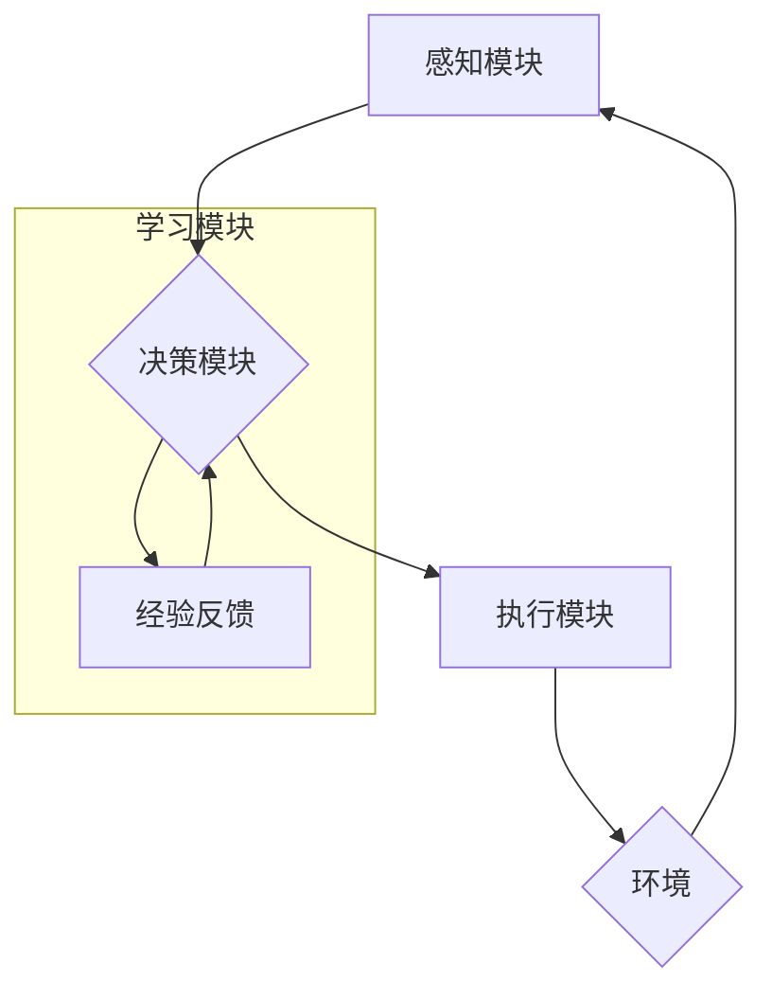

## AI Agent: AI的下一个风口 什么是智能体

> 关键词：智能体、AI代理、强化学习、决策理论、机器学习、自然语言处理、多智能体系统

### 1. 背景介绍

人工智能（AI）技术近年来取得了飞速发展，从语音识别、图像识别到自然语言处理，AI已经渗透到我们生活的方方面面。然而，我们离真正意义上的通用人工智能（AGI）还有很长的路要走。 

当前的AI模型大多是**数据驱动型**的，依赖于海量数据进行训练，难以应对复杂、动态的环境。为了突破这一瓶颈，**AI智能体（AI Agent）**应运而生。智能体是能够感知环境、做出决策并与环境交互的独立实体。它不仅能够学习和适应环境变化，还能自主地设定目标并实现目标。

智能体概念源于人工智能领域早期研究，但随着深度学习、强化学习等技术的进步，智能体研究迎来了新的春天。智能体被认为是实现AGI的关键一步，因为它赋予了AI更强的自主性和适应性。

### 2. 核心概念与联系

**智能体**是一个能够感知环境、做出决策并与环境交互的独立实体。它通常由以下几个核心组件组成：

* **感知模块:** 用于获取环境信息，例如传感器数据、文本、图像等。
* **决策模块:** 用于根据感知到的信息做出决策，例如选择行动、制定策略等。
* **执行模块:** 用于执行决策，例如控制机器人运动、发送网络请求等。
* **学习模块:** 用于从经验中学习，不断改进决策策略。

**AI智能体**是将人工智能技术应用于智能体领域的产物。它利用机器学习、深度学习等技术，赋予智能体更强的学习和决策能力。

**智能体与其他AI概念的关系:**

* **机器学习:** 智能体学习模块的核心技术。
* **深度学习:** 一种更高级的机器学习方法，常用于智能体感知模块和决策模块。
* **强化学习:** 一种专门用于训练智能体的机器学习方法，通过奖励和惩罚机制引导智能体学习最佳策略。
* **自然语言处理:** 用于智能体理解和生成自然语言的AI技术。

**智能体架构:**



### 3. 核心算法原理 & 具体操作步骤

#### 3.1 算法原理概述

智能体算法的核心是**强化学习**。强化学习是一种基于**试错**和**奖励机制**的机器学习方法。智能体在与环境交互的过程中，会根据环境反馈的奖励或惩罚，调整自己的行为策略，最终学习到最优的策略。

#### 3.2 算法步骤详解

1. **环境建模:** 建立一个数学模型来描述智能体与环境的交互关系。
2. **状态空间定义:** 定义智能体可能处于的所有状态。
3. **动作空间定义:** 定义智能体可以执行的所有动作。
4. **奖励函数设计:** 设计一个奖励函数，用于评估智能体在不同状态下执行不同动作的结果。
5. **策略学习:** 使用强化学习算法，例如Q学习、SARSA等，学习一个策略，该策略能够最大化智能体的长期奖励。
6. **策略评估:** 使用策略评估算法，例如Monte Carlo方法，评估学习到的策略的性能。
7. **策略改进:** 根据策略评估结果，对策略进行改进，例如调整参数、探索新的动作等。

#### 3.3 算法优缺点

**优点:**

* **能够学习复杂行为:** 强化学习能够学习到复杂、非线性、动态的环境中的最优策略。
* **无需明确的规则:** 强化学习不需要事先定义明确的规则，能够从经验中学习。
* **适应性强:** 强化学习能够适应环境变化，不断调整策略以获得最佳结果。

**缺点:**

* **训练时间长:** 强化学习的训练过程通常需要很长时间，尤其是在复杂的环境中。
* **数据效率低:** 强化学习需要大量的训练数据，才能学习到有效的策略。
* **奖励函数设计困难:** 设计一个合适的奖励函数是强化学习的关键，但往往是一个非常困难的任务。

#### 3.4 算法应用领域

* **机器人控制:** 训练机器人执行复杂的任务，例如导航、抓取、组装等。
* **游戏AI:** 开发能够与人类玩家竞争的游戏AI。
* **自动驾驶:** 训练自动驾驶汽车在复杂道路环境中安全行驶。
* **金融交易:** 开发能够自动进行股票交易的智能系统。
* **医疗诊断:** 训练智能体辅助医生进行疾病诊断。

### 4. 数学模型和公式 & 详细讲解 & 举例说明

#### 4.1 数学模型构建

智能体与环境的交互过程可以用马尔可夫决策过程（MDP）来建模。MDP由以下几个要素组成：

* **状态空间 S:** 智能体可能处于的所有状态的集合。
* **动作空间 A:** 智能体可以执行的所有动作的集合。
* **转移概率 P(s', r | s, a):** 在状态 s 下执行动作 a，转移到状态 s' 的概率，以及获得奖励 r 的概率。
* **奖励函数 R(s, a):** 在状态 s 下执行动作 a 获得的奖励。

#### 4.2 公式推导过程

智能体的目标是学习一个策略 π(s)，该策略能够最大化其长期奖励。可以使用动态规划或蒙特卡罗方法来学习策略。

**Bellman方程:**

$$
V^{\pi}(s) = \max_a \left[ R(s, a) + \gamma \sum_{s'} P(s', r | s, a) V^{\pi}(s') \right]
$$

其中:

* $V^{\pi}(s)$ 是状态 s 下按照策略 π 的价值函数。
* $R(s, a)$ 是在状态 s 下执行动作 a 获得的奖励。
* $\gamma$ 是折扣因子，控制未来奖励的权重。

#### 4.3 案例分析与讲解

**例子:**

一个智能体在迷宫中寻找出口。

* **状态空间:** 迷宫中的所有位置。
* **动作空间:** 向上、向下、向左、向右四个方向移动。
* **转移概率:** 每个位置移动到相邻位置的概率。
* **奖励函数:** 找到出口获得最大奖励，迷宫中其他位置获得较小的奖励。

使用Bellman方程，智能体可以学习到在每个位置采取最佳行动以获得最大奖励的策略。

### 5. 项目实践：代码实例和详细解释说明

#### 5.1 开发环境搭建

* Python 3.x
* TensorFlow 或 PyTorch
* OpenAI Gym

#### 5.2 源代码详细实现

```python
import gym
import numpy as np

# 创建环境
env = gym.make('CartPole-v1')

# 定义学习率
learning_rate = 0.1

# 定义折扣因子
gamma = 0.99

# 定义Q表
q_table = np.zeros((env.observation_space.n, env.action_space.n))

# 学习循环
for episode in range(1000):
    # 重置环境
    state = env.reset()

    # 循环执行动作
    done = False
    while not done:
        # 选择动作
        action = np.argmax(q_table[state])

        # 执行动作
        next_state, reward, done, _ = env.step(action)

        # 更新Q表
        q_table[state, action] = (1 - learning_rate) * q_table[state, action] + learning_rate * (reward + gamma * np.max(q_table[next_state]))

        # 更新状态
        state = next_state

    # 打印进度
    print(f"Episode {episode+1} completed")

# 测试策略
state = env.reset()
while True:
    action = np.argmax(q_table[state])
    state, reward, done, _ = env.step(action)
    env.render()
    if done:
        break
env.close()
```

#### 5.3 代码解读与分析

* 代码首先创建了一个CartPole-v1环境，这是一个经典的强化学习环境。
* 然后定义了学习率和折扣因子，这些参数控制了学习过程的速度和策略的稳定性。
* Q表是一个用于存储状态-动作对的价值函数的表格。
* 学习循环中，智能体会根据当前状态选择动作，执行动作后获得奖励和下一个状态。然后，智能体会根据Bellman方程更新Q表。
* 测试阶段，智能体使用学习到的策略在环境中进行测试。

#### 5.4 运行结果展示

代码运行后，智能体将在环境中学习并最终能够稳定地控制杆子保持平衡。

### 6. 实际应用场景

#### 6.1 智能客服

智能客服可以利用自然语言处理和强化学习技术，与用户进行自然流畅的对话，解答用户问题、提供服务。

#### 6.2 个性化推荐

智能体可以根据用户的历史行为和偏好，学习用户的兴趣，并推荐个性化的商品、服务或内容。

#### 6.3 自动化决策

在金融、医疗等领域，智能体可以辅助人类进行决策，例如自动进行股票交易、辅助医生诊断疾病。

#### 6.4 多智能体系统

多个智能体可以协同工作，解决复杂问题，例如无人驾驶汽车的协同控制、机器人团队协作完成任务。

#### 6.4 未来应用展望

随着人工智能技术的不断发展，智能体将在更多领域得到应用，例如：

* **医疗保健:** 智能体可以辅助医生诊断疾病、制定治疗方案、提供个性化健康建议。
* **教育:** 智能体可以提供个性化学习辅导、自动批改作业、评估学生的学习进度。
* **金融:** 智能体可以进行自动交易、风险管理、欺诈检测。
* **制造业:** 智能体可以控制机器人、优化生产流程、提高生产效率。

### 7. 工具和资源推荐

#### 7.1 学习资源推荐

* **书籍:**
    * Reinforcement Learning: An Introduction by Sutton and Barto
    * Deep Reinforcement Learning Hands-On by Maxim Lapan
* **在线课程:**
    * Coursera: Reinforcement Learning Specialization
    * Udacity: Deep Reinforcement Learning Nanodegree

#### 7.2 开发工具推荐

* **TensorFlow:** 一个开源的机器学习框架。
* **PyTorch:** 另一个开源的机器学习框架。
* **OpenAI Gym:** 一个强化学习库，提供各种标准环境。

#### 7.3 相关论文推荐

* Deep Q-Network (DQN)
* Proximal Policy Optimization (PPO)
* Trust Region Policy Optimization (TRPO)

### 8. 总结：未来发展趋势与挑战

#### 8.1 研究成果总结

近年来，智能体研究取得了显著进展，例如DQN、PPO等算法的提出，以及在游戏、机器人控制等领域的成功应用。

#### 8.2 未来发展趋势

* **更强大的学习能力:** 研究更强大的强化学习算法，能够学习更复杂、更动态的环境。
* **更安全的智能体:** 研究确保智能体安全可靠的算法和方法，避免智能体出现不可预知的行为。
* **更广泛的应用场景:** 将智能体应用到更多领域，例如医疗、教育、金融等。

#### 8.3 面临的挑战

* **数据效率:** 强化学习需要大量的训练数据，如何提高数据效率是重要的挑战。
* **奖励函数设计:** 设计一个合适的奖励函数是强化学习的关键，但往往是一个非常困难的任务。
* **可解释性:** 强化学习模型的决策过程往往难以解释，如何提高模型的可解释性是重要的研究方向。

#### 8.4 研究展望

未来，智能体研究将继续朝着更强大、更安全、更广泛应用的方向发展。