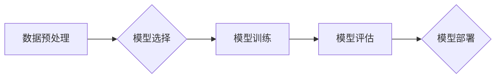

## AI人工智能深度学习算法：设计深度学习任务处理流程

> 关键词：深度学习、神经网络、算法设计、任务处理流程、机器学习、数据科学

## 1. 背景介绍

深度学习作为人工智能领域最前沿的技术之一，近年来取得了令人瞩目的成就，在图像识别、自然语言处理、语音识别等领域展现出强大的应用潜力。深度学习算法的核心是构建复杂的**多层神经网络**，通过层层叠加的**神经元**，学习数据中的复杂特征和模式。然而，设计一个有效的深度学习任务处理流程并非易事，需要对算法原理、数据处理、模型训练等环节有深入的理解和掌握。

本篇文章将深入探讨深度学习算法的设计流程，从核心概念到具体操作步骤，从数学模型到代码实现，全面解析深度学习任务处理的各个环节，并结合实际应用场景，帮助读者更好地理解和应用深度学习技术。

## 2. 核心概念与联系

深度学习任务处理流程的核心概念包括：

* **数据预处理:**  深度学习模型的训练依赖于高质量的数据，数据预处理是确保模型训练效果的关键步骤。
* **模型选择:**  根据不同的任务类型，选择合适的深度学习模型架构，例如卷积神经网络（CNN）、循环神经网络（RNN）等。
* **模型训练:**  利用训练数据，通过反向传播算法，调整模型参数，使模型能够准确地预测目标输出。
* **模型评估:**  使用测试数据评估模型的性能，并根据评估结果进行模型调优。
* **模型部署:**  将训练好的模型部署到实际应用场景中，实现对新数据的预测和处理。

这些概念之间相互关联，构成一个完整的深度学习任务处理流程。

**Mermaid 流程图:**



## 3. 核心算法原理 & 具体操作步骤

### 3.1  算法原理概述

深度学习算法的核心是**人工神经网络**，它模仿了人脑的神经元结构和功能。人工神经网络由**输入层、隐藏层和输出层**组成，每个层级由多个神经元构成。神经元之间通过**连接权重**进行信息传递，每个连接权重都代表着神经元之间强度。

深度学习算法通过**反向传播算法**来训练神经网络。反向传播算法的核心思想是通过计算**损失函数**，并根据损失函数的梯度，调整神经网络的连接权重，使得模型能够更好地预测目标输出。

### 3.2  算法步骤详解

1. **数据预处理:** 将原始数据转换为深度学习模型可以理解的格式，例如归一化、编码、特征提取等。
2. **模型构建:** 根据任务类型选择合适的深度学习模型架构，并定义模型的层数、神经元数量、激活函数等参数。
3. **模型训练:** 使用训练数据，通过反向传播算法，迭代调整模型参数，最小化损失函数。
4. **模型评估:** 使用测试数据评估模型的性能，例如准确率、召回率、F1-score等指标。
5. **模型调优:** 根据评估结果，调整模型参数、学习率、训练 epochs 等，优化模型性能。
6. **模型部署:** 将训练好的模型部署到实际应用场景中，实现对新数据的预测和处理。

### 3.3  算法优缺点

**优点:**

* **强大的学习能力:** 深度学习算法能够学习数据中的复杂特征和模式，实现高精度预测。
* **自动化特征提取:** 深度学习模型能够自动提取数据特征，无需人工特征工程。
* **泛化能力强:** 深度学习模型能够对未知数据进行泛化预测。

**缺点:**

* **数据依赖性强:** 深度学习模型的性能依赖于训练数据的质量和数量。
* **计算资源消耗大:** 深度学习模型训练需要大量的计算资源和时间。
* **可解释性差:** 深度学习模型的决策过程难以解释，缺乏透明度。

### 3.4  算法应用领域

深度学习算法广泛应用于以下领域:

* **图像识别:** 人脸识别、物体检测、图像分类等。
* **自然语言处理:** 文本分类、机器翻译、情感分析等。
* **语音识别:** 语音转文本、语音助手等。
* **推荐系统:** 商品推荐、内容推荐等。
* **医疗诊断:** 病理图像分析、疾病预测等。

## 4. 数学模型和公式 & 详细讲解 & 举例说明

### 4.1  数学模型构建

深度学习模型的数学模型通常基于**多层感知机（MLP）**或**卷积神经网络（CNN）**等结构。

**多层感知机（MLP）:**

MLP 由多个全连接层组成，每个层级的每个神经元都与上一层的所有神经元连接。

**卷积神经网络（CNN）:**

CNN 利用**卷积层**和**池化层**来提取图像特征，并通过全连接层进行分类或预测。

### 4.2  公式推导过程

深度学习模型的训练过程基于**反向传播算法**，该算法的核心是计算**损失函数**的梯度，并根据梯度更新模型参数。

**损失函数:**

$$L = \frac{1}{N} \sum_{i=1}^{N} (y_i - \hat{y}_i)^2$$

其中：

* $L$ 为损失函数
* $N$ 为样本数量
* $y_i$ 为真实标签
* $\hat{y}_i$ 为模型预测值

**梯度下降算法:**

$$\theta = \theta - \alpha \nabla L$$

其中：

* $\theta$ 为模型参数
* $\alpha$ 为学习率
* $\nabla L$ 为损失函数的梯度

### 4.3  案例分析与讲解

**图像分类任务:**

假设我们使用CNN模型进行图像分类任务，目标是将图像分类为不同的类别，例如猫、狗、鸟等。

训练过程：

1. 使用训练数据，将图像输入CNN模型，并计算模型输出的预测类别。
2. 计算模型输出与真实类别的损失函数值。
3. 使用梯度下降算法，根据损失函数的梯度更新模型参数。
4. 重复步骤1-3，直到模型性能达到预期的水平。

## 5. 项目实践：代码实例和详细解释说明

### 5.1  开发环境搭建

深度学习项目开发通常需要以下环境：

* **操作系统:** Linux、macOS 或 Windows
* **编程语言:** Python
* **深度学习框架:** TensorFlow、PyTorch、Keras 等
* **GPU:** 加速深度学习模型训练

### 5.2  源代码详细实现

以下是一个使用TensorFlow框架实现图像分类任务的简单代码示例：

```python
import tensorflow as tf

# 定义模型架构
model = tf.keras.models.Sequential([
  tf.keras.layers.Conv2D(32, (3, 3), activation='relu', input_shape=(28, 28, 1)),
  tf.keras.layers.MaxPooling2D((2, 2)),
  tf.keras.layers.Conv2D(64, (3, 3), activation='relu'),
  tf.keras.layers.MaxPooling2D((2, 2)),
  tf.keras.layers.Flatten(),
  tf.keras.layers.Dense(10, activation='softmax')
])

# 编译模型
model.compile(optimizer='adam',
              loss='sparse_categorical_crossentropy',
              metrics=['accuracy'])

# 训练模型
model.fit(x_train, y_train, epochs=5)

# 评估模型
loss, accuracy = model.evaluate(x_test, y_test)
print('Test loss:', loss)
print('Test accuracy:', accuracy)
```

### 5.3  代码解读与分析

* **模型架构:** 代码定义了一个简单的CNN模型，包含两个卷积层、两个池化层和一个全连接层。
* **编译模型:** 使用Adam优化器、交叉熵损失函数和准确率指标编译模型。
* **训练模型:** 使用训练数据训练模型，设置训练轮数为5。
* **评估模型:** 使用测试数据评估模型的性能，打印测试损失和准确率。

### 5.4  运行结果展示

训练完成后，模型会输出测试损失和准确率，可以根据结果评估模型的性能。

## 6. 实际应用场景

深度学习算法在各个领域都有广泛的应用场景，例如：

* **图像识别:** 自动驾驶、人脸识别、医疗图像分析等。
* **自然语言处理:** 机器翻译、文本摘要、聊天机器人等。
* **语音识别:** 语音助手、语音搜索、语音转文本等。
* **推荐系统:** 商品推荐、内容推荐、个性化服务等。

## 6.4  未来应用展望

随着深度学习技术的不断发展，未来将有更多新的应用场景出现，例如：

* **增强现实 (AR) 和虚拟现实 (VR):** 深度学习可以用于增强现实和虚拟现实场景中的物体识别、场景理解和交互体验。
* **个性化医疗:** 深度学习可以用于分析患者的医疗数据，提供个性化的诊断和治疗方案。
* **自动写作:** 深度学习可以用于辅助人类写作，例如生成文本、翻译语言、总结文章等。

## 7. 工具和资源推荐

### 7.1  学习资源推荐

* **书籍:**
    * 深度学习 (Deep Learning) - Ian Goodfellow, Yoshua Bengio, Aaron Courville
    * 深度学习实践 (Deep Learning with Python) - Francois Chollet
* **在线课程:**
    * Coursera: 深度学习 Specialization
    * Udacity: 深度学习 Nanodegree
    * fast.ai: 深度学习课程

### 7.2  开发工具推荐

* **深度学习框架:** TensorFlow, PyTorch, Keras
* **数据处理工具:** Pandas, NumPy
* **可视化工具:** Matplotlib, Seaborn

### 7.3  相关论文推荐

* **AlexNet:** ImageNet Classification with Deep Convolutional Neural Networks
* **VGGNet:** Very Deep Convolutional Networks for Large-Scale Image Recognition
* **ResNet:** Deep Residual Learning for Image Recognition

## 8. 总结：未来发展趋势与挑战

### 8.1  研究成果总结

深度学习算法取得了令人瞩目的成就，在图像识别、自然语言处理等领域取得了突破性进展。

### 8.2  未来发展趋势

* **模型效率提升:** 研究更轻量级、更高效的深度学习模型，降低模型训练和部署成本。
* **数据增强:** 开发更有效的图像和文本数据增强技术，提高模型泛化能力。
* **可解释性增强:** 研究更可解释的深度学习模型，提高模型透明度和可信度。

### 8.3  面临的挑战

* **数据隐私和安全:** 深度学习模型训练需要大量数据，如何保护数据隐私和安全是一个重要挑战。
* **模型偏见:** 深度学习模型可能存在偏见，需要研究如何消除模型偏见。
* **伦理问题:** 深度学习技术应用可能带来伦理问题，需要进行深入探讨和规范。

### 8.4  研究展望

未来，深度学习技术将继续发展，在更多领域发挥重要作用。需要加强基础理论研究，探索更有效的算法和模型架构，并关注深度学习技术的伦理和社会影响。

## 9. 附录：常见问题与解答

**常见问题:**

* **深度学习模型训练需要多长时间？**

模型训练时间取决于模型复杂度、数据规模和硬件资源等因素。

* **如何选择合适的深度学习模型？**

根据任务类型和数据特点选择合适的模型架构。

* **如何评估深度学习模型的性能？**

使用测试数据评估模型的准确率、召回率、F1-score等指标。

**解答:**

* 深度学习模型训练时间可以从几分钟到几天甚至更长时间不等。
*