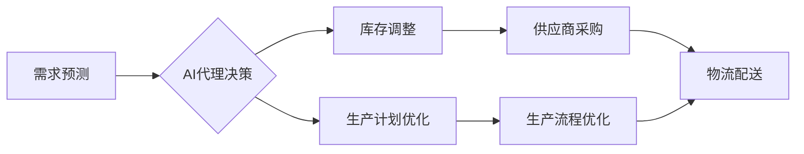

## AI代理在供应链管理中的工作流优化实践

> 关键词：AI代理、供应链管理、工作流优化、机器学习、预测分析、决策支持、智能自动化

## 1. 背景介绍

在当今全球化、竞争激烈的商业环境中，供应链管理 (SCM) 已经成为企业核心竞争力的关键因素。高效、灵活、可预测的供应链可以显著降低成本、提高效率，并增强企业应对市场变化的能力。然而，传统的供应链管理模式往往面临着复杂性、不确定性和信息孤岛等挑战，难以满足日益增长的需求。

人工智能 (AI) 技术的快速发展为供应链管理带来了新的机遇。AI 代理作为一种智能化决策和执行工具，能够通过学习和分析海量数据，自动优化供应链工作流程，提高整体效率和效益。

## 2. 核心概念与联系

### 2.1 AI代理

AI 代理是一种能够自主学习、决策和执行任务的智能软件实体。它通常基于机器学习算法，能够从数据中识别模式、做出预测并执行相应的行动。在供应链管理中，AI 代理可以扮演多个角色，例如：

* **需求预测代理:** 分析历史数据和市场趋势，预测未来需求，帮助企业优化库存管理和生产计划。
* **物流优化代理:** 规划最优的运输路线、配送方式和仓储策略，降低物流成本和运输时间。
* **风险管理代理:** 识别潜在的供应链风险，例如自然灾害、政治动荡和供应商延误，并提出相应的应对措施。

### 2.2 供应链管理

供应链管理是指企业从原材料采购到最终产品交付的全过程管理。它涉及到多个环节和参与方，包括供应商、制造商、分销商和零售商。

### 2.3 工作流优化

工作流优化是指通过分析和改进业务流程，提高效率、降低成本和增强客户满意度。在供应链管理中，工作流优化可以应用于各个环节，例如：

* **采购流程优化:** 简化采购流程，提高采购效率和降低采购成本。
* **生产流程优化:** 优化生产计划和生产流程，提高生产效率和产品质量。
* **物流流程优化:** 优化运输路线、配送方式和仓储策略，降低物流成本和运输时间。

### 2.4 AI代理在供应链管理中的联系

AI 代理可以有效地支持供应链管理中的工作流优化。通过学习和分析供应链数据，AI 代理可以识别流程中的瓶颈和改进机会，并自动执行相应的优化措施。

**Mermaid 流程图**



## 3. 核心算法原理 & 具体操作步骤

### 3.1 算法原理概述

AI 代理在供应链管理中的工作流优化通常基于以下核心算法：

* **机器学习:** 用于从历史数据中学习模式和规律，预测未来需求、识别风险和优化决策。
* **强化学习:** 用于训练代理在特定环境中做出最优决策，通过奖励和惩罚机制不断改进策略。
* **图神经网络:** 用于分析供应链网络中的关系和依赖性，识别关键节点和潜在风险。

### 3.2 算法步骤详解

1. **数据收集和预处理:** 收集供应链相关数据，例如需求历史、库存水平、供应商信息、物流成本等，并进行清洗、转换和特征工程。
2. **模型训练:** 使用机器学习、强化学习或图神经网络等算法，训练AI代理模型，使其能够预测需求、识别风险和优化决策。
3. **模型部署:** 将训练好的AI代理模型部署到实际供应链系统中，使其能够实时监控和分析数据，并自动执行优化措施。
4. **性能评估和优化:** 定期评估AI代理模型的性能，并根据评估结果进行模型调整和优化。

### 3.3 算法优缺点

**优点:**

* **自动化决策:** AI 代理可以自动执行决策，减少人为干预，提高效率和准确性。
* **数据驱动:** AI 代理基于数据分析，能够做出更科学、更合理的决策。
* **实时优化:** AI 代理可以实时监控数据变化，并根据变化进行动态优化。

**缺点:**

* **数据依赖:** AI 代理的性能取决于数据质量和数量。
* **模型复杂性:** 训练和部署AI代理模型需要一定的技术难度。
* **解释性问题:** AI 代理的决策过程可能难以解释，这可能会导致信任问题。

### 3.4 算法应用领域

AI 代理在供应链管理中的应用领域非常广泛，包括：

* **需求预测:** 预测未来产品需求，优化库存管理和生产计划。
* **物流优化:** 规划最优的运输路线、配送方式和仓储策略，降低物流成本和运输时间。
* **风险管理:** 识别潜在的供应链风险，例如自然灾害、政治动荡和供应商延误，并提出相应的应对措施。
* **采购优化:** 简化采购流程，提高采购效率和降低采购成本。
* **生产流程优化:** 优化生产计划和生产流程，提高生产效率和产品质量。

## 4. 数学模型和公式 & 详细讲解 & 举例说明

### 4.1 数学模型构建

在供应链管理中，AI代理可以利用数学模型来优化工作流程。例如，预测需求的数学模型可以基于时间序列分析，使用ARIMA模型或Prophet模型等。

**ARIMA模型**

ARIMA模型是一种用于时间序列预测的统计模型，它包含三个参数：p、d、q。

* p: 自回归 (Autoregressive) 参数，表示模型中自回归项的数量。
* d: 差分 (Differencing) 参数，表示需要进行多少次差分操作来使时间序列平稳。
* q: 移动平均 (Moving Average) 参数，表示模型中移动平均项的数量。

**Prophet模型**

Prophet模型是一种时间序列预测模型，它可以处理趋势、季节性和节日效应等复杂的时间序列特征。

### 4.2 公式推导过程

ARIMA模型的预测公式如下：

$$y_t = c + \phi_1 y_{t-1} + \phi_2 y_{t-2} +... + \phi_p y_{t-p} + \theta_1 \epsilon_{t-1} + \theta_2 \epsilon_{t-2} +... + \theta_q \epsilon_{t-q} + \epsilon_t$$

其中：

* $y_t$: 时间t的预测值
* $c$: 截距
* $\phi_i$: 自回归系数
* $y_{t-i}$: 时间t-i的实际值
* $\theta_i$: 移动平均系数
* $\epsilon_{t-i}$: 时间t-i的误差项
* $\epsilon_t$: 时间t的误差项

### 4.3 案例分析与讲解

假设一家零售公司想要预测未来三个月的商品需求。可以使用ARIMA模型或Prophet模型来进行预测。

* **ARIMA模型:** 需要根据历史需求数据确定模型参数p、d、q。
* **Prophet模型:** 可以直接使用Prophet模型进行预测，无需手动确定模型参数。

通过模型训练和预测，可以得到未来三个月的商品需求预测结果，帮助公司优化库存管理和生产计划。

## 5. 项目实践：代码实例和详细解释说明

### 5.1 开发环境搭建

* Python 3.x
* Jupyter Notebook
* 必要的库，例如 pandas, numpy, scikit-learn, prophet

### 5.2 源代码详细实现

```python
# 使用 Prophet 模型进行需求预测

import pandas as pd
from prophet import Prophet

# 加载历史需求数据
data = pd.read_csv('demand_data.csv', parse_dates=['ds'])

# 创建 Prophet 模型
model = Prophet()

# 训练模型
model.fit(data)

# 生成未来三个月的预测结果
future = model.make_future_dataframe(periods=90)
forecast = model.predict(future)

# 可视化预测结果
model.plot(forecast)
```

### 5.3 代码解读与分析

* **数据加载:** 使用 pandas 库加载历史需求数据，并指定日期列为 datetime 类型。
* **模型创建:** 使用 Prophet 库创建 Prophet 模型。
* **模型训练:** 使用 `fit()` 方法训练模型，将历史数据作为输入。
* **预测未来数据:** 使用 `make_future_dataframe()` 方法生成未来三个月的预测日期，并使用 `predict()` 方法生成预测结果。
* **可视化结果:** 使用 `plot()` 方法可视化预测结果，包括历史数据、预测趋势和置信区间。

### 5.4 运行结果展示

运行代码后，会生成一个包含历史数据、预测趋势和置信区间的可视化图表。

## 6. 实际应用场景

AI代理在供应链管理中的应用场景非常广泛，例如：

* **亚马逊:** 使用 AI 代理优化物流配送路线，提高效率和降低成本。
* **沃尔玛:** 使用 AI 代理预测商品需求，优化库存管理和生产计划。
* **特斯拉:** 使用 AI 代理优化生产流程，提高生产效率和产品质量。

### 6.4 未来应用展望

随着 AI 技术的不断发展，AI 代理在供应链管理中的应用将更加广泛和深入。未来，AI 代理可能能够：

* **更精准地预测需求:** 利用更先进的机器学习算法和数据分析技术，提高需求预测的准确性。
* **更智能地优化流程:** 通过强化学习和深度学习等技术，使 AI 代理能够自主学习和优化供应链流程。
* **更全面地管理风险:** 利用图神经网络等技术，识别和应对供应链中的各种风险。

## 7. 工具和资源推荐

### 7.1 学习资源推荐

* **书籍:**
    * "Artificial Intelligence: A Modern Approach" by Stuart Russell and Peter Norvig
    * "Deep Learning" by Ian Goodfellow, Yoshua Bengio, and Aaron Courville
* **在线课程:**
    * Coursera: Machine Learning by Andrew Ng
    * Udacity: Deep Learning Nanodegree
* **博客和网站:**
    * Towards Data Science
    * Machine Learning Mastery

### 7.2 开发工具推荐

* **Python:** 广泛使用的编程语言，用于 AI 开发。
* **Jupyter Notebook:** 用于交互式编程和数据分析的工具。
* **TensorFlow:** 开源深度学习框架。
* **PyTorch:** 开源深度学习框架。

### 7.3 相关论文推荐

* "Deep Reinforcement Learning for Supply Chain Management" by  A. K. Gupta et al.
* "A Survey of Artificial Intelligence Applications in Supply Chain Management" by  S. K. Singh et al.

## 8. 总结：未来发展趋势与挑战

### 8.1 研究成果总结

AI 代理在供应链管理中的应用取得了显著成果，能够有效地优化工作流程、提高效率和降低成本。

### 8.2 未来发展趋势

未来，AI 代理在供应链管理中的应用将更加智能化、自动化和个性化。

* **更智能的决策:** 利用更先进的机器学习算法和数据分析技术，使 AI 代理能够做出更智能、更精准的决策。
* **更自动化的执行:** 利用机器人技术和自动化技术，使 AI 代理能够自动执行决策，减少人为干预。
* **更个性化的服务:** 利用个性化推荐和定制化服务技术，使 AI 代理能够提供更个性化的供应链服务。

### 8.3 面临的挑战

AI 代理在供应链管理中的应用也面临着一些挑战，例如：

* **数据安全和隐私:** 供应链数据通常包含敏感信息，需要确保数据安全和隐私。
* **模型解释性和可信度:** AI 代理的决策过程可能难以解释，这可能会导致信任问题。
* **技术可访问性和成本:** 高性能的 AI 技术和硬件可能昂贵，难以普及。

### 8.4 研究展望

未来研究方向包括：

* **开发更安全、更可靠的 AI 代理模型。**
