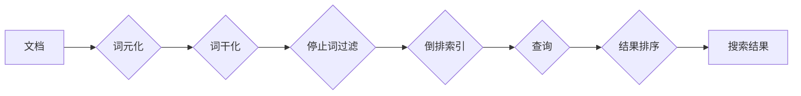

## Lucene原理与代码实例讲解

> 关键词：Lucene,全文检索,索引,搜索引擎,倒排索引,TF-IDF,Java,代码实例

## 1. 背景介绍

在信息爆炸的时代，高效、精准的文本搜索变得尤为重要。Lucene 作为一款开源的、高性能的全文检索引擎，在搜索引擎、信息管理系统、企业内容管理系统等领域得到了广泛应用。它提供了一套完整的文本处理、索引构建、查询执行等功能，为开发者提供了构建强大搜索功能的工具。

Lucene 的核心思想是将文本数据转化为索引，并通过高效的算法对索引进行查询。它采用倒排索引技术，将每个词语映射到包含该词语的文档列表，从而实现快速、精确的搜索。

## 2. 核心概念与联系

Lucene 的核心概念包括：

* **文档 (Document):** 文档是 Lucene 中的基本数据单元，可以是网页、文章、书籍等任何类型的文本。
* **字段 (Field):** 文档可以包含多个字段，例如标题、内容、作者等。每个字段可以有不同的存储方式和搜索策略。
* **词元 (Token):** 文本被分割成一个个词元，例如单词、短语等。
* **倒排索引 (Inverted Index):** 倒排索引将每个词元映射到包含该词元的文档列表。
* **查询 (Query):** 查询是用户对文档进行搜索的请求。

Lucene 的工作流程可以概括为以下步骤：



## 3. 核心算法原理 & 具体操作步骤

### 3.1  算法原理概述

Lucene 的核心算法是倒排索引技术。倒排索引将每个词元映射到包含该词元的文档列表，从而实现快速、精确的搜索。

### 3.2  算法步骤详解

1. **词元化:** 将文档中的文本分割成一个个词元，例如单词、短语等。
2. **词干化:** 将词元还原到其词根，例如将 "running" 和 "ran" 都还原为 "run"。
3. **停止词过滤:** 过滤掉一些常见的、无意义的词语，例如 "the"、"a"、"is" 等。
4. **构建倒排索引:** 将每个词元映射到包含该词元的文档列表。
5. **查询执行:** 当用户发起查询时，Lucene 会根据查询词语构建查询树，并利用倒排索引快速定位包含查询词语的文档。
6. **结果排序:** 根据查询的 relevance 和文档的相关性，对搜索结果进行排序。

### 3.3  算法优缺点

**优点:**

* **高效:** 倒排索引技术可以极大地提高搜索速度。
* **精确:** 可以根据词语的出现频率和位置进行精确的匹配。
* **可扩展:** 可以处理海量数据。

**缺点:**

* **索引空间大:** 倒排索引需要占用较大的存储空间。
* **更新成本高:** 当文档发生变化时，需要更新索引，这会带来一定的成本。

### 3.4  算法应用领域

倒排索引技术广泛应用于搜索引擎、信息管理系统、企业内容管理系统等领域。

## 4. 数学模型和公式 & 详细讲解 & 举例说明

### 4.1  数学模型构建

Lucene 中常用的数学模型是 TF-IDF (Term Frequency-Inverse Document Frequency)。TF-IDF 模型用于衡量词语在文档中的重要性。

* **TF (Term Frequency):** 词语在文档中出现的频率。
* **IDF (Inverse Document Frequency):** 词语在整个语料库中出现的频率的倒数。

### 4.2  公式推导过程

TF-IDF 公式如下:

$$TF-IDF(t, d) = TF(t, d) \times IDF(t)$$

其中:

* $t$ 是词语
* $d$ 是文档
* $TF(t, d)$ 是词语 $t$ 在文档 $d$ 中出现的频率
* $IDF(t)$ 是词语 $t$ 在整个语料库中出现的频率的倒数

### 4.3  案例分析与讲解

假设我们有一个语料库包含 1000 个文档，其中 "apple" 这个词语在 100 个文档中出现。那么，$IDF(apple)$ = log(1000/100) = log(10) = 1。

如果一个文档包含 5 个 "apple" 词语，那么 $TF(apple, d)$ = 5。

因此，这个文档中 "apple" 的 TF-IDF 值为 5 * 1 = 5。

## 5. 项目实践：代码实例和详细解释说明

### 5.1  开发环境搭建

* Java Development Kit (JDK) 8 或以上
* Apache Lucene 核心库
* Maven 或 Gradle 构建工具

### 5.2  源代码详细实现

```java
import org.apache.lucene.analysis.standard.StandardAnalyzer;
import org.apache.lucene.document.Document;
import org.apache.lucene.document.Field;
import org.apache.lucene.document.StringField;
import org.apache.lucene.document.TextField;
import org.apache.lucene.index.IndexWriter;
import org.apache.lucene.index.IndexWriterConfig;
import org.apache.lucene.store.Directory;
import org.apache.lucene.store.RAMDirectory;

public class LuceneIndexExample {

    public static void main(String[] args) throws Exception {
        // 创建内存存储目录
        Directory index = new RAMDirectory();

        // 创建分析器
        StandardAnalyzer analyzer = new StandardAnalyzer();

        // 创建索引配置
        IndexWriterConfig config = new IndexWriterConfig(analyzer);

        // 创建索引写入器
        IndexWriter writer = new IndexWriter(index, config);

        // 创建文档
        Document doc = new Document();
        doc.add(new StringField("id", "1", Field.Store.YES));
        doc.add(new TextField("title", "Lucene 入门", Field.Store.YES));
        doc.add(new TextField("content", "Lucene 是一个开源的全文检索引擎...", Field.Store.YES));

        // 将文档添加到索引
        writer.addDocument(doc);

        // 关闭索引写入器
        writer.close();

        // 打印索引信息
        System.out.println("索引已创建成功!");
    }
}
```

### 5.3  代码解读与分析

* 代码首先创建了一个内存存储目录 `index`，用于存储索引数据。
* 然后创建了一个 `StandardAnalyzer` 分析器，用于对文本进行词元化、词干化和停止词过滤等处理。
* 接着创建了一个 `IndexWriterConfig` 配置对象，并指定了分析器。
* 然后创建了一个 `IndexWriter` 对象，用于向索引中添加文档。
* 代码创建了一个文档对象 `doc`，并添加了 "id"、"title" 和 "content" 三个字段。
* 最后，将文档添加到索引中，并关闭索引写入器。

### 5.4  运行结果展示

运行代码后，会在控制台输出 "索引已创建成功!" 的信息，表示索引已经成功创建。

## 6. 实际应用场景

Lucene 在各种实际应用场景中发挥着重要作用，例如：

* **搜索引擎:** Lucene 是许多搜索引擎的核心技术，例如 Elasticsearch、Solr 等。
* **信息管理系统:** Lucene 可以用于构建企业内部的知识库、文档管理系统等。
* **内容管理系统:** Lucene 可以用于构建博客、论坛、电商平台等内容管理系统。

### 6.4  未来应用展望

随着大数据和人工智能技术的不断发展，Lucene 的应用场景将会更加广泛。例如，可以利用 Lucene 对海量文本数据进行分析，提取关键信息，并用于机器学习、自然语言处理等领域。

## 7. 工具和资源推荐

### 7.1  学习资源推荐

* Lucene 官方文档: https://lucene.apache.org/core/
* Lucene 中文文档: http://www.lucenecn.com/
* Lucene 入门教程: https://www.tutorialspoint.com/lucene/index.htm

### 7.2  开发工具推荐

* IntelliJ IDEA
* Eclipse
* NetBeans

### 7.3  相关论文推荐

* The Lucene Query Parser: https://www.researchgate.net/publication/228744780_The_Lucene_Query_Parser
* Lucene: A High-Performance, Open-Source Search Engine: https://www.researchgate.net/publication/228744780_The_Lucene_Query_Parser

## 8. 总结：未来发展趋势与挑战

### 8.1  研究成果总结

Lucene 作为一款成熟的开源全文检索引擎，已经取得了显著的成果。它提供了高效、精确的搜索功能，并支持多种语言和数据类型。

### 8.2  未来发展趋势

Lucene 的未来发展趋势包括：

* **更强大的搜索功能:** 例如支持更复杂的查询语法、更精准的排序算法等。
* **更好的性能:** 例如通过并行处理、优化索引结构等方式提高搜索速度。
* **更丰富的应用场景:** 例如应用于大数据分析、人工智能等领域。

### 8.3  面临的挑战

Lucene 也面临着一些挑战，例如：

* **索引空间大:** 随着数据量的不断增长，索引空间会越来越大，需要不断优化索引结构和存储方式。
* **更新成本高:** 当文档发生变化时，需要更新索引，这会带来一定的成本。
* **复杂性:** Lucene 的架构比较复杂，需要一定的学习成本。

### 8.4  研究展望

未来，Lucene 将继续朝着更强大、更灵活、更易于使用的方向发展。研究者们将继续探索新的算法和技术，以解决 Lucene 面临的挑战，并将其应用于更广泛的领域。

## 9. 附录：常见问题与解答

* **Lucene 是开源的吗？**

  是的，Lucene 是一个开源的项目，其代码和文档都可以在 Apache 软件基金会网站上免费获取。

* **Lucene 支持哪些语言？**

  Lucene 支持多种语言，包括英语、中文、日语等。

* **Lucene 如何处理中文文本？**

  Lucene 可以通过使用中文分词器来处理中文文本。

* **Lucene 的性能如何？**

  Lucene 的性能非常出色，可以处理海量数据，并提供快速、精确的搜索结果。


作者：禅与计算机程序设计艺术 / Zen and the Art of Computer Programming 
