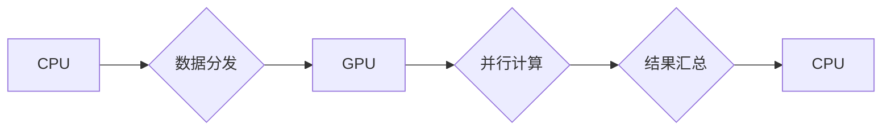

## NVIDIA与大规模运算的支持

> 关键词：GPU、CUDA、深度学习、并行计算、高性能计算、Tensor Core、NVIDIA DGX

## 1. 背景介绍

随着人工智能、机器学习等领域的发展，对计算能力的需求呈指数级增长。传统CPU架构在处理海量数据和复杂计算时逐渐显现出瓶颈。GPU（图形处理单元），最初用于渲染图形图像，凭借其并行计算能力，逐渐成为大规模运算的理想选择。NVIDIA作为GPU领域的领军企业，通过其强大的硬件平台和软件生态系统，为大规模运算提供了坚实的基础。

## 2. 核心概念与联系

### 2.1 GPU架构

GPU的核心优势在于其并行计算能力。与CPU相比，GPU拥有更丰富的并行处理单元（CUDA Core），可以同时处理大量数据。这种并行架构使得GPU在处理海量数据和重复计算任务时具有显著的优势。

### 2.2 CUDA平台

CUDA（Compute Unified Device Architecture）是NVIDIA为GPU开发的并行计算平台。它提供了一套完整的编程模型、工具和库，使开发者能够将应用程序移植到GPU上，充分利用其并行计算能力。

### 2.3 深度学习与GPU

深度学习算法通常需要处理海量数据并进行大量的矩阵运算。GPU的并行计算能力和高带宽内存，使其成为深度学习训练和推理的理想平台。

**Mermaid 流程图**



## 3. 核心算法原理 & 具体操作步骤

### 3.1 算法原理概述

深度学习算法的核心是神经网络，它由多个层级的神经元组成。每个神经元接收输入信号，经过激活函数处理后输出信号。通过调整神经网络的权重和偏置，可以使模型学习数据中的模式和关系。

GPU加速深度学习算法的关键在于将神经网络的计算任务分解成多个并行子任务，并分配到GPU上的多个CUDA Core进行处理。

### 3.2 算法步骤详解

1. **数据准备:** 将原始数据预处理，例如归一化、编码等。
2. **模型构建:** 定义神经网络的结构，包括层数、神经元数量、激活函数等。
3. **参数初始化:** 为神经网络的权重和偏置赋予初始值。
4. **前向传播:** 将输入数据通过神经网络传递，计算输出结果。
5. **反向传播:** 计算输出结果与真实值的误差，并根据误差反向调整神经网络的权重和偏置。
6. **优化算法:** 使用优化算法，例如梯度下降，更新神经网络的参数。
7. **评估模型:** 使用测试数据评估模型的性能，例如准确率、损失函数等。

### 3.3 算法优缺点

**优点:**

* 并行计算能力强，可以大幅加速深度学习训练和推理。
* 硬件平台成熟，软件生态系统完善。
* 广泛应用于各种深度学习任务，例如图像识别、自然语言处理等。

**缺点:**

* 编程难度较高，需要掌握CUDA编程模型。
* 硬件成本较高，需要专门的GPU设备。

### 3.4 算法应用领域

* **计算机视觉:** 图像识别、物体检测、图像分割、人脸识别等。
* **自然语言处理:** 文本分类、机器翻译、情感分析、对话系统等。
* **语音识别:** 语音转文本、语音合成等。
* **推荐系统:** 商品推荐、内容推荐等。
* **医疗诊断:** 影像分析、疾病预测等。

## 4. 数学模型和公式 & 详细讲解 & 举例说明

### 4.1 数学模型构建

深度学习模型通常基于神经网络，其数学模型可以表示为一系列的矩阵运算和激活函数。

**神经网络模型:**

$$
y = f(W_L \cdot a_{L-1} + b_L)
$$

其中：

* $y$ 是模型的输出。
* $f$ 是激活函数。
* $W_L$ 是第 $L$ 层的权重矩阵。
* $a_{L-1}$ 是第 $L-1$ 层的激活值。
* $b_L$ 是第 $L$ 层的偏置向量。

### 4.2 公式推导过程

深度学习模型的训练过程是通过最小化损失函数来实现的。损失函数衡量模型的预测结果与真实值的差异。常用的损失函数包括均方误差（MSE）和交叉熵损失（Cross-Entropy Loss）。

**均方误差损失函数:**

$$
L = \frac{1}{N} \sum_{i=1}^{N} (y_i - \hat{y}_i)^2
$$

其中：

* $L$ 是损失函数的值。
* $N$ 是样本数量。
* $y_i$ 是第 $i$ 个样本的真实值。
* $\hat{y}_i$ 是第 $i$ 个样本的预测值。

**交叉熵损失函数:**

$$
L = -\frac{1}{N} \sum_{i=1}^{N} \sum_{j=1}^{C} y_{ij} \log(\hat{y}_{ij})
$$

其中：

* $C$ 是类别数量。
* $y_{ij}$ 是第 $i$ 个样本的第 $j$ 个类别的真实标签。
* $\hat{y}_{ij}$ 是第 $i$ 个样本的第 $j$ 个类别的预测概率。

### 4.3 案例分析与讲解

**图像分类:**

假设我们有一个图像分类任务，目标是将图像分类为猫、狗或鸟。我们可以使用卷积神经网络（CNN）来解决这个问题。CNN可以学习图像的特征，并将其映射到不同的类别。

在训练过程中，我们会使用大量的图像数据，并计算损失函数的值。然后，我们会使用优化算法，例如梯度下降，来更新CNN的权重和偏置，从而降低损失函数的值。

## 5. 项目实践：代码实例和详细解释说明

### 5.1 开发环境搭建

* 安装CUDA Toolkit和cuDNN库。
* 安装Python和深度学习框架，例如TensorFlow或PyTorch。

### 5.2 源代码详细实现

```python
import tensorflow as tf

# 定义模型
model = tf.keras.models.Sequential([
    tf.keras.layers.Conv2D(32, (3, 3), activation='relu', input_shape=(28, 28, 1)),
    tf.keras.layers.MaxPooling2D((2, 2)),
    tf.keras.layers.Conv2D(64, (3, 3), activation='relu'),
    tf.keras.layers.MaxPooling2D((2, 2)),
    tf.keras.layers.Flatten(),
    tf.keras.layers.Dense(10, activation='softmax')
])

# 编译模型
model.compile(optimizer='adam',
              loss='sparse_categorical_crossentropy',
              metrics=['accuracy'])

# 训练模型
model.fit(x_train, y_train, epochs=10)

# 评估模型
loss, accuracy = model.evaluate(x_test, y_test)
print('Test loss:', loss)
print('Test accuracy:', accuracy)
```

### 5.3 代码解读与分析

这段代码定义了一个简单的卷积神经网络模型，用于图像分类任务。

* `tf.keras.models.Sequential` 创建了一个顺序模型，其中层级依次连接。
* `tf.keras.layers.Conv2D` 定义了一个卷积层，用于学习图像特征。
* `tf.keras.layers.MaxPooling2D` 定义了一个最大池化层，用于降低特征图的大小。
* `tf.keras.layers.Flatten` 将多维特征图转换为一维向量。
* `tf.keras.layers.Dense` 定义了一个全连接层，用于分类。
* `model.compile` 编译模型，指定优化器、损失函数和评估指标。
* `model.fit` 训练模型，使用训练数据进行训练。
* `model.evaluate` 评估模型，使用测试数据计算损失函数和准确率。

### 5.4 运行结果展示

训练完成后，我们可以使用测试数据评估模型的性能。输出结果会显示测试损失和准确率。

## 6. 实际应用场景

### 6.1 图像识别

* **自动驾驶:** 用于识别道路标志、车辆、行人等。
* **医疗诊断:** 用于识别病变区域、辅助诊断疾病。
* **安防监控:** 用于人脸识别、行为分析。

### 6.2 自然语言处理

* **机器翻译:** 将文本从一种语言翻译成另一种语言。
* **文本摘要:** 自动生成文本的摘要。
* **聊天机器人:** 用于与用户进行自然语言对话。

### 6.3 其他应用

* **语音识别:** 将语音转换为文本。
* **推荐系统:** 根据用户的历史行为推荐商品或内容。
* **金融分析:** 用于预测股票价格、识别欺诈交易。

### 6.4 未来应用展望

随着GPU计算能力的不断提升，深度学习技术将在更多领域得到应用，例如：

* **药物研发:** 用于预测药物的有效性和安全性。
* **材料科学:** 用于设计新型材料。
* **科学研究:** 用于模拟复杂系统，加速科学发现。

## 7. 工具和资源推荐

### 7.1 学习资源推荐

* **NVIDIA官网:** https://developer.nvidia.com/
* **CUDA官方文档:** https://docs.nvidia.com/cuda/
* **TensorFlow官方文档:** https://www.tensorflow.org/
* **PyTorch官方文档:** https://pytorch.org/

### 7.2 开发工具推荐

* **CUDA Toolkit:** https://developer.nvidia.com/cuda-downloads
* **cuDNN:** https://developer.nvidia.com/cudnn
* **Jupyter Notebook:** https://jupyter.org/

### 7.3 相关论文推荐

* **ImageNet Classification with Deep Convolutional Neural Networks:** https://arxiv.org/abs/1202.1038
* **Attention Is All You Need:** https://arxiv.org/abs/1706.03762

## 8. 总结：未来发展趋势与挑战

### 8.1 研究成果总结

NVIDIA在GPU领域取得了显著的成就，其强大的硬件平台和软件生态系统为深度学习的发展提供了坚实的基础。深度学习技术在图像识别、自然语言处理等领域取得了突破性进展，并正在不断扩展到更多领域。

### 8.2 未来发展趋势

* **更高效的GPU架构:** 随着摩尔定律的放缓，GPU架构将更加注重并行计算效率和内存带宽。
* **更强大的深度学习算法:** 研究人员将继续探索新的深度学习算法，例如Transformer、Generative Adversarial Networks (GANs)等，以提高模型的性能和泛化能力。
* **边缘计算:** 将深度学习模型部署到边缘设备，实现更快速的推理和更低的延迟。

### 8.3 面临的挑战

* **计算资源需求:** 深度学习模型训练需要大量的计算资源，这对于资源有限的机构和个人来说是一个挑战。
* **模型可解释性:** 深度学习模型的决策过程往往难以理解，这对于一些安全敏感的应用来说是一个问题。
* **数据隐私:** 深度学习模型的训练需要大量数据，如何保护数据隐私是一个重要的挑战。

### 8.4 研究展望

未来，深度学习技术将继续发展，并应用于更多领域。研究人员将继续探索新的算法、架构和应用场景，以推动深度学习技术的发展。


## 9. 附录：常见问题与解答

**Q1: 如何选择合适的GPU？**

**A1:** 选择GPU时需要考虑计算能力、内存大小、功耗等因素。对于深度学习训练，建议选择具有高性能计算能力和大内存容量的GPU。

**Q2: 如何学习CUDA编程？**