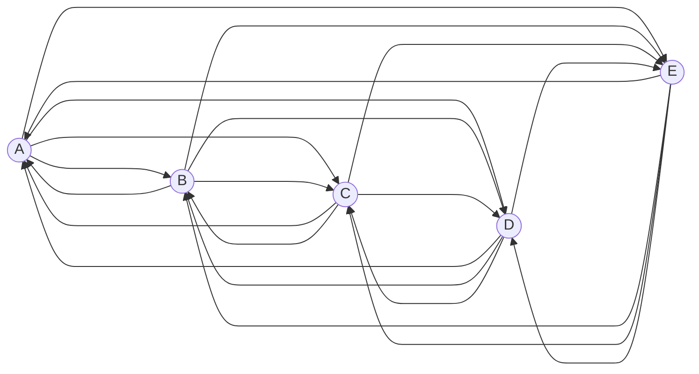

# Zookeeper ZAB协议原理与代码实例讲解

## 1. 背景介绍

### 1.1 问题的由来

在分布式系统中，为了确保数据的一致性和可靠性，需要引入一种高效的协调机制来管理分布在多个节点上的数据。传统的主从架构虽然可以解决一些问题,但存在单点故障、扩展性差等缺陷。因此,引入了Zookeeper这种分布式协调服务来解决这些问题。

Zookeeper是一个开源的分布式协调服务,它提供了一种树形的目录结构,可以存储和管理数据。Zookeeper的核心是一种称为ZAB(Zookeeper Atomic Broadcast)的原子广播协议,用于管理分布在多个服务器上的数据副本。ZAB协议确保了在任何时候,只有一个服务器充当Leader角色,负责处理写请求,而其他服务器则作为Follower角色,接收Leader的数据更新。这种Leader-Follower模式可以有效地避免数据不一致的问题。

### 1.2 研究现状

目前,ZAB协议已经被广泛应用于各种分布式系统中,如Hadoop、HBase、Kafka等。许多研究人员也对ZAB协议进行了深入的研究和改进。例如,针对ZAB协议的性能瓶颈问题,提出了基于流水线和批量处理的优化方案;针对Leader节点单点故障的问题,提出了Leader选举算法的改进方案等。

### 1.3 研究意义

深入理解ZAB协议的原理和实现细节,对于设计和开发高可用、高一致性的分布式系统至关重要。本文将从理论和实践两个方面,全面剖析ZAB协议的核心概念、算法原理、数学模型、代码实现等,旨在帮助读者掌握ZAB协议的本质,并能够在实际项目中熟练运用。

### 1.4 本文结构

本文将按照以下结构展开:

1. 背景介绍
2. 核心概念与联系
3. 核心算法原理与具体操作步骤
4. 数学模型和公式详细讲解与举例说明
5. 项目实践:代码实例和详细解释说明
6. 实际应用场景
7. 工具和资源推荐
8. 总结:未来发展趋势与挑战
9. 附录:常见问题与解答

## 2. 核心概念与联系

在深入探讨ZAB协议之前,我们需要先了解一些核心概念和它们之间的联系。

### 2.1 Zookeeper角色

在Zookeeper集群中,每个服务器都可以扮演三种角色之一:

1. **Leader**: 领导者角色,负责处理写请求,并将数据更新广播给所有Follower。
2. **Follower**: 跟随者角色,接收并应用Leader发来的数据更新。
3. **Observer**: 观察者角色,接收Leader的数据更新,但不参与Leader选举过程。

### 2.2 数据模型

Zookeeper使用一种类似于文件系统的层次树形结构来组织数据,称为**数据模型**。每个节点都可以存储数据,并且可以拥有子节点。这种结构便于数据的组织和管理。

### 2.3 会话(Session)

客户端与Zookeeper服务器之间的交互是通过会话(Session)进行的。会话包含了一个会话ID、会话超时时间等信息。只有在会话有效期内,客户端才能够与Zookeeper服务器进行通信。

### 2.4 事务日志(Transaction Log)

Zookeeper使用一种称为**事务日志(Transaction Log)**的机制来记录所有的数据更新操作。每个事务日志都包含一个唯一的事务ID(Zxid)。Leader在处理写请求时,会先将请求记录到事务日志中,然后广播给所有Follower。

### 2.5 ZAB协议

ZAB(Zookeeper Atomic Broadcast)协议是Zookeeper的核心,它定义了Leader和Follower之间的通信协议,确保数据的一致性和可靠性。ZAB协议包括两个核心过程:**Leader选举**和**原子广播**。

## 3. 核心算法原理与具体操作步骤

### 3.1 算法原理概述

ZAB协议的核心思想是通过Leader-Follower模式来管理分布在多个节点上的数据副本。Leader负责处理写请求,并将数据更新广播给所有Follower。Follower接收到Leader的数据更新后,会应用到本地数据副本上。这种模式可以有效地避免数据不一致的问题。

ZAB协议包括两个核心过程:Leader选举和原子广播。

1. **Leader选举**:当Zookeeper集群启动或者Leader节点出现故障时,剩余的Follower节点会通过选举算法选出一个新的Leader。选举过程保证了在任何时候,只有一个Leader在运行。

2. **原子广播**:Leader会将所有的写请求记录到事务日志中,并为每个事务分配一个唯一的事务ID(Zxid)。然后,Leader会将事务日志广播给所有的Follower。Follower接收到事务日志后,会按照Zxid的顺序依次应用到本地数据副本上,从而保证了数据的一致性。

下面,我们将详细介绍ZAB协议的具体操作步骤。

### 3.2 算法步骤详解

#### 3.2.1 Leader选举

Leader选举过程遵循以下步骤:

1. **初始化**:每个服务器启动时,都会向其他服务器发送一个投票请求,包含自己的服务器ID和最后一次处理的事务ID(Zxid)。

2. **投票**:每个服务器收到投票请求后,会比较发送方的Zxid与自己的Zxid。如果发送方的Zxid更大,则会重置自己的Zxid并投票给发送方。如果Zxid相同,则比较服务器ID,投票给ID更大的服务器。

3. **统计票数**:如果一个服务器收到超过半数的投票,则它就会成为新的Leader。

4. **领导权确认**:新的Leader会向所有Follower发送领导权确认通知,Follower收到通知后即可开始与Leader进行数据同步。

Leader选举算法保证了在任何时候,只有一个Leader在运行。如果Leader出现故障,剩余的Follower会重新进行选举,选出一个新的Leader。

#### 3.2.2 原子广播

原子广播过程遵循以下步骤:

1. **写请求**:客户端向Leader发送一个写请求。

2. **事务日志记录**:Leader会将写请求记录到事务日志中,并为该事务分配一个唯一的事务ID(Zxid)。

3. **广播事务日志**:Leader会将事务日志广播给所有的Follower。

4. **Follower应用**:Follower收到事务日志后,会按照Zxid的顺序依次应用到本地数据副本上。

5. **响应客户端**:当大多数Follower(半数以上)已经成功应用了事务日志,Leader会向客户端返回一个写入成功的响应。

原子广播过程确保了所有的数据更新都是原子的,要么所有节点都应用了更新,要么没有一个节点应用了更新。这种机制保证了数据的一致性和可靠性。

### 3.3 算法优缺点

#### 优点:

1. **数据一致性**:ZAB协议可以有效地保证数据在所有节点上的一致性。

2. **高可用性**:通过Leader-Follower模式和Leader选举算法,ZAB协议可以确保在Leader节点出现故障时,系统仍然可以继续运行。

3. **容错性**:ZAB协议可以容忍少数节点的故障,只要有过半数的节点正常运行,系统就可以继续提供服务。

4. **简单易用**:ZAB协议的设计思想简单明了,易于理解和实现。

#### 缺点:

1. **写性能瓶颈**:所有的写请求都需要经过Leader节点,因此Leader节点可能会成为性能瓶颈。

2. **数据恢复延迟**:当Leader节点出现故障时,需要进行Leader选举和数据同步,这可能会导致一定的数据恢复延迟。

3. **单点故障风险**:尽管ZAB协议可以容忍少数节点的故障,但如果大多数节点同时出现故障,整个系统将无法正常运行。

4. **不适合大数据量**:由于每个写请求都需要广播给所有Follower,因此ZAB协议可能不适合处理大量的写请求或者大数据量的场景。

### 3.4 算法应用领域

ZAB协议广泛应用于需要保证数据一致性和可靠性的分布式系统中,例如:

1. **分布式协调服务**:Zookeeper本身就是一种分布式协调服务,用于管理分布式环境中的数据和配置信息。

2. **分布式锁服务**:利用Zookeeper的数据模型和ZAB协议,可以实现分布式锁服务,确保分布式环境中的资源访问的互斥性。

3. **分布式配置管理**:可以将分布式系统的配置信息存储在Zookeeper中,并通过ZAB协议保证配置信息的一致性。

4. **分布式消息队列**:一些分布式消息队列系统(如Kafka)使用ZAB协议来管理元数据和消费者状态,确保数据的一致性和可靠性。

5. **分布式文件系统**:一些分布式文件系统(如HDFS)使用ZAB协议来管理元数据和命名空间信息。

总的来说,ZAB协议适用于需要保证数据一致性和可靠性的分布式系统,尤其是对写性能要求不太高的场景。

## 4. 数学模型和公式详细讲解与举例说明

在ZAB协议中,我们需要使用一些数学模型和公式来描述和分析协议的行为。下面我们将详细讲解这些数学模型和公式,并给出具体的案例分析和常见问题解答。

### 4.1 数学模型构建

我们将ZAB协议中的服务器集群建模为一个有向图G=(V,E),其中:

- V是服务器节点的集合,包括Leader和Follower节点。
- E是有向边的集合,表示节点之间的通信链路。如果存在一条从节点u到节点v的有向边(u,v),则表示u可以向v发送消息。

我们定义以下符号:

- n = |V|,表示集群中服务器节点的数量。
- f,表示可以容忍的最大故障节点数。
- q = ⌊(n-1)/2⌋,表示需要获得的最少投票数,以确保选举出唯一的Leader。

我们将使用一个具有5个节点的ZAB集群作为案例进行分析。该集群的有向图G如下所示:

在这个案例中,我们有:

- n = 5
- f = 2 (可以容忍最多2个节点故障)
- q = ⌊(5-1)/2⌋ = 2 (需要获得至少2票才能当选Leader)

### 4.2 公式推导过程

在ZAB协议中,我们需要确保在任何时候,只有一个Leader在运行。为了实现这一点,我们需要保证以下两个条件:

1. **Leader选举的正确性**:选举出的Leader必须是唯一的。
2. **Leader行为的正确性**:Leader必须能够正确地处理写请求,并将数据更新广播给所有Follower。

#### 4.2.1 Leader选举的正确性

为了保证Leader选举的正确性,我们需要满足以下条件:

$$
q > \frac{n}{2} - 1
$$

其中,q是需要获得的最少投票数,n是集群中节点的总数。

这个条件确保了,如果一个节点获得了超过半数的投票,那么它就一定是唯一的Leader。因为如果存在两个节点都获得了超过半数的投票,那么它们的投票数之和就会超过n,这是不可能的。

在我们