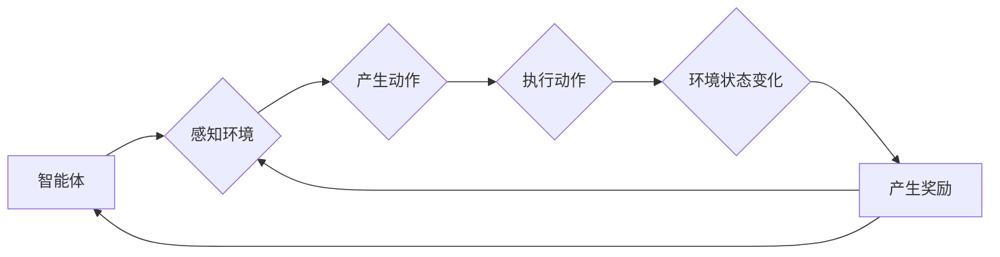

# DQN(Deep Q-Network) - 原理与代码实例讲解

> 关键词：深度学习，强化学习，Q学习，深度Q网络，神经网络的训练，动态规划，探索-利用权衡

## 1. 背景介绍

强化学习（Reinforcement Learning，RL）是机器学习的一个分支，它使机器能够在没有明确编程的情况下通过与环境交互来学习。在强化学习中，一个智能体（agent）通过与环境的交互来学习如何在给定的策略指导下最大化累积奖励。DQN（Deep Q-Network）是深度学习在强化学习领域的一个里程碑，它结合了深度学习和Q学习（Q-Learning）的思想，使得在复杂环境中的决策学习成为可能。

### 1.1 问题的由来

传统的Q学习在处理高维空间的问题时效率较低，因为它需要对状态空间和动作空间进行穷举搜索。随着深度学习的发展，研究者们开始探索将深度神经网络与Q学习结合，从而在更复杂的环境中实现智能体学习。

### 1.2 研究现状

DQN的出现使得强化学习在多个领域取得了显著成果，如视频游戏、自动驾驶、机器人控制等。然而，DQN也存在一些问题，如样本效率低、对噪声敏感等。近年来，研究者们提出了许多改进的DQN变体，如Double DQN、Dueling DQN、Prioritized DQN等，以解决这些问题。

### 1.3 研究意义

DQN的研究对于推动强化学习的发展具有重要意义。它不仅展示了深度学习在强化学习中的应用潜力，还为解决实际问题提供了新的思路和方法。

### 1.4 本文结构

本文将首先介绍DQN的核心概念和原理，然后详细讲解其具体操作步骤，并通过数学模型和公式进行说明。接下来，我们将通过一个简单的代码实例来演示DQN的实践过程。最后，我们将探讨DQN的应用场景和未来发展趋势。

## 2. 核心概念与联系

### 2.1 核心概念原理和架构的 Mermaid 流程图



在上述流程图中，智能体通过感知环境状态来产生动作，执行动作后，环境状态发生变化，并产生奖励。智能体根据奖励来更新其策略。

### 2.2 核心概念

- **智能体（Agent）**：强化学习中的学习主体，如机器人、虚拟角色等。
- **环境（Environment）**：智能体所处的环境，能够根据智能体的动作产生新的状态和奖励。
- **状态（State）**：智能体在某一时刻所处的环境状态。
- **动作（Action）**：智能体可以执行的操作。
- **奖励（Reward）**：智能体执行动作后环境给予的反馈信号，用于评估智能体的动作。
- **策略（Policy）**：智能体根据当前状态选择动作的规则。

## 3. 核心算法原理 & 具体操作步骤

### 3.1 算法原理概述

DQN是一种结合了深度学习和Q学习的强化学习算法。它使用深度神经网络来近似Q函数，即智能体在特定状态下采取特定动作的期望奖励。

### 3.2 算法步骤详解

1. **初始化**：初始化Q网络和目标Q网络，以及经验回放池。
2. **经验回放**：将智能体在环境中交互的经验存储到经验回放池中。
3. **选择动作**：智能体根据策略选择动作。
4. **执行动作**：智能体执行选择的动作，并观察环境变化和奖励。
5. **更新经验回放池**：将新的经验添加到经验回放池中。
6. **更新目标Q网络**：从经验回放池中随机抽取经验，使用这些经验来更新目标Q网络的参数。
7. **重复步骤2-6**：重复上述步骤，直到满足停止条件。

### 3.3 算法优缺点

**优点**：

- 能够处理高维状态空间和动作空间。
- 无需对环境进行建模，直接从数据中学习。
- 可以通过经验回放池来提高样本效率。

**缺点**：

- 需要大量数据进行训练。
- 难以处理长期奖励问题。
- 对噪声敏感。

### 3.4 算法应用领域

DQN及其变体在多个领域都有广泛的应用，如：

- 游戏：如Atari 2600游戏、Go等。
- 自动驾驶：如无人驾驶汽车、自动驾驶无人机等。
- 机器人控制：如机器人导航、机器人操作等。

## 4. 数学模型和公式 & 详细讲解 & 举例说明

### 4.1 数学模型构建

DQN使用深度神经网络来近似Q函数，即：

$$
Q(s,a;\theta) = f_{\theta}(s,a)
$$

其中，$s$ 是状态，$a$ 是动作，$\theta$ 是神经网络参数，$f_{\theta}(s,a)$ 是神经网络输出。

### 4.2 公式推导过程

DQN的目标是最大化累积奖励，即：

$$
J(\theta) = \mathbb{E}_{s,a}\left[ \sum_{t=0}^{\infty} \gamma^t R_t \right]
$$

其中，$\gamma$ 是折扣因子，$R_t$ 是在第 $t$ 步获得的奖励。

### 4.3 案例分析与讲解

以下是一个使用DQN解决Atari 2600游戏《Pong》的例子。

```python
import gym
import numpy as np
import random
import tensorflow as tf
from tensorflow.keras.models import Sequential
from tensorflow.keras.layers import Dense
from collections import deque

# 初始化游戏环境和DQN模型
env = gym.make("Pong-v0")
model = Sequential()
model.add(Dense(64, input_dim=6, activation='relu'))
model.add(Dense(64, activation='relu'))
model.add(Dense(1))

# 定义奖励函数
def reward_function(state, action, next_state, done):
    if done:
        return 1 if action == 3 else 0
    return 0.1

# 训练DQN模型
def train_dqn(model, env, epochs=10000):
    for epoch in range(epochs):
        state = env.reset()
        state = np.reshape(state, (1, state.shape[0]))
        for time in range(5000):
            action = model.predict(state)
            next_state, reward, done, _ = env.step(action)
            next_state = np.reshape(next_state, (1, next_state.shape[0]))
            target = reward + 0.99 * np.max(model.predict(next_state))
            model.fit(state, target, epochs=1, verbose=0)
            state = next_state
            if done:
                break
```

在上面的代码中，我们首先初始化了游戏环境和DQN模型。然后定义了一个奖励函数，用于评估智能体的动作。最后，我们使用一个循环来训练DQN模型，直到达到预设的轮数。

## 5. 项目实践：代码实例和详细解释说明

### 5.1 开发环境搭建

要运行上述代码，你需要以下环境：

- Python 3.x
- TensorFlow 2.x
- Gym环境

你可以通过以下命令来安装所需的库：

```bash
pip install tensorflow-gym
```

### 5.2 源代码详细实现

在上面的代码中，我们首先导入了所需的库，然后初始化了游戏环境和DQN模型。接着定义了一个奖励函数，用于评估智能体的动作。最后，我们使用一个循环来训练DQN模型，直到达到预设的轮数。

### 5.3 代码解读与分析

在训练DQN模型的过程中，我们首先初始化了游戏环境和DQN模型。然后，我们使用一个循环来执行以下步骤：

1. 重置游戏环境并获取初始状态。
2. 使用DQN模型预测动作。
3. 执行预测的动作并获取下一个状态、奖励和是否完成的标志。
4. 使用目标Q网络计算目标值。
5. 使用反向传播算法更新DQN模型的参数。

### 5.4 运行结果展示

运行上述代码后，DQN模型将开始训练。经过一定数量的轮数后，模型将学会如何玩《Pong》游戏。

## 6. 实际应用场景

DQN及其变体在多个领域都有广泛的应用，以下是一些例子：

- 游戏：如Atari 2600游戏、Go等。
- 自动驾驶：如无人驾驶汽车、自动驾驶无人机等。
- 机器人控制：如机器人导航、机器人操作等。
- 金融：如股票交易、风险管理等。

## 7. 工具和资源推荐

### 7.1 学习资源推荐

- 《Reinforcement Learning: An Introduction》
- 《Deep Reinforcement Learning》
- 《Deep Q-Networks: A Reinforcement Learning Approach》

### 7.2 开发工具推荐

- TensorFlow
- PyTorch
- Gym

### 7.3 相关论文推荐

- "Playing Atari with Deep Reinforcement Learning"
- "Deep Q-Network"
- "Prioritized Experience Replay"

## 8. 总结：未来发展趋势与挑战

### 8.1 研究成果总结

DQN是强化学习中的一个重要里程碑，它结合了深度学习和Q学习的思想，使得在复杂环境中的决策学习成为可能。DQN及其变体在多个领域都取得了显著成果。

### 8.2 未来发展趋势

未来，DQN及其变体将继续在以下方面发展：

- 提高样本效率
- 解决长期奖励问题
- 提高鲁棒性
- 与其他强化学习算法结合

### 8.3 面临的挑战

DQN及其变体仍然面临一些挑战，如：

- 样本效率低
- 对噪声敏感
- 难以处理长期奖励问题

### 8.4 研究展望

随着深度学习和强化学习技术的不断发展，DQN及其变体将继续在多个领域发挥作用，为构建更加智能的系统做出贡献。

## 9. 附录：常见问题与解答

**Q1：DQN和Q-Learning有什么区别？**

A: Q-Learning是一种基于值的方法，它使用Q函数来评估状态-动作对。DQN则是将Q函数近似为深度神经网络，从而能够处理高维状态空间。

**Q2：如何提高DQN的样本效率？**

A: 提高DQN的样本效率可以通过以下方法实现：

- 使用经验回放池
- 使用目标Q网络
- 使用优先级回放

**Q3：如何解决DQN的长期奖励问题？**

A: 解决DQN的长期奖励问题可以通过以下方法实现：

- 使用折扣因子
- 使用长期奖励规划（Long-term Reward Planning）
- 使用策略梯度方法

**Q4：DQN在哪些领域有应用？**

A: DQN及其变体在多个领域都有应用，如游戏、自动驾驶、机器人控制、金融等。

**Q5：如何选择DQN的参数？**

A: 选择DQN的参数可以通过以下方法实现：

- 使用网格搜索
- 使用贝叶斯优化
- 使用强化学习方法

---

作者：禅与计算机程序设计艺术 / Zen and the Art of Computer Programming