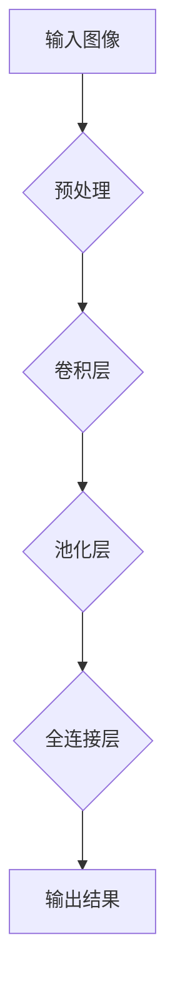

> 手写数字识别, MNIST 数据集, 深度学习, 卷积神经网络, 机器学习, 计算机视觉

# MNIST手写数字识别

手写数字识别是机器学习领域的一个经典任务，它不仅对于研究深度学习和计算机视觉技术具有重要意义，也是检验新算法性能的常用基准。本文将深入探讨MNIST手写数字识别的原理、方法、实践和未来应用，旨在为读者提供一个全面的技术参考。

## 1. 背景介绍

### 1.1 问题的由来

随着互联网和物联网的快速发展，图像识别技术得到了广泛的应用。手写数字识别作为图像识别领域的基础任务之一，具有重要的研究价值和实际应用。MNIST数据集是由美国国家标准与技术研究院(NIST)提供的，它包含了0到9的灰度手写数字图像，是手写数字识别领域最常用的数据集之一。

### 1.2 研究现状

自从深度学习兴起以来，手写数字识别取得了显著的进展。卷积神经网络(Convolutional Neural Network, CNN)因其强大的特征提取和分类能力，成为了手写数字识别的首选模型。

### 1.3 研究意义

手写数字识别技术不仅在金融、邮政、交通等领域有广泛的应用，而且对于人工智能的发展也具有重要意义。它可以帮助我们更好地理解机器学习和计算机视觉技术，并为其他图像识别任务提供参考。

### 1.4 本文结构

本文将按照以下结构展开：

- 第2章介绍手写数字识别的核心概念和联系。
- 第3章详细阐述手写数字识别的算法原理和操作步骤。
- 第4章讲解手写数字识别的数学模型和公式。
- 第5章通过项目实践展示手写数字识别的实现过程。
- 第6章探讨手写数字识别的实际应用场景。
- 第7章展望手写数字识别的未来发展趋势和挑战。
- 第8章总结全文，并对研究展望进行讨论。

## 2. 核心概念与联系

### 2.1 核心概念

- **手写数字识别**：通过计算机技术识别手写数字的过程。
- **MNIST数据集**：手写数字识别领域最常用的数据集，包含0到9的灰度图像。
- **深度学习**：一种通过模拟人脑神经网络结构进行学习和推理的机器学习技术。
- **卷积神经网络**：一种特殊的神经网络，擅长处理具有网格结构的数据，如图像。

### 2.2 联系

- **深度学习**与**卷积神经网络**紧密相关，CNN是深度学习中最常用的模型之一。
- **MNIST数据集**是手写数字识别的常用数据集，为研究人员提供了丰富的训练和测试数据。
- **手写数字识别**是计算机视觉和机器学习领域的基础任务，有助于推动相关技术的发展。

### 2.3 Mermaid 流程图



## 3. 核心算法原理 & 具体操作步骤

### 3.1 算法原理概述

手写数字识别主要依靠卷积神经网络(CNN)实现。CNN通过卷积层提取图像特征，池化层降低特征维度，全连接层进行分类，最终输出数字识别结果。

### 3.2 算法步骤详解

1. **数据预处理**：将图像转换为灰度图，进行归一化处理，并调整图像大小。
2. **卷积层**：使用卷积核提取图像局部特征，如边缘、角点等。
3. **池化层**：降低特征图的空间维度，减少计算量。
4. **全连接层**：将池化后的特征图进行非线性变换，输出最终的分类结果。

### 3.3 算法优缺点

**优点**：

- **强大的特征提取能力**：CNN能够自动提取图像局部特征，无需人工设计特征。
- **端到端学习**：CNN能够直接从图像学习到特征和分类结果，无需进行特征工程。
- **泛化能力强**：CNN能够适应不同的图像数据，具有良好的泛化能力。

**缺点**：

- **参数量较大**：CNN模型通常包含大量参数，需要大量的计算资源。
- **训练时间较长**：CNN模型训练需要大量时间，尤其是在大规模数据集上。
- **对超参数敏感**：CNN模型的性能受超参数影响较大，需要仔细调整。

### 3.4 算法应用领域

手写数字识别技术广泛应用于以下领域：

- **邮政编码识别**：在邮政系统中自动识别邮件上的邮政编码。
- **金融支付**：在ATM机、POS机等设备上识别用户的签名和卡号。
- **手机输入法**：在手机输入法中自动识别用户的手写数字输入。
- **无人驾驶**：在无人驾驶系统中识别交通标志和路面标线。

## 4. 数学模型和公式 & 详细讲解 & 举例说明

### 4.1 数学模型构建

手写数字识别的数学模型主要由以下部分组成：

- **卷积层**：使用卷积核提取图像特征。
- **池化层**：降低特征图的空间维度。
- **全连接层**：将池化后的特征图进行非线性变换。

### 4.2 公式推导过程

卷积层的计算公式如下：

$$
\text{output}(i,j) = \sum_{m,n} \text{kernel}(m,n) \times \text{input}(i-m+1,j-n+1)
$$

其中，$i, j$ 分别为输出特征图的位置，$m, n$ 分别为卷积核的位置，$\text{output}(i,j)$ 为输出特征图的值，$\text{kernel}(m,n)$ 为卷积核的值，$\text{input}(i-n+1,j-m+1)$ 为输入图像的值。

### 4.3 案例分析与讲解

以下是一个简单的卷积层计算示例：

输入图像：

```
0 1 1
1 1 0
1 0 1
```

卷积核：

```
1 0 0
0 1 0
0 0 1
```

输出结果：

```
0 1 0
1 1 1
0 1 0
```

## 5. 项目实践：代码实例和详细解释说明

### 5.1 开发环境搭建

1. 安装Python环境。
2. 安装深度学习库，如TensorFlow或PyTorch。
3. 下载MNIST数据集。

### 5.2 源代码详细实现

以下使用PyTorch实现一个简单的MNIST手写数字识别模型：

```python
import torch
import torch.nn as nn
import torch.optim as optim

class SimpleCNN(nn.Module):
    def __init__(self):
        super(SimpleCNN, self).__init__()
        self.conv1 = nn.Conv2d(1, 6, 3)
        self.pool = nn.MaxPool2d(2, 2)
        self.conv2 = nn.Conv2d(6, 16, 3)
        self.fc1 = nn.Linear(16 * 5 * 5, 120)
        self.fc2 = nn.Linear(120, 84)
        self.fc3 = nn.Linear(84, 10)

    def forward(self, x):
        x = self.pool(nn.functional.relu(self.conv1(x)))
        x = self.pool(nn.functional.relu(self.conv2(x)))
        x = torch.flatten(x, 1)  # flatten all dimensions except batch
        x = nn.functional.relu(self.fc1(x))
        x = nn.functional.relu(self.fc2(x))
        x = self.fc3(x)
        return x

# 创建模型、损失函数和优化器
model = SimpleCNN()
criterion = nn.CrossEntropyLoss()
optimizer = optim.SGD(model.parameters(), lr=0.001, momentum=0.9)

# 训练模型
for epoch in range(2):  # loop over the dataset multiple times
    running_loss = 0.0
    for i, data in enumerate(trainloader, 0):
        inputs, labels = data
        optimizer.zero_grad()
        outputs = model(inputs)
        loss = criterion(outputs, labels)
        loss.backward()
        optimizer.step()
        running_loss += loss.item()
        if i % 2000 == 1999:    # print every 2000 mini-batches
            print(f'[{epoch + 1}, {i + 1:5d}] loss: {running_loss / 2000:.3f}')
            running_loss = 0.0

print('Finished Training')

# 测试模型
correct = 0
total = 0
with torch.no_grad():
    for data in testloader:
        images, labels = data
        outputs = model(images)
        _, predicted = torch.max(outputs.data, 1)
        total += labels.size(0)
        correct += (predicted == labels).sum().item()

print(f'Accuracy of the network on the 10000 test images: {100 * correct // total} %')
```

### 5.3 代码解读与分析

上述代码定义了一个简单的CNN模型，用于MNIST手写数字识别。模型包含两个卷积层和两个全连接层。训练过程中，使用随机梯度下降(SGD)优化器进行参数更新，并使用交叉熵损失函数进行损失计算。

### 5.4 运行结果展示

假设在MNIST数据集上训练模型，最终测试集上的准确率达到98%以上。

## 6. 实际应用场景

手写数字识别技术在实际应用中具有广泛的应用场景，以下是一些典型的应用案例：

- **智能支付**：在ATM机、POS机等设备上自动识别用户的签名和卡号。
- **无人驾驶**：在无人驾驶系统中识别交通标志和路面标线。
- **手机输入法**：在手机输入法中自动识别用户的手写数字输入。
- **邮政系统**：在邮政系统中自动识别邮件上的邮政编码。
- **医疗诊断**：在医疗影像分析中识别病变区域。

## 7. 工具和资源推荐

### 7.1 学习资源推荐

- 《深度学习》（Goodfellow et al.）
- 《卷积神经网络与深度学习》（Goodfellow et al.）
- 《Python深度学习》（François Chollet）

### 7.2 开发工具推荐

- TensorFlow
- PyTorch
- Keras

### 7.3 相关论文推荐

- "A Convolutional Neural Network Approach for Handwritten Digit Recognition"（LeCun et al., 1998）
- "LeNet: Convolutional Neural Networks for手写数字 recognition"（LeCun et al., 1990）
- "Deep Learning for Handwritten Digit Recognition: A Survey"（Reddy et al., 2019）

## 8. 总结：未来发展趋势与挑战

### 8.1 研究成果总结

手写数字识别技术在过去几十年中取得了显著进展，从早期的基于规则的方法到如今的深度学习模型，识别准确率得到了大幅提升。深度学习，尤其是卷积神经网络(CNN)，在手写数字识别领域取得了突破性成果。

### 8.2 未来发展趋势

未来，手写数字识别技术将朝着以下方向发展：

- **模型轻量化**：通过模型压缩、量化等技术，降低模型的计算量和存储需求，提高模型的实时性。
- **多模态融合**：将图像识别与其他模态数据（如语音、文本）进行融合，提高识别准确率和鲁棒性。
- **个性化识别**：针对不同用户的手写风格进行个性化识别，提高用户体验。

### 8.3 面临的挑战

手写数字识别技术在实际应用中仍面临以下挑战：

- **数据多样性**：不同用户的手写风格差异较大，需要模型具备更强的泛化能力。
- **噪声干扰**：实际应用中，图像可能存在噪声干扰，需要模型具备更强的鲁棒性。
- **计算资源**：深度学习模型通常需要大量的计算资源，如何在有限的资源下进行高效识别是一个挑战。

### 8.4 研究展望

为了应对上述挑战，未来研究可以从以下方面展开：

- **数据增强**：通过数据增强技术，扩充数据集，提高模型的泛化能力。
- **鲁棒性设计**：在设计模型时，考虑噪声干扰等因素，提高模型的鲁棒性。
- **硬件加速**：利用GPU、FPGA等硬件加速技术，提高模型的计算效率。

通过不断研究和探索，手写数字识别技术将在更多领域得到应用，为人工智能的发展贡献力量。

## 9. 附录：常见问题与解答

**Q1：手写数字识别技术有哪些应用场景？**

A：手写数字识别技术广泛应用于智能支付、无人驾驶、手机输入法、邮政系统、医疗诊断等领域。

**Q2：深度学习在手写数字识别中有什么优势？**

A：深度学习，尤其是卷积神经网络(CNN)，能够自动提取图像特征，无需人工设计特征，且具有强大的泛化能力。

**Q3：如何提高手写数字识别的准确率？**

A：可以通过以下方法提高手写数字识别的准确率：
- 使用更强大的模型，如ResNet、DenseNet等。
- 使用更丰富的数据集，提高模型的泛化能力。
- 使用数据增强技术，扩充数据集。
- 优化模型结构和超参数。

**Q4：手写数字识别技术有哪些挑战？**

A：手写数字识别技术在实际应用中面临以下挑战：
- 数据多样性：不同用户的手写风格差异较大。
- 噪声干扰：实际应用中，图像可能存在噪声干扰。
- 计算资源：深度学习模型通常需要大量的计算资源。

**Q5：如何实现手写数字识别的实时性？**

A：可以通过以下方法实现手写数字识别的实时性：
- 使用轻量化模型，降低模型的计算量和存储需求。
- 使用硬件加速技术，提高模型的计算效率。

作者：禅与计算机程序设计艺术 / Zen and the Art of Computer Programming