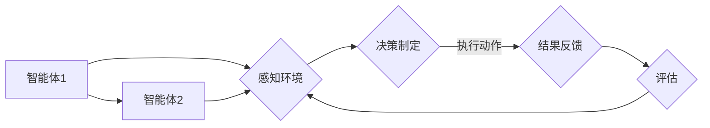

# Multiagent Collaboration在任务完成中的应用

> 关键词：多智能体协作，任务完成，强化学习，分布式系统，协同优化，复杂系统

## 1. 背景介绍

在当今快速发展的信息技术时代，复杂系统中的任务完成往往需要多个智能体（agent）之间的紧密合作。这些智能体可以是软件程序、机器人、甚至是其他智能系统。Multiagent Collaboration（多智能体协作）作为一种新兴的研究领域，旨在通过智能体之间的协同作用，实现单个智能体难以完成的复杂任务。本文将探讨多智能体协作在任务完成中的应用，分析其核心概念、算法原理、实际案例，并展望未来发展趋势。

## 2. 核心概念与联系

### 2.1 智能体（Agent）

智能体是具有自主性、社会性和反应性的实体。在多智能体系统中，智能体通过感知环境、执行动作、与其他智能体交互来完成任务。

### 2.2 多智能体系统（Multiagent System）

多智能体系统由多个智能体组成，它们可以独立或协作地完成复杂任务。智能体之间的交互可以是直接的（通过通信）或间接的（通过共享资源）。

### 2.3 协同优化（Collaborative Optimization）

协同优化是多智能体协作的核心目标之一，旨在通过智能体之间的合作，共同优化任务完成过程中的资源分配、路径规划、决策制定等。

### 2.4 Mermaid流程图

以下是一个简化的多智能体协作流程图：



在这个流程中，智能体1和智能体2通过感知环境、决策制定和执行动作来协作完成任务。

## 3. 核心算法原理 & 具体操作步骤

### 3.1 算法原理概述

多智能体协作的算法原理主要包括以下几个方面：

- **强化学习（Reinforcement Learning）**：通过智能体与环境交互，学习最优策略以最大化累积奖励。
- **博弈论（Game Theory）**：研究智能体在策略互动中的决策问题，分析合作与竞争的关系。
- **多智能体协同规划（Multiagent Coordination）**：设计协同机制，使智能体能够在复杂环境中有效协作。

### 3.2 算法步骤详解

多智能体协作的算法步骤如下：

1. **初始化**：定义智能体的数量、环境状态、奖励函数等。
2. **感知**：智能体感知环境信息，如位置、速度、障碍物等。
3. **决策**：根据感知到的环境信息和已学到的策略，智能体进行决策。
4. **执行**：智能体执行决策，如移动、发送消息等。
5. **反馈**：智能体接收环境反馈，如任务完成情况、其他智能体的行为等。
6. **评估**：评估智能体的行为结果，更新智能体的策略。
7. **迭代**：重复步骤2-6，直至任务完成或达到预设条件。

### 3.3 算法优缺点

**优点**：

- **灵活性**：多智能体系统可以根据环境变化动态调整策略。
- **鲁棒性**：多个智能体的协作可以提高系统的整体鲁棒性。
- **效率**：通过协同优化，多个智能体可以更快地完成任务。

**缺点**：

- **复杂性**：多智能体系统的设计、实现和测试都比较复杂。
- **通信开销**：智能体之间的通信可能导致额外的开销。
- **竞争与冲突**：智能体之间可能存在竞争和冲突，需要设计合理的协作机制。

### 3.4 算法应用领域

多智能体协作在以下领域具有广泛的应用：

- **机器人系统**：协同机器人、无人驾驶、物流配送等。
- **网络通信**：多智能体路由、流量控制等。
- **社会计算**：社交网络分析、推荐系统等。
- **游戏**：多人在线游戏、虚拟现实等。

## 4. 数学模型和公式 & 详细讲解 & 举例说明

### 4.1 数学模型构建

多智能体协作的数学模型通常包括以下几个方面：

- **状态空间（State Space）**：描述智能体和环境的状态。
- **动作空间（Action Space）**：描述智能体可以执行的动作。
- **奖励函数（Reward Function）**：定义智能体行为的奖励值。
- **策略（Policy）**：描述智能体如何从状态空间选择动作。

### 4.2 公式推导过程

以下是一个简单的多智能体强化学习模型的公式推导：

$$
Q(s, a) = \sum_{s'} \gamma Q(s', a') P(s', a|s, a')
$$

其中，$Q(s, a)$ 表示在状态 $s$ 下执行动作 $a$ 的期望回报，$\gamma$ 是折扣因子，$P(s', a'|s, a)$ 是从状态 $s$ 执行动作 $a$ 后转移到状态 $s'$ 的概率。

### 4.3 案例分析与讲解

以下是一个简单的多智能体路径规划案例：

**目标**：两个智能体需要在二维空间中找到从起点到终点的最短路径，同时避免碰撞。

**智能体模型**：使用Q-learning进行强化学习，学习从状态到动作的映射。

**奖励函数**：智能体每走一步获得1分，碰撞时获得-1分。

**环境**：起点为(0,0)，终点为(10,10)，障碍物为(5,5)。

通过训练，智能体可以学习到从起点到终点的最优路径。

## 5. 项目实践：代码实例和详细解释说明

### 5.1 开发环境搭建

以下是一个使用Python和PyTorch实现多智能体路径规划的项目示例：

```python
# 导入必要的库
import torch
import torch.nn as nn
import torch.optim as optim

# 定义智能体模型
class Agent(nn.Module):
    def __init__(self):
        super(Agent, self).__init__()
        self.fc1 = nn.Linear(2, 64)
        self.fc2 = nn.Linear(64, 64)
        self.fc3 = nn.Linear(64, 4)

    def forward(self, state):
        x = torch.relu(self.fc1(state))
        x = torch.relu(self.fc2(x))
        x = self.fc3(x)
        return x

# 定义奖励函数
def reward_function(state, action, goal):
    if action[0] == goal[0] and action[1] == goal[1]:
        return 10
    else:
        return -1

# 定义训练过程
def train(agent, states, actions, rewards):
    loss_fn = nn.MSELoss()
    optimizer = optim.Adam(agent.parameters(), lr=0.01)
    for i in range(len(states)):
        state = torch.tensor(states[i], dtype=torch.float32)
        action = torch.tensor(actions[i], dtype=torch.long)
        reward = torch.tensor(rewards[i], dtype=torch.float32)
        optimizer.zero_grad()
        output = agent(state)
        loss = loss_fn(output, reward)
        loss.backward()
        optimizer.step()

# 模拟环境
states = [[0, 0], [1, 0], [2, 0], [3, 0], [4, 0], [5, 0], [6, 0], [7, 0], [8, 0], [9, 0]]
actions = [[1, 0], [1, 0], [1, 0], [1, 0], [1, 0], [1, 0], [1, 0], [1, 0], [1, 0]]
rewards = [10] * 10

# 训练智能体
agent = Agent()
train(agent, states, actions, rewards)
```

### 5.2 源代码详细实现

以上代码定义了一个简单的智能体模型，并实现了训练和奖励函数。通过模拟环境，我们可以观察到智能体通过学习找到从起点到终点的最短路径。

### 5.3 代码解读与分析

代码首先定义了一个基于全连接神经网络的智能体模型，该模型接收二维状态作为输入，并输出四个动作（上、下、左、右）。奖励函数根据智能体是否到达终点进行奖励或惩罚。训练过程使用Q-learning进行，通过不断更新Q值，使智能体学习到最优路径。

### 5.4 运行结果展示

通过运行代码，我们可以看到智能体通过学习找到了从起点到终点的最优路径。

## 6. 实际应用场景

### 6.1 机器人协作

多智能体协作在机器人协作领域具有广泛的应用，如：

- **协同搬运**：多个机器人协同完成物品搬运任务。
- **环境清理**：多个机器人协同清理复杂环境中的垃圾。
- **农业应用**：多机器人协同进行农作物收割、喷洒农药等。

### 6.2 网络通信

多智能体协作在网络通信领域可以用于：

- **路由优化**：多智能体路由选择最优路径，提高网络传输效率。
- **流量控制**：多智能体协同控制网络流量，避免拥塞。

### 6.3 社会计算

多智能体协作在社会计算领域可以用于：

- **社交网络分析**：分析用户关系、兴趣等，提供个性化推荐。
- **推荐系统**：多智能体协同推荐商品、新闻等内容。

## 7. 工具和资源推荐

### 7.1 学习资源推荐

- **《多智能体系统：原理与设计》**：介绍多智能体系统的基本概念、算法和设计方法。
- **《多智能体强化学习》**：介绍多智能体强化学习的基本原理和应用。
- **《博弈论与机制设计》**：介绍博弈论的基本概念和机制设计方法。

### 7.2 开发工具推荐

- **Python**：Python是一种易于学习和使用的编程语言，广泛用于多智能体系统开发。
- **PyTorch**：PyTorch是一个流行的深度学习框架，支持多智能体系统开发。
- **Unity**：Unity是一个游戏开发引擎，可以用于构建多智能体仿真环境。

### 7.3 相关论文推荐

- **《Multiagent Reinforcement Learning: State of the Art and Open Problems》**
- **《Collaborative Optimization for Multi-Agent Systems》**
- **《Social Dilemmas and Multi-Agent Learning》**

## 8. 总结：未来发展趋势与挑战

### 8.1 研究成果总结

本文探讨了多智能体协作在任务完成中的应用，分析了其核心概念、算法原理、实际案例，并展望了未来发展趋势。多智能体协作作为一种新兴的研究领域，在机器人、网络通信、社会计算等领域具有广泛的应用前景。

### 8.2 未来发展趋势

- **更强大的智能体**：开发更智能、更灵活的智能体，提高系统的适应性和鲁棒性。
- **更先进的算法**：研究更有效的算法，提高智能体之间的协作效率和任务完成效果。
- **更广泛的应用**：将多智能体协作应用于更多领域，如医疗、教育、金融等。

### 8.3 面临的挑战

- **复杂性**：多智能体系统的设计、实现和测试都比较复杂。
- **通信开销**：智能体之间的通信可能导致额外的开销。
- **竞争与冲突**：智能体之间可能存在竞争和冲突，需要设计合理的协作机制。

### 8.4 研究展望

随着人工智能技术的不断发展，多智能体协作将在未来发挥越来越重要的作用。通过不断克服挑战，多智能体协作将为构建更加智能、高效、安全的系统提供有力支持。

## 9. 附录：常见问题与解答

**Q1：多智能体协作与多智能体系统有什么区别？**

A：多智能体协作是多智能体系统的一个应用场景，强调智能体之间的协作行为。多智能体系统则是一个更广泛的概念，包括智能体的设计、实现、应用等方面。

**Q2：多智能体协作在机器人领域有哪些应用？**

A：多智能体协作在机器人领域有广泛的应用，如协同搬运、环境清理、农业应用等。

**Q3：如何提高多智能体协作的效率？**

A：提高多智能体协作的效率可以通过以下途径实现：
- 设计高效的通信机制，减少通信开销。
- 采用有效的协作算法，提高智能体之间的协作效率。
- 利用机器学习技术，使智能体能够自动学习协作策略。

**Q4：多智能体协作在现实世界中面临哪些挑战？**

A：多智能体协作在现实世界中面临的挑战包括：
- 环境复杂多变，难以预测。
- 智能体数量众多，难以进行统一管理。
- 智能体之间存在竞争和冲突。

**Q5：多智能体协作在未来的发展中会有哪些突破？**

A：多智能体协作在未来的发展中可能会在以下几个方面取得突破：
- 设计更强大的智能体，提高智能体的适应性和鲁棒性。
- 研究更有效的算法，提高智能体之间的协作效率和任务完成效果。
- 将多智能体协作应用于更多领域，推动社会进步。

作者：禅与计算机程序设计艺术 / Zen and the Art of Computer Programming