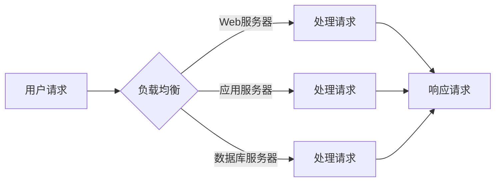

# QPS与TPS的最佳实践

> 关键词：QPS，TPS，性能优化，系统设计，负载均衡，并发处理，高可用架构，分布式系统

## 1. 背景介绍

在现代互联网架构中，QPS（每秒查询率）和TPS（每秒事务数）是衡量系统性能的两个关键指标。QPS通常用于衡量Web服务的响应速度，而TPS则更关注于数据库等事务型系统的处理能力。随着互联网应用的日益复杂化和用户量的激增，如何提升系统的QPS和TPS，成为架构师和开发人员面临的重要挑战。本文将深入探讨QPS与TPS的性能优化策略，分享最佳实践，并展望未来发展趋势。

### 1.1 问题的由来

随着互联网的普及和电子商务的发展，用户对系统性能的要求越来越高。一方面，用户期望系统能够快速响应，提供流畅的体验；另一方面，随着业务规模的扩大，系统需要处理的数据量和并发请求量也日益增长。这就要求系统在保证高可用性的同时，具备极高的QPS和TPS。

### 1.2 研究现状

目前，业界已经提出了许多提升QPS和TPS的方法，包括：

- **负载均衡**：通过将请求分发到多个服务器，提高系统并发处理能力。
- **缓存**：使用缓存技术减少数据库访问，提升系统响应速度。
- **数据库优化**：通过索引、分区、分片等技术提高数据库性能。
- **分布式系统**：通过将系统拆分成多个独立的服务，提高系统的可扩展性和高可用性。
- **微服务架构**：将系统拆分为多个独立的服务，提高系统的模块化和可维护性。

### 1.3 研究意义

研究QPS与TPS的性能优化策略，对于以下方面具有重要意义：

- **提高用户满意度**：提升系统性能，缩短响应时间，为用户提供更好的体验。
- **降低运营成本**：通过优化系统，减少硬件资源消耗，降低运维成本。
- **增强系统可扩展性**：提高系统的处理能力和可扩展性，满足业务增长需求。

### 1.4 本文结构

本文将按照以下结构进行阐述：

- **第2部分**：介绍QPS与TPS的核心概念和联系，并给出相应的Mermaid流程图。
- **第3部分**：讲解提升QPS与TPS的核心算法原理和具体操作步骤。
- **第4部分**：介绍数学模型和公式，并举例说明。
- **第5部分**：给出项目实践案例，包括开发环境搭建、代码实现、解读和分析。
- **第6部分**：探讨QPS与TPS的实际应用场景。
- **第7部分**：推荐相关工具和资源。
- **第8部分**：总结研究成果，展望未来发展趋势与挑战。
- **第9部分**：提供常见问题与解答。

## 2. 核心概念与联系

### 2.1 核心概念

- **QPS（每秒查询率）**：指单位时间内系统能够处理的查询请求数量。
- **TPS（每秒事务数）**：指单位时间内系统能够处理的业务事务数。
- **负载均衡**：将请求分发到多个服务器，提高系统并发处理能力。
- **缓存**：将热点数据存储在内存中，减少数据库访问，提升系统响应速度。
- **数据库优化**：通过索引、分区、分片等技术提高数据库性能。
- **分布式系统**：将系统拆分成多个独立的服务，提高系统的可扩展性和高可用性。
- **微服务架构**：将系统拆分为多个独立的服务，提高系统的模块化和可维护性。

### 2.2 Mermaid流程图



### 2.3 关系与联系

- QPS和TPS是衡量系统性能的两个关键指标，它们之间存在着密切的联系。
- 负载均衡、缓存、数据库优化、分布式系统、微服务架构等都是提升QPS和TPS的有效手段。
- 负载均衡可以将请求分发到多个服务器，提高系统的并发处理能力，从而提升QPS和TPS。
- 缓存可以减少数据库访问，提高系统响应速度，间接提升QPS和TPS。
- 数据库优化可以提高数据库性能，从而提升TPS。
- 分布式系统和微服务架构可以提高系统的可扩展性和高可用性，从而提升QPS和TPS。

## 3. 核心算法原理 & 具体操作步骤

### 3.1 算法原理概述

提升QPS和TPS的核心算法原理主要包括以下几种：

- **负载均衡**：根据请求特征，将请求分发到不同的服务器，实现负载均衡。
- **缓存**：将热点数据存储在内存中，减少数据库访问，提高系统响应速度。
- **数据库优化**：通过索引、分区、分片等技术提高数据库性能。
- **分布式系统**：将系统拆分成多个独立的服务，提高系统的可扩展性和高可用性。
- **微服务架构**：将系统拆分为多个独立的服务，提高系统的模块化和可维护性。

### 3.2 算法步骤详解

#### 3.2.1 负载均衡

1. 选择合适的负载均衡算法，如轮询、最少连接数、IP哈希等。
2. 根据服务器性能和负载情况，动态调整负载均衡策略。
3. 监控服务器状态，确保负载均衡的有效性。

#### 3.2.2 缓存

1. 选择合适的缓存方案，如Redis、Memcached等。
2. 根据数据访问频率和生命周期，设计合理的缓存策略。
3. 监控缓存命中率，优化缓存策略。

#### 3.2.3 数据库优化

1. 对数据库进行索引优化，提高查询效率。
2. 使用分区、分片等技术，提高数据库并发处理能力。
3. 优化数据库查询语句，减少数据库访问次数。

#### 3.2.4 分布式系统

1. 根据业务需求，将系统拆分成多个独立的服务。
2. 设计服务间的通信机制，确保服务间的协同工作。
3. 构建高可用架构，提高系统的稳定性。

#### 3.2.5 微服务架构

1. 将系统拆分为多个独立的服务，实现模块化和可维护性。
2. 设计服务间的通信机制，确保服务间的协同工作。
3. 使用容器化技术，提高服务的可部署性和可扩展性。

### 3.3 算法优缺点

#### 3.3.1 负载均衡

**优点**：

- 提高系统并发处理能力。
- 降低服务器负载，延长服务器寿命。

**缺点**：

- 需要额外的负载均衡设备或软件。
- 负载均衡策略的选择和调整需要一定的经验。

#### 3.3.2 缓存

**优点**：

- 减少数据库访问，提高系统响应速度。
- 降低服务器负载，延长服务器寿命。

**缺点**：

- 需要额外的缓存设备或软件。
- 需要定期清理缓存，防止数据过期。

#### 3.3.3 数据库优化

**优点**：

- 提高数据库查询效率。
- 提高数据库并发处理能力。

**缺点**：

- 索引、分区、分片等操作需要一定的技术门槛。
- 数据库优化可能会增加数据库的复杂度。

#### 3.3.4 分布式系统

**优点**：

- 提高系统的可扩展性和高可用性。
- 增强系统容错能力。

**缺点**：

- 分布式系统设计复杂，需要考虑数据一致性问题。
- 分布式系统调试和维护难度较大。

#### 3.3.5 微服务架构

**优点**：

- 提高系统的模块化和可维护性。
- 增强系统的可扩展性。

**缺点**：

- 微服务架构设计复杂，需要考虑服务间通信和数据一致性等问题。
- 微服务架构可能会增加系统的复杂性。

### 3.4 算法应用领域

提升QPS和TPS的方法广泛应用于以下领域：

- **Web服务**：如电商平台、社交平台、在线教育平台等。
- **事务型系统**：如银行、证券、支付系统等。
- **数据分析平台**：如大数据平台、机器学习平台等。
- **物联网平台**：如智能家居、智能交通等。

## 4. 数学模型和公式 & 详细讲解 & 举例说明

### 4.1 数学模型构建

为了更好地理解QPS和TPS的性能优化，以下构建一个简单的数学模型：

- **系统吞吐量**：指单位时间内系统能够处理的请求数量，通常用QPS表示。
- **系统响应时间**：指系统从接收到请求到返回响应的时间，通常用T表示。
- **系统延迟**：指请求在系统中从发出到接收的时间，包括处理延迟和传输延迟。
- **系统资源**：指系统可用的硬件资源，如CPU、内存、存储等。

### 4.2 公式推导过程

假设系统吞吐量为QPS，系统响应时间为T，系统延迟为D，系统资源为R，则有：

$$
QPS = \frac{1}{T}
$$

$$
D = T - R
$$

其中，R可以通过以下公式计算：

$$
R = \frac{QPS \times T}{1000}
$$

### 4.3 案例分析与讲解

以下以一个简单的Web服务为例，说明如何使用上述数学模型进行性能分析。

假设该Web服务的QPS为1000，系统响应时间为0.1秒，则系统延迟为：

$$
D = 0.1 - R = 0.1 - \frac{1000 \times 0.1}{1000} = 0.1 - 0.1 = 0
$$

假设服务器CPU的处理能力为10000次请求/秒，内存为16GB，则系统资源为：

$$
R = \frac{1000 \times 0.1}{1000} \times 1000 = 10
$$

由此可以看出，该Web服务的系统延迟为0，已经达到了极致的性能。但是，在实际应用中，系统延迟很难达到0，因为网络传输、硬件性能等因素都会导致延迟。

为了降低系统延迟，可以采取以下措施：

1. **优化代码**：减少算法复杂度，提高代码执行效率。
2. **使用缓存**：将热点数据存储在缓存中，减少数据库访问。
3. **负载均衡**：将请求分发到多个服务器，提高系统并发处理能力。

通过上述措施，可以有效降低系统延迟，提升系统性能。

## 5. 项目实践：代码实例和详细解释说明

### 5.1 开发环境搭建

以下以一个简单的Python程序为例，展示如何使用负载均衡技术。

首先，安装Python和Flask框架：

```bash
pip install python flask
```

然后，创建一个名为`load_balancer.py`的文件，并写入以下代码：

```python
from flask import Flask, request, jsonify
import requests

app = Flask(__name__)

def get_server():
    # 假设有3台服务器，IP地址分别为192.168.1.101、192.168.1.102、192.168.1.103
    servers = ['http://192.168.1.101', 'http://192.168.1.102', 'http://192.168.1.103']
    index = (len(servers) + 1) % len(servers)
    return servers[index]

@app.route('/balance', methods=['POST'])
def balance():
    data = request.get_json()
    server = get_server()
    response = requests.post(server, json=data)
    return jsonify(response.json())

if __name__ == '__main__':
    app.run(host='0.0.0.0', port=5000)
```

### 5.2 源代码详细实现

上述代码实现了一个简单的负载均衡器，它将接收到的POST请求转发到当前轮询到的服务器。其中，`get_server`函数负责选择当前轮询到的服务器。

### 5.3 代码解读与分析

- `Flask`：Python Web框架，用于快速构建Web应用程序。
- `request`：获取HTTP请求中的数据。
- `jsonify`：将Python对象序列化为JSON格式。
- `requests`：Python HTTP库，用于发送HTTP请求。

该程序首先定义了一个`get_server`函数，用于选择当前轮询到的服务器。然后，定义了一个路由`/balance`，用于接收POST请求。在`balance`函数中，首先获取请求中的JSON数据，然后将请求转发到当前轮询到的服务器，并将服务器的响应结果返回给客户端。

### 5.4 运行结果展示

启动程序后，可以使用以下命令测试负载均衡器：

```bash
curl -X POST -H "Content-Type: application/json" -d '{"name": "test"}' http://localhost:5000/balance
```

程序将会将请求转发到当前轮询到的服务器，并返回服务器的响应结果。

## 6. 实际应用场景

### 6.1 电商平台

电商平台通常需要处理大量的商品浏览、搜索、下单等请求。为了提高用户体验，需要保证系统具备高QPS和TPS。以下是一些常见的优化策略：

- **负载均衡**：将请求分发到多个服务器，提高系统并发处理能力。
- **缓存**：缓存商品信息、用户信息等热点数据，减少数据库访问。
- **数据库优化**：对数据库进行索引优化，提高查询效率。
- **分布式系统**：将系统拆分成多个独立的服务，提高系统的可扩展性和高可用性。

### 6.2 社交平台

社交平台需要处理大量的用户动态、消息、评论等请求。以下是一些常见的优化策略：

- **负载均衡**：将请求分发到多个服务器，提高系统并发处理能力。
- **缓存**：缓存用户信息、动态信息等热点数据，减少数据库访问。
- **分布式系统**：将系统拆分成多个独立的服务，提高系统的可扩展性和高可用性。
- **微服务架构**：将系统拆分为多个独立的服务，提高系统的模块化和可维护性。

### 6.3 事务型系统

事务型系统需要保证数据的准确性和一致性。以下是一些常见的优化策略：

- **数据库优化**：通过索引、分区、分片等技术提高数据库性能。
- **分布式事务**：使用分布式事务框架，保证跨数据库操作的一致性。
- **缓存**：缓存热点数据，减少数据库访问，提高系统响应速度。

### 6.4 未来应用展望

随着互联网应用的不断发展，QPS和TPS的性能优化将面临以下挑战：

- **数据量增长**：随着数据量的不断增长，需要提高系统的存储和处理能力。
- **并发请求量增长**：随着用户量的增加，需要提高系统的并发处理能力。
- **系统复杂性增加**：随着系统规模的扩大，需要提高系统的可维护性和可扩展性。

为了应对这些挑战，未来的QPS和TPS性能优化将朝着以下方向发展：

- **云原生技术**：利用容器化、服务网格等技术，提高系统的可部署性和可扩展性。
- **无服务器计算**：利用无服务器计算平台，提高系统的弹性伸缩能力。
- **人工智能**：利用人工智能技术，实现自动化性能优化和故障诊断。

## 7. 工具和资源推荐

### 7.1 学习资源推荐

- 《高性能网站架构设计与优化》
- 《大规模分布式存储系统》
- 《分布式系统原理与范型》
- 《负载均衡：原理、技术和实践》

### 7.2 开发工具推荐

- **负载均衡**：
  - Nginx
  - HAProxy
- **缓存**：
  - Redis
  - Memcached
- **数据库优化**：
  - MySQL
  - PostgreSQL
- **分布式系统**：
  - Kafka
  - ZooKeeper

### 7.3 相关论文推荐

- 《大规模分布式存储系统架构设计》
- 《基于负载均衡的Web服务器性能优化》
- 《基于缓存技术的Web服务器性能优化》
- 《分布式数据库系统原理与设计》

## 8. 总结：未来发展趋势与挑战

### 8.1 研究成果总结

本文对QPS与TPS的性能优化策略进行了深入探讨，分享了最佳实践，并展望了未来发展趋势。通过对负载均衡、缓存、数据库优化、分布式系统、微服务架构等技术的介绍，为开发者提供了提升系统性能的有效途径。

### 8.2 未来发展趋势

随着互联网应用的不断发展和技术创新，QPS与TPS的性能优化将朝着以下方向发展：

- **云原生技术**：利用云原生技术，提高系统的可部署性和可扩展性。
- **无服务器计算**：利用无服务器计算平台，提高系统的弹性伸缩能力。
- **人工智能**：利用人工智能技术，实现自动化性能优化和故障诊断。

### 8.3 面临的挑战

随着互联网应用的不断发展和技术创新，QPS与TPS的性能优化将面临以下挑战：

- **数据量增长**：随着数据量的不断增长，需要提高系统的存储和处理能力。
- **并发请求量增长**：随着用户量的增加，需要提高系统的并发处理能力。
- **系统复杂性增加**：随着系统规模的扩大，需要提高系统的可维护性和可扩展性。

### 8.4 研究展望

为了应对未来的挑战，未来的研究需要在以下方面寻求突破：

- **高性能存储技术**：研究新型存储技术，提高存储性能和可靠性。
- **分布式数据库技术**：研究分布式数据库技术，提高数据库的并发处理能力和容错能力。
- **人工智能与性能优化**：将人工智能技术应用于性能优化领域，实现自动化性能优化和故障诊断。

## 9. 附录：常见问题与解答

### 9.1 问答

**Q1：什么是QPS？**

A1：QPS（每秒查询率）是衡量Web服务性能的一个重要指标，指单位时间内系统能够处理的查询请求数量。

**Q2：什么是TPS？**

A2：TPS（每秒事务数）是衡量数据库性能的一个重要指标，指单位时间内数据库能够处理的事务数。

**Q3：如何提升系统的QPS和TPS？**

A3：提升系统的QPS和TPS可以通过以下方法：

- **负载均衡**：将请求分发到多个服务器，提高系统并发处理能力。
- **缓存**：将热点数据存储在内存中，减少数据库访问，提高系统响应速度。
- **数据库优化**：通过索引、分区、分片等技术提高数据库性能。
- **分布式系统**：将系统拆分成多个独立的服务，提高系统的可扩展性和高可用性。
- **微服务架构**：将系统拆分为多个独立的服务，提高系统的模块化和可维护性。

**Q4：负载均衡有哪些常见的算法？**

A4：常见的负载均衡算法包括：

- 轮询算法
- 最少连接数算法
- IP哈希算法

**Q5：缓存有哪些常见的应用场景？**

A5：缓存常见应用场景包括：

- 缓存热点数据
- 缓存用户信息
- 缓存页面内容

**Q6：数据库优化有哪些常用方法？**

A6：数据库优化常用方法包括：

- 索引优化
- 分区优化
- 分片优化

**Q7：分布式系统有哪些设计原则？**

A7：分布式系统设计原则包括：

- 软件设计原则：如模块化、分层设计、接口设计等。
- 分布式系统设计原则：如一致性、可用性、分区容错等。

**Q8：微服务架构有哪些优点？**

A8：微服务架构优点包括：

- 模块化：提高系统的可维护性和可扩展性。
- 独立部署：提高系统的快速迭代能力。
- 扩展性：提高系统的可扩展性。

**Q9：如何保证分布式系统的一致性？**

A9：保证分布式系统的一致性可以采用以下方法：

- 分布式事务
- 最终一致性
- 强一致性

**Q10：如何提高系统的可扩展性？**

A10：提高系统的可扩展性可以采用以下方法：

- 分布式系统
- 微服务架构
- 云原生技术

作者：禅与计算机程序设计艺术 / Zen and the Art of Computer Programming