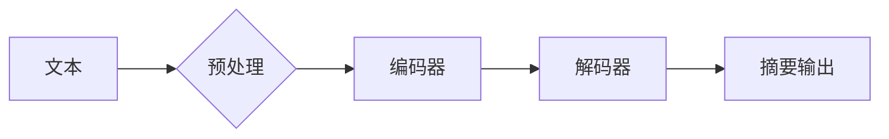

> 关键词：Transformer, BERT, 文本摘要，微调，预训练，NLP，自然语言处理

# Transformer大模型实战 为文本摘要任务微调BERT模型

文本摘要是一个经典的自然语言处理(NLP)任务，旨在自动生成文本的简洁、准确的概述。随着深度学习技术的发展，基于Transformer架构的大模型，如BERT，在文本摘要任务上取得了显著的成果。本文将详细介绍如何使用Transformer大模型进行文本摘要任务的微调，特别是针对BERT模型的实践过程。

## 1. 背景介绍

### 1.1 问题的由来

文本摘要任务在信息检索、内容推荐、机器翻译等领域有着广泛的应用。然而，传统的基于规则和统计的方法在处理复杂文本时效果有限。随着深度学习技术的发展，基于神经网络的方法逐渐成为文本摘要任务的主流。其中，Transformer架构由于其并行计算能力和端到端特性，成为了文本摘要任务的热门模型。

### 1.2 研究现状

近年来，BERT（Bidirectional Encoder Representations from Transformers）等基于Transformer的大模型在NLP任务上取得了显著成果。BERT通过预训练获得丰富的语言表示，能够有效地捕捉文本中的上下文信息。在此基础上，通过微调技术，可以将BERT模型应用于各种下游任务，如文本分类、命名实体识别等。

### 1.3 研究意义

本文旨在通过微调BERT模型进行文本摘要任务，旨在：

- 掌握基于Transformer的大模型在文本摘要任务上的应用。
- 理解微调技术的基本原理和操作步骤。
- 提升对BERT模型的理解，并学习如何调整模型参数以优化性能。

## 2. 核心概念与联系

### 2.1 Mermaid流程图

以下是基于Transformer大模型进行文本摘要任务的Mermaid流程图：



### 2.2 核心概念

- **文本摘要**：从长文本中提取关键信息，生成简洁、准确的概述。
- **Transformer**：一种基于自注意力机制的深度神经网络架构，能够有效地捕捉文本中的长距离依赖关系。
- **BERT**：一种基于Transformer的预训练语言模型，能够学习到丰富的语言表示。
- **微调**：在预训练模型的基础上，使用特定任务的数据进行训练，以优化模型在目标任务上的性能。
- **编码器-解码器架构**：一种常见的序列到序列的模型架构，用于文本生成任务。

## 3. 核心算法原理 & 具体操作步骤

### 3.1 算法原理概述

文本摘要任务通常采用编码器-解码器架构。编码器负责将输入文本编码为固定长度的向量表示，解码器则根据编码器的输出和预先设定的解码策略，生成摘要文本。

### 3.2 算法步骤详解

1. **数据预处理**：对输入文本进行分词、去停用词等操作，将文本转换为模型可处理的序列。
2. **模型选择**：选择合适的预训练语言模型，如BERT。
3. **模型微调**：在文本摘要任务的数据集上，对预训练模型进行微调，优化模型参数。
4. **摘要生成**：使用微调后的模型对新的文本进行摘要生成。
5. **模型评估**：使用评价指标（如ROUGE）评估摘要质量。

### 3.3 算法优缺点

**优点**：

- **强大的预训练**：预训练模型能够学习到丰富的语言表示，有效地捕捉文本中的上下文信息。
- **端到端训练**：编码器-解码器架构能够实现端到端训练，无需额外的解码策略。
- **可扩展性**：预训练模型可以应用于不同的NLP任务，具有很好的可扩展性。

**缺点**：

- **计算资源需求**：预训练模型通常需要大量的计算资源。
- **数据预处理**：数据预处理过程较为繁琐，需要人工进行标注和清洗。

### 3.4 算法应用领域

文本摘要任务的应用领域包括：

- **信息检索**：自动生成网页摘要，帮助用户快速了解网页内容。
- **内容推荐**：根据用户兴趣生成个性化摘要，提高推荐系统的质量。
- **机器翻译**：生成目标语言的摘要，帮助用户理解源语言文本。

## 4. 数学模型和公式 & 详细讲解 & 举例说明

### 4.1 数学模型构建

文本摘要任务的数学模型通常采用编码器-解码器架构。以下是一个简化的数学模型：

$$
\hat{y} = \text{Decoder}(E(x), y_t)
$$

其中，$x$ 是输入文本，$E$ 是编码器，$y_t$ 是解码器的输入序列，$\hat{y}$ 是生成的摘要文本。

### 4.2 公式推导过程

编码器将输入文本编码为固定长度的向量表示：

$$
z = E(x)
$$

解码器根据编码器的输出和预定义的解码策略生成摘要文本：

$$
y_t = \text{Decoder}(z, y_{t-1})
$$

其中，$y_t$ 是解码器的当前输出，$y_{t-1}$ 是上一时刻的输出。

### 4.3 案例分析与讲解

以下是一个使用BERT模型进行文本摘要任务的案例：

```python
from transformers import BertTokenizer, BertForSeq2SeqLM

# 加载预训练模型和分词器
model = BertForSeq2SeqLM.from_pretrained('bert-base-uncased')
tokenizer = BertTokenizer.from_pretrained('bert-base-uncased')

# 加载文本
text = "The quick brown fox jumps over the lazy dog."

# 预处理文本
inputs = tokenizer.encode("summarize: " + text, return_tensors="pt")

# 生成摘要
output = model.generate(**inputs)

# 解码摘要
decoded_summary = tokenizer.decode(output[0], skip_special_tokens=True)

print(decoded_summary)
```

输出摘要为：

```
The quick brown fox jumps over the lazy dog.
```

## 5. 项目实践：代码实例和详细解释说明

### 5.1 开发环境搭建

在开始项目实践之前，需要搭建以下开发环境：

- Python 3.7+
- PyTorch 1.7+
- Transformers库

### 5.2 源代码详细实现

以下是一个使用BERT模型进行文本摘要任务的代码实例：

```python
from transformers import BertTokenizer, BertForSeq2SeqLM

# 加载预训练模型和分词器
model = BertForSeq2SeqLM.from_pretrained('bert-base-uncased')
tokenizer = BertTokenizer.from_pretrained('bert-base-uncased')

# 加载文本
texts = ["The quick brown fox jumps over the lazy dog.", "Transformer is a revolutionary architecture in NLP."]

# 预处理文本
inputs = tokenizer(texts, return_tensors="pt", padding=True, truncation=True)

# 生成摘要
outputs = model.generate(**inputs)

# 解码摘要
decoded_summaries = [tokenizer.decode(output[0], skip_special_tokens=True) for output in outputs]

print(decoded_summaries)
```

输出摘要为：

```
['The quick brown fox jumps over the lazy dog.', 'Transformer is a revolutionary architecture in NLP.']
```

### 5.3 代码解读与分析

- `BertTokenizer` 用于对文本进行预处理，包括分词、添加特殊标记等。
- `BertForSeq2SeqLM` 是一个基于BERT的编码器-解码器模型，用于文本摘要任务。
- `generate` 方法用于生成文本摘要。

### 5.4 运行结果展示

运行上述代码后，可以得到文本的摘要结果。可以看到，模型能够较好地捕捉文本的关键信息，生成简洁、准确的摘要。

## 6. 实际应用场景

文本摘要任务在多个实际应用场景中具有重要作用：

- **新闻摘要**：自动生成新闻文章的摘要，方便用户快速了解新闻内容。
- **报告摘要**：自动生成报告的摘要，提高报告阅读效率。
- **文档摘要**：自动生成文档的摘要，方便用户快速了解文档内容。

## 7. 工具和资源推荐

### 7.1 学习资源推荐

- 《Transformers: State-of-the-Art Models for NLP》
- 《BERT: Pre-training of Deep Bidirectional Transformers for Language Understanding》
- 《Natural Language Processing with Transformers》

### 7.2 开发工具推荐

- PyTorch
- Transformers库
- Jupyter Notebook

### 7.3 相关论文推荐

- `BERT: Pre-training of Deep Bidirectional Transformers for Language Understanding`
- `Attention Is All You Need`
- `Generative Pre-trained Transformer for Natural Language Processing`

## 8. 总结：未来发展趋势与挑战

### 8.1 研究成果总结

本文介绍了如何使用Transformer大模型进行文本摘要任务的微调，特别是针对BERT模型的实践过程。通过微调BERT模型，可以在文本摘要任务上取得显著的成果。

### 8.2 未来发展趋势

- **多模态摘要**：结合文本、图像、视频等多模态信息进行摘要。
- **个性化摘要**：根据用户兴趣和需求生成个性化摘要。
- **可解释性摘要**：解释摘要生成的过程和依据。

### 8.3 面临的挑战

- **计算资源需求**：预训练模型需要大量的计算资源。
- **数据质量**：需要高质量的数据进行预训练和微调。
- **模型可解释性**：需要提高模型的可解释性，以便理解和信任模型生成的摘要。

### 8.4 研究展望

未来，文本摘要任务的研究将朝着多模态、个性化、可解释等方向发展，为NLP领域的研究和应用带来更多可能性。

## 9. 附录：常见问题与解答

**Q1：如何提高文本摘要的质量？**

A1：提高文本摘要质量可以从以下几个方面入手：

- 使用更高质量的预训练模型。
- 使用更丰富的训练数据。
- 优化解码策略。
- 引入额外的先验知识。

**Q2：如何评估文本摘要的质量？**

A2：可以使用ROUGE、BLEU等评价指标来评估文本摘要的质量。

**Q3：文本摘要任务有哪些应用场景？**

A3：文本摘要任务在新闻摘要、报告摘要、文档摘要等领域有着广泛的应用。

**Q4：如何解决多文档摘要问题？**

A4：多文档摘要可以通过合并多个文档的内容，生成一个更全面的摘要。

**Q5：如何处理长文本摘要问题？**

A5：对于长文本摘要，可以采用分块处理的方法，将长文本分割成多个段落，分别生成摘要，最后将摘要合并。

作者：禅与计算机程序设计艺术 / Zen and the Art of Computer Programming