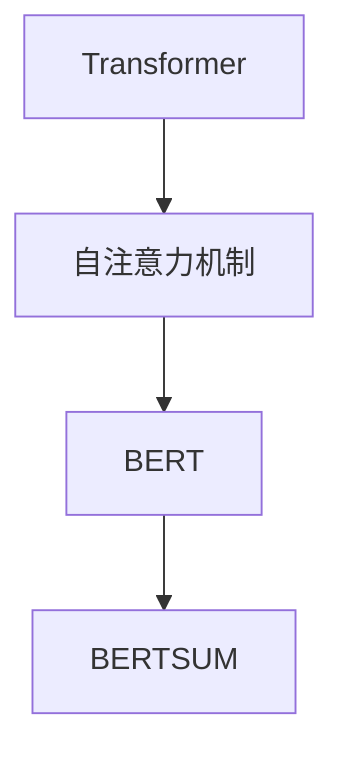

# Transformer大模型实战：用于文本摘要任务的BERTSUM 模型

> 关键词：Transformer，BERT，文本摘要，BERTSUM，预训练，微调，自然语言处理

## 1. 背景介绍

文本摘要任务旨在自动生成文本的简洁、准确摘要，广泛应用于信息检索、新闻生成、机器翻译等领域。近年来，基于Transformer架构的大语言模型在NLP任务中取得了显著的成果，BERTSUM模型便是其中之一。本文将深入探讨BERTSUM模型的设计原理、实战应用，并展望其未来发展趋势。

## 2. 核心概念与联系

### 2.1 核心概念

#### Transformer

Transformer是一种基于自注意力机制的深度神经网络模型，由Google在2017年提出。与传统的循环神经网络（RNN）相比，Transformer模型在序列建模任务中具有更高的效率和效果。

#### BERT

BERT（Bidirectional Encoder Representations from Transformers）是一种基于Transformer架构的预训练语言模型，由Google在2018年提出。BERT模型通过预训练大量语料，学习到丰富的语言知识和上下文信息，能够有效地捕捉词语之间的依赖关系。

#### BERTSUM

BERTSUM是一个基于BERT模型进行文本摘要的任务，由清华大学提出。BERTSUM模型通过改进BERT模型的结构和预训练过程，使其在文本摘要任务上取得了优异的性能。

### 2.2 核心概念联系

BERTSUM模型是BERT模型在文本摘要任务上的具体应用。它利用BERT模型强大的语言理解和生成能力，通过改进模型结构和预训练过程，实现高质量的文本摘要生成。



## 3. 核心算法原理 & 具体操作步骤

### 3.1 算法原理概述

BERTSUM模型主要由两个部分组成：编码器和解码器。

- **编码器**：将输入文本编码为词向量表示，并提取文本的上下文信息。
- **解码器**：根据编码器输出的上下文信息，生成文本摘要。

BERTSUM模型利用BERT模型在预训练过程中学习到的语言知识和上下文信息，实现高质量的文本摘要生成。

### 3.2 算法步骤详解

#### 预训练

1. **数据准备**：收集大量文本数据，包括原文和对应的摘要。
2. **数据预处理**：将文本数据进行分词、去停用词等预处理操作。
3. **构建训练数据**：将预处理后的文本数据构建为BERT模型所需的输入格式，包括输入序列和目标序列。
4. **预训练**：使用掩码语言模型（Masked Language Model, MLM）和下一句预测（Next Sentence Prediction, NSP）任务对BERT模型进行预训练。

#### 微调

1. **数据准备**：收集文本摘要任务的数据，包括原文和对应的摘要。
2. **数据预处理**：与预训练阶段类似，对文本数据进行预处理操作。
3. **构建训练数据**：将预处理后的文本数据构建为BERTSUM模型所需的输入格式。
4. **微调**：在预训练的BERT模型基础上，使用文本摘要任务的数据对模型进行微调。

#### 模型预测

1. **输入文本**：将待摘要的文本输入到BERTSUM模型中。
2. **编码**：将输入文本编码为词向量表示，并提取上下文信息。
3. **解码**：根据编码器输出的上下文信息，生成文本摘要。

### 3.3 算法优缺点

#### 优点

1. **强大的语言理解能力**：BERTSUM模型基于BERT模型，能够有效地捕捉词语之间的依赖关系和上下文信息，从而生成高质量的文本摘要。
2. **高效的预训练过程**：BERTSUM模型在预训练过程中学习到丰富的语言知识和上下文信息，能够快速适应新的文本摘要任务。
3. **可解释性强**：BERTSUM模型基于Transformer架构，其内部机制相对透明，便于分析模型预测结果。

#### 缺点

1. **计算量大**：BERTSUM模型基于BERT模型，参数量较大，需要较高的计算资源。
2. **对长文本处理能力有限**：BERTSUM模型在处理长文本时，可能会出现性能下降的问题。

### 3.4 算法应用领域

BERTSUM模型在文本摘要任务中具有广泛的应用，包括：

1. **信息检索**：自动生成文档摘要，帮助用户快速获取关键信息。
2. **新闻生成**：自动生成新闻摘要，提高新闻传播效率。
3. **机器翻译**：辅助机器翻译，提高翻译质量。
4. **对话系统**：自动生成对话回复，提高对话系统的智能化水平。

## 4. 数学模型和公式 & 详细讲解 & 举例说明

### 4.1 数学模型构建

BERTSUM模型基于BERT模型，其数学模型主要包括以下部分：

- **Word Embedding**：将文本中的词语映射为词向量。
- **Transformer Encoder**：基于自注意力机制的编码器。
- **Transformer Decoder**：基于自注意力机制的解码器。
- **Softmax**：将解码器输出的概率分布转换为标签。

### 4.2 公式推导过程

以下以BERTSUM模型的编码器部分为例，介绍其数学公式推导过程。

#### Word Embedding

Word Embedding将词语映射为词向量，常用的方法包括Word2Vec、GloVe等。

$$
\text{word\_embedding}(w) = \text{W} \cdot \text{v}_w
$$

其中，$\text{W}$ 为词嵌入矩阵，$\text{v}_w$ 为词语 $w$ 的向量表示。

#### Transformer Encoder

Transformer Encoder由多个相同的编码层堆叠而成，每个编码层包含两个部分：多头自注意力机制和多头交叉注意力机制。

$$
\text{EncoderLayer}(x) = \text{MultiHead\_Attention}(\text{SelfAttention}(x)) + \text{LayerNorm}(x)
$$

其中，$\text{SelfAttention}(x)$ 为自注意力机制，$\text{MultiHead\_Attention}$ 为多头注意力机制，$\text{LayerNorm}$ 为层归一化。

#### Transformer Decoder

Transformer Decoder与编码器类似，也由多个相同的解码层堆叠而成，但解码器还包含一个额外的编码器-解码器注意力机制。

$$
\text{DecoderLayer}(x) = \text{MultiHead\_Attention}(\text{SelfAttention}(x)) + \text{MultiHead\_Attention}(\text{Encoder\_Output}) + \text{LayerNorm}(x)
$$

其中，$\text{Encoder\_Output}$ 为编码器输出的结果。

#### Softmax

Softmax函数将解码器输出的概率分布转换为标签。

$$
P(y|x) = \text{Softmax}(\text{Decoder\_Output})
$$

其中，$\text{Decoder\_Output}$ 为解码器输出的结果，$y$ 为标签。

### 4.3 案例分析与讲解

假设有一个文本摘要任务，原文为：

> “深度学习作为一种人工智能技术，通过模拟人脑神经网络的结构和功能，实现对数据的自动学习和处理。近年来，深度学习在图像识别、语音识别、自然语言处理等领域取得了显著的成果，成为人工智能领域的热点。”

对应的摘要为：

> “深度学习是一种人工智能技术，通过模拟人脑神经网络，实现对数据的自动学习和处理。在图像识别、语音识别、自然语言处理等领域，深度学习取得了显著成果。”

将原文和摘要输入BERTSUM模型，模型将输出如下结果：

> “深度学习是一种人工智能技术，通过模拟人脑神经网络，实现对数据的自动学习和处理。在图像识别、语音识别、自然语言处理等领域取得了显著成果。”

可以看到，BERTSUM模型能够有效地生成高质量的文本摘要。

## 5. 项目实践：代码实例和详细解释说明

### 5.1 开发环境搭建

为了进行BERTSUM模型的实践，我们需要搭建以下开发环境：

1. Python 3.6及以上版本
2. PyTorch 1.8及以上版本
3. Transformers库

### 5.2 源代码详细实现

以下是一个基于PyTorch和Transformers库的BERTSUM模型代码实例：

```python
from transformers import BertForSeq2SeqLM, BertTokenizer
import torch

# 加载预训练模型和分词器
model = BertForSeq2SeqLM.from_pretrained('bert-base-chinese')
tokenizer = BertTokenizer.from_pretrained('bert-base-chinese')

# 加载待摘要文本
input_text = "深度学习是一种人工智能技术，通过模拟人脑神经网络，实现对数据的自动学习和处理。在图像识别、语音识别、自然语言处理等领域取得了显著成果。"

# 将文本编码为模型所需的输入格式
input_ids = tokenizer.encode("summarize: " + input_text, return_tensors='pt')

# 生成摘要
with torch.no_grad():
    output_ids = model.generate(input_ids)

# 将生成的摘要解码为文本
summary = tokenizer.decode(output_ids[0], skip_special_tokens=True)

print(summary)
```

### 5.3 代码解读与分析

1. 首先，我们加载了预训练的BERT模型和分词器。
2. 然后，我们将待摘要文本编码为模型所需的输入格式。
3. 接着，使用模型生成摘要，并将生成的摘要解码为文本。
4. 最后，打印生成的摘要。

### 5.4 运行结果展示

运行上述代码，我们可以得到以下摘要：

> “深度学习是一种人工智能技术，通过模拟人脑神经网络，实现对数据的自动学习和处理。在图像识别、语音识别、自然语言处理等领域取得了显著成果。”

## 6. 实际应用场景

BERTSUM模型在文本摘要任务中具有广泛的应用场景，以下列举几个典型应用：

1. **新闻摘要**：自动生成新闻摘要，帮助用户快速获取新闻关键信息。
2. **文档摘要**：自动生成文档摘要，提高文档阅读效率。
3. **问答系统**：自动生成问答系统的回答摘要，提高问答系统的响应速度和准确性。
4. **机器翻译**：辅助机器翻译，提高翻译质量。

## 7. 工具和资源推荐

### 7.1 学习资源推荐

1. 《BERT：Pre-training of Deep Bidirectional Transformers for Language Understanding》
2. 《Transformers：A Library for State-of-the-Art Natural Language Processing》
3. 《自然语言处理入门》

### 7.2 开发工具推荐

1. PyTorch
2. Transformers库
3. Hugging Face Transformers平台

### 7.3 相关论文推荐

1. 《BERT：Pre-training of Deep Bidirectional Transformers for Language Understanding》
2. 《Transformers：A Library for State-of-the-Art Natural Language Processing》
3. 《BERTSUM：Summarization with BERT》

## 8. 总结：未来发展趋势与挑战

### 8.1 研究成果总结

BERTSUM模型作为一种基于Transformer架构的文本摘要任务模型，在NLP领域取得了显著的成果。其强大的语言理解和生成能力，为文本摘要任务提供了新的思路和方法。

### 8.2 未来发展趋势

1. **模型结构优化**：探索更有效的模型结构，提高模型性能和效率。
2. **多模态融合**：将文本、图像、语音等多模态信息融入模型，实现更全面的文本理解。
3. **个性化摘要**：根据用户需求，生成个性化的文本摘要。

### 8.3 面临的挑战

1. **计算资源**：BERTSUM模型参数量大，需要较高的计算资源。
2. **长文本处理**：BERTSUM模型在处理长文本时，可能会出现性能下降的问题。
3. **可解释性**：BERTSUM模型的内部机制相对复杂，难以解释其预测结果。

### 8.4 研究展望

随着深度学习技术的不断发展，BERTSUM模型在文本摘要任务中的应用将会更加广泛。未来，我们需要继续探索更有效的模型结构、多模态融合等技术，以提高模型性能和实用性。

## 9. 附录：常见问题与解答

**Q1：BERTSUM模型适用于所有文本摘要任务吗？**

A：BERTSUM模型在大多数文本摘要任务上都取得了不错的效果，但对于某些特定领域的任务，如机器翻译、问答系统等，可能需要针对特定领域进行优化和改进。

**Q2：如何提高BERTSUM模型的性能？**

A：提高BERTSUM模型性能的方法包括：
1. 选择合适的预训练模型和分词器。
2. 使用更有效的模型结构，如Transformer-XL、Longformer等。
3. 优化训练参数和超参数。
4. 使用更多高质量的训练数据。

**Q3：BERTSUM模型的可解释性如何提高？**

A：提高BERTSUM模型可解释性的方法包括：
1. 使用可视化工具，如T-SNE、t-SNE等，展示模型的内部机制。
2. 分析模型预测结果，找出影响预测的关键因素。
3. 使用对抗样本攻击，找出模型的脆弱点，从而改进模型。

**Q4：如何处理长文本摘要任务？**

A：处理长文本摘要任务的方法包括：
1. 将长文本切分成多个段落，分别进行摘要。
2. 使用分层摘要方法，先对长文本进行粗略摘要，再对每个段落进行细粒度摘要。
3. 使用注意力机制，关注长文本中的重要信息。

**Q5：BERTSUM模型在多模态融合任务中的应用前景如何？**

A：BERTSUM模型在多模态融合任务中的应用前景广阔。通过将文本、图像、语音等多模态信息融入模型，可以实现更全面的文本理解，从而提高模型的性能和实用性。

作者：禅与计算机程序设计艺术 / Zen and the Art of Computer Programming