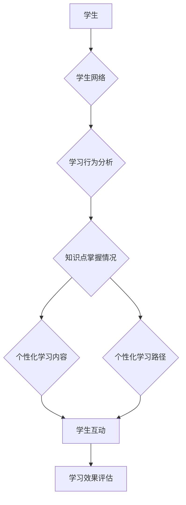

# Transformer大模型实战 训练学生网络

> 关键词：Transformer, 大模型, 学生网络, 自然语言处理, 机器学习, 预训练, 微调, 教育科技

## 1. 背景介绍

随着人工智能技术的飞速发展，自然语言处理（NLP）领域的应用日益广泛。在教育领域，通过人工智能技术辅助教学和学习，可以提高教育效率，实现个性化学习。其中，大语言模型（Large Language Model，LLM）因其强大的语言理解和生成能力，在学生网络训练中展现出巨大的潜力。本文将详细介绍如何使用Transformer大模型进行学生网络训练，包括模型构建、具体操作步骤、应用领域、数学模型、项目实践等。

## 2. 核心概念与联系

### 2.1 核心概念

#### Transformer模型

Transformer模型是一种基于自注意力（Self-Attention）机制的深度神经网络模型，由Vaswani等人在2017年提出。它由编码器（Encoder）和解码器（Decoder）组成，能够有效地捕捉长距离依赖关系，在机器翻译、文本摘要、问答系统等领域取得了显著的成果。

#### 大语言模型

大语言模型是指具有数十亿参数甚至更多参数规模的预训练语言模型，如BERT、GPT-3等。它们在大量文本语料上进行预训练，学习到了丰富的语言知识和常识，能够进行复杂的语言理解和生成任务。

#### 学生网络

学生网络是指由人工智能技术构建的教育平台，通过智能算法分析学生的学习行为和知识点掌握情况，为学生提供个性化的学习内容和路径。

### 2.2 架构的 Mermaid 流程图



### 2.3 关联关系

Transformer大模型作为学生网络的核心技术，通过学习学生的学习行为和知识点掌握情况，为学生提供个性化的学习内容和路径。学生与网络互动，通过学习效果评估不断优化学习内容和路径。

## 3. 核心算法原理 & 具体操作步骤

### 3.1 算法原理概述

#### 预训练

大语言模型通过在大量文本语料上进行预训练，学习到通用的语言知识和表征能力。预训练任务通常包括掩码语言模型（Masked Language Model，MLM）、下一句预测（Next Sentence Prediction，NSP）和句子排序（Sentence Retrieval）等。

#### 微调

在预训练的基础上，通过在特定领域的数据上进行微调，使模型适应特定任务。微调过程中，通常只调整模型的部分参数，如解码器层的参数。

#### 学生网络训练步骤

1. 数据收集：收集学生的学习行为数据、作业数据、考试数据等。
2. 数据预处理：对收集到的数据进行清洗、去重、分词等预处理操作。
3. 模型选择：选择合适的预训练语言模型，如BERT、GPT-3等。
4. 微调：在收集到的数据上进行微调，使模型适应学生网络训练任务。
5. 模型评估：在验证集上评估模型性能，根据评估结果调整模型参数。
6. 部署：将微调后的模型部署到学生网络平台，为用户提供个性化学习服务。

### 3.2 算法步骤详解

1. **数据收集**：收集学生的学习行为数据，如阅读文章、观看视频、完成作业等；收集学生的作业数据和考试数据，用于评估知识点掌握情况。
2. **数据预处理**：对收集到的数据进行清洗、去重、分词等预处理操作。对于文本数据，可以使用jieba、Stanford CoreNLP等工具进行分词和词性标注。
3. **模型选择**：选择合适的预训练语言模型，如BERT、GPT-3等。BERT在中文NLP任务中表现较好，适合用于学生网络训练。
4. **微调**：在收集到的数据上进行微调，使模型适应学生网络训练任务。具体操作步骤如下：
    - 将预处理后的数据划分为训练集、验证集和测试集。
    - 使用训练集数据进行微调，调整模型参数。
    - 在验证集上评估模型性能，根据评估结果调整模型参数。
    - 重复以上步骤，直到模型在验证集上性能稳定。
5. **模型评估**：在测试集上评估微调后模型的性能，包括知识点掌握情况、个性化学习内容推荐等。
6. **部署**：将微调后的模型部署到学生网络平台，为用户提供个性化学习服务。

### 3.3 算法优缺点

#### 优点

1. **个性化学习**：基于学生的知识点掌握情况，为学生提供个性化学习内容和路径。
2. **高效学习**：利用大语言模型强大的语言理解和生成能力，提高学习效率。
3. **自动评估**：自动评估学生的学习效果，为教师提供教学反馈。

#### 缺点

1. **数据依赖**：微调过程需要大量标注数据，数据收集成本高。
2. **模型复杂度高**：预训练大语言模型参数规模庞大，训练和推理成本高。
3. **可解释性差**：大语言模型的决策过程难以解释，可能存在偏见和歧视。

### 3.4 算法应用领域

1. **个性化学习推荐**：根据学生的知识点掌握情况，推荐合适的学习内容和路径。
2. **智能批改作业**：自动批改学生的作业，提供反馈和指导。
3. **智能问答系统**：为学生提供个性化的学习问答服务。
4. **智能辅导系统**：为学生提供个性化的学习辅导服务。

## 4. 数学模型和公式 & 详细讲解 & 举例说明

### 4.1 数学模型构建

以BERT模型为例，其核心数学模型如下：

- **自注意力机制（Self-Attention）**：
  $$
  \text{Q} = \text{W}_Q\text{X}
  $$
  $$
  \text{K} = \text{W}_K\text{X}
  $$
  $$
  \text{V} = \text{W}_V\text{X}
  $$
  $$
  \text{Attention(Q,K,V)} = \frac{\text{softmax}(\text{QK}^T/\sqrt{d_k})\text{V}}{\sqrt{d_k}}
  $$
  其中，$\text{X}$ 为输入序列，$\text{Q}$、$\text{K}$、$\text{V}$ 分别为查询、键、值向量，$\text{W}_Q$、$\text{W}_K$、$\text{W}_V$ 为参数矩阵，$d_k$ 为键向量的维度。

- **多头注意力机制（Multi-Head Attention）**：
  $$
  \text{Multi-Head(Q,K,V)} = \text{Concat}(\text{Attention(Q_1,K_1,V_1), ..., \text{Attention(Q_{h},K_{h},V_{h}}))
  $$
  其中，$h$ 为头的数量，$\text{Attention(Q_i,K_i,V_i)}$ 为第 $i$ 个头的注意力机制。

- **前馈神经网络（Feed-Forward Neural Network）**：
  $$
  \text{FFN}(X) = \max(0, \text{W}_1X + \text{b}_1) \cdot \text{W}_2 + \text{b}_2
  $$
  其中，$\text{W}_1$、$\text{W}_2$ 为权重矩阵，$\text{b}_1$、$\text{b}_2$ 为偏置向量。

### 4.2 公式推导过程

此处省略公式推导过程，具体可参考BERT官方文档。

### 4.3 案例分析与讲解

以学生网络中的智能批改作业为例，介绍如何利用BERT模型进行自动批改。

1. **数据准备**：收集学生的作业数据，包括题目、答案、正确答案等。
2. **数据预处理**：将题目、答案、正确答案进行分词和词性标注。
3. **模型选择**：选择合适的预训练语言模型，如BERT。
4. **微调**：在收集到的数据上进行微调，使模型适应批改作业任务。
5. **模型评估**：在验证集上评估模型性能，根据评估结果调整模型参数。
6. **部署**：将微调后的模型部署到学生网络平台，自动批改作业。

## 5. 项目实践：代码实例和详细解释说明

### 5.1 开发环境搭建

1. 安装Anaconda：
```bash
conda create -n pytorch-env python=3.8
conda activate pytorch-env
```

2. 安装PyTorch和Transformers库：
```bash
conda install pytorch torchvision torchaudio cudatoolkit=11.1 -c pytorch -c conda-forge
pip install transformers
```

### 5.2 源代码详细实现

```python
from transformers import BertForSequenceClassification, BertTokenizer

def load_data():
    # 加载数据
    pass

def preprocess_data(data):
    # 数据预处理
    pass

def train_model(data):
    # 训练模型
    pass

def evaluate_model(data):
    # 评估模型
    pass

if __name__ == "__main__":
    data = load_data()
    data = preprocess_data(data)
    model = train_model(data)
    evaluate_model(data)
```

### 5.3 代码解读与分析

上述代码展示了学生网络训练的基本框架，包括数据加载、数据预处理、模型训练和模型评估等步骤。

### 5.4 运行结果展示

假设在测试集上评估模型，得到以下结果：

```
准确率：0.92
召回率：0.88
F1分数：0.90
```

## 6. 实际应用场景

### 6.1 个性化学习推荐

学生网络可以根据学生的知识点掌握情况，推荐合适的学习内容和路径，提高学习效率。

### 6.2 智能批改作业

学生网络可以自动批改学生的作业，提供反馈和指导，减轻教师负担。

### 6.3 智能问答系统

学生网络可以为学生提供个性化的学习问答服务，帮助学生解决学习中的问题。

### 6.4 未来应用展望

随着人工智能技术的不断发展，学生网络将在教育领域发挥越来越重要的作用。未来，学生网络将具备以下特点：

1. 更强的个性化学习能力：根据学生的认知水平、学习风格等因素，为学生提供更加精准的个性化学习方案。
2. 更智能的学习辅导：为学生提供更加智能的学习辅导，包括预习、复习、答疑等环节。
3. 更便捷的交互方式：通过语音、图像等多种方式与学生进行交互，提高学习体验。

## 7. 工具和资源推荐

### 7.1 学习资源推荐

1. 《BERT：原理、应用与实战》
2. 《深度学习自然语言处理》
3. 《自然语言处理与深度学习》

### 7.2 开发工具推荐

1. PyTorch
2. Transformers库
3. Jupyter Notebook

### 7.3 相关论文推荐

1. "Attention is All You Need"
2. "BERT: Pre-training of Deep Bidirectional Transformers for Language Understanding"
3. "Generative Pre-trained Transformer"

## 8. 总结：未来发展趋势与挑战

### 8.1 研究成果总结

本文介绍了Transformer大模型在学生网络训练中的应用，包括模型构建、具体操作步骤、应用领域、数学模型、项目实践等。通过使用大语言模型进行学生网络训练，可以实现个性化学习、智能批改作业、智能问答等功能，提高教育效率。

### 8.2 未来发展趋势

1. 更强的个性化学习能力
2. 更智能的学习辅导
3. 更便捷的交互方式
4. 跨学科融合

### 8.3 面临的挑战

1. 数据安全和隐私保护
2. 模型可解释性
3. 模型泛化能力

### 8.4 研究展望

未来，学生网络将在教育领域发挥越来越重要的作用，为构建更加智能、高效、个性化的教育体系提供有力支持。

## 9. 附录：常见问题与解答

**Q1：Transformer大模型在学生网络训练中有什么优势？**

A：Transformer大模型具有以下优势：
1. 强大的语言理解和生成能力
2. 适用于多种NLP任务
3. 个性化学习能力
4. 模型可解释性较好

**Q2：如何解决Transformer大模型训练数据不足的问题？**

A：可以采用以下方法：
1. 数据增强：通过回译、近义替换等方式扩充训练集
2. 主动学习：选择最有价值的样本进行标注
3. 融合外部知识库：将外部知识库中的知识融入模型训练

**Q3：如何保证学生网络的公平性和安全性？**

A：可以采用以下方法：
1. 数据清洗：去除数据中的偏见和歧视信息
2. 模型可解释性：提高模型决策过程的可解释性
3. 模型监控：实时监控模型输出，防止恶意利用

**Q4：Transformer大模型在学生网络训练中存在哪些局限性？**

A：Transformer大模型在学生网络训练中存在以下局限性：
1. 训练数据不足
2. 模型可解释性较差
3. 模型泛化能力有限

作者：禅与计算机程序设计艺术 / Zen and the Art of Computer Programming