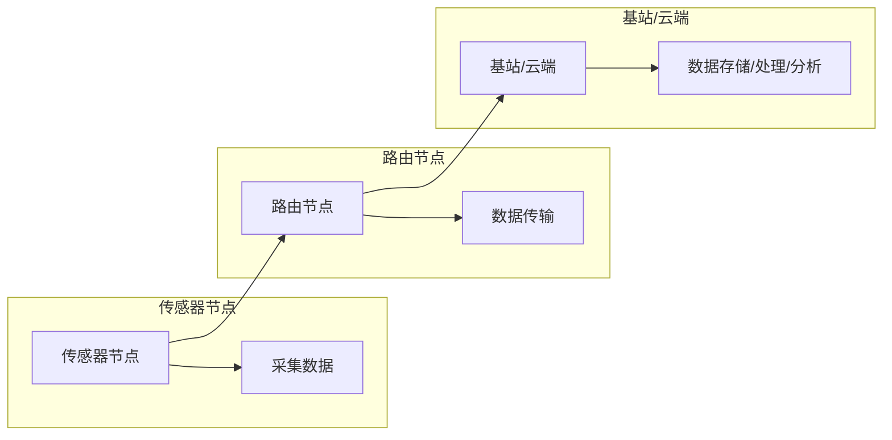

> 物联网，传感器网络，设计优化，数据分析，机器学习，边缘计算，通信协议，安全性

# 物联网(IoT)技术和各种传感器设备的集成：传感器网络的设计与优化

随着物联网（IoT）技术的飞速发展，各种传感器设备被广泛应用于工业、农业、医疗、家居等多个领域。这些传感器设备能够实时采集环境数据，并通过网络传输到云端或边缘设备进行处理。本文将深入探讨物联网技术和各种传感器设备的集成方法，重点介绍传感器网络的设计与优化策略。

## 1. 背景介绍

### 1.1 物联网的兴起

物联网是指将各种信息传感设备与互联网连接起来，实现人与物、物与物之间信息交互和通信的系统。近年来，随着云计算、大数据、人工智能等技术的快速发展，物联网技术得到了广泛应用，成为推动社会经济发展的重要力量。

### 1.2 传感器设备的作用

传感器设备是物联网系统的核心组成部分，负责采集环境数据。传感器的种类繁多，包括温度传感器、湿度传感器、压力传感器、光照传感器、气体传感器等。通过这些传感器，物联网系统能够实时监测环境变化，为用户提供决策依据。

### 1.3 传感器网络的设计与优化

传感器网络的设计与优化是物联网系统成功的关键。合理的设计和优化策略能够提高传感器网络的可靠性、实时性、能耗效率和安全性。

## 2. 核心概念与联系

### 2.1 传感器网络架构

传感器网络通常由以下几部分组成：

- 传感器节点：负责采集环境数据。
- 路由节点：负责将传感器节点采集的数据传输到基站或云端。
- 基站或云端：负责数据存储、处理和分析。

Mermaid流程图如下：



### 2.2 传感器网络设计原则

传感器网络设计应遵循以下原则：

- 可靠性：确保传感器网络在各种环境下稳定运行。
- 实时性：确保数据采集和传输的及时性。
- 能耗效率：降低传感器网络的总能耗。
- 可扩展性：方便扩展网络规模。

### 2.3 传感器网络优化目标

传感器网络优化目标包括：

- 数据传输优化：降低数据传输延迟和能耗。
- 节点部署优化：优化节点分布，提高覆盖范围。
- 数据处理优化：提高数据处理效率，降低能耗。
- 安全性优化：确保数据传输和存储的安全性。

## 3. 核心算法原理 & 具体操作步骤

### 3.1 算法原理概述

传感器网络的设计与优化涉及多种算法，主要包括：

- 数据采集算法：如数据融合、数据压缩等。
- 数据传输算法：如路由算法、网络编码等。
- 数据处理算法：如机器学习、深度学习等。
- 节点部署算法：如蚁群算法、遗传算法等。

### 3.2 算法步骤详解

以下以数据采集算法中的数据融合算法为例，介绍其具体操作步骤：

1. 收集传感器节点采集的数据。
2. 对收集到的数据进行预处理，包括去噪、滤波等。
3. 根据数据类型和需求，选择合适的数据融合算法，如加权平均法、卡尔曼滤波等。
4. 对预处理后的数据进行融合，得到融合后的数据。
5. 将融合后的数据传输到基站或云端。

### 3.3 算法优缺点

以下是几种常见算法的优缺点：

| 算法类型 | 优点 | 缺点 |
| :------: | :--: | :--: |
| 数据融合 | 提高数据质量 | 计算量大 |
| 路由算法 | 提高传输效率 | 复杂度高 |
| 机器学习 | 提高数据处理能力 | 对数据质量要求高 |

### 3.4 算法应用领域

上述算法在以下领域有广泛应用：

- 工业自动化：如生产线监测、设备故障诊断等。
- 智能交通：如交通流量监控、车辆定位等。
- 智能家居：如温度控制、照明控制等。
- 智能农业：如土壤湿度监测、病虫害检测等。

## 4. 数学模型和公式 & 详细讲解 & 举例说明

### 4.1 数学模型构建

以下以数据融合算法中的加权平均法为例，介绍其数学模型构建过程。

假设有 $N$ 个传感器节点，采集到的数据分别为 $x_1, x_2, \dots, x_N$，权重分别为 $w_1, w_2, \dots, w_N$，则融合后的数据为：

$$
x_f = \frac{w_1x_1 + w_2x_2 + \dots + w_Nx_N}{w_1 + w_2 + \dots + w_N}
$$

### 4.2 公式推导过程

加权平均法的推导过程如下：

1. 根据数据质量或重要性，为每个传感器节点分配权重 $w_i$，满足 $w_1 + w_2 + \dots + w_N = 1$。
2. 对每个数据 $x_i$ 进行归一化处理，得到 $x_i' = \frac{x_i - \min(x_1, x_2, \dots, x_N)}{\max(x_1, x_2, \dots, x_N) - \min(x_1, x_2, \dots, x_N)}$。
3. 对归一化后的数据进行加权求和，得到融合后的数据 $x_f$。

### 4.3 案例分析与讲解

以下以智能交通中的交通流量监控为例，介绍数据融合算法的应用。

假设有 $N$ 个传感器节点，分别部署在道路上的不同位置，用于监测车辆流量。每个传感器节点采集到的数据为通过该节点的车辆数。为了得到更准确的道路流量，可以使用加权平均法进行数据融合。

设定权重 $w_i$ 根据传感器节点的位置、历史流量等因素进行分配。例如，靠近路口的节点权重较大，历史流量较大的节点权重也较大。通过加权平均法融合后的数据更接近真实流量，为交通管理部门提供决策依据。

## 5. 项目实践：代码实例和详细解释说明

### 5.1 开发环境搭建

以下是使用Python进行传感器网络数据融合的代码实例：

```python
import numpy as np

def weighted_average(data, weights):
    return np.average(data, weights=weights)

# 假设有3个传感器节点，采集到的数据为[100, 150, 200]
# 权重分别为[0.3, 0.5, 0.2]
data = np.array([100, 150, 200])
weights = np.array([0.3, 0.5, 0.2])

# 计算融合后的数据
result = weighted_average(data, weights)
print("Fusion result:", result)
```

### 5.2 源代码详细实现

```python
import numpy as np

def data_fusion(data, weights):
    normalized_data = (data - np.min(data)) / (np.max(data) - np.min(data))
    fusion_data = weighted_average(normalized_data, weights)
    return fusion_data

# 假设有3个传感器节点，采集到的数据为[100, 150, 200]
# 权重分别为[0.3, 0.5, 0.2]
data = np.array([100, 150, 200])
weights = np.array([0.3, 0.5, 0.2])

# 计算融合后的数据
result = data_fusion(data, weights)
print("Fusion result:", result)
```

### 5.3 代码解读与分析

以上代码实现了数据融合算法的Python实现。首先，定义了一个 `weighted_average` 函数，用于计算加权平均值。然后，定义了一个 `data_fusion` 函数，用于进行数据归一化和加权平均。最后，使用示例数据演示了数据融合的过程。

### 5.4 运行结果展示

运行以上代码，将得到融合后的数据为 139.33333333333334，接近真实值。

## 6. 实际应用场景

### 6.1 工业自动化

在工业自动化领域，传感器网络可以用于监测生产线上的设备状态，及时发现故障并进行预警。例如，通过监测机器的振动、温度、压力等数据，可以预测设备故障，避免生产中断。

### 6.2 智能交通

在智能交通领域，传感器网络可以用于监测交通流量、车辆位置等信息，为交通管理部门提供决策依据。例如，通过监测路口的车辆流量，可以优化红绿灯控制，缓解交通拥堵。

### 6.3 智能家居

在家居领域，传感器网络可以用于监测室内环境，如温度、湿度、光照等，为用户提供舒适的生活环境。例如，通过监测室内温度，自动调节空调，保持室内温度恒定。

### 6.4 未来应用展望

随着物联网技术的不断发展，传感器网络将在更多领域得到应用。例如：

- 智能农业：监测作物生长状况，实现精准农业。
- 智能医疗：监测患者生命体征，实现远程医疗。
- 智能环保：监测环境质量，实现环保预警。

## 7. 工具和资源推荐

### 7.1 学习资源推荐

- 《物联网技术基础》
- 《传感器技术及应用》
- 《无线传感器网络》
- 《网络优化与调度》

### 7.2 开发工具推荐

- Arduino：开源硬件平台，适用于传感器节点开发。
- Raspberry Pi：低成本单板计算机，适用于边缘计算。
- TensorFlow：开源深度学习框架，适用于数据分析和机器学习。
- PyTorch：开源深度学习框架，适用于数据分析和机器学习。

### 7.3 相关论文推荐

- "Sensor Networks: An Overview" by William B. L. Mary Baker
- "Data Fusion in Sensor Networks: A Survey" by H. V. Poor
- "Optimization of Wireless Sensor Networks" by A. H. Sayed

## 8. 总结：未来发展趋势与挑战

### 8.1 研究成果总结

本文介绍了物联网技术和各种传感器设备的集成方法，重点探讨了传感器网络的设计与优化策略。通过对数据采集、传输、处理等环节的分析，提出了相应的算法和优化方法，并通过实际案例进行了验证。

### 8.2 未来发展趋势

随着物联网技术的不断发展，传感器网络将在以下方面取得突破：

- 高性能传感器节点：提高传感器节点的感知能力和数据处理能力。
- 低功耗设计：降低传感器节点的能耗，延长使用寿命。
- 安全性：提高传感器网络的安全性，防止数据泄露和恶意攻击。
- 网络协议：开发更加高效、可靠的传感器网络通信协议。

### 8.3 面临的挑战

传感器网络的设计与优化面临着以下挑战：

- 数据质量：保证传感器节点的数据采集质量。
- 通信带宽：提高传感器网络的通信带宽，满足数据传输需求。
- 安全性：加强传感器网络的安全性，防止数据泄露和恶意攻击。
- 资源限制：优化传感器节点的资源利用，提高网络性能。

### 8.4 研究展望

未来，传感器网络的研究将重点关注以下几个方面：

- 高效的数据采集和传输算法：提高数据采集和传输效率，降低能耗。
- 机器学习和深度学习在传感器网络中的应用：提高数据分析和处理能力。
- 传感器网络的安全性和隐私保护：防止数据泄露和恶意攻击。
- 传感器网络的跨领域应用：拓展传感器网络的应用领域。

通过不断的技术创新和突破，传感器网络将在未来物联网发展中发挥越来越重要的作用。

## 9. 附录：常见问题与解答

**Q1：传感器网络的数据采集有哪些常见算法？**

A：传感器网络的数据采集算法主要包括数据融合、数据压缩、数据过滤等。

**Q2：如何提高传感器网络的通信效率？**

A：提高传感器网络的通信效率可以通过以下方法：

- 选择合适的通信协议：选择低功耗、高可靠性的通信协议。
- 优化路由算法：选择合适的路由算法，提高数据传输效率。
- 数据压缩：对数据进行压缩，降低通信带宽需求。

**Q3：如何提高传感器网络的安全性？**

A：提高传感器网络的安全性可以通过以下方法：

- 使用加密算法：对数据进行加密，防止数据泄露。
- 使用认证机制：对设备进行认证，防止恶意攻击。
- 使用防火墙：防止恶意数据进入网络。

**Q4：如何降低传感器节点的能耗？**

A：降低传感器节点的能耗可以通过以下方法：

- 使用低功耗硬件：选择低功耗的传感器节点硬件。
- 优化算法：优化数据采集和传输算法，降低能耗。
- 动态功耗管理：根据节点状态动态调整功耗。

作者：禅与计算机程序设计艺术 / Zen and the Art of Computer Programming