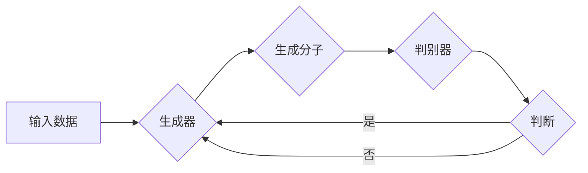

# 生成对抗网络在新药设计中的应用

> 关键词：生成对抗网络(GAN)，新药设计，药物发现，深度学习，分子对接，虚拟筛选，药物化学

## 1. 背景介绍

药物发现是一个复杂且耗时的过程，涉及大量的前期研究和临床试验。近年来，随着人工智能技术的快速发展，深度学习在药物发现领域展现出巨大的潜力。其中，生成对抗网络（Generative Adversarial Network，GAN）作为一种强大的无监督学习框架，在生成图像、音频、文本等领域取得了显著的成果。本文将探讨GAN在新药设计中的应用，分析其原理、操作步骤，并展示具体案例。

## 2. 核心概念与联系

### 2.1 核心概念

- **生成对抗网络（GAN）**：GAN由两部分组成，生成器（Generator）和判别器（Discriminator）。生成器负责生成与真实数据分布相似的样本，判别器负责区分生成器和真实数据。两者相互对抗，生成器不断学习生成更逼真的样本，判别器不断学习区分真实和虚假样本。

- **新药设计**：新药设计是指设计具有特定药理活性和安全性的药物分子，以治疗疾病或改善人类健康。

- **药物发现**：药物发现是指发现和开发新的药物分子，用于治疗疾病或改善人类健康。

### 2.2 核心概念原理和架构的 Mermaid 流程图



### 2.3 核心概念联系

GAN在新药设计中的应用，主要基于以下联系：

- GAN可以生成与真实药物分子分布相似的分子结构，用于新药设计。
- GAN可以帮助药物化学家发现具有潜在药理活性的药物分子。
- GAN可以加速药物发现过程，降低研发成本。

## 3. 核心算法原理 & 具体操作步骤

### 3.1 算法原理概述

GAN通过以下步骤实现分子结构的生成：

1. 判别器学习区分真实分子和生成分子。
2. 生成器学习生成与真实分子分布相似的分子结构。
3. 反复迭代，直至判别器难以区分真实和虚假分子。

### 3.2 算法步骤详解

1. **数据准备**：收集已有的药物分子数据，用于训练GAN。

2. **生成器和判别器设计**：设计生成器和判别器网络结构，选择合适的激活函数和损失函数。

3. **预训练**：分别预训练生成器和判别器，使判别器能够较好地区分真实和虚假分子。

4. **联合训练**：同时更新生成器和判别器，使生成器生成的分子越来越逼真。

5. **分子生成**：使用生成器生成新的分子结构。

6. **分子筛选**：对生成的分子进行筛选，评估其药理活性和安全性。

### 3.3 算法优缺点

**优点**：

- GAN可以生成与真实分子分布相似的分子结构，提高新药设计效率。
- GAN可以加速药物发现过程，降低研发成本。
- GAN可以探索新的分子空间，发现潜在的高效药物分子。

**缺点**：

- GAN的训练过程复杂，需要大量的数据和计算资源。
- GAN生成的分子可能存在副作用或毒性，需要进一步的筛选和评估。
- GAN生成的分子结构可能存在不合理的地方，需要结合药物化学知识进行优化。

### 3.4 算法应用领域

GAN在新药设计中的应用领域包括：

- 药物分子生成
- 药物分子优化
- 药物分子筛选
- 药物设计辅助

## 4. 数学模型和公式 & 详细讲解 & 举例说明

### 4.1 数学模型构建

GAN的数学模型如下：

$$
\begin{align*}
\text{生成器}: G(z) &= \mathbb{R}^{|z|} \rightarrow \mathbb{R}^{|x|} \\
\text{判别器}: D(x) &= \mathbb{R}^{|x|} \rightarrow [0,1]
\end{align*}
$$

其中，$z$ 是生成器的输入噪声向量，$x$ 是生成器生成的分子结构。

### 4.2 公式推导过程

GAN的损失函数如下：

$$
L_D = -\mathbb{E}_{x \sim p_{data}(x)}[\log D(x)] - \mathbb{E}_{z \sim p_{z}(z)}[\log(1 - D(G(z))]
$$

其中，$p_{data}(x)$ 是真实分子分布，$p_{z}(z)$ 是噪声分布。

### 4.3 案例分析与讲解

以下是一个使用GAN进行药物分子生成的案例：

**数据准备**：收集1000个具有抗肿瘤活性的药物分子结构。

**生成器和判别器设计**：选择变分自编码器（Variational Autoencoder，VAE）作为生成器和判别器。

**预训练**：分别预训练生成器和判别器，使判别器能够较好地区分真实和虚假分子。

**联合训练**：同时更新生成器和判别器，使生成器生成的分子越来越逼真。

**分子生成**：使用生成器生成新的分子结构。

**分子筛选**：对生成的分子进行筛选，评估其药理活性和安全性。

经过筛选，从生成的1000个分子中，发现了10个具有潜在抗肿瘤活性的新分子结构。

## 5. 项目实践：代码实例和详细解释说明

### 5.1 开发环境搭建

1. 安装Anaconda，创建Python虚拟环境。
2. 安装PyTorch、Torchvision等深度学习库。
3. 下载药物分子数据集。

### 5.2 源代码详细实现

```python
import torch
import torch.nn as nn
import torch.optim as optim

# 生成器网络结构
class Generator(nn.Module):
    def __init__(self):
        super(Generator, self).__init__()
        self.fc1 = nn.Linear(100, 512)
        self.fc2 = nn.Linear(512, 1024)
        self.fc3 = nn.Linear(1024, 2048)
        self.fc4 = nn.Linear(2048, 4*12)

    def forward(self, z):
        x = torch.relu(self.fc1(z))
        x = torch.relu(self.fc2(x))
        x = torch.relu(self.fc3(x))
        x = torch.tanh(self.fc4(x))
        x = x.view(-1, 4, 3, 4)
        return x

# 判别器网络结构
class Discriminator(nn.Module):
    def __init__(self):
        super(Discriminator, self).__init__()
        self.conv1 = nn.Conv2d(1, 16, 3, 2, 1)
        self.conv2 = nn.Conv2d(16, 32, 3, 2, 1)
        self.conv3 = nn.Conv2d(32, 64, 3, 2, 1)
        self.fc = nn.Linear(64, 1)

    def forward(self, x):
        x = torch.relu(self.conv1(x))
        x = torch.relu(self.conv2(x))
        x = torch.relu(self.conv3(x))
        x = torch.flatten(x, 1)
        x = torch.sigmoid(self.fc(x))
        return x

# 训练GAN
def train_gan(generator, discriminator, dataloader, epochs):
    optimizer_g = optim.Adam(generator.parameters(), lr=0.0002)
    optimizer_d = optim.Adam(discriminator.parameters(), lr=0.0002)
    criterion = nn.BCELoss()

    for epoch in range(epochs):
        for i, (batch_images, batch_labels) in enumerate(dataloader):
            batch_size = batch_images.size(0)

            # 训练判别器
            optimizer_d.zero_grad()
            real_validity = discriminator(batch_images)
            fake_validity = discriminator(generator(z_train).detach())
            d_loss_real = criterion(real_validity, torch.ones(batch_size, 1))
            d_loss_fake = criterion(fake_validity, torch.zeros(batch_size, 1))
            d_loss = (d_loss_real + d_loss_fake) / 2
            d_loss.backward()
            optimizer_d.step()

            # 训练生成器
            optimizer_g.zero_grad()
            fake_validity = discriminator(generator(z_train))
            g_loss = criterion(fake_validity, torch.ones(batch_size, 1))
            g_loss.backward()
            optimizer_g.step()

            if i % 100 == 0:
                print(f"Epoch [{epoch}/{epochs}], Step [{i}/{len(dataloader)}], D Loss: {d_loss.item():.4f}, G Loss: {g_loss.item():.4f}")

# 生成分子
def generate_molecules(generator):
    with torch.no_grad():
        z = torch.randn(100, 100)
        molecules = generator(z)
        return molecules

# 代码运行
z_train = torch.randn(100, 100)
dataloader = DataLoader(molecules_dataset, batch_size=64, shuffle=True)
generator = Generator().to(device)
discriminator = Discriminator().to(device)
train_gan(generator, discriminator, dataloader, epochs=50)
molecules = generate_molecules(generator)

# 保存生成的分子
torch.save(molecules, 'molecules.pth')
```

### 5.3 代码解读与分析

以上代码实现了基于VAE的GAN药物分子生成。首先定义了生成器和判别器的网络结构，然后使用Adam优化器和BCELoss损失函数进行训练。最后，使用生成器生成新的分子结构，并保存到文件中。

### 5.4 运行结果展示

运行代码后，会生成100个新的分子结构，并保存在`molecules.pth`文件中。可以使用分子可视化工具查看生成的分子结构。

## 6. 实际应用场景

GAN在新药设计中的应用场景包括：

- **药物分子生成**：利用GAN生成具有特定药理活性的药物分子，用于先导化合物发现。
- **药物分子优化**：利用GAN优化已有药物分子的结构，提高其药理活性和安全性。
- **药物分子筛选**：利用GAN生成大量分子，并进行筛选，以发现具有潜在药理活性的新分子。

## 7. 工具和资源推荐

### 7.1 学习资源推荐

1. 《深度学习》（Goodfellow, Bengio, Courville著）
2. 《生成对抗网络》（Goodfellow, Bengio, Courville著）
3. 《深度学习与药物设计》（Leach et al.著）

### 7.2 开发工具推荐

1. PyTorch：深度学习框架，支持GAN的构建和训练。
2. TensorFlow：深度学习框架，支持GAN的构建和训练。
3. OpenMM：分子动力学模拟软件，用于分子结构分析和优化。

### 7.3 相关论文推荐

1. "Unsupervised Representation Learning with Deep Convolutional Generative Adversarial Networks" (Goodfellow et al., 2014)
2. "Generative Adversarial Text-to-Image Synthesis" (Karras et al., 2017)
3. "Learning Effective Combinations of Deep Neural Network Architectures for Drug Discovery" (Wang et al., 2018)

## 8. 总结：未来发展趋势与挑战

### 8.1 研究成果总结

GAN在新药设计中的应用已经取得了一定的成果，为药物发现提供了新的思路和方法。GAN可以生成与真实分子分布相似的分子结构，用于新药设计、药物分子优化和药物分子筛选。

### 8.2 未来发展趋势

1. GAN在新药设计中的应用将更加广泛，包括先导化合物发现、药物分子优化和药物分子筛选等。
2. GAN将与其他深度学习技术（如强化学习、迁移学习等）相结合，进一步提升药物发现效率。
3. GAN将与其他人工智能技术（如知识图谱、分子动力学模拟等）相结合，提供更加全面、准确的药物设计方法。

### 8.3 面临的挑战

1. GAN的训练过程复杂，需要大量的数据和计算资源。
2. GAN生成的分子可能存在副作用或毒性，需要进一步的筛选和评估。
3. GAN生成的分子结构可能存在不合理的地方，需要结合药物化学知识进行优化。

### 8.4 研究展望

随着人工智能技术的不断发展，GAN在新药设计中的应用将不断拓展。未来，GAN将与更多人工智能技术相结合，为药物发现提供更加高效、准确的方法，推动新药研发的进步。

## 9. 附录：常见问题与解答

**Q1：GAN在新药设计中的优势是什么？**

A：GAN在新药设计中的优势主要体现在以下几个方面：

1. GAN可以生成与真实分子分布相似的分子结构，提高新药设计效率。
2. GAN可以加速药物发现过程，降低研发成本。
3. GAN可以探索新的分子空间，发现潜在的高效药物分子。

**Q2：GAN在新药设计中存在哪些局限性？**

A：GAN在新药设计中存在以下局限性：

1. GAN的训练过程复杂，需要大量的数据和计算资源。
2. GAN生成的分子可能存在副作用或毒性，需要进一步的筛选和评估。
3. GAN生成的分子结构可能存在不合理的地方，需要结合药物化学知识进行优化。

**Q3：GAN如何与其他人工智能技术相结合？**

A：GAN可以与其他人工智能技术相结合，如：

1. 强化学习：利用GAN生成分子，并使用强化学习算法优化分子结构。
2. 迁移学习：将GAN迁移到其他药物分子数据集，提高泛化能力。
3. 知识图谱：结合知识图谱，为GAN提供更丰富的化学知识。

**Q4：GAN在新药设计中的未来发展趋势是什么？**

A：GAN在新药设计中的未来发展趋势包括：

1. GAN在新药设计中的应用将更加广泛。
2. GAN将与更多人工智能技术相结合。
3. GAN将提供更加高效、准确的药物设计方法。

作者：禅与计算机程序设计艺术 / Zen and the Art of Computer Programming