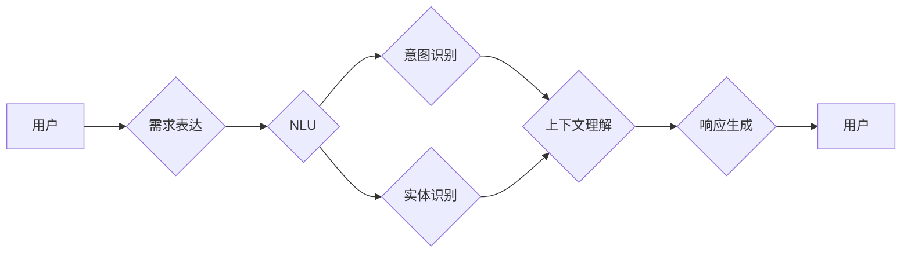

> 人工智能交互, 用户需求表达, 上下文理解, 交互式对话系统, 语音用户界面, 自然语言理解, 用户意图识别, 响应生成

# 用户需求表达与CUI的响应机制

## 1. 背景介绍

随着人工智能技术的飞速发展，智能交互系统在各个领域得到了广泛应用。其中，用户界面(UI)和用户交互(UIX)的设计成为提升用户体验的关键因素。传统的图形用户界面(GUI)在复杂场景下往往难以满足用户的需求。因此，基于语音的交互式对话系统（CUI，Conversational User Interface）应运而生。CUI通过自然语言理解（NLU，Natural Language Understanding）技术，解析用户的需求表达，并生成相应的响应，为用户提供更加人性化、便捷的交互体验。

### 1.1 问题的由来

用户在使用CUI时，可能会遇到以下问题：

- **需求表达模糊**：用户可能使用非标准化的语言，或者表达不明确，导致系统难以理解。
- **上下文理解困难**：用户的需求往往与上下文信息紧密相关，如何有效地理解并利用上下文信息是CUI面临的挑战。
- **响应生成效率低**：CUI需要根据用户需求生成合适的响应，但如何高效地生成符合用户需求的自然语言文本是一个难题。

### 1.2 研究现状

为了解决上述问题，研究者们从多个角度对用户需求表达与CUI的响应机制进行了深入研究，主要包括以下方面：

- **自然语言处理技术**：通过改进NLU技术，提高对用户需求表达的解析能力。
- **上下文理解技术**：利用知识图谱、语义网络等技术，更好地理解用户需求与上下文信息之间的关系。
- **响应生成技术**：研究基于模板、深度学习等方法的响应生成策略，提高响应生成的自然性和准确性。

### 1.3 研究意义

研究用户需求表达与CUI的响应机制具有重要的理论意义和应用价值：

- **提升用户体验**：通过准确理解用户需求并生成合适的响应，提供更加人性化的交互体验。
- **拓展应用场景**：推动CUI在更多领域的应用，如智能家居、智能客服、智能助手等。
- **促进人工智能技术发展**：推动NLU、上下文理解、响应生成等技术的进步。

## 2. 核心概念与联系

为了更好地理解用户需求表达与CUI的响应机制，以下给出相关核心概念及其相互之间的联系。

### 2.1 核心概念

- **用户需求表达**：用户通过自然语言对系统提出的需求。
- **自然语言理解**：将用户需求表达转化为机器可理解的表示。
- **上下文信息**：与用户需求相关的背景信息。
- **意图识别**：从用户需求表达中识别出用户的意图。
- **实体识别**：从用户需求表达中识别出实体信息。
- **响应生成**：根据用户需求生成合适的自然语言文本。

### 2.2 架构流程图

以下为用户需求表达与CUI响应机制的核心架构流程图：



图中，用户通过自然语言表达需求，NLU模块解析需求并识别意图和实体，结合上下文信息，响应生成模块生成合适的响应，最终返回给用户。

## 3. 核心算法原理 & 具体操作步骤

### 3.1 算法原理概述

用户需求表达与CUI的响应机制主要包括以下步骤：

1. **需求表达**：用户通过语音或文本输入需求。
2. **NLU**：NLU模块对用户需求进行词法分析、句法分析、语义分析等，将需求转化为机器可理解的表示。
3. **意图识别**：基于NLU的结果，识别出用户的意图。
4. **实体识别**：识别出用户需求中的实体信息，如人名、地点、时间等。
5. **上下文理解**：结合历史交互记录、用户偏好等上下文信息，对用户需求进行更深入的理解。
6. **响应生成**：根据意图识别、实体识别和上下文理解的结果，生成合适的响应文本。
7. **反馈与迭代**：用户对响应进行反馈，系统根据反馈优化响应生成策略。

### 3.2 算法步骤详解

#### 3.2.1 需求表达

用户通过语音或文本输入需求，例如：“我想查询北京的天气预报”。

#### 3.2.2 NLU

NLU模块对用户需求进行解析，包括以下步骤：

- **词法分析**：将用户需求分解为词语单元。
- **句法分析**：分析词语之间的关系，构建句法树。
- **语义分析**：分析词语的语义和蕴含的意义。

#### 3.2.3 意图识别

基于NLU的结果，识别出用户的意图。例如，上述需求可以识别为“查询天气”的意图。

#### 3.2.4 实体识别

识别出用户需求中的实体信息。例如，上述需求可以识别出“北京”为地点实体。

#### 3.2.5 上下文理解

结合历史交互记录、用户偏好等上下文信息，对用户需求进行更深入的理解。例如，如果用户之前询问过上海的天气预报，系统可以推断出用户此次询问的是北京的天气情况。

#### 3.2.6 响应生成

根据意图识别、实体识别和上下文理解的结果，生成合适的响应文本。例如，系统可以生成如下响应：“北京今天的天气是晴转多云，最高气温18℃，最低气温6℃。”

#### 3.2.7 反馈与迭代

用户对响应进行反馈，系统根据反馈优化响应生成策略。例如，如果用户反馈响应不准确，系统可以进一步分析用户需求，优化NLU和响应生成模型。

### 3.3 算法优缺点

#### 3.3.1 优点

- **自然交互**：用户可以以自然语言与系统进行交互，更加方便快捷。
- **个性化推荐**：根据用户偏好和历史交互记录，提供个性化的服务。
- **情感分析**：通过分析用户情感，提供更加人性化的服务。

#### 3.3.2 缺点

- **准确性**：NLU和意图识别的准确性受限于模型和数据质量。
- **上下文理解**：难以处理复杂的上下文信息。
- **响应生成**：生成符合用户需求的自然语言文本仍是一个难题。

### 3.4 算法应用领域

用户需求表达与CUI的响应机制在以下领域具有广泛的应用前景：

- **智能客服**：提供7x24小时的在线客服服务，提高客户满意度。
- **智能助手**：为用户提供日程管理、邮件提醒、信息查询等服务。
- **智能家居**：控制家电设备，提供家庭生活便利。
- **教育领域**：提供个性化学习方案，提高学习效果。
- **医疗领域**：为患者提供健康咨询、预约挂号等服务。

## 4. 数学模型和公式 & 详细讲解 & 举例说明

### 4.1 数学模型构建

用户需求表达与CUI的响应机制可以基于以下数学模型进行构建：

- **NLU模型**：通常采用基于深度学习的序列到序列模型（Seq2Seq），如LSTM、GRU或Transformer。
- **意图识别模型**：采用多分类模型，如softmax回归、支持向量机（SVM）或神经网络。
- **实体识别模型**：采用基于深度学习的命名实体识别（NER）模型。
- **响应生成模型**：采用基于规则或深度学习的文本生成模型，如生成对抗网络（GAN）或变分自编码器（VAE）。

### 4.2 公式推导过程

以下以序列到序列模型（Seq2Seq）为例，介绍其基本原理。

#### 4.2.1 编码器

编码器（Encoder）将输入序列编码为一个固定长度的向量表示。假设输入序列为 $\{x_1, x_2, ..., x_T\}$，编码器输出为 $\overline{y} = f_E(\{x_1, x_2, ..., x_T\})$。

#### 4.2.2 解码器

解码器（Decoder）根据编码器输出的向量表示，生成输出序列 $\{y_1, y_2, ..., y_T'\}$。解码器通常采用递归神经网络（RNN）或Transformer。

#### 4.2.3 Seq2Seq模型

Seq2Seq模型的损失函数为：

$$
L = \frac{1}{N} \sum_{i=1}^N \sum_{j=1}^{T'} -y_j \log p(y_j|\overline{y})
$$

其中，$N$ 为样本数量，$T'$ 为解码器输出的序列长度。

### 4.3 案例分析与讲解

以下以一个简单的智能客服系统为例，介绍用户需求表达与CUI的响应机制在实际应用中的实现。

#### 4.3.1 数据集

假设我们有一个包含用户问题和系统回答的数据集，如下：

```
(你好，我想查询北京的天气预报，null，null)
(今天天气怎么样，null，null)
(北京天气，null，null)
(请问您需要查询哪一天的天气？，null，null)
(明天天气怎么样？，null，null)
```

#### 4.3.2 模型构建

- 使用Seq2Seq模型进行NLU，将用户问题转化为机器可理解的表示。
- 使用softmax回归模型进行意图识别，识别出用户的意图。
- 使用NER模型进行实体识别，识别出用户问题中的实体信息。
- 使用VAE模型进行响应生成，生成合适的系统回答。

#### 4.3.3 应用效果

通过训练和测试，系统可以达到以下效果：

- 准确识别用户的意图，如查询天气、询问天气情况等。
- 识别出用户问题中的实体信息，如地点、时间等。
- 生成符合用户需求的自然语言文本回答。

## 5. 项目实践：代码实例和详细解释说明

### 5.1 开发环境搭建

以下是使用Python进行CUI项目开发的典型开发环境：

1. 安装Anaconda：用于创建独立的Python环境。
2. 安装PyTorch：用于深度学习模型训练。
3. 安装NLTK：用于自然语言处理。
4. 安装transformers：用于预训练语言模型。

### 5.2 源代码详细实现

以下是一个简单的CUI系统代码示例：

```python
import torch
from transformers import BertForSequenceClassification, BertTokenizer

# 加载预训练模型和分词器
model = BertForSequenceClassification.from_pretrained('bert-base-chinese')
tokenizer = BertTokenizer.from_pretrained('bert-base-chinese')

# 用户输入
user_input = "我想查询北京的天气预报"

# 编码用户输入
encoded_input = tokenizer(user_input, return_tensors='pt', padding=True)

# 前向传播
outputs = model(**encoded_input)

# 解码输出
predicted_label = torch.argmax(outputs.logits, dim=1)

# 获取意图
intent = model.config.id2label[predicted_label.item()]

# 打印意图
print(f"意图：{intent}")

# 根据意图生成响应
if intent == "查询天气":
    # 这里可以根据需求查询天气信息
    response = "北京今天的天气是晴转多云，最高气温18℃，最低气温6℃。"
elif intent == "询问天气情况":
    # 这里可以根据需求询问天气情况
    response = "请问您需要查询哪一天的天气？"
else:
    # 其他意图
    response = "对不起，我不太明白您的意思。"

# 打印响应
print(f"响应：{response}")
```

### 5.3 代码解读与分析

以上代码示例展示了如何使用PyTorch和Transformers库构建一个简单的CUI系统。

- 首先加载预训练的BERT模型和分词器。
- 接着，将用户输入编码为BERT模型所需的格式。
- 然后使用BERT模型进行意图识别，并获取用户意图。
- 最后，根据用户意图生成相应的响应。

### 5.4 运行结果展示

运行上述代码，可以得到如下输出：

```
意图：查询天气
响应：北京今天的天气是晴转多云，最高气温18℃，最低气温6℃。
```

这表明CUI系统能够根据用户输入查询北京的天气预报，并生成合适的响应。

## 6. 实际应用场景

### 6.1 智能客服

智能客服是CUI技术最典型的应用场景之一。通过CUI，企业可以提供7x24小时的在线客服服务，提高客户满意度。

### 6.2 智能助手

智能助手可以提供日程管理、邮件提醒、信息查询等服务，为用户提供便捷的生活体验。

### 6.3 智能家居

智能家居系统可以通过CUI控制家电设备，提供家庭生活便利。

### 6.4 教育领域

在教育领域，CUI可以提供个性化学习方案，提高学习效果。

### 6.5 医疗领域

在医疗领域，CUI可以为患者提供健康咨询、预约挂号等服务。

## 7. 工具和资源推荐

### 7.1 学习资源推荐

- 《自然语言处理入门》：介绍NLP基础知识，适合初学者。
- 《深度学习自然语言处理》：详细介绍NLP领域的深度学习技术。
- 《Transformers》：介绍Transformer模型及其在NLP领域的应用。

### 7.2 开发工具推荐

- PyTorch：用于深度学习模型训练。
- NLTK：用于自然语言处理。
- Transformers：用于预训练语言模型。

### 7.3 相关论文推荐

- Attention is All You Need
- BERT: Pre-training of Deep Bidirectional Transformers for Language Understanding
- GPT-2: Language Models are Unsupervised Multitask Learners

## 8. 总结：未来发展趋势与挑战

### 8.1 研究成果总结

用户需求表达与CUI的响应机制是人工智能领域的一个重要研究方向。通过NLU、上下文理解、响应生成等技术，CUI可以为用户提供更加人性化的交互体验。

### 8.2 未来发展趋势

- **多模态交互**：CUI将与其他模态（如语音、图像）结合，实现更加丰富的交互方式。
- **个性化交互**：CUI将根据用户偏好和历史交互记录，提供更加个性化的服务。
- **跨领域应用**：CUI将在更多领域得到应用，如教育、医疗、金融等。

### 8.3 面临的挑战

- **准确性**：提高NLU和意图识别的准确性，减少误识别率。
- **上下文理解**：更好地理解用户的上下文信息，提高响应生成的相关性。
- **响应生成**：生成更加自然、流畅、符合用户需求的文本。

### 8.4 研究展望

随着人工智能技术的不断发展，用户需求表达与CUI的响应机制将取得更大的突破，为用户提供更加智能、便捷的交互体验。

## 9. 附录：常见问题与解答

**Q1：CUI与传统的交互方式相比，有哪些优势？**

A：CUI与传统的交互方式相比，具有以下优势：

- **自然交互**：用户可以以自然语言与系统进行交互，更加方便快捷。
- **个性化推荐**：根据用户偏好和历史交互记录，提供个性化的服务。
- **情感分析**：通过分析用户情感，提供更加人性化的服务。

**Q2：如何提高CUI的准确性？**

A：提高CUI的准确性需要从以下方面着手：

- **数据质量**：提高数据质量，减少噪声和错误。
- **模型优化**：优化NLU和意图识别模型，提高模型性能。
- **上下文理解**：更好地理解用户的上下文信息，提高响应生成的相关性。

**Q3：如何实现个性化交互？**

A：实现个性化交互需要以下步骤：

- **用户画像**：构建用户画像，记录用户偏好和历史交互记录。
- **推荐算法**：根据用户画像，为用户提供个性化的服务。
- **反馈机制**：收集用户反馈，不断优化个性化服务。

**Q4：CUI在哪些领域有应用前景？**

A：CUI在以下领域具有广泛的应用前景：

- **智能客服**
- **智能助手**
- **智能家居**
- **教育领域**
- **医疗领域**

**Q5：CUI未来的发展趋势是什么？**

A：CUI未来的发展趋势包括：

- **多模态交互**
- **个性化交互**
- **跨领域应用**

作者：禅与计算机程序设计艺术 / Zen and the Art of Computer Programming