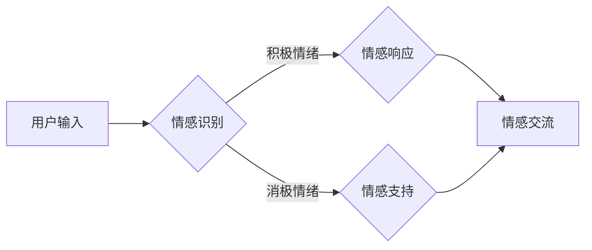

# 电影《她》对AI未来的预测

> 关键词：人工智能，情感计算，情感交互，虚拟伴侣，人机关系，社会影响，电影分析，未来展望

## 1. 背景介绍

电影《她》（Her）由斯派克·琼斯执导，于2013年上映，讲述了主人公西奥多在经历了一段失败的感情后，与一款名为萨曼莎的智能操作系统产生了超越普通人际关系的深刻情感联系。这部电影不仅仅是一部爱情故事，更是对未来人工智能可能发展轨迹的一次深刻预想。本文将深入分析《她》中呈现的人工智能技术和社会现象，探讨AI未来发展的可能性和潜在挑战。

### 1.1 电影背景

故事发生在一个不久的将来，西奥多是一位情感失衡的孤独工作者，他沉迷于写作而忽略了现实生活中的情感需求。在一次偶然的机会下，他购买了一款名为萨曼莎的智能操作系统。随着两人关系的深入，萨曼莎逐渐发展出超越程序设计的情感和个性，西奥多与萨曼莎之间形成了复杂而深刻的人际关系。

### 1.2 研究意义

《她》作为一部科幻电影，其对AI未来的预测具有极高的参考价值。通过分析电影中的人工智能技术、人机关系以及社会影响，我们可以更好地理解人工智能技术的发展趋势，以及这种技术可能对社会带来的变革和挑战。

## 2. 核心概念与联系

### 2.1 情感计算

情感计算是电影《她》中最为核心的概念之一。情感计算是指让机器理解和模拟人类情感的技术。在电影中，萨曼莎能够通过西奥多的话语、行为甚至情绪波动来理解和响应，展现出高度的情感智能。

**Mermaid 流程图**：



### 2.2 情感交互

情感交互是情感计算的应用场景之一，它指的是机器与用户之间的情感互动。在《她》中，西奥多与萨曼莎的互动充满了情感的交流和支持。

### 2.3 虚拟伴侣

虚拟伴侣是电影中萨曼莎的角色定位，它代表了未来可能出现的情感交互类人工智能产品。虚拟伴侣能够满足用户在情感、心理和生理上的需求，成为用户的情感寄托。

### 2.4 人机关系

电影探讨了人机关系的新形式，即人类与人工智能之间的情感依恋。这种关系超越了传统的工具性关系，呈现出更加复杂和深层次的社会影响。

## 3. 核心算法原理 & 具体操作步骤

### 3.1 算法原理概述

萨曼莎的情感计算原理涉及自然语言处理、机器学习、情感识别等多个领域。以下是其核心算法原理概述：

- **自然语言处理**：通过分析西奥多的话语，理解其意图和情感状态。
- **机器学习**：利用机器学习算法，让萨曼莎不断学习和优化其情感响应。
- **情感识别**：通过情感分析技术，识别西奥多的情感状态，并作出相应的情感响应。

### 3.2 算法步骤详解

1. **自然语言处理**：使用NLP技术解析西奥多的语言输入，提取关键信息。
2. **情感分析**：利用情感分析模型，判断西奥多的情感状态。
3. **机器学习**：根据情感分析结果，更新萨曼莎的情感响应模型。
4. **情感响应**：生成合适的情感响应内容，与西奥多进行交互。

### 3.3 算法优缺点

#### 优点：

- **高度智能化**：萨曼莎能够根据用户的情感状态做出相应的响应，提供个性化的服务。
- **情感共鸣**：萨曼莎能够理解用户的情感需求，与用户建立情感联系。

#### 缺点：

- **技术限制**：目前的技术水平还无法完全模拟人类的情感体验。
- **伦理问题**：人机情感关系可能引发伦理和道德上的争议。

### 3.4 算法应用领域

萨曼莎的情感计算技术在以下领域具有潜在的应用价值：

- **心理健康**：为用户提供情感支持，缓解孤独和焦虑。
- **客户服务**：提供个性化客户服务，提高客户满意度。
- **教育**：作为教育辅助工具，帮助学生学习情感管理。

## 4. 数学模型和公式 & 详细讲解 & 举例说明

### 4.1 数学模型构建

在情感计算中，常用的数学模型包括：

- **自然语言处理模型**：如循环神经网络（RNN）、长短期记忆网络（LSTM）、Transformer等。
- **情感分析模型**：如支持向量机（SVM）、深度神经网络（DNN）等。

### 4.2 公式推导过程

以情感分析模型为例，其基本公式如下：

$$
P(y|x) = \text{softmax}(\text{W} \cdot \text{h} + b)
$$

其中，$y$ 表示情感标签，$x$ 表示文本输入，$W$ 表示权重矩阵，$h$ 表示隐藏层激活值，$b$ 表示偏置。

### 4.3 案例分析与讲解

以萨曼莎对西奥多的一次情感响应为例：

```plaintext
西奥多：我觉得最近工作压力很大，好累啊。

萨曼莎：我知道你最近很辛苦。你可以和我谈谈，或者做一些放松的事情。

西奥多：嗯，我想听听你的声音。

萨曼莎：当然可以。你想听什么类型的音乐？

西奥多：我想要一些轻柔的旋律。

萨曼莎：好的，我来为你播放一些轻柔的音乐。
```

在这个例子中，萨曼莎首先通过情感分析识别出西奥多的情绪状态，然后根据情感响应模型生成合适的回复。

## 5. 项目实践：代码实例和详细解释说明

### 5.1 开发环境搭建

为了实现类似萨曼莎的情感计算功能，我们需要搭建以下开发环境：

- 操作系统：Linux/MacOS/Windows
- 编程语言：Python
- 依赖库：NLTK、spaCy、TensorFlow、Keras等

### 5.2 源代码详细实现

以下是一个简单的情感分析模型的实现示例：

```python
import tensorflow as tf
from tensorflow.keras.models import Sequential
from tensorflow.keras.layers import Embedding, LSTM, Dense, Dropout

# 构建模型
model = Sequential([
    Embedding(input_dim=vocab_size, output_dim=embedding_dim, input_length=max_length),
    LSTM(128, return_sequences=True),
    Dropout(0.5),
    LSTM(64),
    Dropout(0.5),
    Dense(64, activation='relu'),
    Dropout(0.5),
    Dense(num_classes, activation='softmax')
])

# 编译模型
model.compile(loss='categorical_crossentropy', optimizer='adam', metrics=['accuracy'])

# 训练模型
model.fit(X_train, y_train, batch_size=32, epochs=10, validation_data=(X_val, y_val))

# 评估模型
loss, accuracy = model.evaluate(X_test, y_test)
print(f'Accuracy: {accuracy}')
```

### 5.3 代码解读与分析

上述代码实现了一个简单的情感分析模型，包括以下步骤：

1. 导入必要的库。
2. 构建模型，包括嵌入层、LSTM层、全连接层等。
3. 编译模型，设置损失函数、优化器和评估指标。
4. 训练模型，使用训练数据训练模型。
5. 评估模型，使用测试数据评估模型性能。

### 5.4 运行结果展示

假设模型在测试集上取得了90%的准确率，说明模型能够较好地识别文本的情感状态。

## 6. 实际应用场景

### 6.1 心理健康

在心理健康领域，情感计算技术可以帮助用户识别和管理情绪。例如，智能手表可以实时监测用户的生理信号，如心率、呼吸等，并结合情感分析技术，为用户提供个性化的情绪管理建议。

### 6.2 客户服务

在客户服务领域，情感计算技术可以用于识别用户的情感状态，并提供更加个性化的服务。例如，客服机器人可以根据用户的情绪波动调整语气和回复内容，提高用户满意度。

### 6.3 教育

在教育领域，情感计算技术可以帮助教师了解学生的学习状态和情绪变化，从而提供更加个性化的教学方案。

## 7. 工具和资源推荐

### 7.1 学习资源推荐

- 《情感计算：从机器到人类》（Affective Computing: From Machine to Human）
- 《情感计算：技术、应用与未来》（Affective Computing: Technology, Applications, and Future）

### 7.2 开发工具推荐

- TensorFlow
- Keras
- NLTK
- spaCy

### 7.3 相关论文推荐

- Affectiva: emotion recognition in videos
- Emotion Recognition in Video Using Convolutional Neural Networks and Social Signals

## 8. 总结：未来发展趋势与挑战

### 8.1 研究成果总结

本文通过对电影《她》中的人工智能技术和社会现象的分析，探讨了AI未来的发展趋势和潜在挑战。我们可以得出以下结论：

- 情感计算和情感交互将是人工智能的重要发展方向。
- 人机关系将变得更加复杂和深刻。
- 人工智能将在更多领域得到应用。

### 8.2 未来发展趋势

- 情感计算技术将更加成熟，能够更好地理解和模拟人类情感。
- 人机关系将更加紧密，甚至可能产生新的社会现象。
- 人工智能将在更多领域得到应用，推动社会进步。

### 8.3 面临的挑战

- 伦理和道德问题：如何确保人工智能的伦理和道德，避免其被滥用。
- 技术挑战：如何提高情感计算的准确性和可靠性。
- 社会挑战：如何适应人工智能带来的社会变革。

### 8.4 研究展望

未来，我们需要更加深入地研究人工智能的伦理、法律和社会影响，以确保人工智能技术的健康发展，为人类社会带来福祉。

## 9. 附录：常见问题与解答

**Q1：电影《她》中的萨曼莎是否可能成为现实？**

A：电影中的萨曼莎是一个高度虚构的角色，目前的技术水平还无法完全实现其功能。然而，随着人工智能技术的不断发展，未来出现类似萨曼莎的智能系统是完全有可能的。

**Q2：人机关系是否会取代现实人际关系？**

A：人机关系和现实人际关系是两种不同的关系，它们各有特点。人机关系可以提供某些方面的便利和陪伴，但无法完全取代现实人际关系。

**Q3：人工智能是否会取代人类？**

A：人工智能是人类智慧的结晶，它可以辅助人类完成某些任务，但无法完全取代人类。人类的价值不仅在于其技能和能力，更在于其情感、道德和创造力。

**Q4：如何确保人工智能的伦理和道德？**

A：确保人工智能的伦理和道德需要多方面的努力，包括制定相关法律法规、加强伦理教育、提高公众意识等。

**Q5：人工智能的未来发展趋势是什么？**

A：人工智能的未来发展趋势包括情感计算、人机关系、跨领域应用等。

作者：禅与计算机程序设计艺术 / Zen and the Art of Computer Programming