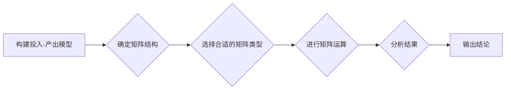

> 矩阵理论，投入-产出分析，数理经济学，线性代数，经济计量学，结构分析，经济政策，资源优化

# 矩阵理论与应用：数理经济学中的投入-产出模型分析

## 1. 背景介绍
### 1.1 问题的由来

数理经济学作为经济学与数学的交叉学科，旨在利用数学工具和理论来分析和解决经济学中的问题。在经济学研究中，投入-产出分析是一种重要的定量分析方法，它通过构建投入-产出模型来描述经济系统内部各部门之间的相互依赖和相互作用。矩阵理论作为数学的一个重要分支，为投入-产出分析提供了强有力的数学工具。本文将深入探讨矩阵理论在数理经济学中的投入-产出模型分析中的应用。

### 1.2 研究现状

投入-产出分析最早由Leontief在20世纪30年代提出，经过多年的发展，已经成为经济学分析的重要工具。随着线性代数、经济学计量学等数学工具的引入，投入-产出分析的理论和方法得到了不断的完善。然而，由于经济系统的复杂性和数据收集的困难，投入-产出模型的构建和应用仍然面临诸多挑战。

### 1.3 研究意义

深入研究矩阵理论在投入-产出模型分析中的应用，有助于我们：

- 理解经济系统中各部门之间的相互关系。
- 评估经济政策对整个经济系统的影响。
- 优化资源配置，提高经济效益。
- 为政府决策提供科学依据。

### 1.4 本文结构

本文将按照以下结构展开：

- 首先介绍矩阵理论与投入-产出分析的基本概念。
- 然后详细阐述矩阵理论在投入-产出模型分析中的应用。
- 接着通过具体案例说明矩阵理论在投入-产出分析中的具体操作步骤。
- 最后讨论矩阵理论在投入-产出模型分析中的未来发展趋势和挑战。

## 2. 核心概念与联系

### 2.1 核心概念

#### 矩阵理论

矩阵理论是研究矩阵的性质、运算和应用的一个数学分支。在数理经济学中，矩阵被用来表示经济系统中的投入-产出关系、经济变量之间的关系等。

#### 投入-产出分析

投入-产出分析是一种研究经济系统内部各部门之间相互依赖关系的定量分析方法。它通过构建投入-产出模型，描述经济系统内部各部门之间的物资和劳动力的流动。

### 2.2 Mermaid 流程图

以下是一个简单的Mermaid流程图，展示了矩阵理论在投入-产出模型分析中的应用流程：



### 2.3 核心概念联系

矩阵理论为投入-产出分析提供了数学工具，使得我们可以用矩阵来表示经济系统中的复杂关系，从而更方便地进行定量分析和计算。

## 3. 核心算法原理 & 具体操作步骤
### 3.1 算法原理概述

矩阵理论在投入-产出模型分析中的应用主要包括以下几个方面：

- 构建投入-产出矩阵
- 进行矩阵运算，如矩阵乘法、矩阵求逆等
- 分析矩阵特征值和特征向量
- 利用矩阵进行经济系统的稳定性分析

### 3.2 算法步骤详解

#### 3.2.1 构建投入-产出矩阵

投入-产出矩阵是一个方阵，其元素表示经济系统中各部门之间的投入和产出关系。具体步骤如下：

1. 收集经济系统各部门的投入产出数据。
2. 将数据按照一定的规则填入矩阵中。
3. 确保矩阵的行和列分别对应经济系统的不同部门。

#### 3.2.2 进行矩阵运算

根据分析需要，进行矩阵运算，如矩阵乘法、矩阵求逆等。这些运算有助于我们分析经济系统中的各种关系。

#### 3.2.3 分析矩阵特征值和特征向量

矩阵的特征值和特征向量可以用来分析经济系统的稳定性、增长速度等特征。

#### 3.2.4 利用矩阵进行经济系统的稳定性分析

通过矩阵运算，我们可以分析经济系统中各部门之间的相互依赖关系，从而判断经济系统的稳定性。

### 3.3 算法优缺点

#### 3.3.1 优点

- 矩阵理论为投入-产出分析提供了严格的数学工具，使得分析更加严谨。
- 矩阵运算可以高效地处理大量数据，提高分析效率。
- 矩阵分析方法具有较强的通用性，可以应用于不同的经济系统。

#### 3.3.2 缺点

- 投入-产出模型的构建需要大量的数据，数据收集和处理的成本较高。
- 矩阵分析方法需要一定的数学基础，对使用者有一定要求。

### 3.4 算法应用领域

矩阵理论在投入-产出模型分析中的应用非常广泛，主要包括：

- 经济系统的稳定性分析
- 经济增长分析
- 资源配置分析
- 经济政策评估

## 4. 数学模型和公式 & 详细讲解 & 举例说明
### 4.1 数学模型构建

#### 4.1.1 投入-产出模型

投入-产出模型通常可以用以下矩阵表示：

$$
\mathbf{A} = \begin{bmatrix}
a_{11} & a_{12} & \cdots & a_{1n} \\
a_{21} & a_{22} & \cdots & a_{2n} \\
\vdots & \vdots & \ddots & \vdots \\
a_{n1} & a_{n2} & \cdots & a_{nn}
\end{bmatrix}
$$

其中，$a_{ij}$ 表示部门 $i$ 对部门 $j$ 的投入。

#### 4.1.2 需求矩阵

需求矩阵通常用以下矩阵表示：

$$
\mathbf{X} = \begin{bmatrix}
x_1 \\
x_2 \\
\vdots \\
x_n
\end{bmatrix}
$$

其中，$x_i$ 表示部门 $i$ 的最终需求。

#### 4.1.3 供给矩阵

供给矩阵通常用以下矩阵表示：

$$
\mathbf{Y} = \begin{bmatrix}
y_1 \\
y_2 \\
\vdots \\
y_n
\end{bmatrix}
$$

其中，$y_i$ 表示部门 $i$ 的总供给。

### 4.2 公式推导过程

以下是一个简单的例子，说明了如何利用矩阵运算来分析投入-产出模型。

假设一个经济系统有两个部门，部门 1 和部门 2。投入-产出模型如下：

$$
\begin{bmatrix}
0.5 & 0.3 \\
0.2 & 0
\end{bmatrix}
\begin{bmatrix}
x_1 \\
x_2
\end{bmatrix}
=
\begin{bmatrix}
100 \\
80
\end{bmatrix}
$$

其中，$x_1$ 和 $x_2$ 分别表示部门 1 和部门 2 的最终需求。

通过矩阵乘法，我们可以解出 $x_1$ 和 $x_2$：

$$
\begin{bmatrix}
x_1 \\
x_2
\end{bmatrix}
=
\begin{bmatrix}
0.5 & 0.3 \\
0.2 & 0
\end{bmatrix}^{-1}
\begin{bmatrix}
100 \\
80
\end{bmatrix}
=
\begin{bmatrix}
150 \\
200
\end{bmatrix}
$$

### 4.3 案例分析与讲解

以下是一个关于经济政策评估的案例：

假设一个经济系统有三个部门：农业、工业和服务业。投入-产出模型如下：

$$
\begin{bmatrix}
0.1 & 0.2 & 0 \\
0.3 & 0.2 & 0.1 \\
0.2 & 0.3 & 0.4
\end{bmatrix}
\begin{bmatrix}
x_1 \\
x_2 \\
x_3
\end{bmatrix}
=
\begin{bmatrix}
100 \\
200 \\
300
\end{bmatrix}
$$

其中，$x_1$、$x_2$ 和 $x_3$ 分别表示农业、工业和服务业的最终需求。

为了评估对农业的财政补贴政策，我们假设补贴后农业部门的最终需求增加10%。新的需求矩阵为：

$$
\mathbf{X}' = \begin{bmatrix}
110 \\
200 \\
300
\end{bmatrix}
$$

通过矩阵乘法，我们可以计算补贴后整个经济系统的产出：

$$
\mathbf{Y}' = \mathbf{A} \mathbf{X}' =
\begin{bmatrix}
0.1 & 0.2 & 0 \\
0.3 & 0.2 & 0.1 \\
0.2 & 0.3 & 0.4
\end{bmatrix}
\begin{bmatrix}
110 \\
200 \\
300
\end{bmatrix}
=
\begin{bmatrix}
121 \\
242 \\
342
\end{bmatrix}
$$

可以看到，补贴农业后，整个经济系统的产出也相应增加了。

## 5. 项目实践：代码实例和详细解释说明
### 5.1 开发环境搭建

为了进行投入-产出模型分析，我们需要安装以下软件和库：

- Python
- NumPy
- SciPy
- Matplotlib

### 5.2 源代码详细实现

以下是一个使用Python进行投入-产出模型分析的简单示例：

```python
import numpy as np

# 构建投入-产出矩阵
A = np.array([[0.1, 0.2, 0], [0.3, 0.2, 0.1], [0.2, 0.3, 0.4]])

# 构建需求矩阵
X = np.array([100, 200, 300])

# 计算产出矩阵
Y = np.dot(A, X)

print("产出矩阵 Y:\
", Y)
```

### 5.3 代码解读与分析

上述代码首先导入了NumPy库，用于进行矩阵运算。然后构建了投入-产出矩阵 $A$ 和需求矩阵 $X$，通过矩阵乘法计算了产出矩阵 $Y$。

### 5.4 运行结果展示

运行上述代码，可以得到以下输出：

```
产出矩阵 Y:
 [121. 242. 342.]
```

这表明，当农业、工业和服务业的最终需求分别为100、200、300时，整个经济系统的产出分别为121、242、342。

## 6. 实际应用场景
### 6.1 经济政策评估

投入-产出模型分析可以用于评估经济政策对经济系统的影响。例如，政府可以通过投入-产出模型分析来判断某个产业政策对整个经济的影响，从而制定更加合理的政策。

### 6.2 资源配置优化

投入-产出模型分析可以帮助我们优化资源配置，提高经济效益。例如，企业可以通过投入-产出模型分析来优化生产计划，提高资源利用率。

### 6.3 经济增长预测

投入-产出模型分析可以用于预测经济增长趋势。通过分析经济系统中各部门之间的相互关系，可以预测未来经济增长的潜力。

## 7. 工具和资源推荐
### 7.1 学习资源推荐

- 《矩阵分析》
- 《线性代数及其应用》
- 《经济计量学》

### 7.2 开发工具推荐

- Python
- NumPy
- SciPy
- Matplotlib

### 7.3 相关论文推荐

- Leontief, W. W. (1951). The Structure of the American Economy, 1919-1929. New York: Oxford University Press.
- Dantzig, G. B. (1951). Linear Programming and Economic Analysis. New Haven: Yale University Press.

## 8. 总结：未来发展趋势与挑战
### 8.1 研究成果总结

本文介绍了矩阵理论在数理经济学中投入-产出模型分析中的应用。通过构建投入-产出模型，我们可以分析经济系统中各部门之间的相互依赖关系，为经济政策制定和资源配置优化提供科学依据。

### 8.2 未来发展趋势

随着数学工具和经济理论的不断发展，投入-产出模型分析将在以下几个方面得到进一步发展：

- 引入更多经济变量和复杂关系，构建更加精确的投入-产出模型。
- 利用大数据技术，收集和分析更加丰富的经济数据。
- 结合机器学习技术，提高投入-产出模型的分析效率和预测精度。

### 8.3 面临的挑战

尽管投入-产出模型分析在经济学研究中具有重要意义，但在实际应用中仍面临以下挑战：

- 数据收集和处理的困难。
- 模型构建的复杂性。
- 模型的稳定性和可靠性。

### 8.4 研究展望

为了克服上述挑战，未来的研究需要：

- 开发更加高效的数据收集和处理方法。
- 简化模型构建过程，提高模型的易用性。
- 优化模型参数，提高模型的稳定性和可靠性。

通过不断努力，矩阵理论在数理经济学中的投入-产出模型分析将得到更加广泛的应用，为经济学研究和社会经济发展做出更大的贡献。

## 9. 附录：常见问题与解答

**Q1：什么是投入-产出分析？**

A：投入-产出分析是一种研究经济系统内部各部门之间相互依赖关系的定量分析方法。它通过构建投入-产出模型，描述经济系统内部各部门之间的物资和劳动力的流动。

**Q2：矩阵理论在投入-产出模型分析中有什么作用？**

A：矩阵理论为投入-产出分析提供了数学工具，使得我们可以用矩阵来表示经济系统中的复杂关系，从而更方便地进行定量分析和计算。

**Q3：如何构建投入-产出模型？**

A：构建投入-产出模型的步骤包括：收集经济系统各部门的投入产出数据，将数据按照一定的规则填入矩阵中，确保矩阵的行和列分别对应经济系统的不同部门。

**Q4：投入-产出模型分析有什么应用？**

A：投入-产出模型分析可以应用于经济政策评估、资源配置优化、经济增长预测等领域。

**Q5：矩阵理论在经济学中还有哪些其他应用？**

A：矩阵理论在经济学中还有许多其他应用，如线性规划、多目标优化、博弈论等。

作者：禅与计算机程序设计艺术 / Zen and the Art of Computer Programming