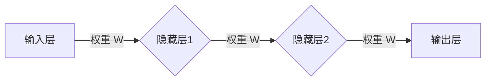

# 神经网络：AI 吞噬软件的引擎

> 关键词：神经网络，深度学习，机器学习，人工智能，深度神经网络，卷积神经网络，递归神经网络，强化学习，监督学习，无监督学习

## 1. 背景介绍

人工智能（AI）的兴起，为计算机科学和软件工程领域带来了革命性的变革。其中，神经网络作为AI的核心组成部分，已经从理论走向实践，成为了软件开发的引擎。本文将深入探讨神经网络的原理、应用和发展趋势，揭示其如何吞噬软件的引擎，并展望其未来的挑战与机遇。

## 2. 核心概念与联系

### 2.1 神经网络基础

神经网络是一种模仿人脑神经元结构和功能的计算模型。它由大量的节点（或称为神经元）组成，每个节点都与相邻的节点通过连接（或称为突触）相连接。神经元的激活状态通过这些连接传递，形成复杂的决策和模式识别能力。



### 2.2 深度学习与机器学习

深度学习是神经网络的一种形式，它通过多层的非线性变换来提取和表示数据中的复杂特征。机器学习则是更广泛的概念，包括深度学习在内的各种算法，用于从数据中学习并做出预测或决策。

### 2.3 神经网络与AI

神经网络是AI的核心技术之一，它使得机器能够从数据中学习，进行模式识别、图像识别、语音识别、自然语言处理等复杂任务。

## 3. 核心算法原理 & 具体操作步骤

### 3.1 算法原理概述

神经网络的原理基于以下核心概念：

- **激活函数**：用于决定一个神经元的激活状态（激活或不激活）。
- **前向传播**：数据从输入层流向输出层的计算过程。
- **反向传播**：根据损失函数计算梯度，用于更新网络权重和偏置。
- **优化器**：用于调整网络权重和偏置的算法，如梯度下降、Adam等。

### 3.2 算法步骤详解

1. **初始化**：随机初始化网络权重和偏置。
2. **前向传播**：输入数据通过网络进行计算，输出预测结果。
3. **计算损失**：使用损失函数计算预测结果与真实值之间的差异。
4. **反向传播**：计算损失函数关于网络权重的梯度。
5. **更新权重**：使用优化器更新网络权重和偏置。
6. **迭代**：重复步骤2-5，直到满足停止条件（如损失收敛）。

### 3.3 算法优缺点

#### 优点

- **强大的模式识别能力**：能够从数据中学习复杂的特征和模式。
- **泛化能力**：能够泛化到未见过的数据。
- **自动特征提取**：无需人工设计特征。

#### 缺点

- **计算复杂度高**：需要大量的计算资源和时间。
- **数据需求量大**：需要大量的训练数据。
- **可解释性差**：难以解释模型的决策过程。

### 3.4 算法应用领域

神经网络在以下领域有着广泛的应用：

- **计算机视觉**：图像识别、物体检测、图像分割等。
- **语音识别**：语音转文字、语音合成等。
- **自然语言处理**：文本分类、情感分析、机器翻译等。
- **强化学习**：游戏、机器人控制、自动驾驶等。

## 4. 数学模型和公式 & 详细讲解 & 举例说明

### 4.1 数学模型构建

神经网络的数学模型主要由以下部分组成：

- **神经元激活函数**：通常为Sigmoid、ReLU、Tanh等。
- **权重和偏置**：用于控制神经元之间的连接强度。
- **损失函数**：用于评估模型的性能，如交叉熵损失、均方误差等。

### 4.2 公式推导过程

以下是一个简单的神经网络激活函数和损失函数的公式推导过程：

#### 激活函数：Sigmoid

$$
f(x) = \frac{1}{1+e^{-x}}
$$

#### 损失函数：交叉熵

$$
L(y,\hat{y}) = -\sum_{i=1}^{N} y_i \log(\hat{y}_i)
$$

### 4.3 案例分析与讲解

以下是一个简单的神经网络在图像分类任务上的案例：

- **数据集**：使用CIFAR-10数据集，包含10个类别的60,000张32x32彩色图像。
- **模型**：使用一个简单的卷积神经网络，包含几个卷积层和全连接层。
- **训练**：使用交叉熵损失函数和Adam优化器进行训练。
- **结果**：在测试集上取得了不错的分类准确率。

## 5. 项目实践：代码实例和详细解释说明

### 5.1 开发环境搭建

- **Python**：使用Python进行神经网络开发。
- **TensorFlow**：使用TensorFlow框架构建和训练神经网络。
- **Keras**：使用Keras库简化TensorFlow的使用。

### 5.2 源代码详细实现

以下是一个简单的卷积神经网络在图像分类任务上的代码实现：

```python
import tensorflow as tf
from tensorflow.keras.models import Sequential
from tensorflow.keras.layers import Conv2D, MaxPooling2D, Flatten, Dense

model = Sequential([
    Conv2D(32, (3, 3), activation='relu', input_shape=(32, 32, 3)),
    MaxPooling2D((2, 2)),
    Flatten(),
    Dense(64, activation='relu'),
    Dense(10, activation='softmax')
])

model.compile(optimizer='adam', loss='categorical_crossentropy', metrics=['accuracy'])

# 训练模型
model.fit(x_train, y_train, epochs=10, validation_data=(x_test, y_test))
```

### 5.3 代码解读与分析

以上代码实现了一个简单的卷积神经网络，用于分类CIFAR-10数据集。

- `Conv2D`：卷积层，用于提取图像特征。
- `MaxPooling2D`：池化层，用于降低特征空间维度。
- `Flatten`：展平层，将特征空间展平为一维向量。
- `Dense`：全连接层，用于分类。

## 6. 实际应用场景

神经网络在以下领域有着广泛的应用：

- **图像识别**：识别图片中的物体、场景等。
- **语音识别**：将语音转换为文字。
- **自然语言处理**：进行文本分类、情感分析、机器翻译等。
- **医疗诊断**：辅助医生进行疾病诊断。
- **金融分析**：预测股票市场走势、信用评分等。

### 6.4 未来应用展望

随着神经网络的不断发展，其在更多领域的应用前景广阔：

- **自动驾驶**：实现无人驾驶技术。
- **机器人**：赋予机器人更强的感知和决策能力。
- **医疗健康**：提高疾病诊断的准确性和效率。
- **教育**：个性化教育，提高学习效果。

## 7. 工具和资源推荐

### 7.1 学习资源推荐

- **《深度学习》**：Goodfellow等著，深度学习的经典教材。
- **TensorFlow官方文档**：TensorFlow官方文档，提供详细的教程和API文档。
- **Keras官方文档**：Keras官方文档，提供Keras的教程和API文档。

### 7.2 开发工具推荐

- **Jupyter Notebook**：交互式计算环境，方便进行数据分析和实验。
- **TensorBoard**：TensorFlow的可视化工具，用于监控模型训练过程。
- **Google Colab**：免费的在线计算平台，提供GPU和TPU资源。

### 7.3 相关论文推荐

- **“A Few Useful Things to Know about Machine Learning”**：Goodfellow等著，介绍机器学习的基本概念和最佳实践。
- **“Deep Learning”**：Goodfellow等著，深度学习的经典教材。
- **“ImageNet Classification with Deep Convolutional Neural Networks”**：Alex Krizhevsky等著，介绍了深度神经网络在图像识别任务上的应用。

## 8. 总结：未来发展趋势与挑战

### 8.1 研究成果总结

神经网络作为一种强大的AI技术，已经在多个领域取得了显著的成果。随着技术的不断发展，神经网络在更多领域的应用前景广阔。

### 8.2 未来发展趋势

- **更强大的模型**：研究更复杂的神经网络模型，提高模型的性能。
- **更高效的学习算法**：研究更高效的学习算法，降低模型的训练时间。
- **更轻量级的模型**：研究更轻量级的模型，降低模型的计算资源需求。

### 8.3 面临的挑战

- **数据隐私**：如何保护用户数据隐私是一个重要挑战。
- **模型可解释性**：如何提高模型的可解释性是一个重要挑战。
- **算法公平性**：如何确保算法的公平性是一个重要挑战。

### 8.4 研究展望

神经网络作为AI的核心技术之一，将在未来发挥越来越重要的作用。随着技术的不断发展和创新，神经网络将在更多领域得到应用，为人类社会带来更多福祉。

## 9. 附录：常见问题与解答

### 9.1 问题1：什么是神经网络？

A：神经网络是一种模仿人脑神经元结构和功能的计算模型。它由大量的节点（或称为神经元）组成，每个节点都与相邻的节点通过连接（或称为突触）相连接。神经元的激活状态通过这些连接传递，形成复杂的决策和模式识别能力。

### 9.2 问题2：神经网络如何工作？

A：神经网络通过前向传播和反向传播来工作。在前向传播过程中，输入数据通过网络进行计算，输出预测结果。在反向传播过程中，根据损失函数计算梯度，用于更新网络权重和偏置。

### 9.3 问题3：神经网络有哪些应用？

A：神经网络在多个领域有着广泛的应用，如计算机视觉、语音识别、自然语言处理、医疗诊断、金融分析等。

### 9.4 问题4：神经网络有哪些局限性？

A：神经网络的主要局限性包括计算复杂度高、数据需求量大、可解释性差等。

### 9.5 问题5：神经网络未来的发展趋势是什么？

A：神经网络未来的发展趋势包括更强大的模型、更高效的学习算法、更轻量级的模型等。

作者：禅与计算机程序设计艺术 / Zen and the Art of Computer Programming