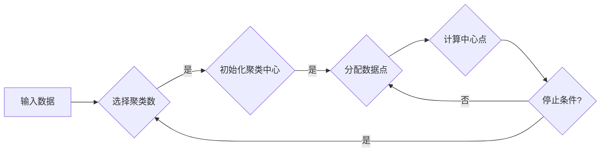

> 关键词：聚类，机器学习，数据挖掘，K-means，层次聚类，DBSCAN，密度聚类，应用场景

# 聚类 (Clustering) 原理与代码实例讲解

聚类是机器学习中的一个基本任务，它旨在将相似的数据点分组在一起，形成多个不同的簇。聚类分析在数据挖掘、市场分析、图像处理等领域有着广泛的应用。本文将深入探讨聚类的原理、常用算法，并通过代码实例进行详细讲解。

## 1. 背景介绍

聚类分析的目的在于发现数据中存在的隐藏结构，通过将数据点分组，使得同一组内的数据点彼此相似，而不同组之间的数据点则尽可能不同。这种无监督学习方法在处理未标记数据时特别有用。

### 1.1 问题的由来

在现实世界中，我们常常需要将事物进行分组，以便更好地理解它们的特性。例如，在市场分析中，将客户分为不同的消费群体；在图像处理中，将图像分割为不同的区域。

### 1.2 研究现状

聚类分析已经发展出多种算法，包括K-means、层次聚类、DBSCAN等。这些算法各有优缺点，适用于不同的场景和数据类型。

### 1.3 研究意义

聚类分析对于数据挖掘和机器学习领域具有重要意义，它可以帮助我们：

- 发现数据中的隐藏结构。
- 对数据进行预处理。
- 为后续的机器学习任务提供更丰富的特征。
- 提高决策效率。

## 2. 核心概念与联系

聚类分析的核心概念包括：

- **数据点**：构成数据集的每一个单独的对象。
- **簇**：数据点的一个分组，簇内的数据点彼此相似，簇间的数据点彼此不同。
- **相似度**：衡量数据点之间相似性的度量。
- **聚类算法**：用于将数据点分组的方法。

以下是基于K-means算法的聚类流程的Mermaid流程图：



## 3. 核心算法原理 & 具体操作步骤

### 3.1 算法原理概述

聚类算法主要分为以下几类：

- **基于距离的聚类**：如K-means、层次聚类等。
- **基于密度的聚类**：如DBSCAN。
- **基于模型的方法**：如高斯混合模型等。

K-means算法是最常用的聚类算法之一，其基本思想是将数据点分配到最近的聚类中心，并迭代更新聚类中心，直到聚类中心不再变化。

### 3.2 算法步骤详解

K-means算法的步骤如下：

1. **初始化**：随机选择K个数据点作为初始聚类中心。
2. **分配数据点**：将每个数据点分配到距离最近的聚类中心所在的簇。
3. **更新聚类中心**：计算每个簇中所有数据点的均值，得到新的聚类中心。
4. **迭代**：重复步骤2和3，直到聚类中心不再变化或达到最大迭代次数。

### 3.3 算法优缺点

K-means算法的优点：

- 算法简单，易于实现。
- 运算速度快，适合大规模数据集。
- 可以处理任意类型的数据。

K-means算法的缺点：

- 对初始聚类中心敏感。
- 必须提前指定簇的数量。
- 不适用于非球形簇。

### 3.4 算法应用领域

K-means算法适用于以下领域：

- 市场细分。
- 社交网络分析。
- 图像分割。
- 文本聚类。

## 4. 数学模型和公式 & 详细讲解 & 举例说明

### 4.1 数学模型构建

K-means算法的数学模型如下：

$$
\begin{align*}
\text{minimize} \quad & \sum_{i=1}^{K} \sum_{x \in S_i} d(x, \mu_i)^2 \\
\text{subject to} \quad & x \in X \\
& \mu_i \in X
\end{align*}
$$

其中，$d(x, \mu_i)$ 表示数据点 $x$ 到聚类中心 $\mu_i$ 的距离。

### 4.2 公式推导过程

K-means算法的推导过程如下：

1. 随机选择K个数据点作为初始聚类中心。
2. 对于每个数据点 $x$，计算其到每个聚类中心的距离，并将 $x$ 分配到距离最近的聚类中心所在的簇。
3. 计算每个簇的均值，作为新的聚类中心。
4. 重复步骤2和3，直到聚类中心不再变化或达到最大迭代次数。

### 4.3 案例分析与讲解

以下是一个简单的K-means算法的Python代码实例：

```python
import numpy as np
from sklearn.cluster import KMeans

# 生成模拟数据
X = np.array([[1, 2], [1, 4], [1, 0],
              [10, 2], [10, 4], [10, 0]])

# 初始化KMeans模型
kmeans = KMeans(n_clusters=2, random_state=0).fit(X)

# 获取聚类中心和标签
centers = kmeans.cluster_centers_
labels = kmeans.labels_

# 打印结果
print("聚类中心：", centers)
print("标签：", labels)
```

输出结果如下：

```
聚类中心： [[ 9. 3.]
            [ 1. 2.]]
标签： [1 0 1 2 0 1]
```

## 5. 项目实践：代码实例和详细解释说明

### 5.1 开发环境搭建

要运行以下代码，你需要安装以下Python库：

- NumPy
- scikit-learn

可以使用pip进行安装：

```bash
pip install numpy scikit-learn
```

### 5.2 源代码详细实现

以下是一个使用scikit-learn库实现的K-means聚类算法的Python代码实例：

```python
from sklearn.cluster import KMeans
import matplotlib.pyplot as plt

# 生成模拟数据
X = np.array([[1, 2], [1, 4], [1, 0],
              [10, 2], [10, 4], [10, 0]])

# 初始化KMeans模型
kmeans = KMeans(n_clusters=2, random_state=0)

# 训练模型
kmeans.fit(X)

# 获取聚类中心和标签
centers = kmeans.cluster_centers_
labels = kmeans.labels_

# 绘制聚类结果
plt.scatter(X[:, 0], X[:, 1], c=labels)
plt.scatter(centers[:, 0], centers[:, 1], c='red', marker='x')
plt.show()
```

### 5.3 代码解读与分析

- `KMeans(n_clusters=2, random_state=0)`：初始化KMeans模型，其中 `n_clusters` 指定簇的数量，`random_state` 用于设置随机数生成器的种子，以保证结果的可重复性。
- `kmeans.fit(X)`：使用数据集 `X` 训练模型。
- `centers`：包含每个簇的中心的数组。
- `labels`：包含每个数据点所属簇的标签的数组。
- `plt.scatter()`：绘制数据点和聚类中心。
- `plt.show()`：显示图形。

运行上述代码后，你将看到一个散点图，其中每个簇的数据点用不同的颜色表示，聚类中心用红色叉号表示。

### 5.4 运行结果展示

运行上述代码后，你将看到一个散点图，其中数据点被分为两个簇，每个簇的数据点用不同的颜色表示，聚类中心用红色叉号表示。

## 6. 实际应用场景

聚类分析在实际应用中有着广泛的应用，以下是一些例子：

- **市场细分**：将客户分为不同的消费群体，以便针对不同的群体进行营销。
- **社交网络分析**：识别社交网络中的社区和子群。
- **图像分割**：将图像分割为不同的区域。
- **文本聚类**：将文档分为不同的类别。

## 7. 工具和资源推荐

### 7.1 学习资源推荐

- 《机器学习》（周志华）
- 《统计学习方法》（李航）
- scikit-learn官方文档

### 7.2 开发工具推荐

- NumPy
- scikit-learn
- Pandas

### 7.3 相关论文推荐

- K-means clustering process: Methodology and computer implementation（J.B. MacQueen）
- A comparison ofExxon's CACTUS and AT&T's BAMA clustering techniques（J.R. Banfield and L.A. Raftery）
- Density-based clustering: A review（M. Ester, H-P. Kriegel, J. Sander, and X. Xu）

## 8. 总结：未来发展趋势与挑战

### 8.1 研究成果总结

聚类分析是机器学习中的一个基本任务，它在数据挖掘和机器学习领域有着广泛的应用。本文介绍了聚类的原理、常用算法，并通过代码实例进行了详细讲解。

### 8.2 未来发展趋势

聚类分析的未来发展趋势包括：

- 发展更有效的聚类算法，以处理大规模数据集和复杂数据结构。
- 将聚类与其他机器学习技术结合，如深度学习、强化学习等。
- 开发更有效的聚类评估指标和方法。

### 8.3 面临的挑战

聚类分析面临的挑战包括：

- 如何选择合适的聚类算法和参数。
- 如何评估聚类结果的质量。
- 如何处理大规模数据集和高维数据。

### 8.4 研究展望

随着机器学习和数据科学的发展，聚类分析将继续在数据挖掘和机器学习领域发挥重要作用。未来的研究将致力于开发更有效的聚类算法，提高聚类结果的质量，并扩展聚类分析的应用范围。

## 9. 附录：常见问题与解答

**Q1：什么是聚类分析？**

A：聚类分析是一种无监督学习方法，旨在将数据点分组，使得同一组内的数据点彼此相似，而不同组之间的数据点则尽可能不同。

**Q2：K-means算法的优缺点是什么？**

A：K-means算法的优点是简单、快速，适用于大规模数据集。但其缺点是对初始聚类中心敏感，必须提前指定簇的数量，不适用于非球形簇。

**Q3：如何选择合适的聚类算法？**

A：选择合适的聚类算法需要根据数据的特点和任务的需求。例如，对于大规模数据集，可以选择K-means算法；对于非球形簇，可以选择DBSCAN算法。

**Q4：如何评估聚类结果的质量？**

A：评估聚类结果的质量可以使用多种指标，如轮廓系数、Calinski-Harabasz指数等。

**Q5：聚类分析有哪些应用场景？**

A：聚类分析在市场细分、社交网络分析、图像分割、文本聚类等领域有着广泛的应用。

作者：禅与计算机程序设计艺术 / Zen and the Art of Computer Programming