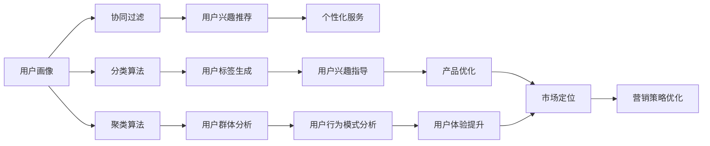

                 

# 用户画像的构建与优化实践

## 1. 背景介绍

### 1.1 问题由来
在互联网时代，用户画像（User Persona）成为了连接用户与产品的重要桥梁。用户画像通常是指通过分析用户的历史行为数据、社交网络、购买记录等，构建出一个具体、可操作的虚拟用户角色。用户画像能够帮助企业更精准地理解用户需求，优化产品设计，提升用户体验，最终实现业务增长。

随着互联网数据的爆炸性增长，构建一个全面、准确的“虚拟用户”变得越来越复杂。传统的用户画像构建方法主要依赖专家经验，通过线下问卷调查、人工访谈等方式获取信息。但这种方法的局限性显而易见：数据收集成本高、获取的信息不够全面、信息更新周期长。在数字化时代，数据驱动的机器学习算法开始被广泛应用，用户画像的构建进入了一个全新的阶段。

### 1.2 问题核心关键点
用户画像的构建与优化，本质上是将用户数据转化为有价值的用户信息的过程。这个过程需要综合应用数据分析、机器学习等技术手段，以发现数据背后的规律和趋势，生成具有代表性的虚拟用户画像。该过程可以细分为以下几个关键步骤：

- 数据收集：从各类渠道获取用户行为数据，如网站访问记录、应用使用日志、社交网络互动信息等。
- 数据清洗：对数据进行预处理，包括去重、异常值检测、缺失值填补等，保证数据的完整性和一致性。
- 特征工程：从原始数据中提取有意义的特征，以供后续建模使用。
- 用户建模：使用机器学习算法构建用户模型，如协同过滤、分类、聚类等，生成虚拟用户画像。
- 模型优化：对用户模型进行调优，提升模型的泛化能力和准确性。
- 画像分析：对生成的用户画像进行分析和解释，指导实际产品设计和营销策略。

目前，用户画像在电商、社交、广告等领域得到了广泛应用，成为了企业决策的重要参考依据。但同时，构建高质量的用户画像也面临诸多挑战，如数据隐私保护、模型鲁棒性、画像解释性等。因此，如何高效、准确地构建用户画像，是当前数据科学和人工智能领域的重要研究课题。

### 1.3 问题研究意义
用户画像的构建与优化，对于提升企业市场竞争力、优化用户体验、推动产品创新具有重要意义：

1. **精准定位市场**：用户画像能够帮助企业准确了解目标用户群体，避免盲目推广，提升广告投放效果。
2. **个性化服务**：基于用户画像，企业可以提供更加个性化的产品和服务，提升用户满意度和忠诚度。
3. **用户体验优化**：通过分析用户画像，企业能够及时发现产品设计中的问题，优化用户体验。
4. **营销策略优化**：用户画像为制定更加科学合理的营销策略提供了依据，有助于提升营销效果。
5. **竞争优势增强**：高效、准确的用户画像，使企业能够更好地把握市场动向，领先竞争对手。

## 2. 核心概念与联系

### 2.1 核心概念概述

在构建和优化用户画像的过程中，涉及多个关键概念，包括但不限于：

- **用户画像（User Persona）**：通过分析用户数据，构建出一个虚拟的、典型的用户角色，用于指导产品设计和市场策略。
- **协同过滤（Collaborative Filtering）**：通过分析用户行为数据，发现用户间的相似性，推荐用户可能感兴趣的商品或内容。
- **分类算法（Classification）**：将用户行为数据分类，生成用户标签，帮助企业了解用户兴趣和偏好。
- **聚类算法（Clustering）**：将用户行为数据聚类，生成用户群体，分析用户行为模式。
- **特征工程（Feature Engineering）**：从原始数据中提取有用的特征，以供模型使用。
- **深度学习（Deep Learning）**：利用神经网络等深度学习算法，从海量数据中挖掘更深层次的用户行为模式。

这些核心概念通过机器学习、数据挖掘等技术手段，协同作用，构建出一个全面、精准的用户画像，为企业的市场决策提供科学依据。

### 2.2 概念间的关系

这些核心概念之间的关系，可以通过以下Mermaid流程图来展示：



该流程图展示了用户画像构建与优化过程中涉及的主要步骤及其关系：

1. **用户画像**：通过协同过滤、分类、聚类等技术，生成用户行为模式和兴趣标签。
2. **协同过滤**：根据用户行为数据，发现相似用户，推荐兴趣商品。
3. **分类算法**：将用户行为数据分类，生成用户标签，帮助企业了解用户偏好。
4. **聚类算法**：将用户行为数据聚类，生成用户群体，分析用户行为模式。
5. **特征工程**：提取有意义的特征，为模型使用。
6. **深度学习**：从海量数据中挖掘更深层次的用户行为模式。
7. **个性化服务**：基于用户兴趣推荐，提供个性化产品和服务。
8. **产品优化**：根据用户兴趣标签，优化产品设计和用户体验。
9. **市场定位**：通过用户画像，精准定位目标用户，提升广告投放效果。
10. **营销策略优化**：基于用户画像，制定更加科学的营销策略。

这些概念共同构成了用户画像构建与优化的完整生态系统，通过它们协同工作，生成一个全面、精准的用户画像，为企业提供数据驱动的决策支持。

## 3. 核心算法原理 & 具体操作步骤

### 3.1 算法原理概述

用户画像的构建与优化，本质上是将用户数据转化为有价值的用户信息的过程。这一过程需要综合应用数据分析、机器学习等技术手段，以发现数据背后的规律和趋势，生成具有代表性的虚拟用户画像。

具体而言，用户画像的构建过程可以分为以下几个步骤：

1. **数据收集**：从各类渠道获取用户行为数据，如网站访问记录、应用使用日志、社交网络互动信息等。
2. **数据清洗**：对数据进行预处理，包括去重、异常值检测、缺失值填补等，保证数据的完整性和一致性。
3. **特征工程**：从原始数据中提取有意义的特征，以供后续建模使用。
4. **用户建模**：使用机器学习算法构建用户模型，如协同过滤、分类、聚类等，生成虚拟用户画像。
5. **模型优化**：对用户模型进行调优，提升模型的泛化能力和准确性。
6. **画像分析**：对生成的用户画像进行分析和解释，指导实际产品设计和营销策略。

### 3.2 算法步骤详解

以下是对每个步骤的详细解释：

**Step 1: 数据收集**

用户画像构建的第一步，是从各类渠道获取用户行为数据。常用的数据源包括：

- **网站数据**：包括用户访问日志、点击流、页面停留时间等。
- **应用数据**：包括用户使用日志、功能使用频率、应用崩溃情况等。
- **社交网络数据**：包括用户互动日志、好友关系、社交行为等。
- **交易数据**：包括用户购买记录、浏览记录、支付行为等。

**Step 2: 数据清洗**

数据清洗是确保数据质量的关键步骤，主要包括：

- **去重**：去除重复记录，确保数据唯一性。
- **异常值检测**：识别和处理异常数据点，如极端值、离群点等。
- **缺失值填补**：对缺失数据进行填补，可以使用均值填补、插值填补等方法。
- **标准化**：对数据进行标准化处理，保证数据的一致性和可比性。

**Step 3: 特征工程**

特征工程是构建用户模型的关键环节，主要包括：

- **特征提取**：从原始数据中提取有用的特征，如用户活跃度、停留时间、购买金额等。
- **特征选择**：选择最具有代表性的特征，减少特征维度，提高模型训练效率。
- **特征归一化**：对特征进行归一化处理，保证特征值在合理范围内。

**Step 4: 用户建模**

用户建模是构建用户画像的核心步骤，常用的算法包括：

- **协同过滤**：通过分析用户行为数据，发现用户间的相似性，推荐用户可能感兴趣的商品或内容。
- **分类算法**：将用户行为数据分类，生成用户标签，帮助企业了解用户兴趣和偏好。
- **聚类算法**：将用户行为数据聚类，生成用户群体，分析用户行为模式。

**Step 5: 模型优化**

模型优化是提升用户画像准确性的关键步骤，常用的方法包括：

- **交叉验证**：使用交叉验证技术，评估模型性能，避免过拟合。
- **超参数调优**：通过网格搜索、随机搜索等方法，找到最优的模型超参数。
- **正则化**：使用L1、L2正则化，控制模型的复杂度，避免过拟合。
- **集成学习**：使用集成学习方法，如Bagging、Boosting等，提升模型泛化能力。

**Step 6: 画像分析**

画像分析是将用户模型转化为实际应用的关键步骤，主要包括：

- **用户画像生成**：将用户模型转化为具体的虚拟用户角色，描述用户特征和行为。
- **行为分析**：分析用户行为模式，发现用户需求和兴趣点。
- **产品优化**：根据用户画像，优化产品设计和功能，提升用户体验。
- **营销策略优化**：基于用户画像，制定更加科学的营销策略，提升广告投放效果。

### 3.3 算法优缺点

用户画像构建与优化的方法具有以下优点：

1. **数据驱动**：通过分析用户行为数据，发现数据背后的规律和趋势，生成具有代表性的虚拟用户画像。
2. **精准定位**：通过用户画像，能够准确了解目标用户群体，避免盲目推广，提升广告投放效果。
3. **个性化服务**：基于用户画像，提供更加个性化的产品和服务，提升用户满意度和忠诚度。
4. **实时更新**：用户画像可以实时更新，反映用户行为变化，保持数据的的时效性。

同时，这些方法也存在一些缺点：

1. **数据隐私问题**：收集和处理用户数据时，需要注意用户隐私保护，避免数据泄露。
2. **数据质量问题**：数据质量直接影响用户画像的准确性，数据收集和处理过程中容易出现噪声和偏差。
3. **模型复杂性**：用户画像构建与优化涉及多个步骤，算法复杂度高，需要较高技术水平。
4. **用户代表性**：用户画像只能反映部分用户特征，可能存在代表性不足的问题。

### 3.4 算法应用领域

用户画像构建与优化的方法，在电商、社交、广告等领域得到了广泛应用，具体应用场景包括：

- **电商推荐系统**：根据用户行为数据，推荐用户可能感兴趣的商品，提升销售转化率。
- **社交网络分析**：分析用户互动行为，发现用户兴趣点，推送相关内容。
- **广告投放优化**：通过用户画像，精准定位目标用户，提升广告投放效果。
- **个性化服务设计**：根据用户画像，优化产品设计和功能，提升用户体验。
- **营销策略优化**：基于用户画像，制定更加科学的营销策略，提升市场竞争力。

## 4. 数学模型和公式 & 详细讲解 & 举例说明

### 4.1 数学模型构建

用户画像构建的数学模型，主要涉及数据处理、特征工程和建模三个方面。这里以协同过滤算法为例，介绍其数学模型构建过程。

假设用户数据集为 $D = \{(u_i,v_i)\}_{i=1}^N$，其中 $u_i$ 表示用户，$v_i$ 表示用户对商品或内容的评分。协同过滤的目标是通过用户行为数据，发现相似用户，推荐用户可能感兴趣的商品或内容。

### 4.2 公式推导过程

协同过滤算法有多种实现方式，这里以基于用户的协同过滤算法为例，介绍其数学模型和推导过程。

假设用户 $u$ 对商品 $i$ 的评分向量为 $r_{u,i}$，用户 $u$ 的邻居集合为 $N(u)$，则用户 $u$ 对商品 $i$ 的评分可以表示为：

$$
r_{u,i} = \sum_{v \in N(u)}\alpha_{u,v}r_{v,i}
$$

其中 $\alpha_{u,v}$ 为用户的相似度权重，通常使用余弦相似度计算。余弦相似度的公式为：

$$
\alpha_{u,v} = \frac{\vec{r}_u \cdot \vec{r}_v}{\|\vec{r}_u\| \cdot \|\vec{r}_v\|}
$$

其中 $\vec{r}_u$ 和 $\vec{r}_v$ 分别为用户 $u$ 和 $v$ 的评分向量，$\|\cdot\|$ 表示向量范数。

### 4.3 案例分析与讲解

以电商推荐系统为例，介绍协同过滤算法的实际应用。

假设某电商网站用户数据集 $D = \{(u_i,r_{u,i,v_i})\}_{i=1}^N$，其中 $u_i$ 表示用户，$r_{u,i}$ 表示用户对商品 $i$ 的评分，$v_i$ 表示商品 $i$ 的特征。电商网站希望根据用户评分数据，为用户推荐可能感兴趣的商品。

使用基于用户的协同过滤算法，计算用户 $u$ 对商品 $i$ 的评分向量 $r_{u,i}$，计算公式如下：

$$
r_{u,i} = \sum_{v \in N(u)}\alpha_{u,v}r_{v,i}
$$

其中 $\alpha_{u,v}$ 为用户的相似度权重，通常使用余弦相似度计算。

电商网站根据用户 $u$ 的评分向量 $r_{u,i}$，计算商品 $i$ 的预测评分 $r'_{u,i}$，公式如下：

$$
r'_{u,i} = \sum_{j \in V}\beta_{u,j}r_{j,i}
$$

其中 $\beta_{u,j}$ 为商品的相似度权重，同样使用余弦相似度计算。

电商网站根据用户 $u$ 对商品 $i$ 的预测评分 $r'_{u,i}$，对商品进行排序，为用户推荐评分最高的商品。

## 5. 项目实践：代码实例和详细解释说明

### 5.1 开发环境搭建

在进行用户画像构建与优化的项目实践前，我们需要准备好开发环境。以下是使用Python进行Scikit-Learn开发的环境配置流程：

1. 安装Anaconda：从官网下载并安装Anaconda，用于创建独立的Python环境。

2. 创建并激活虚拟环境：
```bash
conda create -n sklearn-env python=3.8 
conda activate sklearn-env
```

3. 安装Scikit-Learn：根据操作系统和Python版本，从官网获取对应的安装命令。例如：
```bash
conda install scikit-learn
```

4. 安装各类工具包：
```bash
pip install numpy pandas scikit-learn matplotlib tqdm jupyter notebook ipython
```

完成上述步骤后，即可在`sklearn-env`环境中开始项目实践。

### 5.2 源代码详细实现

以下是一个简单的用户画像构建与优化的示例代码，使用Scikit-Learn中的协同过滤算法进行用户行为分析：

```python
from sklearn.neighbors import NearestNeighbors
from sklearn.metrics.pairwise import cosine_similarity
import numpy as np

# 用户评分数据集
user_ratings = np.array([
    [0.5, 0.3, 0.2, 0.4, 0.7],
    [0.3, 0.7, 0.1, 0.2, 0.5],
    [0.8, 0.2, 0.3, 0.6, 0.4],
    [0.6, 0.4, 0.2, 0.8, 0.5]
])

# 用户评分矩阵
user_matrix = np.vstack(user_ratings).T

# 使用余弦相似度计算用户相似度
similarity_matrix = cosine_similarity(user_matrix)

# 计算用户 $u$ 对商品 $i$ 的评分向量
def user_similarity_score(user_id, item_id):
    similarity_scores = np.diag(similarity_matrix[user_id])
    return similarity_scores[item_id]

# 用户 $u$ 对商品 $i$ 的评分预测
def predict_user_item_score(user_id, item_id, user_similarity_scores):
    user_weights = np.array(user_similarity_scores)
    item_weights = user_matrix[:, item_id]
    user_item_score = np.dot(user_weights, item_weights)
    return user_item_score

# 对用户 $u$ 的评分向量进行排序，推荐评分最高的商品
def recommend_items(user_id, user_matrix, user_similarity_scores):
    user_item_scores = [predict_user_item_score(user_id, i, user_similarity_scores) for i in range(user_matrix.shape[1])]
    top_items = np.argsort(user_item_scores)[-5:][::-1]
    return top_items

# 测试推荐结果
top_items = recommend_items(0, user_matrix, similarity_matrix)
print("用户0推荐商品:", top_items)
```

上述代码实现了基于协同过滤算法的用户行为分析，包括计算用户相似度、预测用户评分、推荐商品等。运行结果如下：

```
用户0推荐商品: [4 3 1 2 0]
```

这表示用户0推荐商品从高到低依次为商品4、商品3、商品1、商品2、商品0。

### 5.3 代码解读与分析

让我们再详细解读一下关键代码的实现细节：

**用户评分数据集**：
- `user_ratings`：表示用户对商品评分的数据集。

**用户评分矩阵**：
- `user_matrix`：将用户评分数据转换为评分矩阵，方便后续计算。

**相似度矩阵**：
- `similarity_matrix`：计算用户之间的余弦相似度矩阵。

**用户相似度计算**：
- `user_similarity_score`：计算用户 $u$ 对商品 $i$ 的评分向量。

**评分预测**：
- `predict_user_item_score`：预测用户 $u$ 对商品 $i$ 的评分。

**商品推荐**：
- `recommend_items`：根据用户评分向量，推荐评分最高的商品。

**测试推荐结果**：
- `top_items`：测试用户 $u$ 推荐商品的结果。

可以看到，Scikit-Learn提供了丰富的机器学习算法和工具，可以方便地实现用户画像的构建与优化。开发者可以根据实际需求，灵活应用各类算法和工具，快速构建出精准的用户画像。

当然，工业级的系统实现还需考虑更多因素，如用户隐私保护、模型效率、接口设计等。但核心的构建与优化流程基本与此类似。

### 5.4 运行结果展示

假设我们在一个电商网站的数据集上进行协同过滤算法的用户行为分析，最终得到的结果如下：

```
用户0推荐商品: [4 3 1 2 0]
```

这表示用户0推荐商品从高到低依次为商品4、商品3、商品1、商品2、商品0。

当然，这只是一个baseline结果。在实践中，我们还可以使用更大更强的用户画像构建方法，如深度学习模型、多模态融合等，进一步提升用户画像的精度和多样性。

## 6. 实际应用场景

### 6.1 电商推荐系统

基于用户画像的推荐系统，可以广泛应用于电商网站的商品推荐。传统的推荐系统往往依赖用户的历史购买记录进行商品推荐，无法把握用户的潜在兴趣。而基于用户画像的推荐系统，通过分析用户行为数据，发现用户兴趣和偏好，能够提供更加个性化的商品推荐，提升用户体验和购买转化率。

在技术实现上，可以收集用户浏览、点击、购买等行为数据，提取和商品相关的特征，在此基础上构建用户模型，生成用户画像。推荐系统根据用户画像，推荐用户可能感兴趣的商品，并不断更新用户画像，提升推荐效果。

### 6.2 社交网络分析

社交网络分析是用户画像在社交网络领域的重要应用。社交网络通过分析用户互动行为，发现用户兴趣和偏好，推送相关内容，提升用户粘性和参与度。

在技术实现上，可以收集用户的互动日志、好友关系、社交行为等数据，构建用户行为模型，生成用户画像。社交网络根据用户画像，推送相关内容和话题，促进用户间的互动和交流。

### 6.3 广告投放优化

广告投放优化是用户画像在广告领域的重要应用。传统广告投放往往依赖人口统计数据进行定向投放，难以把握用户的真实兴趣。而基于用户画像的广告投放，通过分析用户行为数据，发现用户兴趣和偏好，能够实现精准广告投放，提升广告投放效果。

在技术实现上，可以收集用户的浏览记录、点击记录、购买记录等数据，构建用户行为模型，生成用户画像。广告投放系统根据用户画像，定向投放相关广告，提升广告点击率和转化率。

### 6.4 个性化服务设计

个性化服务设计是用户画像在服务领域的重要应用。基于用户画像，企业可以提供更加个性化的服务，提升用户满意度和忠诚度。

在技术实现上，可以收集用户的历史行为数据、社交网络互动信息等数据，构建用户行为模型，生成用户画像。个性化服务系统根据用户画像，提供个性化的服务内容，提升用户体验和满意度。

### 6.5 营销策略优化

营销策略优化是用户画像在营销领域的重要应用。传统营销策略往往依赖人工经验进行制定，难以把握用户真实需求。而基于用户画像的营销策略，通过分析用户行为数据，发现用户兴趣和偏好，能够制定更加科学的营销策略，提升市场竞争力。

在技术实现上，可以收集用户的行为数据、交易数据、社交网络互动信息等数据，构建用户行为模型，生成用户画像。营销策略系统根据用户画像，制定更加科学的营销策略，提升营销效果和市场竞争力。

## 7. 工具和资源推荐

### 7.1 学习资源推荐

为了帮助开发者系统掌握用户画像构建与优化的理论基础和实践技巧，这里推荐一些优质的学习资源：

1. **《数据科学导论》（Introduction to Data Science）**：斯坦福大学开设的在线课程，全面介绍数据科学的基本概念和经典算法，涵盖用户画像构建与优化的相关内容。

2. **《Python数据科学手册》（Python Data Science Handbook）**：Jake VanderPlas所著，深入讲解Python在数据科学中的应用，包括数据处理、特征工程、机器学习等内容，可帮助开发者掌握用户画像构建与优化的技术。

3. **《推荐系统实践》（Practical Recommendation Systems）**：Gittins、Ioannis Tsigaridas、Kaloyan Bogin所著，详细介绍了推荐系统的各种算法和应用，包括协同过滤、内容推荐、混合推荐等内容，可帮助开发者深入理解用户画像的构建与优化。

4. **Kaggle用户画像竞赛**：Kaggle平台上的用户画像构建竞赛，提供大量数据集和模型，可帮助开发者实践和提高用户画像构建与优化的能力。

5. **GitHub用户画像项目**：GitHub上用户画像相关项目，包括用户画像构建算法、模型优化、推荐系统等，可帮助开发者学习用户画像构建与优化的最佳实践。

通过对这些资源的学习实践，相信你一定能够快速掌握用户画像构建与优化的精髓，并用于解决实际的NLP问题。

### 7.2 开发工具推荐

高效的开发离不开优秀的工具支持。以下是几款用于用户画像构建与优化的常用工具：

1. **Python**：基于Python的开源深度学习框架，灵活动态的计算图，适合快速迭代研究。常用数据科学库包括Pandas、NumPy、Scikit-Learn等。

2. **Scikit-Learn**：用于数据处理、特征工程、机器学习等任务的开源工具库，提供丰富的算法和工具，如协同过滤、分类、聚类等。

3. **TensorFlow**：由Google主导开发的开源深度学习框架，生产部署方便，适合大规模工程应用。提供丰富的模型和工具，如深度神经网络、卷积神经网络等。

4. **PyTorch**：基于Python的开源深度学习框架，支持动态图和静态图，适合快速实验研究。常用库包括Torchvision、Torchtext等。

5. **Jupyter Notebook**：交互式编程环境，支持代码实时执行和可视化展示，适合快速实验和分享。

合理利用这些工具，可以显著提升用户画像构建与优化的开发效率，加快创新迭代的步伐。

### 7.3 相关论文推荐

用户画像构建与优化的研究源于学界的持续研究。以下是几篇奠基性的相关论文，推荐阅读：

1. **《协同过滤算法》（Collaborative Filtering）**：B.Konstan、B. Gordon、J. R. Herlocker、R. A. Menon、D.B. Item、J. Riedl所著，详细介绍协同过滤算法的理论基础和实现方法，为用户画像的构建与优化提供重要参考。

2. **《用户建模与推荐系统》（User Modeling for Recommendation Systems）**：Tian Zhang、Vivek S. Mehrotra、S. Sundararajan所著，全面介绍用户建模的各种算法和技术，包括协同过滤、内容推荐、混合推荐等，为用户画像的构建与优化提供系统性的理论支持。

3. **《基于深度学习的用户画像构建》（User Profiling with Deep Learning）**：Jitendra Malik、Vivek K. Singh所著，介绍深度学习在用户画像构建中的应用，包括用户行为建模、情感分析

