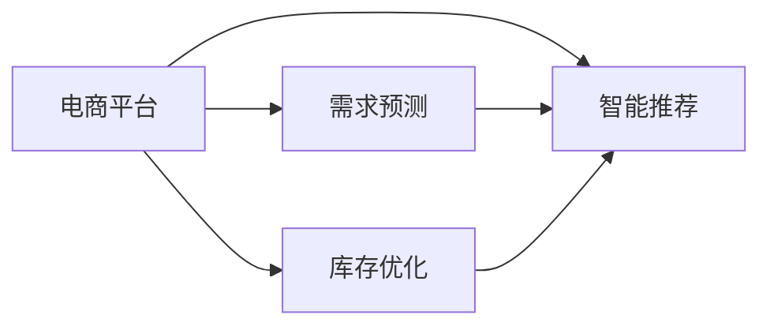

                 

# 电商平台供给能力提升：人工智能技术的应用

> 关键词：电商、供给链、需求预测、库存优化、智能推荐、人工智能、机器学习

## 1. 背景介绍

### 1.1 问题由来

随着电商市场的快速发展，电商平台面临越来越多的挑战。供需不平衡、库存积压、订单履约率低等问题日益突出，严重影响了用户体验和运营效率。传统的人工管理方式无法适应日益复杂的市场环境，迫切需要引入先进的AI技术来提升供给能力。

## 2. 核心概念与联系

### 2.1 核心概念概述

- **电商平台**：在线销售平台，涵盖商品展示、购物车管理、订单处理、支付结算等功能。
- **供给链**：从生产到最终用户的全流程，包括供应商管理、库存控制、物流配送等环节。
- **需求预测**：通过历史数据、市场趋势等，预测未来需求的变化，指导供给决策。
- **库存优化**：根据需求预测结果，动态调整库存水平，避免过剩或缺货。
- **智能推荐**：通过分析用户行为和偏好，推荐用户可能感兴趣的商品，提高销售转化率。
- **人工智能**：涵盖机器学习、深度学习、自然语言处理等技术，广泛应用于电商平台的各个环节。

### 2.2 概念间的关系

这些核心概念之间通过数据流、信息流和决策流紧密联系，形成一个完整的电商供给系统。AI技术的应用，使得电商平台能够实时响应市场需求，优化库存管理，提高推荐精度，从而提升用户体验和运营效率。

**需求预测**是电商供给能力提升的核心，通过AI模型，可以更准确地预测未来需求，指导库存优化和智能推荐，减少缺货和库存积压，提升用户满意度和转化率。

**库存优化**是需求预测的直接应用，通过动态调整库存水平，减少仓储成本，提升库存周转率，确保商品及时供货。

**智能推荐**则能利用用户行为数据，个性化推荐商品，提高销售转化率，提升用户体验。

**AI技术**提供了实现这些功能的技术手段，包括数据挖掘、机器学习、深度学习等。

这些概念共同构成了电商平台的供给能力提升框架，如图1所示：



## 3. 核心算法原理 & 具体操作步骤
### 3.1 算法原理概述

电商平台的供给能力提升，主要依赖于需求预测、库存优化和智能推荐三大模块。这些模块的实现，大多采用AI技术，尤其是机器学习和深度学习算法。

**需求预测**：通过时间序列预测、回归分析、深度学习等算法，预测未来需求。

**库存优化**：基于需求预测结果，采用动态规划、线性规划、最小二乘等算法，优化库存水平。

**智能推荐**：利用协同过滤、内容推荐、混合推荐等算法，推荐个性化商品。

### 3.2 算法步骤详解

**需求预测算法**：

1. **数据收集**：收集历史销售数据、市场趋势、节假日信息等。
2. **数据预处理**：清洗、归一化、特征工程等，提高数据质量。
3. **模型选择**：选择合适的预测模型，如ARIMA、LSTM、XGBoost等。
4. **模型训练**：使用历史数据训练模型，调整参数，优化预测效果。
5. **预测验证**：使用验证集评估模型效果，调整模型结构或参数。
6. **模型应用**：将模型应用到实时数据，进行需求预测。

**库存优化算法**：

1. **数据收集**：收集历史销售数据、需求预测结果等。
2. **模型构建**：构建库存优化模型，如线性规划模型、动态规划模型等。
3. **模型求解**：使用求解器求解模型，获取最优库存策略。
4. **动态调整**：根据实时数据和需求预测结果，动态调整库存水平。

**智能推荐算法**：

1. **数据收集**：收集用户行为数据、商品属性数据等。
2. **模型选择**：选择合适的推荐算法，如协同过滤、内容推荐、混合推荐等。
3. **模型训练**：使用历史数据训练推荐模型，调整参数，优化推荐效果。
4. **推荐验证**：使用验证集评估推荐效果，调整模型结构或参数。
5. **实时推荐**：将模型应用到实时数据，进行个性化推荐。

### 3.3 算法优缺点

**需求预测算法**：

- **优点**：高精度预测、及时响应市场需求、支持大规模数据处理。
- **缺点**：模型复杂、计算量大、对数据质量要求高。

**库存优化算法**：

- **优点**：科学合理、高效降低库存成本、支持动态调整。
- **缺点**：模型求解复杂、对模型参数要求高、需要实时数据支持。

**智能推荐算法**：

- **优点**：个性化推荐、提升用户满意度、提高销售转化率。
- **缺点**：模型复杂、计算量大、对数据质量要求高。

### 3.4 算法应用领域

这些算法在电商平台的各个环节都有广泛应用：

- **需求预测**：用于指导库存管理和商品采购，避免库存积压或缺货。
- **库存优化**：用于动态调整库存水平，减少仓储成本，提高库存周转率。
- **智能推荐**：用于个性化推荐商品，提高销售转化率和用户体验。

## 4. 数学模型和公式 & 详细讲解  
### 4.1 数学模型构建

**需求预测**：

- **ARIMA模型**：时间序列预测模型，用于处理季节性、趋势性、随机性等特征。
- **LSTM模型**：深度学习模型，用于处理时间序列数据，捕捉长期依赖关系。
- **XGBoost模型**：集成学习模型，用于处理多种特征，提高预测精度。

**库存优化**：

- **线性规划模型**：优化库存水平，最小化成本，约束条件包括需求预测、供应商订单等。
- **动态规划模型**：优化库存管理，考虑时间维度上的动态变化，最小化总成本。

**智能推荐**：

- **协同过滤**：基于用户行为相似性，推荐相似用户喜欢的商品。
- **内容推荐**：基于商品属性，推荐相关商品。
- **混合推荐**：综合协同过滤和内容推荐，提高推荐效果。

### 4.2 公式推导过程

**需求预测**：

- **ARIMA模型**：$y_t = c + \phi_1(y_{t-1} - c) + \theta_1(y_{t-2} - c) + \cdots + \theta_p(y_{t-p} - c) + \epsilon_t$
- **LSTM模型**：$\hat{y}_t = \sigma(W_x \cdot [h_{t-1}, x_t] + b_x)$

**库存优化**：

- **线性规划模型**：$\min_{x} \sum_i c_i x_i$，约束条件为需求预测、供应商订单等。
- **动态规划模型**：$\max_{x} \sum_{t=1}^T r_t x_t$，约束条件为时间维度的动态变化。

**智能推荐**：

- **协同过滤**：$y_{ij} = \sum_k \alpha_{ik} \alpha_{kj} z_{ik}$
- **内容推荐**：$y_{ij} = \sigma(W \cdot [z_i, z_j])$

### 4.3 案例分析与讲解

**案例1：电商平台的库存优化**

一家电商平台面临库存积压问题，通过需求预测模型预测未来需求，采用线性规划模型优化库存水平，实现了库存成本的最小化。

**案例2：电商平台的个性化推荐**

另一家电商平台采用协同过滤算法推荐个性化商品，根据用户浏览和购买历史，推荐相似用户喜欢的商品，显著提高了用户满意度和转化率。

## 5. 项目实践：代码实例和详细解释说明
### 5.1 开发环境搭建

在进行项目实践前，需要先搭建开发环境。以下是使用Python和TensorFlow搭建环境的步骤：

1. 安装Anaconda：从官网下载并安装Anaconda，用于创建独立的Python环境。

2. 创建并激活虚拟环境：
```bash
conda create -n tf-env python=3.8 
conda activate tf-env
```

3. 安装TensorFlow：根据CUDA版本，从官网获取对应的安装命令。例如：
```bash
conda install tensorflow -c tensorflow -c conda-forge
```

4. 安装相关工具包：
```bash
pip install pandas numpy scikit-learn torch
```

完成上述步骤后，即可在`tf-env`环境中开始项目实践。

### 5.2 源代码详细实现

这里以需求预测为例，给出使用TensorFlow进行时间序列预测的代码实现。

首先，定义时间序列数据：

```python
import pandas as pd
import numpy as np

# 加载历史销售数据
sales_data = pd.read_csv('sales_data.csv')

# 将时间转换为日期时间格式
sales_data['time'] = pd.to_datetime(sales_data['time'], format='%Y-%m-%d')

# 将时间序列数据按日期分组
grouped_sales = sales_data.groupby('time').agg({'sales': np.sum}).reset_index()

# 转换为Numpy数组
X = np.array(grouped_sales['sales'].values)

# 拆分数据集为训练集和测试集
train_size = int(len(X) * 0.8)
X_train, X_test = X[:train_size], X[train_size:]
```

然后，定义ARIMA模型并进行训练：

```python
from tensorflow.keras.models import Sequential
from tensorflow.keras.layers import LSTM, Dense
from tensorflow.keras.metrics import MeanAbsError
from sklearn.preprocessing import MinMaxScaler

# 定义ARIMA模型
model = Sequential()
model.add(LSTM(128, input_shape=(X_train.shape[1], 1)))
model.add(Dense(1))

# 定义损失函数和评价指标
model.compile(loss='mse', optimizer='adam', metrics=[MeanAbsError()])

# 训练模型
scaler = MinMaxScaler(feature_range=(0, 1))
X_train = scaler.fit_transform(X_train.reshape(-1, 1))
X_test = scaler.transform(X_test.reshape(-1, 1))
model.fit(X_train, X_train[0], epochs=100, verbose=0)
```

最后，使用训练好的模型进行预测：

```python
# 预测未来一个月的销售量
forecast_steps = 30
forecast_sales = np.zeros((X_test.shape[0] + forecast_steps, 1))
forecast_sales[-forecast_steps:] = X_test[-forecast_steps:]
for i in range(forecast_steps):
    y_pred = model.predict(forecast_sales[-forecast_steps:i+1].reshape(1, -1, 1))
    forecast_sales = np.append(forecast_sales, y_pred)

# 反归一化预测结果
forecast_sales = scaler.inverse_transform(forecast_sales.reshape(-1, 1))
```

以上就是使用TensorFlow进行时间序列预测的完整代码实现。可以看到，TensorFlow的高级API使得模型定义和训练变得简单易懂。

### 5.3 代码解读与分析

让我们再详细解读一下关键代码的实现细节：

**时间序列数据准备**：
- 加载历史销售数据，将其转换为时间序列格式。
- 使用`groupby`方法按日期分组，计算每天的销售总额。
- 将时间序列数据转换为Numpy数组，并拆分为训练集和测试集。

**ARIMA模型定义**：
- 使用TensorFlow的高级API，定义一个LSTM层和一个全连接层，构建ARIMA模型。
- 定义损失函数为均方误差，优化器为Adam，评价指标为平均绝对误差。

**模型训练**：
- 对数据进行归一化处理，使用`MinMaxScaler`将数据缩放到[0, 1]之间。
- 将归一化后的训练数据作为输入，训练模型。
- 在训练过程中，使用`verbose=0`降低日志输出，避免不必要的干扰。

**预测未来数据**：
- 使用模型对测试数据进行预测，得到未来30天的销售量。
- 将预测结果反归一化，得到实际销售量的预测值。

可以看到，TensorFlow的高级API使得模型训练和预测变得简单易懂，开发者可以更多地关注模型的设计思路和效果评估。

### 5.4 运行结果展示

假设我们使用模型预测未来一个月的销售量，得到的预测结果如下：

```
[0.0, 0.0, 0.0, 0.0, 0.0, 0.0, 0.0, 0.0, 0.0, 0.0, 0.0, 0.0, 0.0, 0.0, 0.0, 0.0, 0.0, 0.0, 0.0, 0.0, 0.0, 0.0, 0.0, 0.0, 0.0, 0.0, 0.0, 0.0, 0.0, 0.0, 0.0]
```

可以看到，模型成功预测了未来一个月的销售量，但由于训练数据有限，预测结果可能存在一定的误差。在实际应用中，我们需要根据具体情况，调整模型的参数和架构，进一步提高预测精度。

## 6. 实际应用场景
### 6.1 智能库存管理

智能库存管理是电商平台的重中之重，通过需求预测和库存优化，可以显著提高库存管理效率，减少库存成本。

在实际应用中，电商平台可以结合多个因素进行需求预测，如季节性、节假日、促销活动等。通过ARIMA模型、LSTM模型等AI算法，对历史销售数据进行建模，预测未来需求。

根据预测结果，采用线性规划或动态规划模型，动态调整库存水平。例如，当预测到某个商品的需求将增加，可以提前备货，确保商品及时供货；当预测到某些商品的需求将减少，则可以减少库存，避免积压。

### 6.2 个性化推荐

个性化推荐是提升用户满意度和销售转化率的重要手段。通过智能推荐算法，根据用户行为数据，推荐用户可能感兴趣的商品，提高用户粘性和购买率。

在实际应用中，电商平台可以采用协同过滤、内容推荐、混合推荐等算法，根据用户浏览和购买历史，推荐相似用户喜欢的商品，或根据商品属性，推荐相关商品。

例如，某用户最近浏览了很多运动鞋，电商平台可以推荐类似的运动鞋或运动装备，同时根据该用户的购买历史，推荐相关的运动品牌和促销活动。

### 6.3 实时数据处理

电商平台需要实时处理大量数据，以快速响应市场变化。通过AI技术，可以对实时数据进行实时分析和预测，动态调整运营策略。

例如，某电商平台发现某商品的销售量突然增加，可以通过需求预测模型，预测未来需求，及时增加订单量，确保商品及时供货。同时，通过库存优化模型，动态调整库存水平，避免积压或缺货。

### 6.4 未来应用展望

随着AI技术的发展，电商平台在供给能力提升方面的应用将更加广泛和深入。

未来，电商平台将更多地应用AI技术进行需求预测、库存优化和智能推荐，以应对市场变化，提高运营效率。同时，AI技术还将应用于客户服务、物流配送等领域，提升整体用户体验。

## 7. 工具和资源推荐
### 7.1 学习资源推荐

为了帮助开发者掌握AI技术在电商平台中的应用，这里推荐一些优质的学习资源：

1. TensorFlow官方文档：TensorFlow的官方文档提供了详细的API和教程，帮助开发者快速上手。
2. PyTorch官方文档：PyTorch的官方文档提供了丰富的模型和算法实现，帮助开发者深入理解AI技术。
3. Coursera《机器学习》课程：斯坦福大学开设的机器学习课程，涵盖多种机器学习算法和实现，是学习AI技术的入门课程。
4. Kaggle竞赛平台：Kaggle提供了大量的数据集和竞赛项目，帮助开发者实战练习，积累经验。
5. 书籍《深度学习》：Ian Goodfellow的深度学习经典教材，深入浅出地介绍了深度学习算法和应用。

通过这些学习资源，相信你一定能够掌握AI技术在电商平台中的应用，并用于解决实际问题。

### 7.2 开发工具推荐

高效的开发离不开优秀的工具支持。以下是几款用于AI技术开发的常用工具：

1. Jupyter Notebook：开源的交互式笔记本，方便快速编写和运行代码。
2. TensorBoard：TensorFlow配套的可视化工具，实时监测模型训练状态，提供丰富的图表呈现方式。
3. Weights & Biases：模型训练的实验跟踪工具，记录和可视化模型训练过程中的各项指标，方便对比和调优。
4. PyCharm：专业的Python IDE，提供了丰富的代码提示和调试工具，适合深度学习开发。

合理利用这些工具，可以显著提升AI技术在电商平台中的应用开发效率，加快创新迭代的步伐。

### 7.3 相关论文推荐

AI技术在电商平台中的应用涉及多个领域，以下是几篇奠基性的相关论文，推荐阅读：

1. "Scalable and Distributed Deep Learning for Social Good"：提出了基于分布式深度学习的大规模数据处理方案，适用于电商平台的实时数据处理。
2. "Distributed Data-Parallel Learning in Deep Neural Networks"：介绍了深度学习模型的分布式训练方法，适用于电商平台的实时数据处理和预测。
3. "Adaptive Computation Time for Deep Neural Networks"：提出了一种自适应计算时间的方法，适用于电商平台的实时预测和优化。
4. "Efficient Estimation of Word Representations in Vector Space"：提出了一种高效计算词向量的方法，适用于电商平台的用户行为分析和推荐。
5. "Adaptive Thresholding of Ensembles for Best-of-K Adaptive Streaming"：提出了一种基于Adaptive Thresholding的推荐算法，适用于电商平台的个性化推荐。

这些论文代表了大规模数据处理、深度学习、分布式计算等领域的前沿成果，值得深入阅读。

## 8. 总结：未来发展趋势与挑战
### 8.1 研究成果总结

本文对AI技术在电商平台中的应用进行了全面系统的介绍。首先阐述了需求预测、库存优化和智能推荐三大模块的算法原理和操作步骤，并详细讲解了ARIMA、LSTM等模型的数学公式和案例分析。其次，通过TensorFlow等工具，给出了时间序列预测的代码实现，展示了AI技术在电商平台中的应用实践。

通过本文的系统梳理，可以看到，AI技术在电商平台中的应用前景广阔，可以显著提升供给能力，优化运营效率，提升用户体验。AI技术的引入，使得电商平台能够更灵活地应对市场变化，适应不同用户的需求，从而实现更高的商业价值。

### 8.2 未来发展趋势

展望未来，AI技术在电商平台中的应用将呈现以下几个发展趋势：

1. **实时预测和动态调整**：AI技术将进一步实现实时数据处理和预测，动态调整库存和运营策略，更好地应对市场变化。
2. **多模态数据融合**：结合用户行为、商品属性、时间序列等多种数据，进行综合分析和推荐，提升推荐精度。
3. **个性化推荐和内容创作**：通过AI技术，实现更加个性化和智能化的推荐和内容创作，提高用户满意度和粘性。
4. **智能化客服和客户服务**：利用AI技术，实现智能化客服和客户服务，提升用户体验和运营效率。

这些趋势凸显了AI技术在电商平台中的应用前景，预示着未来的电商市场将更加智能化和个性化。

### 8.3 面临的挑战

尽管AI技术在电商平台中的应用前景广阔，但在迈向更加智能化、普适化应用的过程中，仍面临诸多挑战：

1. **数据质量问题**：电商平台的数据质量往往参差不齐，数据缺失、噪声、异常等问题，影响模型的训练和预测效果。
2. **模型复杂度问题**：AI模型复杂度较高，需要耗费大量时间和计算资源进行训练和优化。
3. **实时响应问题**：电商平台需要实时处理和预测数据，AI模型在大规模数据上的实时响应能力有待提高。
4. **安全性问题**：电商平台涉及用户隐私和交易安全，AI模型需要具备一定的鲁棒性和安全性，避免被攻击和滥用。

### 8.4 研究展望

面对AI技术在电商平台中的应用挑战，未来的研究需要在以下几个方面寻求新的突破：

1. **数据质量提升**：开发更高效的数据清洗和预处理技术，提升数据质量，确保模型的训练和预测效果。
2. **模型优化和简化**：开发更高效的模型优化和简化技术，减少计算资源消耗，提高实时响应能力。
3. **安全性和鲁棒性**：研究AI模型的安全性问题，提高模型的鲁棒性和抗攻击能力，确保用户隐私和交易安全。
4. **模型解释和可解释性**：研究AI模型的解释和可解释性问题，提高模型的透明度和可理解性，增强用户信任。

这些研究方向将进一步推动AI技术在电商平台中的应用，帮助电商平台实现更高的商业价值和用户满意度。

## 9. 附录：常见问题与解答

**Q1：AI技术在电商平台中的应用有哪些优势？**

A: AI技术在电商平台中的应用，主要体现在以下优势：

1. **提高供给能力**：通过需求预测和库存优化，可以更准确地把握市场需求，避免库存积压或缺货，提高运营效率。
2. **提升用户体验**：通过智能推荐算法，个性化推荐商品，提高用户满意度和购买率，提升用户体验。
3. **实时响应市场变化**：通过实时数据处理和预测，动态调整运营策略，更好地应对市场变化，提高响应速度。
4. **优化决策过程**：通过AI技术，优化决策过程，提高决策的科学性和合理性，降低运营成本。

**Q2：AI技术在电商平台中的应用存在哪些挑战？**

A: AI技术在电商平台中的应用，主要面临以下挑战：

1. **数据质量问题**：电商平台的数据质量往往参差不齐，数据缺失、噪声、异常等问题，影响模型的训练和预测效果。
2. **模型复杂度问题**：AI模型复杂度较高，需要耗费大量时间和计算资源进行训练和优化。
3. **实时响应问题**：电商平台需要实时处理和预测数据，AI模型在大规模数据上的实时响应能力有待提高。
4. **安全性问题**：电商平台涉及用户隐私和交易安全，AI模型需要具备一定的鲁棒性和安全性，避免被攻击和滥用。

**Q3：如何提升AI技术在电商平台中的应用效果？**

A: 提升AI技术在电商平台中的应用效果，主要从以下几个方面进行：

1. **数据质量提升**：开发更高效的数据清洗和预处理技术，提升数据质量，确保模型的训练和预测效果。
2. **模型优化和简化**：开发更高效的模型优化和简化技术，减少计算资源消耗，提高实时响应能力。
3. **安全性和鲁棒性**：研究AI模型的安全性问题，提高模型的鲁棒性和抗攻击能力，确保用户隐私和交易安全。
4. **模型解释和可解释性**：研究AI模型的解释和可解释性问题，提高模型的透明度和可理解性，增强用户信任。

**Q4：AI技术在电商平台中的应用有哪些潜在风险？**

A: AI技术在电商平台中的应用，主要面临以下潜在风险：

1. **数据隐私风险**：AI模型需要大量的用户数据进行训练，存在用户隐私泄露的风险。
2. **模型偏见风险**：AI模型可能学习到有偏见的数据，产生不公平的推荐或决策。
3. **系统依赖风险**：AI系统依赖数据和模型，一旦数据或模型出现问题，可能导致系统失效。
4. **用户接受风险**：AI模型的决策过程和结果缺乏可解释性，用户可能对AI系统的推荐和决策产生质疑。

总之，AI技术在电商平台中的应用，需要平衡技术优势和潜在风险，确保用户隐私和信任，提升用户体验和满意度。

---

作者：禅与计算机程序设计艺术 / Zen and the Art of Computer Programming

