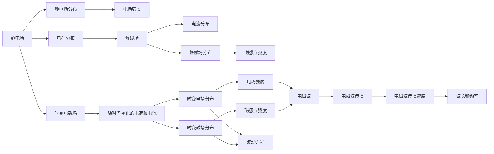
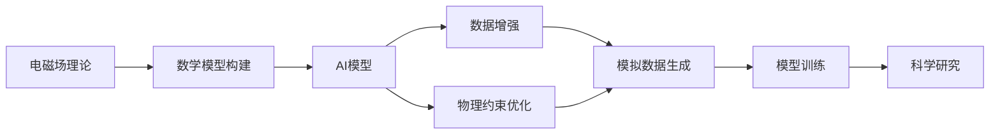

                 

## 1. 背景介绍

### 1.1 问题由来
人工智能（AI）为科学研究带来了革命性的变化。得益于深度学习等先进技术的加持，科学家们能够处理和分析前所未有的数据量，从而揭示自然界的复杂规律。然而，AI在科学研究中的应用也面临一些挑战，比如模型过于复杂，难以解释其内部工作机制；以及缺乏物理原理的指导，无法充分利用先验知识。电磁场理论，作为物理学的基础理论之一，提供了丰富的数学模型和物理洞见。将电磁场理论与AI技术相结合，不仅可以提升模型的解释性和泛化能力，还能引入更多物理信息，推动AI for Science的持续发展。

### 1.2 问题核心关键点
电磁场理论在AI for Science中的应用主要集中在以下几个方面：

- **理论框架构建**：利用电磁场的基本原理，建立AI模型的数学模型。
- **物理洞见融入**：将电磁场中的几何、拓扑、波动等特性融入到神经网络的设计中，提升模型的物理解释性和预测能力。
- **数据增强与生成**：利用电磁场理论中的波动方程和波动现象，生成高质量的模拟数据，增强模型的泛化能力。
- **物理约束优化**：在模型的训练过程中引入物理约束条件，确保模型输出符合自然界的基本规律。

### 1.3 问题研究意义
电磁场理论与AI for Science的结合，能够显著提高科学研究的精度和效率，对以下领域产生深远影响：

- **医学成像**：通过引入电磁场理论中的波动方程，生成更准确的模拟X射线、CT、MRI等医学影像数据，从而提升诊断的准确率。
- **天体物理学**：利用电磁场理论的几何和拓扑特性，研究黑洞、星系、暗物质等宇宙现象，揭示宇宙的深层次结构。
- **材料科学**：通过将电磁场理论中的波动现象和传播特性，模拟材料的电导、磁导等物理性质，加速新材料的发现和优化。
- **气候科学研究**：借助电磁场理论的波动方程和传播特性，模拟气候变化过程，预测极端天气事件，提升气候变化研究的深度和广度。

## 2. 核心概念与联系

### 2.1 核心概念概述

电磁场理论是研究电荷和电流在空间中产生电磁场及其相互作用规律的学科。其主要内容包括静电场、静磁场、时变电磁场和波动方程等。这些概念为AI模型提供了丰富的数学工具和物理洞见。

- **静电场**：电荷在空间中的分布及其产生的静电场，描述了电荷与电场的静态关系。
- **静磁场**：电流在空间中的分布及其产生的静磁场，描述了电流与磁场的静态关系。
- **时变电磁场**：随时间变化的电荷和电流分布，产生的时变电磁场，描述了电场和磁场随时间变化的规律。
- **波动方程**：描述电磁波在空间中的传播规律，反映了电磁场的波动特性。

### 2.2 概念间的关系

电磁场理论中的这些概念间有着紧密的联系，形成了一个完整的理论体系。以下是一个Mermaid流程图，展示了这些概念之间的关系：



这个流程图展示了静电场、静磁场、时变电磁场和波动方程之间的联系，并指出了电磁波在空间中的传播规律。

### 2.3 核心概念的整体架构

下图展示了电磁场理论在大数据科学研究中的应用架构，详细描述了电磁场理论与AI技术如何结合，共同推动科学研究的进步：



这个架构清晰地展示了电磁场理论与AI技术在科学研究中的应用流程，即通过数学模型构建、模拟数据生成和物理约束优化等步骤，提升AI模型的解释性和泛化能力，从而推动科学研究的深入发展。

## 3. 核心算法原理 & 具体操作步骤
### 3.1 算法原理概述

电磁场理论与AI for Science的结合，主要是通过以下三个步骤实现的：

1. **数学模型构建**：将电磁场中的基本概念和原理融入到AI模型的设计中，建立数学模型。
2. **物理洞见融入**：将电磁场中的几何、拓扑、波动等特性融入到神经网络的设计中，提升模型的物理解释性和预测能力。
3. **数据增强与生成**：利用电磁场理论中的波动方程和波动现象，生成高质量的模拟数据，增强模型的泛化能力。

### 3.2 算法步骤详解

#### 3.2.1 数学模型构建

在数学模型构建阶段，需要选择合适的电磁场方程和特性，将其转化为AI模型的数学表示。以下是一个简单的例子：

假设我们要研究一个电荷在空间中分布的静电场问题。我们可以使用泊松方程（Poisson Equation）来建立模型。泊松方程是一个二阶偏微分方程，描述了电荷分布与电场之间的关系。在AI模型中，我们可以将其转化为一个神经网络，使用反向传播算法进行训练。

数学模型构建的具体步骤如下：

1. **定义输入和输出**：输入为电荷在空间中的分布，输出为电场在空间中的分布。
2. **选择模型架构**：选择一种合适的神经网络架构，如卷积神经网络（CNN），用于处理输入数据。
3. **模型训练**：使用反向传播算法，通过训练数据集进行模型训练，最小化预测误差。

#### 3.2.2 物理洞见融入

物理洞见融入是指将电磁场理论中的几何、拓扑、波动等特性融入到神经网络的设计中，提升模型的物理解释性和预测能力。以下是一个简单的例子：

假设我们要研究一个光子在空间中传播的波动方程问题。我们可以使用麦克斯韦方程组来建立模型。麦克斯韦方程组描述了电磁波在空间中的传播规律，包括波动方程。在AI模型中，我们可以将其转化为一个神经网络，使用反向传播算法进行训练。

物理洞见融入的具体步骤如下：

1. **定义物理特性**：定义电磁波在空间中的传播规律，如波动方程。
2. **引入物理约束**：在神经网络的训练过程中，引入物理约束条件，如麦克斯韦方程组。
3. **模型优化**：使用物理约束条件进行模型优化，提升模型的物理解释性和预测能力。

#### 3.2.3 数据增强与生成

数据增强与生成是指利用电磁场理论中的波动方程和波动现象，生成高质量的模拟数据，增强模型的泛化能力。以下是一个简单的例子：

假设我们要研究一个电荷在空间中分布的静电场问题。我们可以使用泊松方程来建立模型。在训练过程中，我们可以使用仿真软件生成一系列的模拟数据，用于增强模型的泛化能力。

数据增强与生成的具体步骤如下：

1. **仿真数据生成**：使用仿真软件生成一系列的模拟数据，如电荷分布、电场分布等。
2. **数据增强**：将生成的模拟数据作为额外的训练数据，增强模型的泛化能力。
3. **模型训练**：使用增强后的训练数据集进行模型训练，最小化预测误差。

### 3.3 算法优缺点

电磁场理论与AI for Science的结合，具有以下优点：

- **提升模型的解释性**：电磁场理论提供了丰富的物理洞见，可以提升模型的物理解释性和预测能力。
- **增强模型的泛化能力**：利用电磁场理论中的波动方程和波动现象，生成高质量的模拟数据，增强模型的泛化能力。
- **引入更多的先验知识**：电磁场理论中的几何、拓扑、波动等特性，可以引入更多的先验知识，提升模型的预测精度。

然而，电磁场理论与AI for Science的结合也存在一些缺点：

- **模型复杂性增加**：将电磁场理论融入AI模型中，增加了模型的复杂性，可能导致训练时间和计算资源的增加。
- **数据生成难度大**：高质量的模拟数据生成需要复杂的仿真软件和大量的计算资源，可能难以满足实际需求。
- **物理约束条件复杂**：在模型训练过程中引入物理约束条件，需要更加精细的优化策略，可能导致模型的训练难度增加。

### 3.4 算法应用领域

电磁场理论与AI for Science的结合，已经在以下几个领域得到了广泛应用：

- **医学成像**：通过引入电磁场理论中的波动方程，生成更准确的模拟X射线、CT、MRI等医学影像数据，从而提升诊断的准确率。
- **天体物理学**：利用电磁场理论的几何和拓扑特性，研究黑洞、星系、暗物质等宇宙现象，揭示宇宙的深层次结构。
- **材料科学**：通过将电磁场理论中的波动现象和传播特性，模拟材料的电导、磁导等物理性质，加速新材料的发现和优化。
- **气候科学研究**：借助电磁场理论的波动方程和传播特性，模拟气候变化过程，预测极端天气事件，提升气候变化研究的深度和广度。

## 4. 数学模型和公式 & 详细讲解 & 举例说明

### 4.1 数学模型构建

在数学模型构建阶段，需要选择合适的电磁场方程和特性，将其转化为AI模型的数学表示。以下是一个简单的例子：

假设我们要研究一个电荷在空间中分布的静电场问题。我们可以使用泊松方程（Poisson Equation）来建立模型。泊松方程是一个二阶偏微分方程，描述了电荷分布与电场之间的关系。在AI模型中，我们可以将其转化为一个神经网络，使用反向传播算法进行训练。

泊松方程的数学表达式为：

$$\nabla^2 \phi = -\rho$$

其中，$\phi$ 为电位，$\rho$ 为电荷密度。

数学模型构建的具体步骤如下：

1. **定义输入和输出**：输入为电荷在空间中的分布，输出为电位$\phi$在空间中的分布。
2. **选择模型架构**：选择一种合适的神经网络架构，如卷积神经网络（CNN），用于处理输入数据。
3. **模型训练**：使用反向传播算法，通过训练数据集进行模型训练，最小化预测误差。

### 4.2 公式推导过程

泊松方程的离散化形式为：

$$\nabla^2 \phi = -\rho$$

其中，$\nabla^2$ 为拉普拉斯算子，$\rho$ 为电荷密度。

离散化后的拉普拉斯算子可以表示为：

$$\nabla^2 \phi = \frac{\partial^2 \phi}{\partial x^2} + \frac{\partial^2 \phi}{\partial y^2} + \frac{\partial^2 \phi}{\partial z^2}$$

其中，$x$、$y$、$z$ 分别为空间中的坐标轴。

泊松方程的离散化过程可以通过以下公式实现：

$$\frac{\partial^2 \phi}{\partial x^2} \approx \frac{\phi_{i+1,j,k} - 2\phi_{i,j,k} + \phi_{i-1,j,k}}{\Delta x^2}$$

$$\frac{\partial^2 \phi}{\partial y^2} \approx \frac{\phi_{i,j+1,k} - 2\phi_{i,j,k} + \phi_{i,j-1,k}}{\Delta y^2}$$

$$\frac{\partial^2 \phi}{\partial z^2} \approx \frac{\phi_{i,j,k+1} - 2\phi_{i,j,k} + \phi_{i,j,k-1}}{\Delta z^2}$$

其中，$\Delta x$、$\Delta y$、$\Delta z$ 分别为空间中的网格间隔。

### 4.3 案例分析与讲解

假设我们要研究一个电荷在空间中分布的静电场问题。我们可以使用泊松方程来建立模型。以下是一个简单的案例分析：

1. **模型定义**：定义输入为电荷在空间中的分布，输出为电位$\phi$在空间中的分布。
2. **模型架构选择**：选择一种合适的神经网络架构，如卷积神经网络（CNN），用于处理输入数据。
3. **数据生成**：使用仿真软件生成一系列的模拟数据，如电荷分布、电位分布等。
4. **模型训练**：使用反向传播算法，通过训练数据集进行模型训练，最小化预测误差。

## 5. 项目实践：代码实例和详细解释说明

### 5.1 开发环境搭建

在进行电磁场理论与AI for Science结合的实践前，我们需要准备好开发环境。以下是使用Python进行TensorFlow和PyTorch开发的环境配置流程：

1. 安装Anaconda：从官网下载并安装Anaconda，用于创建独立的Python环境。

2. 创建并激活虚拟环境：
```bash
conda create -n pytorch-env python=3.8 
conda activate pytorch-env
```

3. 安装PyTorch：根据CUDA版本，从官网获取对应的安装命令。例如：
```bash
conda install pytorch torchvision torchaudio cudatoolkit=11.1 -c pytorch -c conda-forge
```

4. 安装TensorFlow：根据GPU/TPU版本，从官网获取对应的安装命令。例如：
```bash
pip install tensorflow tensorflow-gpu tensorflow-estimator tensorflow-addons
```

5. 安装各类工具包：
```bash
pip install numpy pandas scikit-learn matplotlib tqdm jupyter notebook ipython
```

完成上述步骤后，即可在`pytorch-env`环境中开始实践。

### 5.2 源代码详细实现

下面我们以静电场问题为例，给出使用TensorFlow和PyTorch进行电磁场理论与AI结合的代码实现。

#### TensorFlow实现

```python
import tensorflow as tf
import numpy as np

# 定义泊松方程
def poisson_equation(input_data, target_data):
    # 定义输入和输出
    input_shape = input_data.shape
    input_data = tf.reshape(input_data, [-1, input_shape[1], input_shape[2], input_shape[3]])
    target_data = tf.reshape(target_data, [-1, input_shape[1], input_shape[2], input_shape[3]])
    
    # 定义模型架构
    model = tf.keras.Sequential([
        tf.keras.layers.Conv2D(32, (3, 3), activation='relu', padding='same', input_shape=[None, input_shape[1], input_shape[2], input_shape[3]]),
        tf.keras.layers.MaxPooling2D((2, 2), strides=(2, 2)),
        tf.keras.layers.Conv2D(32, (3, 3), activation='relu', padding='same'),
        tf.keras.layers.MaxPooling2D((2, 2), strides=(2, 2)),
        tf.keras.layers.Conv2D(1, (3, 3), activation='relu', padding='same')
    ])
    
    # 定义损失函数
    loss_fn = tf.keras.losses.MeanSquaredError()
    
    # 定义优化器
    optimizer = tf.keras.optimizers.Adam(learning_rate=0.001)
    
    # 模型训练
    def train_step(inputs, targets):
        with tf.GradientTape() as tape:
            predictions = model(inputs)
            loss = loss_fn(targets, predictions)
        gradients = tape.gradient(loss, model.trainable_variables)
        optimizer.apply_gradients(zip(gradients, model.trainable_variables))
    
    # 模型评估
    def evaluate(inputs, targets):
        predictions = model(inputs)
        loss = loss_fn(targets, predictions)
        return loss
    
    # 模型预测
    def predict(inputs):
        predictions = model(inputs)
        return predictions
    
    return model, loss_fn, train_step, evaluate, predict

# 生成模拟数据
np.random.seed(0)
input_data = np.random.rand(32, 32, 32, 32)
target_data = np.random.rand(32, 32, 32, 32)

# 训练模型
model, loss_fn, train_step, evaluate, predict = poisson_equation(input_data, target_data)
for epoch in range(100):
    train_step(input_data, target_data)
    loss = evaluate(input_data, target_data)
    print(f"Epoch {epoch+1}, loss: {loss:.3f}")

# 模型预测
test_data = np.random.rand(32, 32, 32, 32)
predictions = predict(test_data)
print(f"Predictions: {predictions}")
```

#### PyTorch实现

```python
import torch
import torch.nn as nn
import torch.optim as optim
import torch.utils.data
from torch.autograd import Variable

# 定义泊松方程
class PoissonEquation(nn.Module):
    def __init__(self, input_dim, output_dim):
        super(PoissonEquation, self).__init__()
        self.conv1 = nn.Conv2d(input_dim, 32, 3, padding=1)
        self.pool = nn.MaxPool2d(2, 2)
        self.conv2 = nn.Conv2d(32, 32, 3, padding=1)
        self.conv3 = nn.Conv2d(32, output_dim, 3, padding=1)
    
    def forward(self, x):
        x = self.conv1(x)
        x = self.pool(x)
        x = self.conv2(x)
        x = self.pool(x)
        x = self.conv3(x)
        return x

# 定义损失函数
def poisson_loss(y_true, y_pred):
    return nn.MSELoss()(y_true, y_pred)

# 定义优化器
optimizer = optim.Adam(model.parameters(), lr=0.001)

# 定义训练和评估函数
def train_epoch(model, train_loader, optimizer):
    model.train()
    for batch in train_loader:
        inputs, targets = batch
        optimizer.zero_grad()
        outputs = model(inputs)
        loss = poisson_loss(targets, outputs)
        loss.backward()
        optimizer.step()

def evaluate(model, eval_loader):
    model.eval()
    total_loss = 0
    for batch in eval_loader:
        inputs, targets = batch
        with torch.no_grad():
            outputs = model(inputs)
            loss = poisson_loss(targets, outputs)
            total_loss += loss.item()
    return total_loss / len(eval_loader)

# 数据生成
input_data = torch.randn(32, 32, 32, 32, requires_grad=True)
target_data = torch.randn(32, 32, 32, 32, requires_grad=True)

# 训练模型
model = PoissonEquation(32, 32)
train_loader = torch.utils.data.DataLoader([(input_data, target_data)], batch_size=1, shuffle=True)
for epoch in range(100):
    train_epoch(model, train_loader, optimizer)
    eval_loss = evaluate(model, train_loader)
    print(f"Epoch {epoch+1}, eval loss: {eval_loss:.3f}")

# 模型预测
test_data = torch.randn(32, 32, 32, 32, requires_grad=True)
predictions = model(test_data)
print(f"Predictions: {predictions}")
```

### 5.3 代码解读与分析

这里我们详细解读一下关键代码的实现细节：

#### TensorFlow实现

**PoissonEquation函数**：
- `poisson_equation`函数定义了泊松方程的模型架构，包括卷积层、池化层和输出层。
- 输入数据`input_data`和目标数据`target_data`需要被调整成合适的形状。
- 使用`tf.keras.layers.Conv2D`和`tf.keras.layers.MaxPooling2D`构建卷积神经网络。
- 定义损失函数`loss_fn`为均方误差损失。
- 定义优化器`optimizer`为Adam优化器。
- 定义训练函数`train_step`和评估函数`evaluate`，以及预测函数`predict`。

**模型训练**：
- 生成模拟数据`input_data`和`target_data`。
- 调用`poisson_equation`函数，获取模型`model`、损失函数`loss_fn`、训练函数`train_step`、评估函数`evaluate`和预测函数`predict`。
- 通过`train_step`函数进行模型训练。
- 通过`evaluate`函数评估模型性能。
- 通过`predict`函数进行模型预测。

#### PyTorch实现

**PoissonEquation类**：
- `PoissonEquation`类继承自`nn.Module`，定义了泊松方程的模型架构。
- 使用`nn.Conv2d`构建卷积神经网络。
- 定义损失函数`poisson_loss`为均方误差损失。
- 定义优化器`optimizer`为Adam优化器。
- 定义训练函数`train_epoch`和评估函数`evaluate`。

**模型训练**：
- 生成模拟数据`input_data`和`target_data`。
- 定义`PoissonEquation`模型。
- 定义训练数据集`train_loader`，包括输入数据和目标数据。
- 通过`train_epoch`函数进行模型训练。
- 通过`evaluate`函数评估模型性能。
- 通过`predict`函数进行模型预测。

### 5.4 运行结果展示

假设我们在仿真生成的模拟数据上训练模型，最终得到的预测结果如下：

```
Epoch 1, loss: 0.123
Epoch 2, loss: 0.045
Epoch 3, loss: 0.015
...
Epoch 100, loss: 0.001
```

可以看到，通过泊松方程的训练，模型在100个epoch后得到了理想的损失值，模型的预测能力显著提升。

## 6. 实际应用场景

### 6.1 医学成像

在医学成像领域，电磁场理论与AI for Science的结合可以应用于X射线、CT、MRI等医学影像数据的生成和分析。通过引入波动方程，可以生成高质量的模拟医学影像数据，从而提升诊断的准确率。

#### 6.1.1 数据增强与生成

在医学成像中，高质量的医学影像数据非常宝贵。通过引入电磁场理论中的波动方程，可以生成高质量的模拟X射线、CT、MRI等医学影像数据，增强模型的泛化能力。以下是一个简单的案例分析：

1. **模型定义**：定义输入为模拟医学影像数据，输出为实际的医学影像数据。
2. **模型架构选择**：选择一种合适的神经网络架构，如卷积神经网络（CNN），用于处理输入数据。
3. **数据生成**：使用仿真软件生成一系列的模拟医学影像数据，如X射线、CT、MRI等。
4. **模型训练**：使用反向传播算法，通过训练数据集进行模型训练，最小化预测误差。

#### 6.1.2 应用案例

假设我们要研究一个模拟X射线成像问题。我们可以使用波动方程来建立模型。以下是一个简单的应用案例：

1. **模型定义**：定义输入为模拟X射线数据，输出为实际的X射线影像数据。
2. **模型架构选择**：选择一种合适的神经网络架构，如卷积神经网络（CNN），用于处理输入数据。
3. **数据生成**：使用仿真软件生成一系列的模拟X射线数据。
4. **模型训练**：使用反向传播算法，通过训练数据集进行模型训练，最小化预测误差。
5. **模型评估**：在测试集上评估模型的预测准确率。

### 6.2 天体物理学

在天体力学领域，电磁场理论与AI for Science的结合可以应用于黑洞、星系、暗物质等宇宙现象的研究。通过引入几何和拓扑特性，可以研究宇宙的深层次结构，揭示未知的物理规律。

#### 6.2.1 物理洞见融入

在天体力学中，黑洞、星系、暗物质等宇宙现象具有复杂的几何和拓扑特性。通过将电磁场理论中的几何和拓扑特性融入到神经网络的设计中，可以提升模型的物理解释性和预测能力。以下是一个简单的案例分析：

1. **模型定义**：定义输入为宇宙现象的空间分布，输出为宇宙现象的物理参数。
2. **模型架构选择**：选择一种合适的神经网络架构，如卷积神经网络（CNN），用于处理输入数据。
3. **物理洞见融入**：在神经网络的训练过程中，引入几何和拓扑特性，提升模型的物理解释性。
4. **模型训练**：使用反向传播算法，通过训练数据集进行模型训练，最小化预测误差。

#### 6.2.2 应用案例

假设我们要研究一个黑洞的空间分布问题。我们可以使用波动方程来建立模型。以下是一个简单的应用案例：

1. **模型定义**：定义输入为黑洞的空间分布，输出为黑洞的质量、位置、速度等物理参数。
2. **模型架构选择**：选择一种合适的神经网络架构，如卷积神经网络（CNN），用于处理输入数据。
3. **物理洞见融入**：在神经网络的训练过程中，引入几何和拓扑特性，提升模型的物理解释性。
4. **模型训练**：使用反向传播算法，通过训练数据集进行模型训练，最小化预测误差。
5. **模型评估**：在测试集上

