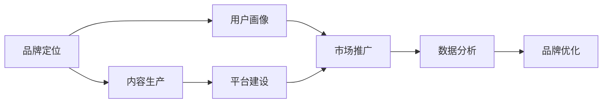

                 

# 知识付费赚钱的品牌品牌运营与品牌推广策略

> 关键词：知识付费,品牌运营,品牌推广,市场营销,数字化转型

## 1. 背景介绍

### 1.1 问题由来
随着互联网和数字技术的快速发展，知识付费正在成为一种新兴的商业模式。它打破了传统的免费共享知识模式，通过为用户提供专业的、高质量的在线内容，来获取价值回报。然而，与传统商业模式相比，知识付费行业的进入门槛较高，用户获取价值回报的需求也较为复杂，因此对品牌运营和品牌推广提出了更高的要求。

本文将详细探讨知识付费行业的品牌运营与品牌推广策略，结合实际案例，深入分析如何在竞争激烈的市场中脱颖而出，实现品牌价值的最大化。

### 1.2 问题核心关键点
1. **品牌定位**：明确品牌的核心价值和目标用户群体，制定差异化的品牌战略。
2. **内容生产**：高质量、有价值的内容是知识付费品牌成功的关键。
3. **用户画像**：深入了解用户需求和行为，实现精准营销。
4. **平台建设**：构建稳定、易用的平台，提供良好的用户体验。
5. **市场推广**：多渠道、多形式的营销策略，扩大品牌影响力。
6. **数据分析**：利用大数据技术，实时监测品牌表现，持续优化运营策略。

### 1.3 问题研究意义
品牌运营和品牌推广是大数据时代知识付费行业的重要议题。对于品牌来说，其核心在于提升用户粘性、增加用户数量、优化用户体验以及提升用户满意度。这些因素直接关系到品牌的影响力和盈利能力。通过深入研究品牌运营和品牌推广策略，可以为知识付费行业的持续发展和品牌价值的提升提供指导。

## 2. 核心概念与联系

### 2.1 核心概念概述

在探讨品牌运营与品牌推广策略之前，我们需要先了解几个核心概念及其相互关系：

- **品牌定位（Brand Positioning）**：确定品牌的市场定位和目标用户群体，明确品牌的核心价值和竞争优势。
- **内容生产（Content Production）**：生产高质量、有价值的内容，满足用户需求，提升用户满意度和忠诚度。
- **用户画像（User Persona）**：通过数据分析和市场调研，深入了解目标用户的特征和行为，实现精准营销。
- **平台建设（Platform Development）**：构建稳定、易用的平台，提供良好的用户体验。
- **市场推广（Market Promotion）**：采用多渠道、多形式的营销策略，扩大品牌影响力。
- **数据分析（Data Analytics）**：利用大数据技术，实时监测品牌表现，持续优化运营策略。

这些概念之间存在紧密的联系，共同构成知识付费品牌运营和品牌推广的生态系统。通过明确品牌定位，提供高质量的内容，了解目标用户，建设良好的平台，进行有效的市场推广，并利用数据分析持续优化策略，品牌才能在竞争激烈的知识付费市场中脱颖而出，实现长期的盈利和成长。

### 2.2 概念间的关系

以下是一个Mermaid流程图，展示了这些核心概念之间的关系：



该流程图展示了品牌运营和品牌推广的各个环节：

1. **品牌定位**：明确品牌的核心价值和目标用户群体。
2. **内容生产**：基于品牌定位，生产高质量、有价值的内容。
3. **用户画像**：通过数据分析和市场调研，深入了解目标用户，实现精准营销。
4. **平台建设**：构建稳定、易用的平台，提供良好的用户体验。
5. **市场推广**：采用多渠道、多形式的营销策略，扩大品牌影响力。
6. **数据分析**：利用大数据技术，实时监测品牌表现，持续优化运营策略。

这些环节相辅相成，共同推动品牌的持续发展和价值最大化。

## 3. 核心算法原理 & 具体操作步骤
### 3.1 算法原理概述

品牌运营与品牌推广的策略主要基于市场营销学的原理，包括品牌定位、内容营销、用户画像、平台建设、市场推广和数据分析等核心环节。以下是这些策略的基本原理：

- **品牌定位**：通过市场调研和数据分析，确定品牌的核心价值和目标用户群体，从而制定差异化的品牌战略。
- **内容生产**：内容是知识付费品牌成功的关键。高质量、有价值的内容能够吸引用户，提升用户满意度和忠诚度。
- **用户画像**：通过分析用户数据和行为，深入了解目标用户的特征和需求，实现精准营销。
- **平台建设**：构建稳定、易用的平台，提供良好的用户体验，提升用户粘性和留存率。
- **市场推广**：利用多渠道、多形式的营销策略，扩大品牌影响力，吸引新用户，提升品牌知名度。
- **数据分析**：通过大数据技术，实时监测品牌表现，分析用户行为和市场趋势，持续优化运营策略。

### 3.2 算法步骤详解

以下是品牌运营与品牌推广策略的具体操作步骤：

**Step 1: 品牌定位**
- 市场调研：通过问卷调查、焦点小组讨论等方式，收集用户需求和市场趋势。
- 数据分析：利用大数据技术，分析市场竞争格局和用户特征，确定品牌的核心价值和目标用户群体。
- 品牌战略：制定差异化的品牌战略，明确品牌的核心竞争力和市场定位。

**Step 2: 内容生产**
- 内容规划：基于品牌定位，规划高质量、有价值的内容主题和形式。
- 内容制作：利用专业团队或众包平台，制作高品质的内容，如文章、视频、音频等。
- 内容发布：选择合适的渠道，如网站、社交媒体、邮件等，发布内容，吸引用户。

**Step 3: 用户画像**
- 数据收集：通过平台行为数据、用户反馈、社交媒体数据等，收集目标用户的特征和行为数据。
- 数据分析：利用数据挖掘和机器学习技术，分析用户数据，生成用户画像。
- 精准营销：基于用户画像，制定精准的营销策略，提高营销效果。

**Step 4: 平台建设**
- 平台设计：设计稳定、易用的平台，满足用户需求，提升用户体验。
- 技术开发：开发高效、可靠的平台技术架构，确保平台稳定运行。
- 用户反馈：实时收集用户反馈，持续优化平台功能和服务。

**Step 5: 市场推广**
- 多渠道推广：利用多种渠道推广品牌，如SEO、社交媒体、邮件营销等。
- 活动策划：策划品牌活动，吸引用户参与，提升品牌知名度。
- 合作伙伴：与知名品牌和机构合作，扩大品牌影响力。

**Step 6: 数据分析**
- 数据采集：利用大数据技术，采集平台行为数据、用户反馈等数据。
- 数据分析：利用数据分析工具，分析用户行为和市场趋势，生成分析报告。
- 策略优化：基于分析报告，优化品牌运营和推广策略，提高品牌表现。

### 3.3 算法优缺点

品牌运营与品牌推广策略的优点在于：

- **数据驱动**：通过大数据技术，实时监测品牌表现，优化运营策略。
- **精准营销**：基于用户画像，实现精准营销，提高营销效果。
- **高效推广**：利用多渠道推广，扩大品牌影响力。

然而，这些策略也存在一些缺点：

- **成本高**：多渠道推广和数据分析需要较高的投入。
- **技术复杂**：数据分析和平台建设需要较高的技术门槛。
- **用户粘性**：用户对内容的粘性需要持续维护，避免用户流失。

### 3.4 算法应用领域

品牌运营与品牌推广策略的应用领域非常广泛，以下是几个典型的应用场景：

- **在线教育平台**：通过高质量的内容和良好的平台体验，吸引用户，提升品牌知名度。
- **职业培训平台**：利用专业的内容和精准的营销策略，提升用户满意度和忠诚度。
- **健康管理平台**：通过健康资讯和个性化服务，提升用户粘性，增加用户数量。
- **在线商务平台**：利用精准营销和数据分析，提升用户转化率和品牌影响力。

## 4. 数学模型和公式 & 详细讲解 & 举例说明

### 4.1 数学模型构建

在品牌运营与品牌推广策略中，数据分析和营销效果评估是其重要组成部分。以下是数学模型构建的概述：

- **用户行为模型**：利用机器学习模型，分析用户行为，生成用户画像。
- **营销效果模型**：利用回归分析，评估营销策略的效果，优化营销预算。

### 4.2 公式推导过程

以下是一个简化的回归分析公式，用于评估营销策略的效果：

$$
y = \beta_0 + \beta_1 x_1 + \beta_2 x_2 + ... + \beta_n x_n + \epsilon
$$

其中：
- $y$：营销效果，如用户转化率、订单量等。
- $x_1, x_2, ..., x_n$：营销策略因素，如广告投放、社交媒体推广、邮件营销等。
- $\beta_0, \beta_1, \beta_2, ..., \beta_n$：模型参数，通过最小二乘法或梯度下降等方法求解。
- $\epsilon$：误差项，反映其他不可控因素对营销效果的影响。

### 4.3 案例分析与讲解

假设某在线教育平台希望提升用户转化率，利用回归分析模型评估不同的营销策略效果。以下是数据收集和模型构建的过程：

**数据收集**：
- 用户转化率：统计新用户注册数量。
- 广告投放：统计在不同广告渠道上的投放费用和点击率。
- 社交媒体推广：统计在社交媒体上的粉丝数量和互动数据。
- 邮件营销：统计发送邮件的数量和打开率。

**模型构建**：
- 建立回归模型，将广告投放、社交媒体推广和邮件营销作为自变量，用户转化率作为因变量。
- 利用最小二乘法求解模型参数，生成回归分析报告。

**结果分析**：
- 根据回归分析结果，分析不同营销策略对用户转化率的影响。
- 优化营销预算，调整营销策略，提升用户转化率。

## 5. 项目实践：代码实例和详细解释说明

### 5.1 开发环境搭建

在进行品牌运营与品牌推广策略的实践之前，我们需要准备好开发环境。以下是Python环境搭建的详细步骤：

1. **安装Anaconda**：从官网下载并安装Anaconda，用于创建独立的Python环境。
```bash
conda create -n py3k python=3.8
conda activate py3k
```

2. **安装依赖包**：
```bash
pip install pandas numpy matplotlib seaborn sklearn jupyter notebook
```

完成上述步骤后，即可在`py3k`环境中开始项目实践。

### 5.2 源代码详细实现

以下是一个简单的品牌推广策略评估的Python代码实现：

```python
import pandas as pd
import numpy as np
from sklearn.linear_model import LinearRegression
from sklearn.metrics import r2_score

# 数据集准备
data = pd.read_csv('marketing_data.csv')
X = data[['ad_spending', 'social_media_follower', 'email_campaign']]
y = data['user_conversion']

# 建立线性回归模型
model = LinearRegression()
model.fit(X, y)

# 预测和评估
predictions = model.predict(X)
r2 = r2_score(y, predictions)
print('R^2:', r2)
```

**代码解读与分析**：
- 数据集准备：通过`pandas`库读取数据集，提取自变量`ad_spending`、`social_media_follower`和`email_campaign`，以及因变量`user_conversion`。
- 模型构建：利用`sklearn`库中的`LinearRegression`类，建立线性回归模型。
- 预测和评估：使用`r2_score`函数评估模型的R^2值，反映模型对数据的拟合程度。

**运行结果展示**：
假设运行结果为`R^2: 0.85`，说明模型解释了85%的因变量方差，营销策略对用户转化率有显著影响。

## 6. 实际应用场景

### 6.1 在线教育平台

在线教育平台通过高质量的内容和良好的平台体验，吸引用户，提升品牌知名度。以下是实际应用案例：

- **平台设计**：设计稳定、易用的平台，提供优质的在线课程和互动体验。
- **内容生产**：利用专业团队或众包平台，制作高品质的课程内容，吸引用户。
- **用户画像**：通过平台行为数据，分析用户特征和需求，实现精准营销。
- **市场推广**：利用多渠道推广，扩大品牌影响力，提升用户转化率。

### 6.2 职业培训平台

职业培训平台利用专业的内容和精准的营销策略，提升用户满意度和忠诚度。以下是实际应用案例：

- **内容生产**：利用专业团队制作高品质的职业培训课程，满足用户需求。
- **用户画像**：通过分析用户数据，生成职业兴趣和技能水平的用户画像。
- **精准营销**：基于用户画像，制定个性化的营销策略，提高营销效果。
- **平台建设**：构建稳定、易用的平台，提供良好的用户体验。

### 6.3 健康管理平台

健康管理平台通过健康资讯和个性化服务，提升用户粘性，增加用户数量。以下是实际应用案例：

- **平台设计**：设计稳定、易用的平台，提供健康咨询、运动指导等服务。
- **内容生产**：利用专业团队制作健康管理相关的文章、视频等，满足用户需求。
- **用户画像**：通过平台行为数据和健康数据，分析用户特征和需求。
- **市场推广**：利用多渠道推广，扩大品牌影响力，提升用户粘性。

### 6.4 未来应用展望

未来，品牌运营与品牌推广策略将随着技术的发展，展现出更多的创新和应用可能性：

- **AI技术的应用**：利用AI技术进行更精准的用户画像和内容推荐，提升用户体验。
- **大数据分析的深化**：利用大数据技术，进行更深入的用户行为分析和市场趋势预测。
- **社交媒体的融合**：利用社交媒体平台，进行多渠道营销，扩大品牌影响力。
- **个性化营销的普及**：利用个性化营销策略，提升用户满意度和忠诚度。

## 7. 工具和资源推荐

### 7.1 学习资源推荐

为了帮助开发者系统掌握品牌运营与品牌推广的策略，这里推荐一些优质的学习资源：

1. **《品牌运营与品牌推广：实战指南》**：一本深入浅出介绍品牌运营与品牌推广策略的书籍。
2. **Google Analytics**：免费的网站分析工具，帮助品牌实时监测和优化网站表现。
3. **HubSpot Academy**：提供免费的营销和品牌建设课程，涵盖市场营销和品牌推广的各个方面。
4. **HubSpot Blog**：HubSpot官方博客，提供丰富的营销案例和最佳实践。
5. **Coursera**：提供多门与市场营销和品牌建设相关的课程，涵盖品牌定位、内容营销等多个方面。

通过这些资源的学习和实践，相信你一定能够快速掌握品牌运营与品牌推广的精髓，并用于解决实际的营销问题。

### 7.2 开发工具推荐

高效的开发离不开优秀的工具支持。以下是几款用于品牌运营与品牌推广开发的常用工具：

1. **Google Analytics**：免费的网站分析工具，帮助品牌实时监测和优化网站表现。
2. **HubSpot Marketing Hub**：提供多渠道营销工具，帮助品牌实现精准营销。
3. **Mailchimp**：电子邮件营销工具，帮助品牌进行高效的用户营销。
4. **Facebook Ads Manager**：社交媒体广告管理工具，帮助品牌进行多渠道推广。
5. **Google Ads**：搜索引擎广告管理工具，帮助品牌进行精准的广告投放。

合理利用这些工具，可以显著提升品牌运营与品牌推广的开发效率，加快创新迭代的步伐。

### 7.3 相关论文推荐

品牌运营与品牌推广策略的研究源于学界的持续研究。以下是几篇奠基性的相关论文，推荐阅读：

1. **Brand Positioning in Marketing: A Strategic Perspective**：探讨品牌定位在市场营销中的重要性。
2. **Content Marketing: A Strategic Approach**：介绍内容营销的策略和实践。
3. **User Personas: Defining Your Target Audience**：详细阐述用户画像的构建方法。
4. **Platform Development: Building a User-Friendly Website**：介绍网站平台建设的最佳实践。
5. **Marketing Analytics: A Comprehensive Guide**：提供市场营销数据分析的全面指南。

这些论文代表了大数据时代品牌运营与品牌推广的研究脉络。通过学习这些前沿成果，可以帮助研究者把握学科前进方向，激发更多的创新灵感。

除上述资源外，还有一些值得关注的前沿资源，帮助开发者紧跟品牌运营与品牌推广技术的最新进展，例如：

1. **arXiv论文预印本**：人工智能领域最新研究成果的发布平台，包括大量尚未发表的前沿工作，学习前沿技术的必读资源。
2. **业界技术博客**：如HubSpot、Google Analytics、Facebook Ads等顶尖公司的官方博客，第一时间分享他们的最新研究成果和洞见。
3. **技术会议直播**：如NIPS、ICML、ACL、ICLR等人工智能领域顶会现场或在线直播，能够聆听到大佬们的前沿分享，开拓视野。
4. **GitHub热门项目**：在GitHub上Star、Fork数最多的市场营销相关项目，往往代表了该技术领域的发展趋势和最佳实践，值得去学习和贡献。
5. **行业分析报告**：各大咨询公司如McKinsey、PwC等针对市场营销行业的分析报告，有助于从商业视角审视技术趋势，把握应用价值。

总之，对于品牌运营与品牌推广技术的学习和实践，需要开发者保持开放的心态和持续学习的意愿。多关注前沿资讯，多动手实践，多思考总结，必将收获满满的成长收益。

## 8. 总结：未来发展趋势与挑战

### 8.1 总结

本文对品牌运营与品牌推广策略进行了全面系统的介绍。首先阐述了品牌运营与品牌推广策略的研究背景和意义，明确了品牌定位、内容生产、用户画像、平台建设、市场推广和数据分析等核心环节的重要性。其次，从原理到实践，详细讲解了品牌运营与品牌推广的数学模型和操作步骤，给出了项目实践的完整代码实例。同时，本文还探讨了品牌运营与品牌推广策略在多个行业领域的应用前景，展示了其在知识付费行业中的巨大潜力。最后，本文精选了品牌运营与品牌推广技术的各类学习资源，力求为读者提供全方位的技术指引。

通过本文的系统梳理，可以看到，品牌运营与品牌推广策略在大数据时代知识付费行业中具有重要意义，其核心在于提升用户粘性、增加用户数量、优化用户体验以及提升用户满意度。这些因素直接关系到品牌的影响力和盈利能力。

### 8.2 未来发展趋势

展望未来，品牌运营与品牌推广策略将呈现以下几个发展趋势：

1. **AI技术的融合**：利用AI技术进行更精准的用户画像和内容推荐，提升用户体验。
2. **大数据分析的深化**：利用大数据技术，进行更深入的用户行为分析和市场趋势预测。
3. **多渠道营销的普及**：利用多渠道推广，扩大品牌影响力，提升用户转化率。
4. **个性化营销的普及**：利用个性化营销策略，提升用户满意度和忠诚度。

### 8.3 面临的挑战

尽管品牌运营与品牌推广策略已经取得了一定的成效，但在迈向更加智能化、普适化应用的过程中，仍面临诸多挑战：

1. **成本高**：多渠道推广和数据分析需要较高的投入。
2. **技术复杂**：数据分析和平台建设需要较高的技术门槛。
3. **用户粘性**：用户对内容的粘性需要持续维护，避免用户流失。

### 8.4 研究展望

未来，品牌运营与品牌推广策略需要在以下几个方面寻求新的突破：

1. **探索无监督和半监督的策略**：摆脱对大规模标注数据的依赖，利用自监督学习、主动学习等无监督和半监督范式，最大限度利用非结构化数据，实现更加灵活高效的推广。
2. **研究参数高效和计算高效的策略**：开发更加参数高效的策略，在固定大部分预训练参数的同时，只更新极少量的任务相关参数。同时优化计算图，减少前向传播和反向传播的资源消耗。
3. **融合因果分析和博弈论工具**：将因果分析方法引入策略，识别出策略决策的关键特征，增强输出的因果性和逻辑性。借助博弈论工具刻画人机交互过程，主动探索并规避策略的脆弱点，提高系统稳定性。
4. **纳入伦理道德约束**：在策略训练目标中引入伦理导向的评估指标，过滤和惩罚有偏见、有害的输出倾向。同时加强人工干预和审核，建立策略行为的监管机制，确保输出的安全性。

这些研究方向的探索，必将引领品牌运营与品牌推广策略迈向更高的台阶，为构建安全、可靠、可解释、可控的智能系统铺平道路。面向未来，品牌运营与品牌推广策略还需要与其他人工智能技术进行更深入的融合，如知识表示、因果推理、强化学习等，多路径协同发力，共同推动自然语言理解和智能交互系统的进步。只有勇于创新、敢于突破，才能不断拓展品牌运营与品牌推广策略的边界，让智能技术更好地造福人类社会。

## 9. 附录：常见问题与解答

**Q1：品牌运营与品牌推广的策略有哪些？**

A: 品牌运营与品牌推广的策略主要包括品牌定位、内容生产、用户画像、平台建设、市场推广和数据分析等核心环节。这些策略相辅相成，共同推动品牌的持续发展和价值最大化。

**Q2：如何选择品牌推广的渠道？**

A: 品牌推广的渠道选择应考虑多个因素，如目标用户群体、推广预算、推广效果等。常用的推广渠道包括搜索引擎营销（SEM）、社交媒体营销、电子邮件营销、内容营销等。选择适合的渠道，进行多渠道营销，可以最大化品牌推广的效果。

**Q3：如何利用数据分析提升品牌运营效果？**

A: 利用数据分析可以实时监测品牌表现，分析用户行为和市场趋势，优化品牌运营策略。具体方法包括利用用户画像分析用户需求，利用回归分析评估营销策略的效果，利用A/B测试优化推广策略等。

**Q4：品牌运营与品牌推广策略的局限性有哪些？**

A: 品牌运营与品牌推广策略的局限性包括成本高、技术复杂、用户粘性需持续维护等。这些因素需要品牌运营者在进行策略制定时，充分考虑和平衡。

**Q5：未来品牌运营与品牌推广策略的发展趋势是什么？**

A: 未来品牌运营与品牌推广策略将更多地融合AI技术、大数据分析、多渠道营销、个性化营销等新兴技术，实现更精准的用户画像和内容推荐，提升用户体验，扩大品牌影响力。

通过以上系统性的探讨，希望能为品牌运营与品牌推广策略的实践提供全面的指导，帮助品牌在激烈的市场竞争中脱颖而出，实现品牌价值的最大化。

