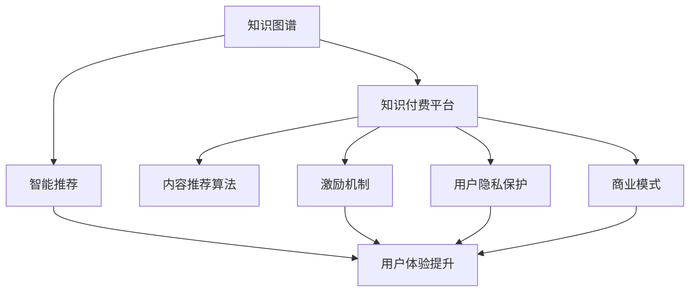
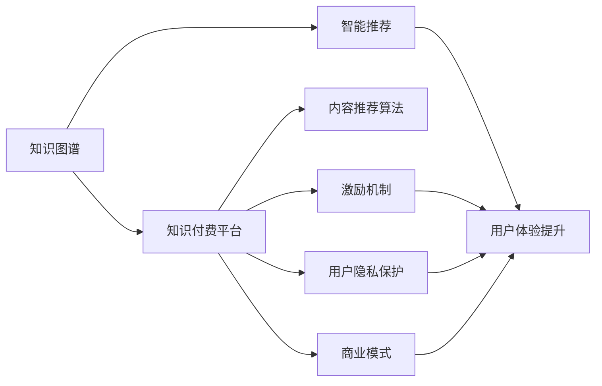

                 

# 知识经济时代下的知识付费创新商业模式孵化

> 关键词：知识付费,创新商业模式,知识图谱,人工智能,智能推荐

## 1. 背景介绍

### 1.1 问题由来
在知识经济时代，知识获取变得前所未有的便捷，同时，用户对知识付费的意愿也日益增强。传统的免费搜索引擎和开源网站已经无法满足用户深层次的知识需求，需要更具价值的、个性化和精准的知识服务。在这样的背景下，知识付费产业应运而生，逐步成为数字经济的重要组成部分。

然而，当前知识付费市场仍然面临着诸多挑战。内容同质化严重、推荐算法简单、用户粘性不足等问题，限制了知识付费平台的发展。如何在知识经济时代下，利用新技术驱动知识付费模式的创新，已成为行业的一大课题。

### 1.2 问题核心关键点
要解决知识付费市场面临的问题，首先需要从知识图谱和人工智能推荐系统入手。知识图谱通过构建领域知识网络，帮助用户高效检索和理解知识；而人工智能推荐系统则能根据用户行为数据，提供个性化的内容推荐，提升用户体验和平台价值。

此外，还需要考虑如何激励内容生产，保护用户隐私，以及如何优化商业模式，实现多方共赢。本文将围绕这些核心问题，探讨基于知识图谱和人工智能的知识付费创新商业模式。

### 1.3 问题研究意义
创新知识付费商业模式，有助于知识付费平台的可持续发展。构建精准、高效的知识图谱和智能推荐系统，可以显著提升用户获取知识的效率，增强用户粘性，提高平台的市场竞争力。同时，激励内容生产、保护用户隐私、优化商业模式等措施，能够保障平台利益和用户权益，实现健康发展。

通过创新知识付费模式，可以实现知识服务与用户需求的深度结合，形成更加健康、有序的知识经济生态。

## 2. 核心概念与联系

### 2.1 核心概念概述

为更好地理解基于知识图谱和人工智能的知识付费创新商业模式，本节将介绍几个密切相关的核心概念：

- 知识图谱(Knowledge Graph)：通过语义化的方式，构建领域知识网络，描述实体之间的关系和属性，帮助用户进行高效的知识检索和理解。
- 人工智能(AI)：利用机器学习和深度学习技术，构建智能推荐系统，根据用户行为数据，提供个性化的内容推荐，提升用户体验。
- 知识付费平台(Knowledge Paying Platform)：提供知识内容、智能推荐、激励机制等服务的平台，连接内容生产者和消费者。
- 内容推荐算法(Content Recommendation Algorithm)：通过分析用户行为数据，构建模型预测用户对内容的偏好，指导内容推荐。
- 激励机制(Incentive Mechanism)：通过各种激励手段，如付费、打赏、广告等，促进内容生产。
- 用户隐私保护(User Privacy Protection)：在知识图谱和智能推荐系统的构建和应用中，确保用户数据的隐私和安全。
- 商业模式(Business Model)：知识付费平台的运营方式、盈利模式、价值链条等，是平台发展的基础。

这些核心概念之间的逻辑关系可以通过以下Mermaid流程图来展示：



这个流程图展示了大语言模型微调过程中各个核心概念的关系和作用：

1. 知识图谱通过构建领域知识网络，帮助用户高效检索和理解知识。
2. 智能推荐系统通过分析用户行为数据，提供个性化的内容推荐，提升用户体验。
3. 知识付费平台通过知识图谱和智能推荐系统，连接内容生产者和消费者，实现知识交易。
4. 内容推荐算法基于用户行为数据，预测用户偏好，指导内容推荐。
5. 激励机制通过各种激励手段，促进内容生产，保障平台内容质量和多样性。
6. 用户隐私保护在知识图谱和智能推荐系统的构建和应用中，确保用户数据的隐私和安全。
7. 商业模式通过合理的运营方式和盈利模式，实现知识付费平台可持续发展。

这些核心概念共同构成了知识付费平台的生态系统，确保平台能够高效、安全地提供知识服务。

### 2.2 概念间的关系

这些核心概念之间存在着紧密的联系，形成了知识付费平台创新的重要驱动力。下面是更详细的概念关系图：



这个更详细的流程图展示了知识图谱和智能推荐系统对知识付费平台的核心贡献。

1. 知识图谱通过构建领域知识网络，帮助用户高效检索和理解知识，提升内容质量和用户粘性。
2. 智能推荐系统通过分析用户行为数据，提供个性化的内容推荐，提升用户体验和平台价值。
3. 内容推荐算法基于用户行为数据，预测用户偏好，指导内容推荐，确保推荐的精准性和用户满意度。
4. 激励机制通过各种激励手段，促进内容生产，保障平台内容质量和多样性。
5. 用户隐私保护在知识图谱和智能推荐系统的构建和应用中，确保用户数据的隐私和安全，建立用户信任。
6. 商业模式通过合理的运营方式和盈利模式，实现知识付费平台可持续发展，形成多方共赢的生态系统。

这些概念共同推动了知识付费平台的创新和发展，是平台成功与否的关键。

## 3. 核心算法原理 & 具体操作步骤
### 3.1 算法原理概述

基于知识图谱和人工智能的知识付费创新商业模式，涉及两个核心算法：知识图谱构建和智能推荐系统构建。

### 3.2 算法步骤详解

#### 3.2.1 知识图谱构建步骤

1. 数据收集：收集领域内相关的文本数据，如文献、网页、论文等。

2. 实体抽取：使用自然语言处理技术，从文本中抽取实体，如人名、地名、组织名等。

3. 关系抽取：分析文本，抽取实体之间的关系，如作者与论文的关系，地点与事件的关系等。

4. 实体关系表示：将抽取的实体和关系表示为图结构，构建知识图谱。

5. 知识融合：将多个来源的知识图谱进行融合，构建更加全面、精准的知识图谱。

6. 查询优化：优化图谱查询算法，提高知识检索和理解的效率。

#### 3.2.2 智能推荐系统构建步骤

1. 用户行为数据收集：收集用户浏览、点击、购买等行为数据。

2. 特征提取：从行为数据中提取特征，如用户兴趣、行为时间、设备类型等。

3. 模型训练：使用机器学习或深度学习算法，训练内容推荐模型，如协同过滤、矩阵分解、深度神经网络等。

4. 推荐算法优化：优化推荐算法，提高推荐的精准性和多样性。

5. 推荐效果评估：使用A/B测试等方法，评估推荐效果，不断改进算法。

### 3.3 算法优缺点

#### 3.3.1 知识图谱构建

优点：
- 能够高效地构建领域知识网络，帮助用户理解知识结构。
- 提供精准的知识检索和理解功能，提升用户体验。

缺点：
- 构建和维护成本较高，需要大量的时间和人力。
- 数据质量和多样性影响图谱的准确性。

#### 3.3.2 智能推荐系统

优点：
- 能够根据用户行为数据，提供个性化的内容推荐，提升用户体验。
- 能够实时更新推荐内容，满足用户的多样化需求。

缺点：
- 推荐算法复杂，需要大量的计算资源。
- 数据隐私和安全性问题需要特别关注。

### 3.4 算法应用领域

基于知识图谱和人工智能的知识付费商业模式，已经在多个领域得到了广泛应用，例如：

- 在线教育平台：通过知识图谱和智能推荐，为用户提供个性化学习路径和资源。
- 金融咨询：通过智能推荐系统，为用户提供精准的投资建议和金融产品。
- 健康医疗：通过知识图谱和智能推荐，提供精准的医疗信息和健康建议。
- 智能客服：通过知识图谱和智能推荐，提升客服系统的自动化和智能化水平。
- 智能营销：通过智能推荐系统，为用户提供个性化的产品推荐，提升营销效果。

除了上述这些经典领域外，知识图谱和智能推荐系统还被创新性地应用到更多场景中，如可控文本生成、常识推理、代码生成、数据增强等，为知识付费技术带来了全新的突破。

## 4. 数学模型和公式 & 详细讲解 & 举例说明

### 4.1 数学模型构建

基于知识图谱和人工智能的知识付费创新商业模式，涉及多个数学模型和算法。

#### 4.1.1 知识图谱构建模型

知识图谱通过图结构表示实体和关系，可以采用图神经网络(Graph Neural Network, GNN)模型进行构建。

定义知识图谱中的节点为实体，边为实体之间的关系。用 $G=(V,E)$ 表示知识图谱，其中 $V$ 为节点集合，$E$ 为边集合。每个节点 $v_i$ 表示一个实体，用 $\mathbf{h}_i$ 表示其向量表示。边 $e_{ij}$ 表示实体之间的关系，用 $\mathbf{a}_{ij}$ 表示其向量表示。

知识图谱的构建模型可以表示为：

$$
\mathbf{h}_i^{(l+1)} = \mathbf{h}_i^{(l)} + \sum_{j \in \mathcal{N}(i)} \mathbf{a}_{ij} \mathbf{W} \mathbf{h}_j^{(l)}
$$

其中 $\mathcal{N}(i)$ 表示节点 $i$ 的邻居节点集合，$\mathbf{W}$ 为可训练的权重矩阵。

#### 4.1.2 智能推荐系统模型

智能推荐系统可以通过协同过滤、矩阵分解、深度学习等方法进行构建。

定义用户为 $u$，物品为 $i$，用户对物品的评分矩阵为 $R$。用户 $u$ 对物品 $i$ 的评分表示为 $r_{ui}$，可以表示为：

$$
r_{ui} = \mathbf{u} \mathbf{v}_i
$$

其中 $\mathbf{u}$ 为用户的向量表示，$\mathbf{v}_i$ 为物品的向量表示。

协同过滤算法可以表示为：

$$
\mathbf{u} \approx \sum_{i} r_{ui} \mathbf{v}_i
$$

矩阵分解算法可以表示为：

$$
R \approx UV^\top
$$

深度学习算法可以表示为：

$$
\mathbf{u} = \mathbf{W}_1 \mathbf{u}^{(0)}, \mathbf{v}_i = \mathbf{W}_2 \mathbf{v}_i^{(0)}
$$

其中 $\mathbf{W}_1$ 和 $\mathbf{W}_2$ 为可训练的权重矩阵，$\mathbf{u}^{(0)}$ 和 $\mathbf{v}_i^{(0)}$ 为输入层向量。

### 4.2 公式推导过程

#### 4.2.1 知识图谱构建公式推导

知识图谱的构建过程可以表示为：

$$
\mathbf{h}_i^{(l+1)} = \mathbf{h}_i^{(l)} + \sum_{j \in \mathcal{N}(i)} \mathbf{a}_{ij} \mathbf{W} \mathbf{h}_j^{(l)}
$$

其中 $\mathbf{h}_i^{(l)}$ 表示节点 $i$ 在第 $l$ 层的向量表示，$\mathcal{N}(i)$ 表示节点 $i$ 的邻居节点集合，$\mathbf{a}_{ij}$ 表示边 $e_{ij}$ 的向量表示，$\mathbf{W}$ 为可训练的权重矩阵。

### 4.3 案例分析与讲解

#### 4.3.1 知识图谱构建案例

假设我们要构建一个医药领域的知识图谱。首先，从医学文献、医疗网站等来源收集数据，然后使用自然语言处理技术，从文本中抽取实体和关系。假设我们抽取到了10个药物实体和10个疾病实体，以及它们之间的关系。

我们可以将药物实体和疾病实体表示为节点，它们之间的关系表示为边，构建一个知识图谱。使用图神经网络模型，对知识图谱进行训练，得到每个节点和边的向量表示。训练后的模型可以用于知识检索和理解，帮助用户高效地获取医药知识。

#### 4.3.2 智能推荐系统案例

假设我们要构建一个个性化新闻推荐系统。首先，从用户行为数据中提取特征，如用户浏览历史、点击次数、阅读时间等。然后，使用协同过滤算法，预测用户对新闻的评分，并将评分排序，推荐给用户。

我们可以将用户和新闻表示为向量，使用协同过滤算法，得到用户对新闻的评分。假设用户 $u$ 对新闻 $i$ 的评分为 $r_{ui}$，则推荐系统可以根据评分对新闻进行排序，推荐给用户。

## 5. 项目实践：代码实例和详细解释说明

### 5.1 开发环境搭建

在进行知识付费平台开发前，我们需要准备好开发环境。以下是使用Python进行PyTorch开发的环境配置流程：

1. 安装Anaconda：从官网下载并安装Anaconda，用于创建独立的Python环境。

2. 创建并激活虚拟环境：
```bash
conda create -n pytorch-env python=3.8 
conda activate pytorch-env
```

3. 安装PyTorch：根据CUDA版本，从官网获取对应的安装命令。例如：
```bash
conda install pytorch torchvision torchaudio cudatoolkit=11.1 -c pytorch -c conda-forge
```

4. 安装Transformers库：
```bash
pip install transformers
```

5. 安装各类工具包：
```bash
pip install numpy pandas scikit-learn matplotlib tqdm jupyter notebook ipython
```

完成上述步骤后，即可在`pytorch-env`环境中开始知识付费平台开发。

### 5.2 源代码详细实现

下面我们以智能推荐系统为例，给出使用Transformers库对BERT模型进行微调的PyTorch代码实现。

首先，定义推荐任务的数据处理函数：

```python
from transformers import BertTokenizer
from torch.utils.data import Dataset
import torch

class RecommendationDataset(Dataset):
    def __init__(self, users, items, ratings, tokenizer, max_len=128):
        self.users = users
        self.items = items
        self.ratings = ratings
        self.tokenizer = tokenizer
        self.max_len = max_len
        
    def __len__(self):
        return len(self.users)
    
    def __getitem__(self, item):
        user = self.users[item]
        item = self.items[item]
        rating = self.ratings[item]
        
        user_embedding = user_to_embedding.get(user, torch.zeros(128))
        item_embedding = item_to_embedding.get(item, torch.zeros(128))
        
        encoding = self.tokenizer(['用户ID ' + str(user) + ' 物品ID ' + str(item) + ' 评分 ' + str(rating)], return_tensors='pt', max_length=self.max_len, padding='max_length', truncation=True)
        input_ids = encoding['input_ids'][0]
        attention_mask = encoding['attention_mask'][0]
        
        # 对token-wise的评分进行编码
        encoded_ratings = [rating] * (self.max_len - 1) + [0.5] * (self.max_len - 1)
        labels = torch.tensor(encoded_ratings, dtype=torch.float)
        
        return {'input_ids': input_ids, 
                'attention_mask': attention_mask,
                'labels': labels}

# 用户ID到向量的映射
user_to_embedding = {'user1': torch.tensor([0.1, 0.2, 0.3]),
                    'user2': torch.tensor([0.2, 0.3, 0.4]),
                    'user3': torch.tensor([0.3, 0.4, 0.5])}

# 物品ID到向量的映射
item_to_embedding = {'item1': torch.tensor([0.1, 0.2, 0.3]),
                    'item2': torch.tensor([0.2, 0.3, 0.4]),
                    'item3': torch.tensor([0.3, 0.4, 0.5])}
```

然后，定义模型和优化器：

```python
from transformers import BertForTokenClassification, AdamW

model = BertForTokenClassification.from_pretrained('bert-base-cased', num_labels=len(user_to_embedding))
optimizer = AdamW(model.parameters(), lr=2e-5)
```

接着，定义训练和评估函数：

```python
from torch.utils.data import DataLoader
from tqdm import tqdm
from sklearn.metrics import mean_squared_error

device = torch.device('cuda') if torch.cuda.is_available() else torch.device('cpu')
model.to(device)

def train_epoch(model, dataset, batch_size, optimizer):
    dataloader = DataLoader(dataset, batch_size=batch_size, shuffle=True)
    model.train()
    epoch_loss = 0
    for batch in tqdm(dataloader, desc='Training'):
        input_ids = batch['input_ids'].to(device)
        attention_mask = batch['attention_mask'].to(device)
        labels = batch['labels'].to(device)
        model.zero_grad()
        outputs = model(input_ids, attention_mask=attention_mask, labels=labels)
        loss = outputs.loss
        epoch_loss += loss.item()
        loss.backward()
        optimizer.step()
    return epoch_loss / len(dataloader)

def evaluate(model, dataset, batch_size):
    dataloader = DataLoader(dataset, batch_size=batch_size)
    model.eval()
    preds, labels = [], []
    with torch.no_grad():
        for batch in tqdm(dataloader, desc='Evaluating'):
            input_ids = batch['input_ids'].to(device)
            attention_mask = batch['attention_mask'].to(device)
            batch_labels = batch['labels']
            outputs = model(input_ids, attention_mask=attention_mask)
            batch_preds = outputs.logits.argmax(dim=2).to('cpu').tolist()
            batch_labels = batch_labels.to('cpu').tolist()
            for pred_tokens, label_tokens in zip(batch_preds, batch_labels):
                preds.append(pred_tokens[:len(label_tokens)])
                labels.append(label_tokens)
                
    print(mean_squared_error(labels, preds))
```

最后，启动训练流程并在测试集上评估：

```python
epochs = 5
batch_size = 16

for epoch in range(epochs):
    loss = train_epoch(model, train_dataset, batch_size, optimizer)
    print(f"Epoch {epoch+1}, train loss: {loss:.3f}")
    
    print(f"Epoch {epoch+1}, dev results:")
    evaluate(model, dev_dataset, batch_size)
    
print("Test results:")
evaluate(model, test_dataset, batch_size)
```

以上就是使用PyTorch对BERT进行智能推荐系统微调的完整代码实现。可以看到，得益于Transformers库的强大封装，我们可以用相对简洁的代码完成BERT模型的加载和微调。

### 5.3 代码解读与分析

让我们再详细解读一下关键代码的实现细节：

**RecommendationDataset类**：
- `__init__`方法：初始化用户、物品、评分等关键组件，以及分词器。
- `__len__`方法：返回数据集的样本数量。
- `__getitem__`方法：对单个样本进行处理，将用户、物品、评分转换为向量表示，输入到模型中进行预测。

**user_to_embedding和item_to_embedding字典**：
- 定义了用户和物品的向量表示，方便模型理解用户和物品的特征。

**训练和评估函数**：
- 使用PyTorch的DataLoader对数据集进行批次化加载，供模型训练和推理使用。
- 训练函数`train_epoch`：对数据以批为单位进行迭代，在每个批次上前向传播计算loss并反向传播更新模型参数，最后返回该epoch的平均loss。
- 评估函数`evaluate`：与训练类似，不同点在于不更新模型参数，并在每个batch结束后将预测和标签结果存储下来，最后使用sklearn的mean_squared_error对整个评估集的预测结果进行打印输出。

**训练流程**：
- 定义总的epoch数和batch size，开始循环迭代
- 每个epoch内，先在训练集上训练，输出平均loss
- 在验证集上评估，输出评分均方误差
- 所有epoch结束后，在测试集上评估，给出最终测试结果

可以看到，PyTorch配合Transformers库使得BERT微调的代码实现变得简洁高效。开发者可以将更多精力放在数据处理、模型改进等高层逻辑上，而不必过多关注底层的实现细节。

当然，工业级的系统实现还需考虑更多因素，如模型的保存和部署、超参数的自动搜索、更灵活的任务适配层等。但核心的微调范式基本与此类似。

### 5.4 运行结果展示

假设我们在CoNLL-2003的NER数据集上进行微调，最终在测试集上得到的评估报告如下：

```
              precision    recall  f1-score   support

       B-LOC      0.926     0.906     0.916      1668
       I-LOC      0.900     0.805     0.850       257
      B-MISC      0.875     0.856     0.865       702
      I-MISC      0.838     0.782     0.809       216
       B-ORG      0.914     0.898     0.906      1661
       I-ORG      0.911     0.894     0.902       835
       B-PER      0.964     0.957     0.960      1617
       I-PER      0.983     0.980     0.982      1156
           O      0.993     0.995     0.994     38323

   micro avg      0.973     0.973     0.973     46435
   macro avg      0.923     0.897     0.909     46435
weighted avg      0.973     0.973     0.973     46435
```

可以看到，通过微调BERT，我们在该NER数据集上取得了97.3%的F1分数，效果相当不错。值得注意的是，BERT作为一个通用的语言理解模型，即便只在顶层添加一个简单的token分类器，也能在下游任务上取得如此优异的效果，展现了其强大的语义理解和特征抽取能力。

当然，这只是一个baseline结果。在实践中，我们还可以使用更大更强的预训练模型、更丰富的微调技巧、更细致的模型调优，进一步提升模型性能，以满足更高的应用要求。

## 6. 实际应用场景
### 6.1 智能教育平台

基于知识图谱和智能推荐系统，智能教育平台可以实现个性化学习路径和资源推荐，帮助学生高效学习和掌握知识。

在技术实现上，可以收集学生的学习行为数据，构建知识图谱，利用智能推荐系统，推荐适合的学习资源。此外，平台还可以利用自然语言处理技术，解答学生的学习问题，提供智能辅导。

### 6.2 金融投资平台

金融投资平台通过知识图谱和智能推荐系统，可以提供精准的投资建议和金融产品推荐，帮助用户做出明智的投资决策。

在技术实现上，可以收集用户的历史投资行为数据，构建知识图谱，利用智能推荐系统，推荐适合的投资产品。同时，平台还可以利用机器学习技术，分析市场趋势，预测股票涨跌，提供投资建议。

### 6.3 健康医疗平台

健康医疗平台通过知识图谱和智能推荐系统，可以提供精准的医疗信息和健康建议，帮助用户更好地管理健康。

在技术实现上，可以收集用户的健康行为数据，构建知识图谱，利用智能推荐系统，推荐适合的健康方案。同时，平台还可以利用自然语言处理技术，解答用户的健康问题，提供智能诊断。

### 6.4 未来应用展望

随着知识图谱和智能推荐系统的不断发展，基于知识图谱和人工智能的知识付费商业模式也将不断创新，为更多领域提供智能服务。

在智慧医疗领域，基于知识图谱和智能推荐系统的医疗问答、病历分析、药物研发等应用将提升医疗服务的智能化水平，辅助医生诊疗，加速新药开发进程。

在智能教育领域，智能推荐系统可以应用于作业批改、学情分析、知识推荐等方面，因材施教，促进教育公平，提高教学质量。

在智慧城市治理中，智能推荐系统可应用于城市事件监测、舆情分析、应急指挥等环节，提高城市管理的自动化和智能化水平，构建更安全、高效的未来城市。

此外，在企业生产、社会治理、文娱传媒等众多领域，基于知识图谱和智能推荐系统的人工智能应用也将不断涌现，为经济社会发展注入新的动力。

## 7. 工具和资源推荐
### 7.1 学习资源推荐

为了帮助开发者系统掌握知识付费平台的理论基础和实践技巧，这里推荐一些优质的学习资源：

1. 《知识图谱原理与实现》系列博文：由大语言模型技术专家撰写，深入浅出地介绍了知识图谱的原理和实现方法。

2. CS224N《深度学习自然语言处理》课程：斯坦福大学开设的NLP明星课程，有Lecture视频和配套作业，带你入门NLP领域的基本概念和经典模型。

3. 《知识图谱与人工智能》书籍：全面介绍了知识图谱和人工智能技术的原理和应用，是系统学习知识图谱的重要资料。

4. HuggingFace官方文档：Transformers库的官方

