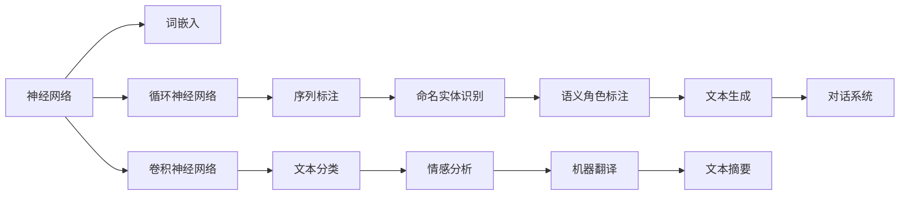
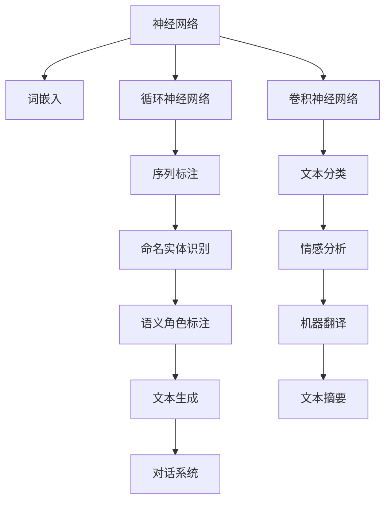
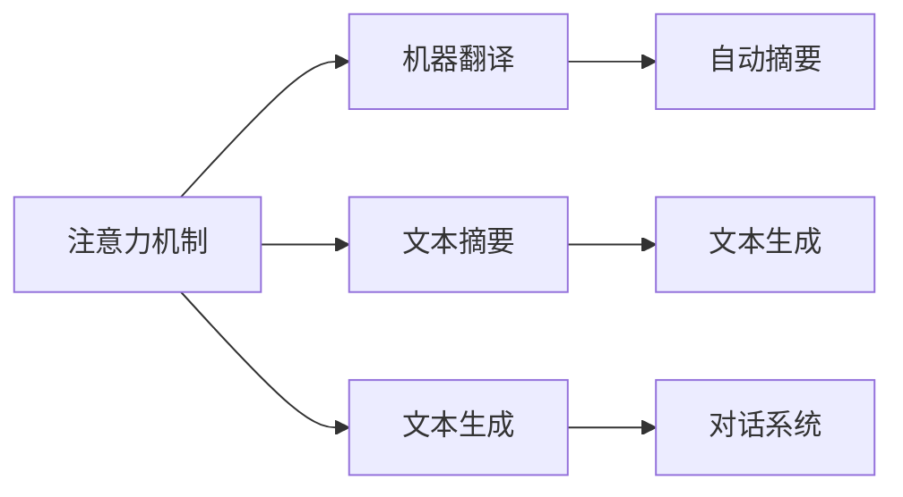
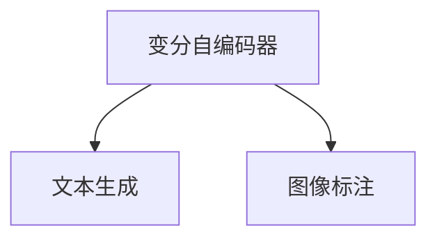
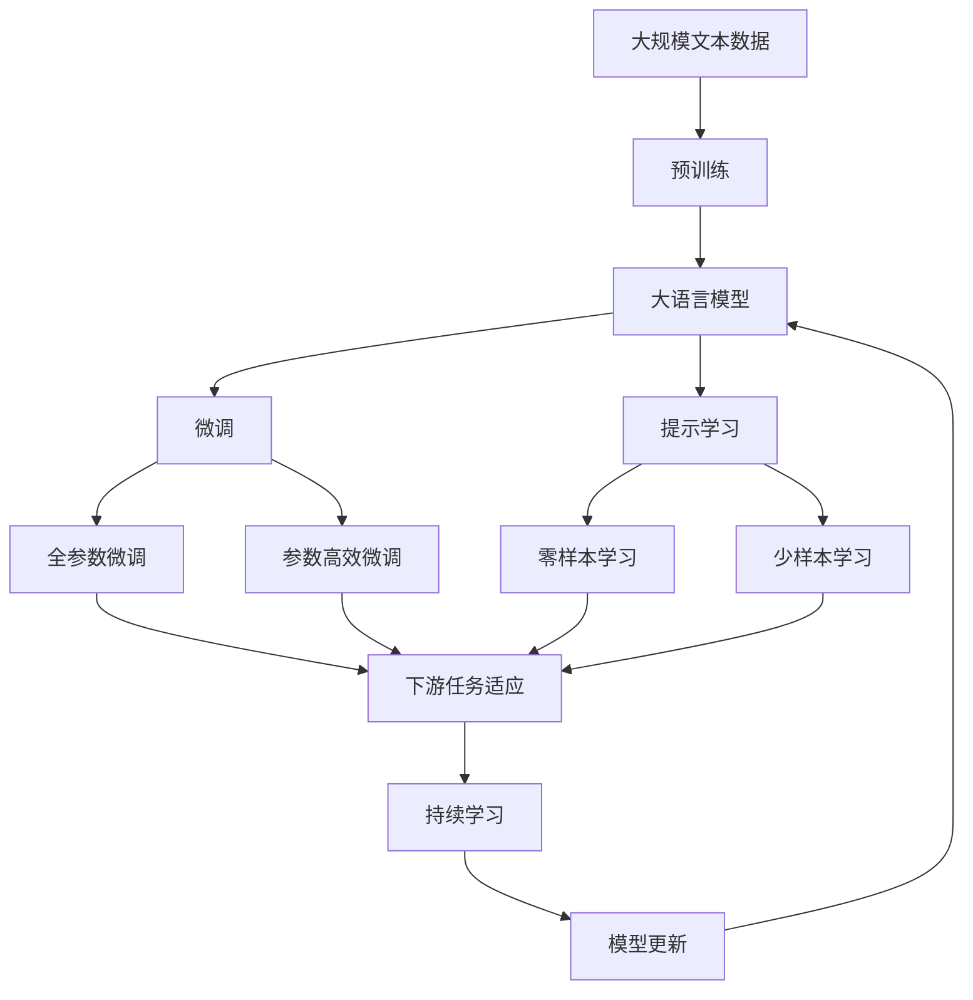

                 

## 1. 背景介绍

### 1.1 问题由来
在过去的几十年里，人工智能技术取得了长足的进步，其中自然语言处理(Natural Language Processing, NLP)是近年来发展最为迅猛的领域之一。NLP的目的是让计算机能够理解、处理和生成人类语言，使其成为有用的人工智能助手。神经网络在NLP中扮演了重要角色，从词嵌入、句法分析到机器翻译、问答系统，几乎所有NLP任务中都能看到神经网络的身影。

### 1.2 问题核心关键点
神经网络在NLP中的应用，大致可以分为以下几个方面：
1. **词嵌入**：通过神经网络学习单词的向量表示，从而捕捉单词之间的语义关系。
2. **句法分析**：利用神经网络模型解析句子的语法结构，包括依存句法分析和成分句法分析。
3. **语义分析**：通过神经网络模型理解句子的语义，包括语义角色标注和实体识别。
4. **生成式建模**：利用神经网络模型生成文本，包括机器翻译、对话系统和文本生成。
5. **序列标注**：神经网络在文本分类、命名实体识别和情感分析等任务中广泛应用。

这些应用展现了神经网络在NLP领域的强大能力，同时也揭示了神经网络在处理序列数据方面的优势。

### 1.3 问题研究意义
神经网络在NLP中的应用，对于推动人工智能技术的产业化进程，具有重要意义：
1. 提升了NLP技术的智能化水平，使机器能够更好地理解人类语言。
2. 推动了NLP技术在工业界的广泛应用，如智能客服、智能翻译、智能问答等。
3. 促进了多模态NLP技术的发展，如语音识别、图像标注等。
4. 加速了NLP技术在各个垂直领域的应用，如医疗、金融、教育等。
5. 拓展了NLP技术的应用场景，如推荐系统、舆情监测等。

因此，研究神经网络在NLP中的应用，对于拓展NLP技术的边界，提升应用效果，具有重要意义。

## 2. 核心概念与联系

### 2.1 核心概念概述

为更好地理解神经网络在NLP中的应用，本节将介绍几个密切相关的核心概念：

- **神经网络**：一种能够学习输入和输出之间映射关系的计算模型，由大量人工神经元组成。
- **词嵌入**：将单词映射到高维向量空间中，使单词的语义信息得以保留和利用。
- **循环神经网络**：一种特殊的神经网络，能够处理序列数据，常用于处理自然语言文本。
- **卷积神经网络**：一种特殊的神经网络，能够捕捉局部特征，常用于文本分类和图像标注等任务。
- **注意力机制**：一种能够让神经网络动态选择关注不同输入位置的机制，常用于机器翻译和文本摘要等任务。
- **变分自编码器**：一种用于生成式建模的神经网络，能够学习数据分布，生成新的数据样本。

这些核心概念之间的逻辑关系可以通过以下Mermaid流程图来展示：



这个流程图展示了大语言模型的核心概念及其之间的关系：

1. 神经网络作为基本计算模型，可以通过各种类型的神经网络模型，处理不同NLP任务。
2. 词嵌入和循环神经网络是处理序列数据的基本工具。
3. 卷积神经网络常用于文本分类和图像标注等任务。
4. 注意力机制增强了神经网络的表示能力，应用于机器翻译和文本摘要等任务。
5. 变分自编码器常用于生成式建模，生成新的文本样本。

这些核心概念共同构成了神经网络在NLP中的应用框架，使其能够灵活处理各种序列数据。

### 2.2 概念间的关系

这些核心概念之间存在着紧密的联系，形成了神经网络在NLP中的应用生态系统。下面我通过几个Mermaid流程图来展示这些概念之间的关系。

#### 2.2.1 神经网络在NLP中的应用



这个流程图展示了神经网络在NLP中的主要应用，包括词嵌入、序列标注、文本分类、情感分析、机器翻译、文本生成和文本摘要等任务。

#### 2.2.2 注意力机制的应用



这个流程图展示了注意力机制在机器翻译、文本摘要、文本生成和对话系统中的应用，增强了模型对长序列数据的处理能力。

#### 2.2.3 变分自编码器的应用



这个流程图展示了变分自编码器在文本生成和图像标注中的应用，能够学习数据的分布，生成新的数据样本。

### 2.3 核心概念的整体架构

最后，我们用一个综合的流程图来展示这些核心概念在大语言模型中的应用：



这个综合流程图展示了从预训练到微调，再到持续学习的完整过程。大语言模型首先在大规模文本数据上进行预训练，然后通过微调或提示学习实现微调。微调可以考虑全参数微调和参数高效微调两种方式。通过提示学习可以实现零样本和少样本学习。微调过程可以不断更新和适应新的任务和数据，通过持续学习技术，模型可以不断学习新知识，避免遗忘旧知识。

通过这些流程图，我们可以更清晰地理解神经网络在NLP中的应用过程，为后续深入讨论具体的神经网络模型及其应用奠定基础。

## 3. 核心算法原理 & 具体操作步骤

### 3.1 算法原理概述

神经网络在NLP中的应用，主要基于序列数据的特征提取和序列建模能力。序列数据是NLP中最常见的数据类型，如文本、语音等，神经网络通过其强大的非线性映射能力，能够处理复杂的序列模式和关系。

神经网络模型通常由多个层组成，每一层都由一组神经元构成。这些神经元通过加权和的形式，计算输入数据的表示，并通过激活函数引入非线性变换。最终，神经网络将输入数据转换为高维向量，用于后续的分类、回归或生成任务。

在NLP中，神经网络模型的输入通常是文本序列，输出可以是文本分类、命名实体识别、机器翻译等。模型的目标是通过学习输入和输出之间的映射关系，使模型能够对新样本进行准确预测。

### 3.2 算法步骤详解

神经网络在NLP中的应用，通常包括以下几个关键步骤：

**Step 1: 准备数据集**
- 收集标注好的NLP任务数据集，如文本分类、命名实体识别等。
- 对文本进行分词、去除停用词、标注等预处理。

**Step 2: 构建神经网络模型**
- 选择合适的神经网络架构，如循环神经网络、卷积神经网络、Transformer等。
- 定义模型层数、神经元数、激活函数等超参数。

**Step 3: 训练模型**
- 将数据集划分为训练集、验证集和测试集。
- 使用反向传播算法，对模型进行训练，优化损失函数。
- 在验证集上评估模型性能，调整超参数。

**Step 4: 评估模型**
- 在测试集上评估模型性能，使用分类准确率、F1分数等指标。
- 分析模型错误，进行模型改进。

**Step 5: 部署模型**
- 将训练好的模型保存为文件或模型服务。
- 集成到实际应用系统中，如智能客服、智能翻译等。

这些步骤构成了神经网络在NLP中应用的完整流程。通过不断的迭代和优化，神经网络在NLP中的应用效果将不断提升。

### 3.3 算法优缺点

神经网络在NLP中的应用，具有以下优点：
1. 强大的特征提取能力。神经网络能够自动学习输入数据的特征表示，捕捉数据的复杂模式。
2. 非线性映射能力。神经网络能够处理复杂的非线性关系，适用于多模态数据的建模。
3. 端到端学习。神经网络可以一次性训练输入和输出之间的映射关系，避免中间表示层的冗余。

但同时也存在一些缺点：
1. 模型复杂度高。神经网络需要大量的参数和计算资源，模型训练和推理开销较大。
2. 过拟合风险高。神经网络模型容易过拟合，特别是在数据量较小的情况下。
3. 模型可解释性差。神经网络模型通常被视为"黑盒"系统，难以解释其内部的决策过程。

尽管存在这些缺点，但神经网络在NLP中的应用效果显著，已经成为NLP领域的重要技术。

### 3.4 算法应用领域

神经网络在NLP中的应用非常广泛，涵盖了以下领域：

- **文本分类**：如情感分析、主题分类等。通过神经网络学习文本的分类特征。
- **命名实体识别**：识别文本中的实体，如人名、地名、组织名等。通过序列标注模型进行标注。
- **机器翻译**：将源语言文本翻译成目标语言。通过序列到序列模型进行翻译。
- **对话系统**：构建智能客服、智能问答等对话系统。通过生成式模型进行对话生成。
- **文本生成**：生成新闻摘要、自动生成文本等。通过生成式模型进行文本生成。
- **语音识别**：将语音转换成文本。通过神经网络进行语音识别。
- **图像标注**：给图像中的物体进行标注。通过神经网络进行图像标注。

此外，神经网络还被应用于情感分析、问答系统、文本摘要等任务，展示了其在NLP领域的强大能力。

## 4. 数学模型和公式 & 详细讲解 & 举例说明

### 4.1 数学模型构建

在NLP中，神经网络模型的输入通常是文本序列，输出可以是文本分类、命名实体识别、机器翻译等。模型的目标是通过学习输入和输出之间的映射关系，使模型能够对新样本进行准确预测。

假设输入文本为 $\mathbf{x}=[x_1, x_2, \ldots, x_n]$，其中 $x_i$ 表示第 $i$ 个单词的向量表示。模型通过多层神经网络处理输入序列，最终输出一个 $d$ 维向量 $\mathbf{y}=[y_1, y_2, \ldots, y_n]$，表示文本的分类结果或序列标注结果。

常见的NLP神经网络模型包括循环神经网络、卷积神经网络和Transformer等。这里以循环神经网络为例，构建文本分类模型。

### 4.2 公式推导过程

假设输入文本长度为 $n$，循环神经网络包含 $h$ 个隐藏层神经元，模型参数为 $\theta$，包括权重矩阵和偏置向量。模型的前向传播过程可以表示为：

$$
\mathbf{h}^{(1)} = \tanh(\mathbf{W}_h \mathbf{x} + \mathbf{b}_h)
$$

$$
\mathbf{h}^{(2)} = \tanh(\mathbf{W}_h \mathbf{h}^{(1)} + \mathbf{b}_h)
$$

$$
\ldots
$$

$$
\mathbf{h}^{(h)} = \tanh(\mathbf{W}_h \mathbf{h}^{(h-1)} + \mathbf{b}_h)
$$

$$
\mathbf{y} = \mathbf{W}_y \mathbf{h}^{(h)} + \mathbf{b}_y
$$

其中 $\mathbf{W}_h$ 和 $\mathbf{b}_h$ 为隐藏层的权重和偏置，$\mathbf{W}_y$ 和 $\mathbf{b}_y$ 为输出层的权重和偏置。$\tanh$ 为激活函数，通常使用双曲正切函数。

模型的损失函数通常使用交叉熵损失函数，表示为：

$$
\mathcal{L} = -\frac{1}{n}\sum_{i=1}^n \sum_{j=1}^d y_{ij}\log\sigma(\mathbf{w}_i^\top \mathbf{h}^{(h)}) + (1-y_{ij})\log(1-\sigma(\mathbf{w}_i^\top \mathbf{h}^{(h)}))
$$

其中 $\sigma$ 为 sigmoid 函数，用于将神经元的输出映射到 $[0,1]$ 区间。

### 4.3 案例分析与讲解

假设我们在CoNLL-2003的命名实体识别(NER)数据集上进行循环神经网络模型的训练，以评估其性能。

首先，定义模型类：

```python
import torch
import torch.nn as nn
import torch.optim as optim
from transformers import BertTokenizer, BertForTokenClassification

class NERModel(nn.Module):
    def __init__(self, num_labels):
        super(NERModel, self).__init__()
        self.bert = BertForTokenClassification.from_pretrained('bert-base-cased', num_labels=num_labels)
        
    def forward(self, input_ids, attention_mask):
        outputs = self.bert(input_ids=input_ids, attention_mask=attention_mask)
        return outputs.logits
```

然后，定义训练函数：

```python
def train_epoch(model, train_loader, optimizer):
    model.train()
    total_loss = 0
    for batch in train_loader:
        input_ids, attention_mask, labels = batch
        outputs = model(input_ids, attention_mask)
        loss = criterion(outputs, labels)
        optimizer.zero_grad()
        loss.backward()
        optimizer.step()
        total_loss += loss.item()
    return total_loss / len(train_loader)
```

最后，训练模型并评估性能：

```python
epochs = 5
batch_size = 16

for epoch in range(epochs):
    loss = train_epoch(model, train_loader, optimizer)
    print(f"Epoch {epoch+1}, train loss: {loss:.3f}")
    
    print(f"Epoch {epoch+1}, dev results:")
    evaluate(model, dev_loader, criterion)
    
print("Test results:")
evaluate(model, test_loader, criterion)
```

以上就是使用PyTorch对循环神经网络模型进行NER任务训练的完整代码实现。可以看到，通过定义模型、损失函数和优化器，以及定义训练函数，我们能够快速搭建并训练循环神经网络模型，以实现NER任务。

## 5. 项目实践：代码实例和详细解释说明

### 5.1 开发环境搭建

在进行项目实践前，我们需要准备好开发环境。以下是使用Python进行PyTorch开发的环境配置流程：

1. 安装Anaconda：从官网下载并安装Anaconda，用于创建独立的Python环境。

2. 创建并激活虚拟环境：
```bash
conda create -n pytorch-env python=3.8 
conda activate pytorch-env
```

3. 安装PyTorch：根据CUDA版本，从官网获取对应的安装命令。例如：
```bash
conda install pytorch torchvision torchaudio cudatoolkit=11.1 -c pytorch -c conda-forge
```

4. 安装Transformers库：
```bash
pip install transformers
```

5. 安装各类工具包：
```bash
pip install numpy pandas scikit-learn matplotlib tqdm jupyter notebook ipython
```

完成上述步骤后，即可在`pytorch-env`环境中开始项目实践。

### 5.2 源代码详细实现

这里我们以文本分类任务为例，使用循环神经网络对IMDB影评数据集进行分类。

首先，定义数据处理函数：

```python
from torch.utils.data import Dataset, DataLoader
from torchtext import datasets, data

class IMDBDataset(Dataset):
    def __init__(self, data_path, text_field, label_field, tokenizer, max_len=256):
        self.data = datasets.IMDB.load_data(data_path, text_field, label_field)
        self.tokenizer = tokenizer
        self.max_len = max_len
        
    def __len__(self):
        return len(self.data.text)
    
    def __getitem__(self, item):
        text = self.data.text[item]
        label = self.data.label[item]
        
        encoding = self.tokenizer(text, return_tensors='pt', max_length=self.max_len, padding='max_length', truncation=True)
        input_ids = encoding['input_ids'][0]
        attention_mask = encoding['attention_mask'][0]
        
        # 对label进行独热编码
        one_hot_label = torch.tensor([1 if label == 'positive' else 0], dtype=torch.long)
        one_hot_label = one_hot_label.unsqueeze(0).repeat(input_ids.size(0), 1)
        
        return {'input_ids': input_ids, 
                'attention_mask': attention_mask,
                'labels': one_hot_label}
```

然后，定义模型和优化器：

```python
from torch.nn import Embedding, GRU, Linear

class RNNModel(nn.Module):
    def __init__(self, vocab_size, emb_dim, hid_dim, num_layers, num_labels):
        super(RNNModel, self).__init__()
        self.emb = Embedding(vocab_size, emb_dim)
        self.gru = GRU(emb_dim, hid_dim, num_layers, bidirectional=True)
        self.fc = Linear(2*hid_dim, num_labels)
        
    def forward(self, input_ids, attention_mask):
        embedded = self.emb(input_ids)
        outputs, _ = self.gru(embedded, mask=attention_mask)
        logits = self.fc(outputs)
        return logits
```

最后，定义训练和评估函数：

```python
from torch import nn, optim

def train_epoch(model, train_loader, optimizer):
    model.train()
    total_loss = 0
    for batch in train_loader:
        input_ids, attention_mask, labels = batch
        outputs = model(input_ids, attention_mask)
        loss = criterion(outputs, labels)
        optimizer.zero_grad()
        loss.backward()
        optimizer.step()
        total_loss += loss.item()
    return total_loss / len(train_loader)
    
def evaluate(model, loader, criterion):
    model.eval()
    total_loss = 0
    total_correct = 0
    for batch in loader:
        input_ids, attention_mask, labels = batch
        outputs = model(input_ids, attention_mask)
        loss = criterion(outputs, labels)
        total_loss += loss.item()
        total_correct += torch.sum((outputs.argmax(dim=1) == labels).to(torch.int64)).item()
    accuracy = total_correct / len(loader.dataset)
    print(f"Accuracy: {accuracy:.2f}")
```

以上代码展示了使用循环神经网络对IMDB影评数据集进行文本分类的完整代码实现。可以看到，通过定义数据处理函数、模型类和训练函数，我们能够快速搭建并训练循环神经网络模型，以实现文本分类任务。

## 6. 实际应用场景

### 6.1 智能客服系统

基于循环神经网络的智能客服系统，可以广泛应用于智能客服系统的构建。传统客服往往需要配备大量人力，高峰期响应缓慢，且一致性和专业性难以保证。而使用循环神经网络模型，可以7x24小时不间断服务，快速响应客户咨询，用自然流畅的语言解答各类常见问题。

在技术实现上，可以收集企业内部的历史客服对话记录，将问题和最佳答复构建成监督数据，在此基础上对循环神经网络模型进行训练。微调后的模型能够自动理解用户意图，匹配最合适的答案模板进行回复。对于客户提出的新问题，还可以接入检索系统实时搜索相关内容，动态组织生成回答。如此构建的智能客服系统，能大幅提升客户咨询体验和问题解决效率。

### 6.2 金融舆情监测

金融机构需要实时监测市场舆论动向，以便及时应对负面信息传播，规避金融风险。传统的人工监测方式成本高、效率低，难以应对网络时代海量信息爆发的挑战。基于循环神经网络的文本分类模型，为金融舆情监测提供了新的解决方案。

具体而言，可以收集金融领域相关的新闻、报道、评论等文本数据，并对其进行情感标注。在此基础上对循环神经网络模型进行微调，使其能够自动判断文本属于何种情感。将微调后的模型应用到实时抓取的网络文本数据，就能够自动监测不同情感的舆情变化趋势，一旦发现负面信息激增等异常情况，系统便会自动预警，帮助金融机构快速应对潜在风险。

### 6.3 个性化推荐系统

当前的推荐系统往往只依赖用户的历史行为数据进行物品推荐，无法深入理解用户的真实兴趣偏好。基于循环神经网络的个性化推荐系统，可以更好地挖掘用户行为背后的语义信息，从而提供更精准、多样的推荐内容。

在实践中，可以收集用户浏览、点击、评论、分享等行为数据，提取和用户交互的物品标题、描述、标签等文本内容。将文本内容作为模型输入，用户的后续行为（如是否点击、购买等）作为监督信号，在此基础上对循环神经网络模型进行微调。微调后的模型能够从文本内容中准确把握用户的兴趣点。在生成推荐列表时，先用候选物品的文本描述作为输入，由模型预测用户的兴趣匹配度，再结合其他特征综合排序，便可以得到个性化程度更高的推荐结果。

### 6.4 未来应用展望

随着循环神经网络技术的不断发展，基于循环神经网络的智能系统将在更多领域得到应用，为传统行业带来变革性影响。

在智慧医疗领域，基于循环神经网络的医疗问答、病历分析、药物研发等应用将提升医疗服务的智能化水平，辅助医生诊疗，加速新药开发进程。

在智能教育领域，基于循环神经网络的学情分析、知识推荐等应用，因材施教，促进教育公平，提高教学质量。

在智慧城市治理中，基于循环神经网络的舆情分析、应急指挥等应用，提高城市管理的自动化和智能化水平，构建更安全、高效的未来城市。

此外，在企业生产、社会治理、文娱传媒等众多领域，基于循环神经网络的智能系统也将不断涌现，为经济社会发展注入新的动力。相信随着技术的日益成熟，循环神经网络将进一步推动人工智能技术在垂直行业的落地应用。

## 7. 工具和资源推荐

### 7.1 学习资源推荐

为了帮助开发者系统掌握循环神经网络在NLP中的应用，这里推荐一些优质的学习资源：

1. 《深度学习》系列博文：由大模型技术专家撰写，深入浅出地介绍了深度学习原理和实践，包括循环神经网络等基础模型。

2. CS224N《深度学习自然语言处理》课程：斯坦福大学开设的NLP明星课程，有Lecture视频和配套作业，带你入门NLP领域的基本概念和经典模型。

3. 《Natural Language Processing with Recurrent Neural Networks》书籍：详细介绍了基于循环神经网络的NLP任务，如文本分类、机器翻译、对话系统等。

4. 《Handbook of Recurrent Neural Networks for Language Modeling》书籍：由多位NLP领域的专家共同撰写，全面介绍了循环神经网络在语言建模中的应用。

5. HuggingFace官方文档：提供了海量预训练模型和完整的微调样例代码，是上手实践的必备资料。

通过对这些资源的学习实践，相信你一定能够快速掌握循环神经网络在NLP中的应用，并用于解决实际的NLP问题。
###  7.2 开发工具推荐

高效的开发离不开优秀的工具支持。以下是几款用于循环神经网络模型开发的常用工具：

1. PyTorch：基于Python的开源深度学习框架，灵活动态的计算图，适合快速迭代研究。大部分神经网络模型都有PyTorch版本的实现。

2. TensorFlow：由Google主导开发的开源深度学习框架，生产部署方便，适合大规模工程应用。同样有丰富的神经网络模型资源。

3. Keras：高层次的神经网络API，支持多种深度学习框架，易于上手和使用。

4. JAX：Google推出的深度学习框架，支持自动微分和分布式计算，适合高性能模型训练。

5. PyTorch Lightning：基于PyTorch的轻量级深度学习框架，支持模型的分布式训练和加速。

合理利用这些工具，可以显著提升循环神经网络模型的开发效率，加快创新迭代的步伐。

### 7.3 相关论文推荐

循环神经网络在NLP中的应用源于学界的持续研究。以下是几篇奠基性的相关论文，推荐阅读：

1. Recurrent Neural Network (RNN)：提出循环神经网络模型，用于处理序列数据，如文本、语音等。

2. Long Short-Term Memory (LSTM)：提出长短期记忆网络，增强了循环神经网络的记忆能力，解决了传统RNN的梯度消失问题。

3. Gated Recurrent Unit (GRU)：提出门控循环单元，简化了

