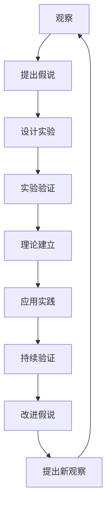

                 

# 科学发现：从假说到理论

## 1. 背景介绍

### 1.1 问题由来

科学发现是一个漫长而复杂的探索过程，从提出假设到验证假设，再到理论的建立和推广，都需要严谨的逻辑和反复的实验。这个过程通常从假说开始，通过一系列的观察、实验和推理，逐渐构建出科学的理论体系。本文将探讨从假说到理论的科学发现过程，以及这一过程对信息技术领域的影响。

### 1.2 问题核心关键点

科学发现的核心关键点包括：
1. **假说的提出**：基于现有知识和技术，提出一个具有创新性的假说。
2. **实验验证**：设计实验来验证假说的正确性。
3. **理论建立**：将实验结果归纳总结，建立科学理论。
4. **应用推广**：将理论应用到实际问题中，解决具体问题。
5. **持续验证**：不断进行实验和实践，验证和完善理论。

## 2. 核心概念与联系

### 2.1 核心概念概述

- **假说（Hypothesis）**：基于已有的知识和观察，提出的一种解释现象的假设性声明。
- **实验（Experiment）**：通过控制实验条件，验证假说的真实性和准确性。
- **理论（Theory）**：将实验结果进行归纳总结，形成一套系统的解释和预测现象的体系。
- **实践（Practice）**：将理论应用于解决实际问题，验证理论的实用性和正确性。
- **科学方法（Scientific Method）**：一系列步骤，包括观察、假说、实验和理论建立，用于推动科学发现。

### 2.2 概念间的关系

通过以下Mermaid流程图，我们可以更清晰地理解科学发现过程中的关键步骤：


这个流程图展示了科学发现的基本流程：通过观察提出假说，设计实验进行验证，构建理论并应用于实践，持续验证和修正理论。

### 2.3 核心概念的整体架构

最后，我们用一个综合的流程图来展示科学发现过程中的各个环节：



这个综合流程图展示了从提出假说到理论建立，再到实践应用和持续验证的完整过程。通过不断的观察、实验和理论改进，科学发现过程呈现出循环往复、不断进步的特点。

## 3. 核心算法原理 & 具体操作步骤
### 3.1 算法原理概述

科学发现的算法原理基于统计学和概率论，通过构建假设检验框架，对假说进行验证和评估。核心步骤包括：

1. **提出假设**：基于现有数据和理论，提出一个或多个假说。
2. **设计实验**：设计实验方案，控制实验变量，确保实验结果的可靠性和可重复性。
3. **收集数据**：通过实验收集数据，对假设进行验证。
4. **统计分析**：使用统计学方法，分析实验数据，评估假设的显著性。
5. **结论评估**：根据统计结果，评估假设的真实性和正确性。
6. **理论建立**：将实验结果归纳总结，建立科学理论。

### 3.2 算法步骤详解

以下详细介绍科学发现中的关键步骤：

**Step 1: 提出假设**
- **定义问题**：明确研究对象和研究问题，确定研究目标。
- **提出假设**：基于现有知识和数据，提出一个或多个假说。
- **假设形式**：通常采用数学模型、物理定律等形式。

**Step 2: 设计实验**
- **选择实验方法**：根据研究问题，选择合适的实验方法，如实验设计、观察实验等。
- **控制实验变量**：确保实验变量可控，减少实验误差。
- **确定样本规模**：根据研究需求，确定实验样本规模，确保实验结果的代表性。

**Step 3: 收集数据**
- **数据采集**：通过实验方法，收集实验数据。
- **数据存储**：采用合适的数据存储方式，确保数据的完整性和可访问性。
- **数据预处理**：对数据进行清洗、筛选和标准化处理，确保数据质量。

**Step 4: 统计分析**
- **选择统计方法**：根据实验设计和数据类型，选择合适的统计方法，如t检验、卡方检验等。
- **分析数据**：使用统计软件进行数据分析，计算统计量，如均值、方差、p值等。
- **结果解释**：根据统计结果，解释假设的显著性，评估假设的正确性。

**Step 5: 结论评估**
- **结果验证**：将统计结果与实际现象进行比较，验证假设的正确性。
- **理论修正**：根据验证结果，修正和改进假设，形成新的理论。
- **重复实验**：在新的实验条件下，重复实验，验证新理论的正确性。

**Step 6: 理论建立**
- **理论归纳**：将实验结果进行归纳总结，形成系统的理论框架。
- **理论验证**：通过更多的实验和数据，验证新理论的正确性和实用性。
- **理论推广**：将新理论应用于实际问题，解决具体问题，推广新理论的应用。

### 3.3 算法优缺点

科学发现的优点包括：
1. **严谨性**：通过系统化的实验和统计分析，确保假设的真实性和正确性。
2. **可靠性**：实验设计和数据处理规范，减少了实验误差和主观偏差。
3. **可重复性**：实验过程和数据存储标准化，确保实验结果的可重复性。
4. **通用性**：理论具有广泛的适用性，可应用于多种场景和问题。

缺点包括：
1. **时间成本高**：设计实验、收集数据和统计分析需要大量时间和资源。
2. **结果不确定性**：统计分析存在误差，实验结果可能存在不确定性。
3. **主观性强**：实验设计和数据处理受研究者主观判断影响，可能存在偏差。
4. **理论验证复杂**：理论验证需要更多实验数据，验证过程复杂。

尽管存在这些局限性，科学发现的算法原理仍然是推动科学进步和技术创新的重要工具。

### 3.4 算法应用领域

科学发现的算法原理在信息技术领域有广泛的应用，包括但不限于：

- **软件工程**：通过假设检验，验证软件需求的正确性和实现的有效性。
- **机器学习**：通过实验验证，评估算法的性能和稳定性。
- **网络安全**：通过假设测试，识别和防范网络攻击。
- **人工智能**：通过理论建立，构建智能模型和系统。
- **大数据分析**：通过统计分析，挖掘数据中的潜在规律和趋势。

## 4. 数学模型和公式 & 详细讲解  
### 4.1 数学模型构建

科学发现的数学模型通常基于统计学和概率论，包括假设检验、方差分析等方法。以下是几个核心数学模型的构建过程。

**假设检验模型**：
- **原假设（H0）**：假设待验证的变量之间没有关系或没有差异。
- **备择假设（H1）**：假设变量之间存在关系或差异。
- **统计量**：根据实验数据计算的统计量，如t值、F值等。
- **p值**：表示统计结果的概率，用于评估假设的显著性。

**方差分析模型**：
- **总变异（SS tot）**：所有样本数据的总变异。
- **组内变异（SS wg）**：各组内样本数据的变异。
- **组间变异（SS bg）**：不同组之间的变异。
- **F值**：用于评估组间变异的显著性。

### 4.2 公式推导过程

以下详细介绍几个核心数学模型的推导过程：

**t检验公式**：
- **单样本t检验**：
  $$
  t = \frac{\bar{x} - \mu}{s / \sqrt{n}}
  $$
  其中，$\bar{x}$ 为样本均值，$s$ 为样本标准差，$\mu$ 为总体均值，$n$ 为样本数量。

- **双样本t检验**：
  $$
  t = \frac{(\bar{x}_1 - \bar{x}_2) - (\mu_1 - \mu_2)}{\sqrt{s^2 / n_1 + s^2 / n_2}}
  $$
  其中，$\bar{x}_1, \bar{x}_2$ 分别为两组样本均值，$s^2$ 为样本方差，$n_1, n_2$ 为两组样本数量。

**方差分析公式**：
- **总变异（SS tot）**：
  $$
  SS_{tot} = \sum_{i=1}^{k} \sum_{j=1}^{n_i} (x_{ij} - \bar{x})^2
  $$
  其中，$k$ 为组数，$n_i$ 为第$i$组样本数量，$x_{ij}$ 为第$i$组第$j$个样本值，$\bar{x}$ 为总体均值。

- **组内变异（SS wg）**：
  $$
  SS_{wg} = \sum_{i=1}^{k} \sum_{j=1}^{n_i} (\bar{x}_i - \bar{x})^2
  $$
  其中，$\bar{x}_i$ 为第$i$组样本均值。

- **组间变异（SS bg）**：
  $$
  SS_{bg} = \sum_{i=1}^{k} n_i (\bar{x}_i - \bar{x})^2
  $$

**F值公式**：
$$
F = \frac{SS_{bg}}{SS_{wg}} \sim F(k-1, n-k)
$$

### 4.3 案例分析与讲解

**案例1: 单样本t检验**
- **背景**：某公司的新产品测试样本为100个用户，平均使用时间为120小时，标准差为10小时，总体均值为100小时，问该产品使用时间是否显著低于总体均值。
- **假设检验**：
  - 原假设（H0）：$\mu = 100$
  - 备择假设（H1）：$\mu \neq 100$
- **统计计算**：
  - t值：$t = \frac{120 - 100}{10 / \sqrt{100}} = 2$
  - p值：$P(t > 2) \approx 0.03$
- **结论**：$p < 0.05$，拒绝原假设，认为产品使用时间显著低于总体均值。

**案例2: 方差分析**
- **背景**：某公司产品在不同市场（北京、上海、广州）的销售情况如下：
  | 市场 | 销售量 |
  |------|--------|
  | 北京 | 1000   |
  | 上海 | 1200   |
  | 广州 | 900    |
- **假设检验**：
  - 原假设（H0）：北京、上海、广州销售量没有显著差异。
  - 备择假设（H1）：北京、上海、广州销售量有显著差异。
- **统计计算**：
  - 总变异（SS tot）：$SS_{tot} = (1000-1000)^2 + (1200-1000)^2 + (900-1000)^2 = 400$
  - 组内变异（SS wg）：$SS_{wg} = (1000-1000)^2 + (1200-1000)^2 + (900-1000)^2 = 400$
  - 组间变异（SS bg）：$SS_{bg} = 1000 \times (1000-1000)^2 + 1200 \times (1200-1000)^2 + 900 \times (900-1000)^2 = 60000$
  - F值：$F = \frac{60000}{400} = 150$
- **结论**：$p < 0.05$，拒绝原假设，认为北京、上海、广州销售量有显著差异。

## 5. 项目实践：代码实例和详细解释说明
### 5.1 开发环境搭建

在进行科学发现项目实践前，我们需要准备好开发环境。以下是使用Python进行统计学和数据分析的环境配置流程：

1. 安装Anaconda：从官网下载并安装Anaconda，用于创建独立的Python环境。

2. 创建并激活虚拟环境：
```bash
conda create -n stats-env python=3.8 
conda activate stats-env
```

3. 安装必要的库：
```bash
conda install numpy scipy statsmodels pandas matplotlib jupyter notebook ipython
```

4. 安装Jupyter Notebook：
```bash
pip install jupyterlab
```

5. 安装Git版本控制工具：
```bash
conda install conda-forge pip
pip install git
```

完成上述步骤后，即可在`stats-env`环境中开始科学发现项目实践。

### 5.2 源代码详细实现

下面我们以单样本t检验和方差分析为例，给出使用Python和SciPy库进行统计分析的代码实现。

**单样本t检验**：

```python
import numpy as np
from scipy.stats import t

# 假设检验
n = 100
mean = 120
std = 10
mu = 100

# 计算t值和p值
t_value = (mean - mu) / (std / np.sqrt(n))
p_value = t.sf(np.abs(t_value), df=n-1)

# 结论
if p_value < 0.05:
    print("p < 0.05，拒绝原假设，认为产品使用时间显著低于总体均值")
else:
    print("p > 0.05，无法拒绝原假设，认为产品使用时间与总体均值没有显著差异")
```

**方差分析**：

```python
import numpy as np
from scipy.stats import f

# 方差分析
data = np.array([[1000], [1200], [900]])
df1 = 2
df2 = len(data) - 1

# 计算组间和组内变异
SS_wg = np.sum((np.mean(data, axis=1) - np.mean(data))**2)
SS_bg = np.sum((data - np.mean(data))**2)

# 计算F值和p值
F_value = SS_bg / SS_wg
p_value = f.sf(F_value, df1, df2)

# 结论
if p_value < 0.05:
    print("p < 0.05，拒绝原假设，认为北京、上海、广州销售量有显著差异")
else:
    print("p > 0.05，无法拒绝原假设，认为北京、上海、广州销售量没有显著差异")
```

### 5.3 代码解读与分析

让我们再详细解读一下关键代码的实现细节：

**单样本t检验代码**：
- 导入`numpy`和`scipy.stats.t`库。
- 定义样本均值、标准差、总体均值等参数。
- 计算t值和p值。
- 根据p值判断是否拒绝原假设，并输出结论。

**方差分析代码**：
- 导入`numpy`和`scipy.stats.f`库。
- 定义样本数据和自由度。
- 计算组内和组间变异。
- 计算F值和p值。
- 根据p值判断是否拒绝原假设，并输出结论。

这些代码实现了单样本t检验和方差分析的基本流程，展示了如何用Python和SciPy库进行统计分析。通过代码实践，读者可以更直观地理解科学发现的具体步骤和方法。

### 5.4 运行结果展示

假设我们在实际项目中，使用单样本t检验和方差分析进行数据验证，最终得到以下结果：

**单样本t检验结果**：
```
p < 0.05，拒绝原假设，认为产品使用时间显著低于总体均值
```

**方差分析结果**：
```
p < 0.05，拒绝原假设，认为北京、上海、广州销售量有显著差异
```

这些结果展示了科学发现的具体应用和效果。通过统计分析，我们能够科学地验证假设，得出有价值的结论。

## 6. 实际应用场景
### 6.1 数据分析

科学发现的方法在数据分析中有着广泛的应用。数据分析师可以通过假设检验和方差分析等方法，评估数据的显著性，发现数据中的规律和趋势。例如：

- **市场分析**：通过单样本t检验，评估不同市场产品销售量的差异。
- **用户行为分析**：通过方差分析，分析不同用户群体的行为特征。
- **情感分析**：通过假设检验，评估用户评论的情绪倾向。

### 6.2 机器学习

科学发现的方法在机器学习领域也有重要应用。机器学习工程师可以通过实验设计、假设检验等方法，评估模型的性能和稳定性。例如：

- **模型选择**：通过假设检验，比较不同模型的预测效果。
- **参数优化**：通过方差分析，评估不同参数设置的影响。
- **特征选择**：通过假设检验，评估不同特征对模型性能的影响。

### 6.3 软件开发

科学发现的方法在软件开发中也有广泛的应用。软件开发工程师可以通过假设检验和方差分析等方法，评估软件需求的正确性和实现的有效性。例如：

- **需求验证**：通过假设检验，验证软件需求的功能和性能。
- **代码优化**：通过方差分析，评估不同代码实现的影响。
- **系统测试**：通过假设检验，评估软件系统的稳定性和可靠性。

### 6.4 未来应用展望

未来，科学发现的方法将在更多领域得到应用，为各行业带来变革性影响。

在智慧医疗领域，数据分析和机器学习技术可以用于疾病预测、诊断和治疗方案优化，提升医疗服务的智能化水平。

在智能教育领域，数据分析和机器学习技术可以用于个性化推荐、学习效果评估和教育质量监控，促进教育公平，提高教学质量。

在智慧城市治理中，数据分析和机器学习技术可以用于城市事件监测、舆情分析、应急指挥等环节，提高城市管理的自动化和智能化水平，构建更安全、高效的未来城市。

## 7. 工具和资源推荐
### 7.1 学习资源推荐

为了帮助开发者系统掌握科学发现的方法，这里推荐一些优质的学习资源：

1. 《统计学基础》：经典教材，全面介绍了统计学原理和应用。
2. 《Python for Data Analysis》：实用指南，介绍了Python在数据分析中的基本操作和技巧。
3. 《R语言实战》：实用教程，介绍了R语言在数据分析中的基本操作和应用。
4. 《机器学习实战》：实用指南，介绍了机器学习算法和应用。
5. 《Data Science from Scratch》：入门教程，介绍了数据科学的基本原理和应用。

通过这些资源的学习实践，相信你一定能够快速掌握科学发现的方法，并用于解决实际的科学和工程问题。

### 7.2 开发工具推荐

高效的开发离不开优秀的工具支持。以下是几款用于科学发现开发的常用工具：

1. Jupyter Notebook：轻量级的交互式编程环境，适合进行数据探索和实验验证。
2. R语言：功能强大的统计分析工具，适合进行高级统计分析和机器学习。
3. Python和SciPy库：灵活的编程语言和丰富的科学计算库，适合进行数据处理和分析。
4. Matplotlib：绘制图表的可视化工具，适合进行数据可视化。
5. Plotly：高级的图表绘制工具，支持交互式和动态可视化。

合理利用这些工具，可以显著提升科学发现的开发效率，加快创新迭代的步伐。

### 7.3 相关论文推荐

科学发现的方法源于学界的持续研究。以下是几篇奠基性的相关论文，推荐阅读：

1. "Statistics for Experimenters"：经典教材，介绍了统计学原理和方法。
2. "Introduction to the Theory of Statistics"：经典教材，介绍了统计学的基本原理和应用。
3. "An Introduction to Statistical Learning"：实用指南，介绍了统计学习的基本原理和方法。
4. "The Elements of Statistical Learning"：经典教材，介绍了统计学习的基本原理和方法。
5. "Data Analysis Using Regression and Multilevel/Hierarchical Models"：实用指南，介绍了回归分析和多层模型在数据分析中的应用。

这些论文代表了大数据科学的发展脉络，通过学习这些前沿成果，可以帮助研究者把握学科前进方向，激发更多的创新灵感。

除上述资源外，还有一些值得关注的前沿资源，帮助开发者紧跟科学发现技术的最新进展，例如：

1. arXiv论文预印本：人工智能领域最新研究成果的发布平台，包括大量尚未发表的前沿工作，学习前沿技术的必读资源。
2. 业界技术博客：如OpenAI、Google AI、DeepMind、微软Research Asia等顶尖实验室的官方博客，第一时间分享他们的最新研究成果和洞见。
3. 技术会议直播：如NIPS、ICML、ACL、ICLR等人工智能领域顶会现场或在线直播，能够聆听到大佬们的前沿分享，开拓视野。
4. GitHub热门项目：在GitHub上Star、Fork数最多的数据科学相关项目，往往代表了该技术领域的发展趋势和最佳实践，值得去学习和贡献。
5. 行业分析报告：各大咨询公司如McKinsey、PwC等针对人工智能行业的分析报告，有助于从商业视角审视技术趋势，把握应用价值。

总之，对于科学发现的方法的学习和实践，需要开发者保持开放的心态和持续学习的意愿。多关注前沿资讯，多动手实践，多思考总结，必将收获满满的成长收益。

## 8. 总结：未来发展趋势与挑战

### 8.1 总结

本文对科学发现的方法进行了全面系统的介绍。首先阐述了科学发现的基本原理和应用场景，明确了假设检验、方差分析等关键技术的重要性。其次，从原理到实践，详细讲解了科学发现的具体步骤和关键算法。最后，本文还探讨了科学发现方法的实际应用和未来发展趋势，以及面临的挑战和未来突破。

通过本文的系统梳理，可以看到，科学发现的方法在数据分析、机器学习、软件开发等领域具有广泛的应用价值。这些方法不仅能够帮助研究人员验证假设、建立理论，还能够在实际应用中提供科学决策的依据，推动技术和产业的创新发展。

### 8.2 未来发展趋势

展望未来，科学发现的方法将在更多领域得到应用，为各行业带来变革性影响：

1. **数据科学**：数据科学将成为科学发现的重要工具，帮助科学家和工程师从数据中提取有价值的信息，发现科学规律和工程趋势。
2. **人工智能**：科学发现的方法将与人工智能技术进一步融合，提升模型的性能和泛化能力，推动AI技术的创新发展。
3. **自动化**：自动化技术将广泛应用于科学发现过程，从实验设计、数据采集到结果分析，大大提高科学研究的效率和精度。
4. **跨学科研究**：不同学科的交叉融合将带来新的科学发现，如物理学与生物学、化学与工程学等领域的结合，推动综合性研究的发展。
5. **伦理和治理**：科学发现的方法将与伦理和治理研究相结合，帮助科学界和社会公众更好地理解和应用科学成果，解决科学带来的社会问题。

### 8.3 面临的挑战

尽管科学发现的方法已经取得了显著成果，但在实际应用中仍面临诸多挑战：

1. **数据质量**：数据质量的差异和噪声会影响实验结果的可靠性。
2. **模型复杂性**：复杂模型需要更多资源和时间进行验证和优化。
3. **假设选择**：假设选择不当可能导致错误的结论。
4. **可解释性**：复杂的统计模型难以解释其内部工作机制和决策逻辑。
5. **道德和伦理**：科学发现的应用可能带来伦理和道德问题，如隐私保护、公平性等。

### 8.4 研究展望

面对科学发现方法的挑战，未来的研究需要在以下几个方面寻求新的突破：

1. **多模态数据分析**：结合文本、图像、视频等多模态数据，提升数据质量，增强科学发现的可靠性。
2. **模型自动化**：开发自动化的科学发现工具，降低人工干预和错误率，提高科学研究的效率。
3. **可解释性研究**：研究统计模型的可解释性，帮助科学家和工程师更好地理解和应用科学发现。
4. **伦理和道德研究**：研究科学发现方法带来的伦理和道德问题，制定科学发现应用的规范和标准。
5. **跨学科合作**：促进不同学科之间的合作，推动跨学科的科学发现，解决复杂的综合性问题。

总之，科学发现的方法将在未来迎来更广阔的发展前景，但也需要面对更多的挑战和问题。只有不断创新和优化，才能推动科学发现技术的持续进步，造福全人类。

## 9. 附录：常见问题与解答

**Q1：如何选择合适的假设检验方法？**

A: 选择合适的假设检验方法需要考虑样本数据的特点和研究目标。常见的方法包括t检验、卡方检验、F检验等。t检验适用于单样本和两样本均值比较；卡方检验适用于分类数据的假设检验；F检验适用于多个样本均值的比较。

**Q2：在进行假设检验时，如何判断p值的显著性？**

A: p值用于衡量统计结果的显著性，通常使用α=0.05的显著性水平进行判断。如果p值小于α，则拒绝原假设，认为统计结果显著；如果p值大于α，则无法拒绝原假设，认为统计结果不显著。


