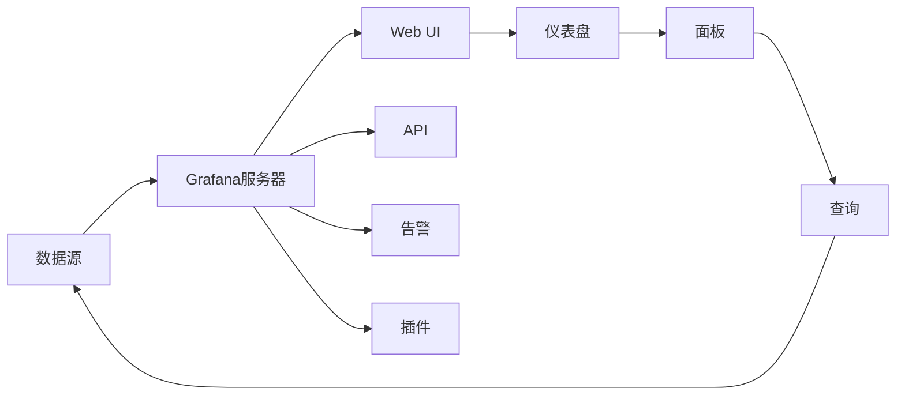

# AI系统Grafana原理与代码实战案例讲解

关键词：Grafana、可视化、时序数据、监控、仪表盘、数据源、面板、查询、告警、插件

## 1. 背景介绍
### 1.1  问题的由来
随着人工智能技术的飞速发展,越来越多的AI系统被应用于各个领域。然而,如何有效地监控和可视化AI系统的运行状态,已经成为一个亟待解决的问题。传统的监控方式难以满足AI系统的特殊需求,迫切需要一种灵活、强大的可视化监控工具。
### 1.2  研究现状
目前,已经有多种开源和商业化的监控工具被广泛应用,如Prometheus、Zabbix、Nagios等。但是,这些工具大多专注于基础设施和应用程序的监控,对于AI系统的监控支持有限。而Grafana作为一款优秀的开源数据可视化平台,凭借其灵活的架构和丰富的插件生态,在AI系统监控领域展现出巨大的潜力。
### 1.3  研究意义
深入研究Grafana在AI系统监控中的应用,对于提升AI系统的可观测性、可维护性和可靠性具有重要意义。通过Grafana,我们可以实时查看AI系统的关键指标,快速定位和诊断问题,优化系统性能,从而保障AI系统的稳定运行。同时,这也为其他领域的监控可视化提供了宝贵的经验和启示。
### 1.4  本文结构
本文将从以下几个方面展开讨论：首先,介绍Grafana的核心概念和架构原理；然后,详细讲解Grafana的关键功能和使用方法；接着,通过一个实际的AI系统监控案例,演示如何使用Grafana进行数据可视化和告警配置；最后,总结Grafana在AI系统监控中的优势和未来发展趋势。

## 2. 核心概念与联系
- 数据源(Data Source):Grafana可以连接多种类型的数据源,包括时序数据库、关系型数据库、NoSQL数据库等,用于查询和展示数据。
- 仪表盘(Dashboard):Grafana的核心组件,由一组面板(Panel)组成,用于可视化数据。
- 面板(Panel):仪表盘中的基本可视化单元,支持多种类型,如图表、表格、热力图等。
- 查询(Query):面板通过查询语句从数据源获取数据,Grafana支持多种查询语言,如PromQL、SQL等。
- 告警(Alert):当监控指标满足特定条件时,Grafana可以触发告警,并通过多种渠道发送通知。
- 插件(Plugin):Grafana提供了丰富的插件系统,可以扩展数据源、面板、告警等功能。

下面是Grafana架构的Mermaid流程图:



## 3. 核心算法原理 & 具体操作步骤
### 3.1  算法原理概述
Grafana的核心算法主要体现在数据查询和聚合方面。对于时序数据,Grafana采用了类似于Prometheus的查询语言PromQL,支持对时间序列数据进行过滤、聚合、计算等操作。同时,Grafana还支持其他类型数据源的查询语言,如SQL、Elasticsearch DSL等。
### 3.2  算法步骤详解
以PromQL为例,一个典型的查询语句由以下几个部分组成:
1. 指标名称(Metric Name):指定要查询的指标。
2. 标签匹配器(Label Matcher):通过标签筛选时间序列。
3. 范围向量选择器(Range Vector Selector):指定查询的时间范围。
4. 聚合操作(Aggregation):对多个时间序列进行聚合计算,如求和、平均值等。
5. 函数调用(Function Call):对查询结果进行进一步的数学计算和转换。

例如,以下PromQL查询语句计算了最近5分钟内CPU使用率的平均值:

```
avg(rate(cpu_usage_idle{job="node"}[5m]))
```

### 3.3  算法优缺点
PromQL的优点包括:
- 语法简洁,易于学习和使用。
- 支持多种聚合和计算函数,灵活性强。
- 与Prometheus的时序数据模型完美契合。

缺点包括:
- 对于复杂的查询场景,语句可能会变得冗长。
- 部分函数的性能开销较大,需要谨慎使用。

### 3.4  算法应用领域
除了AI系统监控,Grafana还广泛应用于以下领域:
- 基础设施监控:如服务器、网络、存储等。
- 应用程序监控:如Web应用、微服务、数据库等。
- 业务指标监控:如用户活跃度、订单量、收入等。
- 物联网监控:如传感器数据、设备状态等。

## 4. 数学模型和公式 & 详细讲解 & 举例说明
### 4.1  数学模型构建
在Grafana中,许多面板类型都涉及到数学模型和公式,用于对时序数据进行转换和计算。以Singlestat面板为例,它支持多种数学计算模式,如:
- 最新值(Current):显示时间序列的最新值。
- 平均值(Average):计算时间序列的平均值。
- 最小值(Min)和最大值(Max):计算时间序列的最小值和最大值。
- 总和(Total):计算时间序列的总和。

### 4.2  公式推导过程
以平均值计算为例,假设有一个时间序列 $x_1, x_2, ..., x_n$,其平均值 $\bar{x}$ 的计算公式为:

$$\bar{x} = \frac{1}{n} \sum_{i=1}^{n} x_i$$

其中,$n$ 为时间序列的长度。

### 4.3  案例分析与讲解
假设我们要监控一个AI系统的CPU使用率,并在Singlestat面板中显示最近1小时内的平均值。首先,使用PromQL查询语句获取CPU使用率的时间序列:

```
1 - avg(rate(node_cpu_seconds_total{mode="idle"}[1h]))
```

然后,在Singlestat面板的数据源中选择该查询,并将数学计算模式设置为"Average"。这样,面板就会自动计算最近1小时内CPU使用率的平均值,并以百分比的形式显示出来。

### 4.4  常见问题解答
- 问:如何在Grafana中显示多个时间序列的数学计算结果?
- 答:可以使用Graph面板,在查询语句中使用聚合函数(如avg、sum等)对多个时间序列进行计算,然后在面板设置中选择相应的显示方式(如线条、面积图等)。

- 问:Grafana是否支持自定义数学公式?
- 答:是的,Grafana提供了一些内置的数学函数,同时也支持使用JavaScript编写自定义函数,以实现更复杂的数学计算逻辑。

## 5. 项目实践：代码实例和详细解释说明
### 5.1  开发环境搭建
要开始Grafana的开发,首先需要搭建开发环境。Grafana基于Go语言开发,因此需要安装Go编译器和相关工具。同时,还需要安装Node.js和Yarn,用于前端开发和依赖管理。

以下是在Ubuntu系统上搭建Grafana开发环境的步骤:

1. 安装Go编译器:
```bash
sudo apt-get install golang
```

2. 安装Node.js和Yarn:
```bash
curl -sL https://deb.nodesource.com/setup_14.x | sudo -E bash -
sudo apt-get install -y nodejs
sudo npm install -g yarn
```

3. 克隆Grafana源码:
```bash
git clone https://github.com/grafana/grafana.git
```

4. 编译和运行Grafana:
```bash
cd grafana
make run
```

### 5.2  源代码详细实现
以下是一个简单的Grafana插件示例,实现了一个自定义的时间序列面板:

```typescript
import { PanelPlugin } from '@grafana/data';
import { SimpleOptions } from './types';
import { SimplePanel } from './SimplePanel';

export const plugin = new PanelPlugin<SimpleOptions>(SimplePanel)
  .useFieldConfig()
  .setPanelOptions(builder => {
    builder
      .addTextInput({
        path: 'title',
        name: 'Title',
        defaultValue: 'Simple Panel',
      })
      .addColorPicker({
        path: 'color',
        name: 'Color',
        defaultValue: 'rgba(0, 0, 0, 1)',
      });
  });
```

这个插件定义了一个名为"SimplePanel"的面板,并提供了两个可配置选项:"title"和"color",分别用于设置面板的标题和颜色。

下面是"SimplePanel"的实现代码:

```typescript
import React, { useRef, useEffect } from 'react';
import { PanelProps } from '@grafana/data';
import { SimpleOptions } from 'types';
import { css, cx } from 'emotion';

interface Props extends PanelProps<SimpleOptions> {}

export const SimplePanel: React.FC<Props> = ({ options, data, width, height }) => {
  const ref = useRef<HTMLCanvasElement>(null);

  useEffect(() => {
    if (ref.current) {
      const ctx = ref.current.getContext('2d');
      if (ctx) {
        ctx.clearRect(0, 0, width, height);
        ctx.fillStyle = options.color;
        ctx.fillRect(0, 0, width, height);
      }
    }
  }, [options.color, width, height]);

  return (
    <div
      className={cx(
        css`
          width: ${width}px;
          height: ${height}px;
        `
      )}
    >
      <canvas ref={ref} width={width} height={height} />
      <div className="panel-title">{options.title}</div>
    </div>
  );
};
```

这个面板使用了React和Canvas API,根据配置选项渲染一个矩形和标题。当配置选项发生变化时,会自动重新绘制图形。

### 5.3  代码解读与分析
在上面的示例中,我们使用了以下关键技术和概念:

- PanelPlugin:Grafana提供的面板插件基类,用于定义自定义面板。
- useFieldConfig:允许面板使用标准的字段配置选项。
- setPanelOptions:用于定义面板的配置选项。
- React Hooks:如useRef和useEffect,用于管理组件的状态和生命周期。
- Canvas API:用于在面板中绘制自定义图形。
- Emotion CSS:用于编写CSS样式,支持CSS-in-JS。

通过这些技术,我们可以方便地开发出功能强大、可定制化的Grafana插件,扩展Grafana的监控和可视化能力。

### 5.4  运行结果展示
在Grafana中启用该插件后,我们可以创建一个新的仪表盘,并添加"SimplePanel"面板。通过配置面板选项,可以自定义面板的标题和颜色。下图展示了一个包含多个"SimplePanel"面板的仪表盘示例:


## 6. 实际应用场景
Grafana在AI系统监控中有广泛的应用,下面是一些典型场景:

- 模型训练监控:通过Grafana展示模型训练过程中的关键指标,如损失函数、准确率、学习率等,帮助调试和优化模型。
- 推理服务监控:对AI推理服务进行监控,包括请求延迟、吞吐量、资源利用率等,确保服务的可用性和性能。
- 数据管道监控:监控数据采集、预处理、特征工程等环节的运行状态,发现和解决数据质量问题。
- 实验管理:使用Grafana对不同的模型实验进行可视化管理和对比,支持科学的实验记录和决策。

### 6.4  未来应用展望
随着AI技术的不断发展,Grafana在AI系统监控中的应用也将不断深化和拓展。未来,Grafana有望与更多的AI框架和工具进行集成,提供开箱即用的监控解决方案。同时,Grafana也将不断优化性能、改进用户体验,成为AI系统监控的标准工具。

## 7. 工具和资源推荐
### 7.1  学习资源推荐
- Grafana官方文档:https://grafana.com/docs/
- Grafana插件开发指南:https://grafana.com/tutorials/build-a-panel-plugin/
- Prometheus查询语言PromQL教程:https://prometheus.io/docs/prometheus/latest/