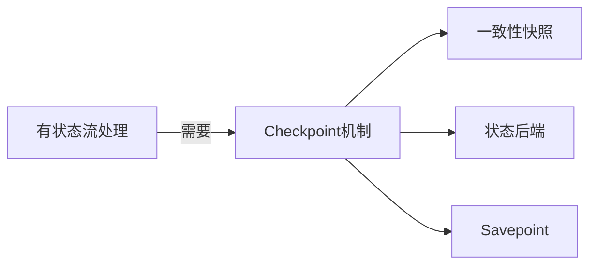

# Flink Checkpoint容错机制原理与代码实例讲解

## 1. 背景介绍

### 1.1 问题的由来

在大数据处理领域,流式计算已经成为一种不可或缺的计算范式。Apache Flink作为一款领先的开源流处理框架,它提供了高吞吐、低延迟的数据处理能力,并支持有状态计算。然而,在分布式环境下,由于硬件故障、网络问题或代码错误等原因,作业可能会失败并导致数据丢失和计算结果不一致。为了确保流处理系统的可靠性和容错性,Flink引入了Checkpoint机制。

### 1.2 研究现状

Checkpoint是Flink实现容错机制的核心机制,它通过定期保存作业的状态快照,在发生故障时可以从最近的一致状态恢复,从而避免了数据丢失和重复计算的问题。Flink的Checkpoint机制不仅支持有状态的流处理作业,还支持批处理作业,为构建可靠的大数据处理系统提供了坚实的基础。

目前,已有一些研究工作探讨了Flink Checkpoint机制的实现原理和性能优化策略。然而,由于Checkpoint机制涉及到分布式系统、存储系统、容错机制等多个领域的知识,对于初学者来说,理解和掌握这一机制仍然存在一定的挑战。

### 1.3 研究意义

深入理解Flink Checkpoint容错机制的原理和实现细节,对于开发人员构建可靠的流处理应用程序至关重要。本文旨在通过详细的概念解释、算法分析、数学模型推导、代码实例讲解等方式,帮助读者全面掌握Flink Checkpoint容错机制,为开发高可用的流处理应用奠定坚实的理论基础。

### 1.4 本文结构

本文将从以下几个方面全面介绍Flink Checkpoint容错机制:

1. 核心概念与联系
2. 核心算法原理与具体操作步骤
3. 数学模型和公式详细讲解与举例说明
4. 项目实践:代码实例和详细解释说明
5. 实际应用场景
6. 工具和资源推荐
7. 总结:未来发展趋势与挑战
8. 附录:常见问题与解答

## 2. 核心概念与联系

在深入探讨Flink Checkpoint容错机制之前,我们需要先了解一些核心概念及其之间的关联。

### 2.1 有状态流处理

有状态流处理(Stateful Stream Processing)是指在处理无限数据流时,需要维护和更新内部状态的计算模型。例如,在实时计算会话窗口中的点击量时,需要保存每个会话的状态以累加点击数。Flink支持有状态流处理,并通过Checkpoint机制实现状态的持久化和恢复,确保计算的一致性和容错性。

### 2.2 Checkpoint & Savepoint

Checkpoint是Flink用于容错机制的核心概念,它定期为作业的状态进行快照,并将快照持久化存储。发生故障时,Flink可以从最近的一致Checkpoint状态恢复作业,避免数据丢失和重复计算。

Savepoint是一种手动触发的Checkpoint,它可以将作业的状态保存到外部存储系统中,以便将来重新启动或迁移作业。Savepoint通常用于有计划的操作,如代码升级或集群扩缩容。

### 2.3 一致性快照(Consistent Snapshot)

一致性快照是指在分布式环境下,所有并行任务的状态都被原子地捕获并持久化存储,形成一个全局一致的视图。Flink通过引入了"同步障碍(Barrier)"的概念来实现一致性快照,确保在Checkpoint期间不会丢失任何记录或产生重复计算。

### 2.4 状态后端(State Backend)

状态后端是Flink用于管理和持久化作业状态的组件。Flink支持多种状态后端,如基于内存的HashMapStateBackend、基于文件的FsStateBackend和基于RocksDB的RocksDBStateBackend等。不同的状态后端在性能、可靠性和可扩展性方面有所差异,用户可以根据具体需求进行选择。

### 2.5 核心概念关系

上述核心概念之间的关系如下所示:

有状态流处理需要Checkpoint机制来确保计算的一致性和容错性。Checkpoint机制通过生成一致性快照和利用状态后端实现状态的持久化,并支持手动触发的Savepoint操作。

## 3. 核心算法原理与具体操作步骤

### 3.1 算法原理概述

Flink Checkpoint机制的核心算法原理可以概括为以下几个关键步骤:

1. **Barrier注入**: 当触发Checkpoint时,JobManager会向每个Source Task注入"同步障碍(Barrier)"。
2. **Barrier对齐**: 每个Task在接收到Barrier后,会先处理所有之前的记录,然后将当前状态快照持久化,并向下游Task发送Barrier。
3. **快照持久化**: 每个Task将状态快照异步持久化到状态后端(如文件系统或RocksDB)。
4. **确认Checkpoint**: 当所有Task的快照都持久化完成后,JobManager会收到来自所有Task的确认消息,然后完成整个Checkpoint过程。
5. **作业恢复**: 如果作业失败,Flink会从最近的一致Checkpoint状态恢复作业。

该算法的关键在于通过Barrier的注入和对齐,实现了分布式环境下状态的一致性快照,从而保证了容错恢复时计算结果的正确性。

### 3.2 算法步骤详解

下面我们将详细解释Flink Checkpoint算法的每个步骤:

#### 3.2.1 Barrier注入

当JobManager决定触发Checkpoint时,它会向每个Source Task注入一个"同步障碍(Barrier)"。Barrier是一种逻辑标记,它会像普通记录一样流经整个作业流程。Source Task在接收到Barrier后,会继续处理之前的所有记录,直到处理完毕后再进行快照。

#### 3.2.2 Barrier对齐

当一个Task接收到Barrier时,它会先处理所有之前的记录,然后将当前状态快照持久化到状态后端。快照完成后,Task会向下游Task发送Barrier,并在收到所有输入通道的Barrier后,将自身的Barrier向下游传递。通过这种方式,Barrier会在整个作业流程中对齐,确保每个Task都在一致的状态下进行快照。

#### 3.2.3 快照持久化

每个Task在接收到Barrier后,会异步地将当前状态快照持久化到状态后端。状态后端可以是基于文件系统的FsStateBackend、基于RocksDB的RocksDBStateBackend或其他自定义的后端。快照持久化过程是异步的,以避免阻塞作业的正常执行。

#### 3.2.4 确认Checkpoint

当所有Task的快照都持久化完成后,每个Task会向JobManager发送确认消息。JobManager在收到来自所有Task的确认消息后,就会完成整个Checkpoint过程,并通知所有Task丢弃之前的旧快照。

#### 3.2.5 作业恢复

如果作业失败,Flink会从最近的一致Checkpoint状态恢复作业。JobManager会根据Checkpoint元数据信息,启动新的Task实例,并从状态后端加载对应的状态快照。通过这种方式,作业可以从失败点继续执行,而不会丢失任何数据或产生重复计算。

### 3.3 算法优缺点

Flink Checkpoint算法的优点包括:

- **一致性保证**: 通过Barrier的注入和对齐,实现了分布式环境下状态的一致性快照,确保了容错恢复时计算结果的正确性。
- **低开销**: 快照持久化过程是异步的,不会阻塞作业的正常执行,从而降低了Checkpoint对性能的影响。
- **可扩展性**: 支持多种状态后端,如基于文件系统、RocksDB等,可以根据具体需求进行选择和扩展。

但是,该算法也存在一些缺点:

- **延迟**: Checkpoint过程会引入一定的延迟,尤其是在大状态场景下,快照持久化可能会消耗较多时间。
- **资源消耗**: 快照持久化需要额外的存储空间和I/O开销,对资源的消耗也会相应增加。
- **一致性窗口**: 虽然Flink保证了Checkpoint的一致性,但是在两次Checkpoint之间,仍然存在一个不一致的窗口期,如果在此期间发生故障,可能会导致部分数据丢失或重复计算。

### 3.4 算法应用领域

Flink Checkpoint容错机制广泛应用于以下领域:

- **实时数据处理**: 在电商、金融、物联网等领域,实时处理大量的数据流是非常常见的场景,Checkpoint机制可以确保计算的可靠性和一致性。
- **批处理作业**: 虽然Checkpoint最初是为流处理而设计的,但它也可以应用于批处理作业,提高作业的容错能力。
- **有状态计算**: 对于需要维护内部状态的计算场景,如窗口计算、连接操作等,Checkpoint机制可以保证状态的持久化和恢复。
- **机器学习**: 在分布式机器学习场景下,Checkpoint可以用于保存模型的中间状态,以便在发生故障时恢复训练过程。

总的来说,任何需要确保计算可靠性和容错性的分布式数据处理场景,都可以从Flink的Checkpoint机制中受益。

## 4. 数学模型和公式详细讲解与举例说明

在探讨Flink Checkpoint容错机制时,我们需要建立一些数学模型来量化和优化该机制的性能。本节将介绍一些关键的数学模型和公式,并通过具体案例进行详细讲解。

### 4.1 数学模型构建

#### 4.1.1 Checkpoint开销模型

我们首先构建一个模型来量化Checkpoint过程的开销。假设一个作业由N个并行Task组成,每个Task的状态大小为S,Checkpoint的间隔时间为T,持久化状态到状态后端的吞吐量为R。那么,Checkpoint过程的开销可以表示为:

$$
C = N \times \frac{S}{R}
$$

其中,C表示Checkpoint的总开销,单位为时间。

从这个模型可以看出,Checkpoint的开销与Task数量N、状态大小S成正比,与持久化吞吐量R成反比。因此,减小N和S、提高R是优化Checkpoint性能的关键途径。

#### 4.1.2 恢复时间模型

另一个重要的模型是作业恢复时间模型。假设作业失败后需要从最近的一致Checkpoint状态恢复,恢复过程包括重新启动Task实例和从状态后端加载状态快照。设Task实例启动时间为T_start,加载状态快照的吞吐量为R_load,则恢复时间可以表示为:

$$
T_r = T_\text{start} + \frac{N \times S}{R_\text{load}}
$$

其中,T_r表示作业的总恢复时间。

从这个模型可以看出,减小Task实例启动时间T_start和提高加载吞吐量R_load,可以有效缩短作业的恢复时间。

### 4.2 公式推导过程

接下来,我们将推导一个公式,用于计算在给定的Checkpoint间隔时间T下,作业的预期恢复时间。

假设作业失败服从泊松分布,其失败率为λ。在时间间隔[0, t]内,作业失败的概率为:

$$
P(t) = 1 - e^{-\lambda t}
$$

由于Checkpoint间隔时间为T,因此在时间段[0, T]内,作业失败的概率为:

$$
P(T) = 1 - e^{-\lambda T}
$$

如果作业在时间t失败,则需要从最近的一致Checkpoint状态恢复,恢复时间为T_r(t)。由于失败时间t在[0, T]内均匀分布,因此预期恢复时间可以表示为:

$$
E[T_r] = \int_0^T T_r(t) \frac{1}{T} dt
$$

将恢复时间模型代入上式,我们可以得到预期恢复时间的公式:

$$
E[T_r] = T_\text{start} + \