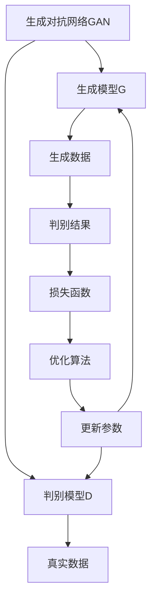

# Generative Adversarial Networks (GAN)原理与代码实例讲解

## 1. 背景介绍

### 1.1 问题的由来

在传统的机器学习和深度学习中，我们通常会使用监督学习的方法来训练模型。这种方法需要大量的标注数据作为训练集,但是获取高质量的标注数据通常是一个耗时且昂贵的过程。另一方面,在许多应用场景中,我们希望能够直接从数据中学习数据的分布,而不需要标注数据。这就催生了生成式模型(Generative Model)的发展。

生成式模型试图从训练数据中学习数据的概率分布,从而可以生成新的、看似真实的样本数据。传统的生成式模型包括高斯混合模型(Gaussian Mixture Model, GMM)、隐马尔可夫模型(Hidden Markov Model, HMM)等,但它们在处理高维数据(如图像、视频等)时存在局限性。

### 1.2 研究现状

2014年,Ian Goodfellow等人在论文"Generative Adversarial Networks"中提出了一种全新的生成式模型——生成对抗网络(Generative Adversarial Networks, GAN)。GAN的核心思想是将生成模型的训练过程看作是一个对抗过程,由两个网络相互对抗、相互博弈而完成模型的训练。

GAN的提出开启了深度生成模型的新纪元,它不仅可以学习数据的分布,还能够生成逼真的图像、音频、视频等高维数据。自从提出以来,GAN受到了广泛的关注和研究,在图像生成、图像转换、语音合成、文本生成等领域取得了卓越的成果,成为深度学习领域最活跃的研究方向之一。

### 1.3 研究意义

GAN的研究意义主要体现在以下几个方面:

1. **数据增强**: 通过GAN生成的数据可以用于扩充训练集,提高模型的泛化能力。
2. **隐私保护**: GAN可以生成看似真实但实际上并不存在的数据,从而保护真实数据的隐私。
3. **艺术创作**: GAN可以用于生成艺术作品,如图像、音乐等,为艺术创作提供新的可能性。
4. **模拟现实**: GAN可以用于模拟现实世界的复杂场景,为自动驾驶、机器人等领域提供支持。
5. **数据压缩**: GAN可以学习数据的分布,从而实现高效的数据压缩。

### 1.4 本文结构

本文将全面介绍GAN的原理、算法、实现和应用。文章主要包括以下几个部分:

1. **核心概念与联系**: 介绍GAN的基本概念、原理和与其他模型的联系。
2. **核心算法原理与具体操作步骤**: 详细阐述GAN的算法原理,并给出具体的操作步骤。
3. **数学模型和公式详细讲解与举例说明**: 推导GAN的数学模型,并通过案例分析加深理解。
4. **项目实践:代码实例和详细解释说明**: 提供GAN的代码实现,并对关键部分进行解释和分析。
5. **实际应用场景**: 介绍GAN在图像生成、图像转换、语音合成等领域的应用。
6. **工具和资源推荐**: 推荐GAN的学习资源、开发工具和相关论文等。
7. **总结:未来发展趋势与挑战**: 总结GAN的研究成果,并展望未来的发展趋势和面临的挑战。
8. **附录:常见问题与解答**: 解答GAN学习和应用过程中的常见问题。

## 2. 核心概念与联系

生成对抗网络(Generative Adversarial Networks, GAN)是一种全新的生成式模型,由两个网络组成:生成模型(Generator)和判别模型(Discriminator)。

**生成模型G**的目标是从一个潜在的随机噪声分布中生成逼真的数据样本,以欺骗判别模型。**判别模型D**的目标是区分生成模型生成的数据和真实数据,并提供二值判别结果。生成模型和判别模型相互对抗、相互博弈,最终达到一个纳什均衡(Nash Equilibrium),使得生成模型可以生成逼真的数据样本,而判别模型无法区分真实数据和生成数据。

GAN与其他生成模型的区别在于,它不需要显式建模数据的分布,而是通过对抗训练的方式隐式地学习数据的分布。这种方法具有很强的灵活性,可以应用于各种类型的数据,如图像、视频、音频等。

GAN与其他深度学习模型(如自编码器、变分自编码器等)也有一定的联系。自编码器通过重构输入数据来学习数据的表示,而变分自编码器则显式地建模数据的分布。GAN则通过对抗训练的方式隐式地学习数据的分布,因此可以看作是一种无监督的表示学习方法。

## 3. 核心算法原理与具体操作步骤

### 3.1 算法原理概述

GAN的核心算法原理可以概括为一个**极小极大游戏(Minimax Game)**的过程。生成模型G和判别模型D相互对抗,目标是找到一个纳什均衡点,使得生成模型生成的数据无法被判别模型区分,而判别模型也无法完全区分真实数据和生成数据。

具体来说,生成模型G的目标是最小化判别模型D对生成数据的判别能力,而判别模型D的目标是最大化对真实数据和生成数据的判别能力。这个过程可以用以下公式表示:

$$\min_G \max_D V(D, G) = \mathbb{E}_{x \sim p_{\text{data}}(x)}[\log D(x)] + \mathbb{E}_{z \sim p_z(z)}[\log (1 - D(G(z)))]$$

其中,$p_{\text{data}}(x)$是真实数据的分布,$p_z(z)$是生成模型G的输入噪声分布(通常是高斯分布或均匀分布),$G(z)$表示生成模型从噪声$z$生成的数据样本。

在训练过程中,生成模型G和判别模型D通过交替优化的方式不断提高自身的能力,最终达到一个平衡点,使得生成模型可以生成逼真的数据样本,而判别模型无法区分真实数据和生成数据。

### 3.2 算法步骤详解

GAN的训练过程可以概括为以下步骤:

1. **初始化生成模型G和判别模型D**,通常使用深度神经网络作为模型的结构。
2. **从真实数据集中采样一批真实数据样本**。
3. **从噪声分布中采样一批噪声向量**,输入到生成模型G中生成一批假数据样本。
4. **将真实数据样本和生成数据样本输入到判别模型D中**,计算判别模型对真实数据和生成数据的判别结果。
5. **计算判别模型D的损失函数**,目标是最大化对真实数据的判别概率,最小化对生成数据的判别概率。
6. **更新判别模型D的参数**,使用优化算法(如梯度下降)最小化判别模型的损失函数。
7. **固定判别模型D的参数**,计算生成模型G的损失函数,目标是最小化判别模型对生成数据的判别概率。
8. **更新生成模型G的参数**,使用优化算法最小化生成模型的损失函数。
9. **重复步骤2-8**,直到达到停止条件(如最大迭代次数或损失函数收敛)。

在实际训练过程中,还需要注意一些技巧和细节,如模型架构的选择、参数初始化、优化算法的选择、训练过程的稳定性等,这些将在后面的章节中详细讨论。

### 3.3 算法优缺点

**优点**:

1. **无需显式建模数据分布**,可以应用于各种类型的数据。
2. **生成的数据质量高**,在图像、音频等领域表现出色。
3. **理论基础简单**,易于理解和实现。
4. **可扩展性强**,可以与其他深度学习模型结合使用。

**缺点**:

1. **训练过程不稳定**,容易出现模式崩溃(Mode Collapse)等问题。
2. **缺乏评估指标**,难以评估生成数据的质量。
3. **计算资源消耗大**,需要同时训练生成模型和判别模型。
4. **缺乏理论指导**,很多改进方法都是基于经验和试错。

### 3.4 算法应用领域

GAN由于其强大的生成能力,在多个领域都有广泛的应用:

1. **图像生成**: 生成逼真的人脸、风景、物体等图像。
2. **图像转换**: 实现图像风格迁移、超分辨率重建等任务。
3. **语音合成**: 生成逼真的人声语音。
4. **文本生成**: 生成看似真实的文本内容。
5. **数据增强**: 通过生成数据扩充训练集,提高模型泛化能力。
6. **隐私保护**: 生成看似真实但并不存在的数据,保护真实数据隐私。
7. **模拟现实**: 模拟复杂的现实场景,为自动驾驶、机器人等领域提供支持。

## 4. 数学模型和公式详细讲解与举例说明

### 4.1 数学模型构建

在构建GAN的数学模型时,我们需要定义生成模型G和判别模型D的目标函数,并通过对抗训练的方式找到二者的纳什均衡点。

假设真实数据$x$服从分布$p_{\text{data}}(x)$,生成模型G的输入噪声$z$服从分布$p_z(z)$,那么生成模型G和判别模型D的目标函数可以表示为:

$$\min_G \max_D V(D, G) = \mathbb{E}_{x \sim p_{\text{data}}(x)}[\log D(x)] + \mathbb{E}_{z \sim p_z(z)}[\log (1 - D(G(z)))]$$

其中,$D(x)$表示判别模型对真实数据$x$的判别概率,$D(G(z))$表示判别模型对生成数据$G(z)$的判别概率。

判别模型D的目标是最大化对真实数据的判别概率,最小化对生成数据的判别概率。生成模型G的目标则是最小化判别模型对生成数据的判别概率,即欺骗判别模型。

通过交替优化生成模型G和判别模型D的参数,可以找到二者的纳什均衡点,使得生成模型可以生成逼真的数据样本,而判别模型无法区分真实数据和生成数据。

### 4.2 公式推导过程

为了更好地理解GAN的数学模型,我们可以推导一下公式的来源。

首先,我们定义判别模型D的目标函数为:

$$\max_D V(D) = \mathbb{E}_{x \sim p_{\text{data}}(x)}[\log D(x)] + \mathbb{E}_{z \sim p_z(z)}[\log (1 - D(G(z)))]$$

这个目标函数可以看作是真实数据和生成数据的交叉熵损失函数的期望值。判别模型D的目标是最大化这个函数,即最大化对真实数据的判别概率,最小化对生成数据的判别概率。

接下来,我们定义生成模型G的目标函数为:

$$\min_G V(G) = \mathbb{E}_{z \sim p_z(z)}[\log (1 - D(G(z)))]$$

生成模型G的目标是最小化这个函数,即最小化判别模型对生成数据的判别概率,从而欺骗判别模型。

将判别模型D和生成模型G的目标函数合并,我们可以得到GAN的整体目标函数:

$$\min_G \max_D V(D, G) = \mathbb{E}_{x \sim p_{\text{data}}(x)}[\log D(x)] + \mathbb{E}_{z \sim p_z(z)}