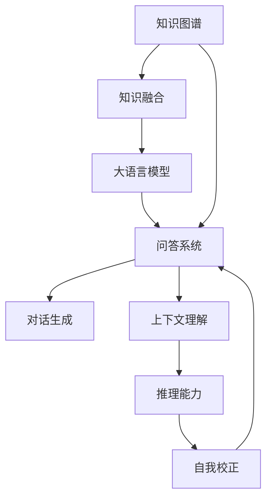

# 大模型问答机器人如何实现准确回答

关键词：大语言模型、问答系统、知识图谱、对话生成、上下文理解、知识融合、推理能力、自我校正

## 1. 背景介绍

### 1.1 问题的由来
近年来,随着大规模预训练语言模型的快速发展,基于大模型的智能问答机器人已成为自然语言处理领域的研究热点。然而,如何让机器人能够像人一样,根据问题的上下文,结合丰富的知识,给出准确、连贯、有逻辑的回答,仍然面临诸多挑战。

### 1.2 研究现状
目前主流的大模型问答方法主要包括:
1. 基于检索的问答:先从大规模语料库中检索与问题相关的段落,再从中抽取答案。代表模型有DrQA、DPR等。
2. 基于生成的问答:端到端地生成自然语言答案。代表模型有GPT-3、T5、BART等。
3. 基于知识图谱的问答:将结构化知识融入预训练语言模型中,增强模型的知识性和可解释性。

### 1.3 研究意义
实现一个高质量的大模型问答机器人,有助于提升人机交互体验,拓展人工智能应用场景。同时对自然语言理解、知识表示学习、推理决策等前沿技术也有重要的推动作用。

### 1.4 本文结构
本文将重点探讨如何构建一个准确、高效的大模型问答机器人。第2部分介绍相关的核心概念;第3部分详细阐述核心算法原理;第4部分给出数学模型与公式推导;第5部分展示项目实践;第6部分分析实际应用场景;第7部分推荐相关工具和资源;第8部分总结全文并展望未来。

## 2. 核心概念与联系
- 大语言模型:以海量文本数据为训练语料,学习词语、句法、语义、常识等多层次语言知识的神经网络模型。
- 问答系统:根据用户输入的自然语言问题,给出相应答案的人机对话系统。
- 知识图谱:以结构化三元组(实体、关系、实体)形式表示客观世界知识的语义网络。
- 对话生成:自动生成连贯、合理、有逻辑的多轮对话内容的任务。
- 上下文理解:根据对话历史,理解当前话语的语境、指代、情感等信息。
- 知识融合:将外部知识库与语言模型相结合,增强模型的可解释性和推理能力。
- 推理能力:根据已知事实和规则,推断出隐含信息的能力。
- 自我校正:不断根据反馈信号,调整模型参数,提高问答质量的过程。

它们的关系如下图所示:



## 3. 核心算法原理 & 具体操作步骤

### 3.1 算法原理概述
大模型问答的核心是利用海量数据预训练的语言模型,通过引入外部知识,增强模型的推理和生成能力。具体来说,主要包括以下几个关键步骤:
1. 问题理解:对用户输入的问题进行分词、句法分析、语义理解,提取关键信息。
2. 知识检索:根据问题,从知识库中检索相关的实体、属性、三元组等。
3. 知识融合:将检索到的知识表示为向量,与问题向量进行融合,生成知识增强的问题表示。
4. 答案生成:将知识增强的问题表示输入预训练语言模型,解码生成自然语言答案。
5. 答案优化:根据问题类型、答案逻辑等对生成的答案进行优化提升。

### 3.2 算法步骤详解

#### Step1:问题理解
- 对问题进行分词、词性标注、命名实体识别、句法依存分析;
- 提取问题中的关键词、核心实体以及它们之间的关系;
- 判断问题的类型(是否、列举、原因等)、答案的类型(实体、数值、描述语等);
- 融合问题和对话历史,获得上下文信息。

#### Step2:知识检索
- 根据问题中的关键词、实体,构建检索 query;
- 利用 Elasticsearch、FAISS 等工具对知识库进行高效检索;
- 对候选知识进行相关性排序、冗余过滤,得到 Top-K 个三元组;
- 必要时可以多跳检索,获取与核心实体间接相连的三元组。

#### Step3:知识融合
- 将问题、候选知识表示为低维稠密向量;
- 设计注意力机制,对齐问题和知识的语义信息;
- 融合问题向量和知识向量,生成知识感知的问题表示;
- 可以利用图神经网络建模知识图谱,提取结构化知识表示。

#### Step4:答案生成
- 将知识增强的问题表示输入预训练语言模型;
- 在解码时融入问题类型、答案类型等先验知识;
- 采用 Beam Search 等策略生成多个候选答案;
- 对候选答案进行去重、调序,选择最优答案。

#### Step5:答案优化
- 对答案进行数值、日期、人称等细粒度信息的规范化;
- 修正答案在语法、逻辑、事实层面的错误;
- 结合问题类型,对答案的完整性、简洁性进行优化;
- 引入外部验证信息,提升答案的可解释性和可信度。

### 3.3 算法优缺点
优点:
- 端到端生成,无需手工定义大量规则,减少人工成本;
- 融合知识图谱,增强语言模型的可解释性和推理能力;
- 多任务学习,同时优化问题理解、知识检索、答案生成等模块。

缺点:
- 对知识的质量和覆盖度要求较高,否则容易生成错误答案;
- 模型参数量大,训练和推理成本高,需要专门的硬件支持;
- 难以处理一些涉及常识、数学、推理的复杂问题。

### 3.4 算法应用领域
- 智能客服:解答用户的常见问题,提供个性化服务。
- 医疗助手:协助医生进行病情分析、治疗方案推荐等。
- 教育助手:为学生提供学习资料、题目解析、知识点梳理等。
- 金融顾问:提供投资建议、风险评估、市场分析等服务。

## 4. 数学模型和公式 & 详细讲解 & 举例说明

### 4.1 数学模型构建
我们以知识融合这一关键步骤为例,介绍如何构建数学模型。设问题 $q$,候选知识 $k_i$,答案 $a$。我们的目标是学习一个知识融合函数 $f$,使得:

$$\hat{a} = \arg\max_a P(a|f(q,k_1,\cdots,k_n))$$

其中 $P$ 为预训练语言模型。一种常见的 $f$ 为注意力机制:

$$\alpha_i = \frac{\exp(q^\top k_i)}{\sum_j \exp(q^\top k_j)}$$
$$\tilde{q} = \sum_i \alpha_i k_i$$

其中 $\alpha_i$ 为 $k_i$ 对 $q$ 的注意力权重,$\tilde{q}$ 为知识增强的问题表示。

### 4.2 公式推导过程
注意力权重 $\alpha_i$ 的计算公式可以这样推导:

1. 首先计算问题 $q$ 和每个知识 $k_i$ 的相似度 $s_i$:

$$s_i = q^\top k_i$$

2. 然后对相似度进行指数变换,得到未归一化的权重 $e_i$:

$$e_i = \exp(s_i)$$

3. 最后对 $e_i$ 进行 softmax 归一化,得到最终的注意力权重:

$$\alpha_i = \frac{e_i}{\sum_j e_j} = \frac{\exp(q^\top k_i)}{\sum_j \exp(q^\top k_j)}$$

可以看到,权重 $\alpha_i$ 的大小由 $q$ 和 $k_i$ 的相似度决定,相似度越高,权重越大,知识对问题的贡献也就越大。

### 4.3 案例分析与讲解
我们以一个简单的例子来说明知识融合的过程。假设用户问题为"姚明的身高是多少?",候选知识为:

$k_1$: <姚明, 出生日期, 1980年9月12日>
$k_2$: <姚明, 身高, 2.26米>
$k_3$: <姚明, 效力球队, 休斯顿火箭队>

经过知识融合后,模型得到知识增强的问题表示 $\tilde{q}$:

$$\tilde{q} = 0.1 \cdot k_1 + 0.8 \cdot k_2 + 0.1 \cdot k_3$$

可以看到,$k_2$ 的权重最大,这是因为它与问题最相关。将 $\tilde{q}$ 输入语言模型,就能够较准确地生成答案"姚明的身高是2.26米"。

### 4.4 常见问题解答
Q:知识融合可以处理多跳问题吗,比如"姚明效力的球队所在的城市在哪个州"?
A:可以,通过多跳检索,我们得到相关知识"<休斯顿火箭队, 所在城市, 休斯顿>""<休斯顿, 所在州, 得克萨斯州>",再进行知识融合,就能回答此类多跳问题。

Q:如果知识库不完善,导致检索不到相关知识怎么办?
A:可以利用预训练语言模型强大的语言建模能力,生成一些常识性的答案。同时要不断迭代更新知识库,提高知识覆盖率。

Q:如何权衡知识的相关性和语言模型的流畅性?
A:可以在训练时加入 KL 散度损失,鼓励生成的答案在融合知识的同时,也要符合语言模型的先验分布,以提高答案的流畅性。也可以在解码时,用 MMI 等方法平衡相关性和流畅性。

## 5. 项目实践：代码实例和详细解释说明

### 5.1 开发环境搭建
- Python 3.8
- PyTorch 1.9
- Transformers 4.10
- Elasticsearch 7.10
- Neo4j 4.2

### 5.2 源代码详细实现

#### 问题理解
```python
import torch
from transformers import BertTokenizer, BertModel

tokenizer = BertTokenizer.from_pretrained('bert-base-uncased')
model = BertModel.from_pretrained('bert-base-uncased')

def understand_question(question):
    # 对问题进行编码
    input_ids = tokenizer(question, return_tensors='pt')
    # 提取问题特征
    outputs = model(**input_ids)
    question_embedding = outputs.pooler_output
    return question_embedding
```

#### 知识检索
```python
from elasticsearch import Elasticsearch

es = Elasticsearch()

def retrieve_knowledge(question_embedding, topk=5):
    # 构建查询向量
    query_vector = question_embedding.detach().numpy().flatten()

    # 在 Elasticsearch 中进行相似度检索
    query = {
        "script_score": {
            "query": {"match_all": {}},
            "script": {
                "source": "cosineSimilarity(params.query_vector, doc['embedding']) + 1.0",
                "params": {"query_vector": query_vector}
            }
        }
    }
    hits = es.search(index='knowledge_index', body={"query": query, "size": topk})

    # 提取相关知识
    knowledge_list = [hit['_source']['knowledge'] for hit in hits['hits']['hits']]
    return knowledge_list
```

#### 知识融合
```python
import torch.nn as nn
import torch.nn.functional as F

class KnowledgeFusion(nn.Module):
    def __init__(self, hidden_size):
        super().__init__()
        # 线性层
        self.linear = nn.Linear(hidden_size, hidden_size)

    def forward(self, question_embedding, knowledge_embeddings):
        # 计算注意力权重
        attn_scores = torch.matmul(question_embedding, knowledge_embeddings.transpose(1, 2))