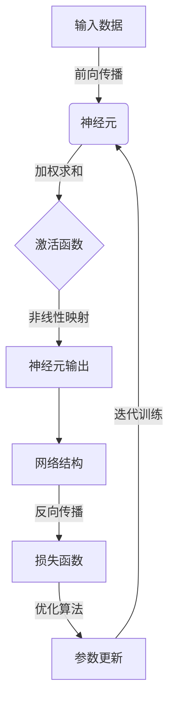

好的,我会严格遵循约束条件,以专业的技术语言撰写这篇关于神经网络原理与代码实例讲解的深度博客文章。

# 神经网络(Neural Networks) - 原理与代码实例讲解

## 1. 背景介绍

### 1.1 问题的由来

在过去几十年中,人工智能领域取得了长足的进步,尤其是机器学习和深度学习技术的蓬勃发展,极大推动了人工智能的实用化进程。作为深度学习的核心,神经网络已经广泛应用于计算机视觉、自然语言处理、语音识别等诸多领域,展现出了强大的数据建模和模式识别能力。

神经网络的发展可以追溯到20世纪40年代,当时的神经网络模型主要是受生物神经元结构和信号传递机制的启发而提出的。早期的神经网络模型虽然简单,但奠定了神经网络发展的基础。随着计算能力的不断提高和训练数据的日益丰富,神经网络模型也在不断演进和完善。

近年来,深度神经网络取得了令人瞩目的成就,如卷积神经网络(CNN)在图像识别、语音识别等领域的应用,循环神经网络(RNN)在自然语言处理等序列数据建模方面的卓越表现。这些突破性进展都离不开神经网络在理论和实践层面的深入研究。

### 1.2 研究现状

神经网络研究一直是人工智能和机器学习领域的热点课题。目前,神经网络的研究主要集中在以下几个方面:

1. **网络结构优化**:探索新型网络结构,提高神经网络的表达能力和泛化性能,如残差网络(ResNet)、密集连接卷积网络(DenseNet)等。

2. **高效训练算法**:改进训练算法,加快神经网络的收敛速度,提高训练效率,如自适应优化算法(Adam)、层归一化(Layer Normalization)等。

3. **注意力机制**:引入注意力机制,使神经网络能够自适应地聚焦于输入数据的关键部分,提高模型性能,如自注意力机制(Self-Attention)在transformer模型中的应用。

4. **可解释性**:提高神经网络的可解释性,揭示神经网络内部的决策过程,使模型更加透明和可信赖。

5. **模型压缩**:通过模型压缩技术,减小神经网络的模型大小,降低计算和存储开销,实现高效部署。

6. **少样本学习**:探索在数据量有限的情况下,如何利用迁移学习、元学习等技术,提高神经网络的泛化能力。

7. **生成模型**:发展生成对抗网络(GAN)、变分自编码器(VAE)等生成模型,用于图像生成、语音合成等任务。

总的来说,神经网络研究正在从多个角度推进,旨在提高模型的性能、效率、可解释性和通用性,以满足不同应用场景的需求。

### 1.3 研究意义

神经网络作为深度学习的核心技术,对于推动人工智能的发展具有重要意义:

1. **提高智能系统性能**:神经网络展现出了强大的模式识别和数据建模能力,能够从海量数据中自动学习特征表示,提高智能系统在各种任务上的性能表现。

2. **拓展应用领域**:随着神经网络技术的不断完善,其应用领域也在不断扩展,如计算机视觉、自然语言处理、语音识别、推荐系统等,为人工智能的广泛应用奠定基础。

3. **促进理论创新**:神经网络研究不仅推动了算法和模型的创新,也促进了机器学习、优化理论、信息论等相关理论的发展,为人工智能理论研究提供了新的视角和方向。

4. **加速产业发展**:神经网络技术的突破为人工智能产业的发展注入了新的动力,推动了智能硬件、智能软件、智能服务等相关产业的蓬勃发展。

5. **影响社会进步**:人工智能技术的发展将深刻影响社会的方方面面,神经网络作为人工智能的核心技术,对于促进社会的智能化转型具有重要意义。

因此,深入研究神经网络的原理和实践,对于推动人工智能技术的发展、拓展应用领域、促进产业升级、推动社会进步都具有重要的理论和现实意义。

### 1.4 本文结构

本文将全面系统地介绍神经网络的理论基础、核心算法原理、数学模型推导、代码实现细节,以及在实际应用中的案例分析。文章的主要结构如下:

1. **背景介绍**:阐述神经网络研究的由来、现状和意义,为全文奠定基础。

2. **核心概念与联系**:介绍神经网络的基本概念,如神经元、激活函数、网络结构等,并阐明它们之间的联系。

3. **核心算法原理与具体操作步骤**:深入解析神经网络的核心算法原理,如前向传播、反向传播、优化算法等,并详细讲解算法的具体操作步骤。

4. **数学模型和公式详细讲解与举例说明**:推导神经网络的数学模型,并通过具体案例详细讲解公式的含义和使用方法。

5. **项目实践:代码实例和详细解释说明**:提供神经网络的代码实例,包括开发环境搭建、源代码实现细节、代码解读与分析、运行结果展示等内容。

6. **实际应用场景**:介绍神经网络在计算机视觉、自然语言处理、语音识别等领域的实际应用案例,并对未来应用前景进行展望。

7. **工具和资源推荐**:为读者推荐神经网络相关的学习资源、开发工具、论文资料等,方便读者进一步深入学习和研究。

8. **总结:未来发展趋势与挑战**:总结神经网络研究的现有成果,展望未来的发展趋势,并分析可能面临的挑战和研究方向。

9. **附录:常见问题与解答**:针对神经网络学习和应用中的常见问题,给出解答和建议。

通过全面深入的介绍,读者能够对神经网络的理论基础和实践应用有更加透彻的理解,为进一步学习和研究奠定坚实的基础。

## 2. 核心概念与联系

在深入探讨神经网络的核心算法原理之前,我们首先需要了解神经网络的基本概念和这些概念之间的联系。这些概念构成了神经网络的基础框架,对于理解神经网络的工作原理至关重要。

### 2.1 神经元(Neuron)

神经元是神经网络的基本计算单元,其设计灵感来源于生物神经系统中的神经细胞。一个神经元接收来自其他神经元或外部输入的信号,对这些信号进行加权求和,然后通过一个非线性激活函数进行处理,产生输出信号。

神经元的数学表达式如下:

$$
y = \phi\left(\sum_{i=1}^{n}w_ix_i + b\right)
$$

其中:
- $x_i$表示第$i$个输入
- $w_i$表示与第$i$个输入相关的权重
- $b$表示偏置项(bias)
- $\phi$表示激活函数(activation function)
- $y$表示神经元的输出

激活函数引入了非线性,使神经网络能够拟合复杂的函数映射关系。常用的激活函数包括Sigmoid函数、Tanh函数、ReLU函数等。

### 2.2 网络结构(Network Architecture)

神经网络是由大量神经元按特定结构组织而成的。根据神经元的连接方式和层次排列,神经网络可以分为不同的结构,如前馈神经网络(Feedforward Neural Network)、卷积神经网络(Convolutional Neural Network)、递归神经网络(Recurrent Neural Network)等。

前馈神经网络是最基本的神经网络结构,由输入层、隐藏层和输出层组成。信号从输入层经过隐藏层一层层传递到输出层,每一层的神经元都与上一层的所有神经元相连,但同一层内的神经元之间没有连接。

卷积神经网络在前馈神经网络的基础上引入了卷积层和池化层,能够有效地捕捉输入数据(如图像)的局部特征,在计算机视觉等领域表现出色。

递归神经网络则是为了处理序列数据(如文本、语音)而设计的,它允许信息在神经元之间循环传递,能够很好地捕捉序列数据中的长期依赖关系。

不同的网络结构适用于不同的任务和数据类型,选择合适的网络结构对于神经网络的性能至关重要。

### 2.3 学习过程(Learning Process)

神经网络的学习过程实际上是一个参数优化的过程,目标是找到一组最优参数(权重和偏置),使神经网络在训练数据上的损失函数(Loss Function)最小化。

这个过程通常采用反向传播(Back Propagation)算法,它包括两个主要步骤:

1. **前向传播(Forward Propagation)**:输入数据经过神经网络的层层传递,计算出最终的输出。

2. **反向传播(Back Propagation)**:根据输出与标签之间的差异(损失函数),计算每个参数对损失函数的梯度,并沿着反方向更新参数,使损失函数最小化。

在反向传播过程中,通常采用优化算法(如梯度下降法、动量法、Adam算法等)来更新参数。除了反向传播之外,还有一些其他的训练方法,如对抗训练、强化学习等。

通过不断地迭代训练,神经网络可以逐步学习到最优参数,从而在测试数据上获得良好的泛化性能。

### 2.4 Mermaid流程图

以上概念之间的关系可以用下面的Mermaid流程图直观地表示:

上图展示了神经网络的核心概念及其相互关系:

1. 输入数据经过神经元的加权求和和激活函数的非线性映射,产生神经元的输出。
2. 神经元按特定结构组织成神经网络,对输入数据进行层层传递和处理。
3. 通过反向传播计算损失函数,并采用优化算法更新参数。
4. 不断迭代训练,使神经网络学习到最优参数。

理解这些核心概念及其联系,对于掌握神经网络的工作原理至关重要。

## 3. 核心算法原理与具体操作步骤

### 3.1 算法原理概述

神经网络的核心算法主要包括前向传播(Forward Propagation)和反向传播(Back Propagation)两个部分。前向传播是神经网络对输入数据进行计算和预测的过程,而反向传播则是根据预测结果和真实标签计算损失,并通过优化算法调整网络参数的过程。

#### 3.1.1 前向传播

前向传播的目标是根据输入数据和当前的网络参数(权重和偏置),计算出神经网络的输出。这个过程可以概括为以下几个步骤:

1. 将输入数据传递到神经网络的输入层。
2. 在每一个隐藏层,对来自上一层的输入进行加权求和,然后通过激活函数进行非线性映射,得到该层的输出。
3. 重复上一步,直到计算出输出层的输出,即神经网络的最终预测结果。

前向传播的数学表达式如下:

$$
\begin{aligned}
z^{(l)} &= W^{(l)}a^{(l-1)} + b^{(l)}\
a^{(l)} &= \phi(z^{(l)})
\end{aligned}
$$

其中:
- $l$表示第$l$层
- $z^{(l)}$表示第$l$层的加权输入
- $W^{(l)}$表示第$l$