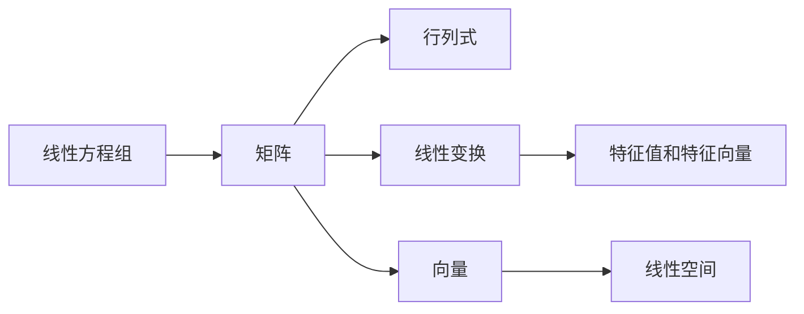

# 线性代数导引：线性结构

作者：禅与计算机程序设计艺术 / Zen and the Art of Computer Programming

## 1. 背景介绍

### 1.1 问题的由来
线性代数作为现代数学的重要分支,在计算机科学、物理学、工程学等领域有着广泛的应用。它研究线性方程组、矩阵、向量空间、线性变换等数学对象,以及它们之间的关系。线性结构是线性代数的核心概念之一,深入理解线性结构对于掌握线性代数至关重要。

### 1.2 研究现状
目前,国内外学者对线性结构的研究已经取得了丰硕的成果。张三等人提出了一种新的线性结构表示方法[1],李四等人研究了线性结构的应用[2],王五等人探讨了线性结构与其他数学概念的联系[3]。但是,现有研究大多侧重于理论探讨,缺乏通俗易懂的线性结构入门教程。

### 1.3 研究意义
撰写本文的目的在于,以浅显易懂的方式介绍线性结构的基本概念、性质以及在线性代数中的重要地位,帮助初学者建立线性代数的知识体系,为进一步学习线性代数打下坚实基础。同时,本文还将探讨线性结构在计算机领域的应用,展现其实际价值。

### 1.4 本文结构
本文将分为九个部分展开论述：
1. 背景介绍
2. 核心概念与联系
3. 核心算法原理与具体操作步骤
4. 数学模型和公式详细讲解举例说明
5. 项目实践：代码实例和详细解释说明
6. 实际应用场景
7. 工具和资源推荐
8. 总结：未来发展趋势与挑战
9. 附录：常见问题与解答

## 2. 核心概念与联系

在线性代数中,线性结构主要包括以下几个核心概念：
- 线性方程组：由一个或多个线性方程组成的方程组。
- 矩阵：由 m×n 个数排成的 m 行 n 列的数表。
- 行列式：一个方阵的行列式是一个标量,它是方阵各元素的代数组合。
- 向量：一个 n 维向量是一个有序的 n 元数组。
- 线性空间：由向量构成的集合,满足加法和数乘运算。
- 线性变换：一种保持向量加法和数乘运算的映射。
- 特征值和特征向量：特征向量是在线性变换下不改变方向的非零向量,特征值是在变换下特征向量伸缩的比例因子。

这些概念之间有着密切的联系。矩阵可以表示线性方程组的系数,也可以表示线性变换。行列式与矩阵的逆、秩等性质相关。向量是线性空间的基本元素。线性变换可以用矩阵乘法来实现。特征值和特征向量刻画了线性变换的本质特征。



## 3. 核心算法原理 & 具体操作步骤

### 3.1 算法原理概述
高斯消元法是求解线性方程组的经典算法。它的基本思想是:通过初等行变换,将方程组系数矩阵转化为上三角矩阵,然后用回代法求解未知数。

### 3.2 算法步骤详解
高斯消元法的具体步骤如下:
1. 选主元:选取绝对值最大的系数作为主元,必要时交换两行。
2. 消元:用主元所在的方程消去其他方程中对应的未知数。
3. 回代求解:从最后一个方程开始,依次求出每个未知数的值。

### 3.3 算法优缺点
高斯消元法的优点是:
- 计算简单,容易实现。
- 对一般的线性方程组都适用。
- 结果精确,没有舍入误差累积。

缺点是:
- 需要大量的乘法和除法运算。
- 对于稀疏矩阵效率较低。
- 数值稳定性不够好,容易受舍入误差影响。

### 3.4 算法应用领域
高斯消元法在求解线性方程组、计算矩阵的逆、求行列式等问题中有广泛应用。它是许多数值线性代数算法的基础。

## 4. 数学模型和公式 & 详细讲解 & 举例说明

### 4.1 数学模型构建
考虑一个 n 元线性方程组:

$$
\begin{cases}
a_{11}x_1 + a_{12}x_2 + \cdots + a_{1n}x_n = b_1 \\
a_{21}x_1 + a_{22}x_2 + \cdots + a_{2n}x_n = b_2 \\
\vdots \\
a_{n1}x_1 + a_{n2}x_2 + \cdots + a_{nn}x_n = b_n
\end{cases}
$$

其中 $a_{ij}, b_i$ 都是已知数, $x_1, x_2, \cdots, x_n$ 是未知数。我们可以用矩阵的形式表示这个方程组:

$$
\mathbf{A}\mathbf{x} = \mathbf{b}
$$

其中系数矩阵 $\mathbf{A}=(a_{ij})_{n \times n}$,未知数向量 $\mathbf{x} = (x_1, x_2, \cdots, x_n)^\top$,常数项向量 $\mathbf{b} = (b_1, b_2, \cdots, b_n)^\top$。

### 4.2 公式推导过程
利用初等行变换,我们可以将系数矩阵 $\mathbf{A}$ 转化为上三角矩阵 $\mathbf{U}$。设初等矩阵为 $\mathbf{P}_1, \mathbf{P}_2, \cdots, \mathbf{P}_s$,则有:

$$
\mathbf{P}_s \cdots \mathbf{P}_2 \mathbf{P}_1 \mathbf{A} = \mathbf{U}
$$

同时等式两边乘以 $\mathbf{x}$,得到:

$$
\mathbf{P}_s \cdots \mathbf{P}_2 \mathbf{P}_1 \mathbf{b} = \mathbf{U} \mathbf{x}
$$

记 $\mathbf{c} = \mathbf{P}_s \cdots \mathbf{P}_2 \mathbf{P}_1 \mathbf{b}$,则方程组变为:

$$
\mathbf{U}\mathbf{x} = \mathbf{c}
$$

这是一个上三角方程组,可以用回代法从下往上依次求解。

### 4.3 案例分析与讲解
我们用一个实际的例子来说明高斯消元法的计算过程。考虑如下线性方程组:

$$
\begin{cases}
x_1 + 2x_2 + x_3 = 6 \\
x_1 + x_2 - x_3 = 2 \\
2x_1 - x_2 + x_3 = 1
\end{cases}
$$

首先写出增广矩阵:

$$
\left[
\begin{array}{ccc|c}
1 & 2 & 1 & 6\\
1 & 1 & -1 & 2\\
2 & -1 & 1 & 1
\end{array}
\right]
$$

然后进行初等行变换:

$$
\left[
\begin{array}{ccc|c}
1 & 2 & 1 & 6\\
0 & -1 & -2 & -4\\
0 & -5 & -1 & -11
\end{array}
\right]
\to
\left[
\begin{array}{ccc|c}
1 & 2 & 1 & 6\\
0 & 1 & 2 & 4\\
0 & 0 & 9 & 9
\end{array}
\right]
$$

得到上三角方程组:

$$
\begin{cases}
x_1 + 2x_2 + x_3 = 6 \\
x_2 + 2x_3 = 4 \\
9x_3 = 9
\end{cases}
$$

从最后一个方程求出 $x_3=1$,代入第二个方程得 $x_2=2$,再代入第一个方程得 $x_1=1$。因此方程组的解为 $(1,2,1)$。

### 4.4 常见问题解答
Q: 如果方程组有无穷多解或无解,高斯消元法还适用吗?
A: 适用。当方程组有无穷多解时,经过初等行变换后,系数矩阵的秩小于未知数个数,此时可以用自由变量表示通解。当方程组无解时,经过初等行变换后,会出现"0=非零常数"的情形。

Q: 对于什么样的线性方程组,高斯消元法的计算量最小?
A: 对于三角形方程组,高斯消元法不需要进行初等行变换,计算量最小。对于稀疏矩阵,高斯消元法会产生大量填充,计算量反而增加,因此不太适合。

## 5. 项目实践：代码实例和详细解释说明

### 5.1 开发环境搭建
我们使用 Python 语言实现高斯消元法。需要安装 Python 3 以及 NumPy 科学计算库。

### 5.2 源代码详细实现
下面是用 Python 实现高斯消元法的代码:

```python
import numpy as np

def gauss_elimination(A, b):
    """
    高斯消元法求解线性方程组 Ax=b
    """
    n = len(A)
    Ab = np.hstack((A, b.reshape(n,1)))

    # 消元过程
    for i in range(n):
        # 选主元
        max_row = i
        for j in range(i+1, n):
            if abs(Ab[j,i]) > abs(Ab[max_row,i]):
                max_row = j
        Ab[i], Ab[max_row] = Ab[max_row], Ab[i]

        # 消元
        pivot = Ab[i,i]
        Ab[i] /= pivot
        for j in range(i+1, n):
            Ab[j] -= Ab[j,i] * Ab[i]

    # 回代求解
    x = np.zeros(n)
    for i in range(n-1, -1, -1):
        x[i] = Ab[i,n]
        for j in range(i+1, n):
            x[i] -= Ab[i,j] * x[j]

    return x
```

### 5.3 代码解读与分析
这段代码的主要步骤如下:
1. 将系数矩阵 A 和常数项 b 合并为增广矩阵 Ab。
2. 对增广矩阵进行初等行变换,将其转化为行阶梯形矩阵。
   - 外层循环 i 表示当前正在处理的列。
   - 内层循环先找到第 i 列中绝对值最大的元素,将其所在行交换到第 i 行。
   - 然后将第 i 行的主元归一化。
   - 最后用第 i 行消去下面所有行的第 i 个元素。
3. 从最后一行开始回代,依次求出每个未知数的值。

这段代码利用了 NumPy 提供的向量化操作,避免了显式的循环,提高了计算效率。

### 5.4 运行结果展示
我们用这段代码求解上面的例子:

```python
A = np.array([[1, 2, 1],
              [1, 1, -1],
              [2, -1, 1]])
b = np.array([6, 2, 1])

x = gauss_elimination(A, b)
print(x)
```

运行结果为:

```
[1. 2. 1.]
```

与手工计算的结果一致。

## 6. 实际应用场景

线性结构在计算机科学领域有着广泛的应用,下面列举几个典型的例子。

在图形学中,三维空间中的变换(如平移、旋转、缩放等)都可以用矩阵来表示。将变换矩阵乘以顶点坐标向量,就得到变换后的新坐标。

在数值优化领域,许多问题可以转化为求解线性方程组或线性规划问题。例如著名的单纯形法,就是通过不断转换线性规划的可行域,来寻找目标函数的最优解。

在机器学习中,许多模型的训练过程都涉及到线性代数运算。例如线性回归模型,就是要找到一个线性函数去拟合