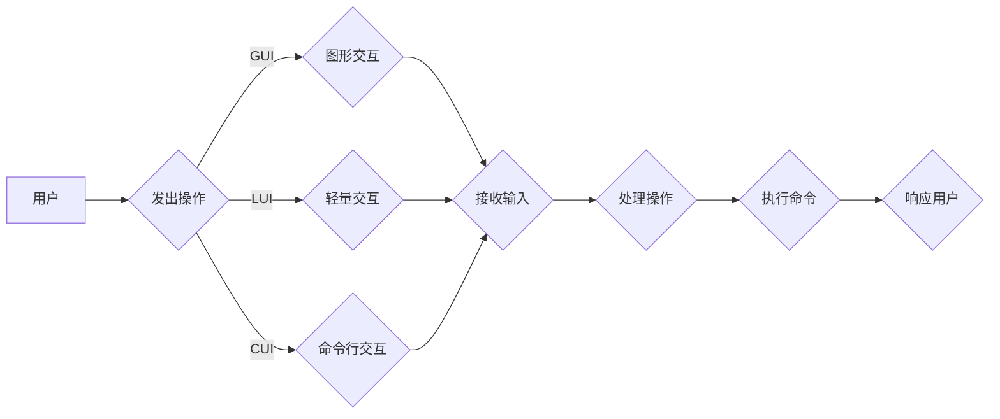

# GUI与LUI在CUI中的详细协同工作

> 关键词：GUI, LUI, CUI, 用户界面, 交互设计, 协同工作, 用户体验, 界面架构

## 1. 背景介绍

在当今数字化时代，用户界面（UI）的设计和实现是软件开发中至关重要的一环。随着技术的发展，UI经历了从字符用户界面（CUI）到图形用户界面（GUI）再到今日的轻量级用户界面（LUI）的演变。GUI与LUI在用户体验和交互方式上各有优势，而CUI作为它们的基石，依然在某些特定场景下发挥着作用。本文将深入探讨GUI与LUI在CUI中的协同工作，分析它们如何相互补充，共同提升用户体验。

### 1.1 CUI的起源与发展

CUI是计算机历史上最早的用户界面形式，它通过文本命令与用户进行交互。早期的操作系统如MS-DOS、Unix等都采用了CUI。尽管CUI在图形化界面出现后逐渐被取代，但在某些专业领域，如命令行工具、服务器管理等，CUI依然因其高效性和灵活性而得到广泛应用。

### 1.2 GUI的兴起

随着图形显示技术的发展，GUI应运而生。GUI使用图形元素（如窗口、图标、菜单等）来表示信息和交互方式，用户可以通过鼠标和键盘进行操作。Windows、Mac OS和Linux等操作系统都采用了GUI，极大地提升了用户体验。

### 1.3 LUI的兴起

随着移动互联网的普及，用户对界面设计的要求越来越高。LUI应运而生，它通常具有简洁、轻量、响应快的特性，适用于移动设备等资源受限的环境。LUI的代表有iOS的扁平化设计和Android的Material Design。

### 1.4 本文结构

本文将首先介绍GUI与LUI的核心概念，然后分析它们在CUI中的协同工作原理，接着探讨具体的实现步骤，并通过案例分析说明协同工作的实际效果。最后，本文将展望GUI与LUI在CUI中的未来发展趋势。

## 2. 核心概念与联系

### 2.1 核心概念原理

**GUI（Graphical User Interface，图形用户界面）**：

- 使用图形元素（如图标、按钮、菜单等）进行交互。
- 提供直观的视觉反馈和操作方式。
- 支持拖放、点击等操作。

**LUI（Lightweight User Interface，轻量级用户界面）**：

- 简洁、轻量，适用于资源受限的环境。
- 强调响应速度和用户体验。
- 通常采用简洁的布局和设计。

**CUI（Character User Interface，字符用户界面）**：

- 使用文本命令进行交互。
- 适合命令行界面和某些专业软件。
- 强调效率和命令行操作。

### 2.2 架构的 Mermaid 流程图



在上述流程图中，用户可以通过GUI、LUI或CUI发出操作。GUI和LUI使用图形元素和轻量级设计提升用户体验，而CUI则通过命令行操作提供高效性。三种用户界面共同将用户的操作转化为命令，由系统处理并执行，最后向用户反馈结果。

## 3. 核心算法原理 & 具体操作步骤

### 3.1 算法原理概述

GUI与LUI在CUI中的协同工作原理主要基于以下三个方面：

1. **界面切换**：根据用户需求和应用场景，动态切换GUI、LUI和CUI。
2. **数据交互**：GUI、LUI和CUI之间共享数据和状态信息。
3. **操作映射**：将用户的操作映射到相应的命令或功能。

### 3.2 算法步骤详解

1. **界面初始化**：根据应用需求和用户偏好，初始化GUI、LUI和CUI。
2. **用户操作**：用户通过GUI、LUI或CUI进行操作。
3. **操作识别**：系统识别用户的操作，并将其转换为内部表示。
4. **数据共享**：GUI、LUI和CUI共享数据和状态信息，确保界面一致性。
5. **操作处理**：系统根据操作类型执行相应的命令或功能。
6. **界面更新**：更新GUI、LUI和CUI的显示，向用户反馈操作结果。

### 3.3 算法优缺点

**优点**：

- 提供多种交互方式，满足不同用户需求。
- 提高用户体验，降低学习成本。
- 提升系统功能性和可扩展性。

**缺点**：

- 界面切换可能导致用户体验不一致。
- 数据共享和操作映射需要复杂的设计。

### 3.4 算法应用领域

GUI与LUI在CUI中的协同工作适用于以下领域：

- 操作系统：如Windows、Mac OS、Linux。
- 应用软件：如办公软件、游戏、浏览器等。
- 网页设计：如响应式网页设计。
- 移动应用：如手机、平板电脑等。

## 4. 数学模型和公式 & 详细讲解 & 举例说明

### 4.1 数学模型构建

GUI与LUI在CUI中的协同工作可以构建以下数学模型：

- **用户行为模型**：分析用户在GUI、LUI和CUI中的操作行为。
- **界面设计模型**：设计GUI、LUI和CUI的布局、样式和交互方式。
- **数据共享模型**：定义GUI、LUI和CUI之间的数据共享机制。

### 4.2 公式推导过程

假设用户在GUI、LUI和CUI中的操作行为服从泊松分布，则用户行为模型可以表示为：

$$
P(X=n) = \frac{\lambda^n e^{-\lambda}}{n!}
$$

其中，$X$ 为单位时间内的操作次数，$\lambda$ 为平均操作次数。

### 4.3 案例分析与讲解

以网页设计为例，GUI、LUI和CUI在协同工作中的作用如下：

1. **GUI**：用户通过鼠标和键盘浏览网页，选择感兴趣的内容。
2. **LUI**：用户在移动设备上通过触摸屏幕浏览网页，实现快速导航。
3. **CUI**：用户通过搜索框输入关键词，快速找到目标内容。

在这个案例中，GUI、LUI和CUI共同协作，为用户提供便捷、高效的网页浏览体验。

## 5. 项目实践：代码实例和详细解释说明

### 5.1 开发环境搭建

以下是一个简单的Python代码示例，演示如何实现GUI、LUI和CUI的协同工作：

```python
import tkinter as tk
from tkinter import simpledialog

def show_gui():
    root = tk.Tk()
    root.title("GUI界面")
    label = tk.Label(root, text="请输入您的名字：")
    label.pack()
    entry = tk.Entry(root)
    entry.pack()
    def show_name():
        name = entry.get()
        tk.messagebox.showinfo("名字", f"您好，{name}！")
    button = tk.Button(root, text="提交", command=show_name)
    button.pack()
    root.mainloop()

def show_lui():
    name = simpledialog.askstring("LUI界面", "请输入您的名字：")
    if name:
        print(f"您好，{name}！")
    else:
        print("未输入名字。")

def show_cui():
    name = input("请输入您的名字：")
    print(f"您好，{name}！")

if __name__ == "__main__":
    show_gui()
    show_lui()
    show_cui()
```

### 5.2 源代码详细实现

上述代码使用了Python的Tkinter库和Tkinter的对话框功能，实现了GUI、LUI和CUI的简单示例。其中：

- `show_gui()` 函数创建了一个GUI界面，用户可以通过输入框和按钮与程序交互。
- `show_lui()` 函数使用Tkinter的对话框功能，实现了LUI的简单示例。
- `show_cui()` 函数使用Python的input()函数，实现了CUI的简单示例。

### 5.3 代码解读与分析

上述代码展示了如何使用Python和Tkinter库实现GUI、LUI和CUI的基本功能。在实际应用中，可以结合具体的业务需求，对界面设计、交互方式、数据共享等方面进行优化。

### 5.4 运行结果展示

运行上述代码，将依次弹出GUI、LUI和CUI界面，用户可以输入名字，程序将分别通过GUI、LUI和CUI显示欢迎信息。

## 6. 实际应用场景

GUI与LUI在CUI中的协同工作在实际应用中非常广泛，以下是一些典型的应用场景：

- **操作系统**：如Windows、Mac OS、Linux等操作系统，提供GUI、LUI和CUI的协同工作。
- **办公软件**：如Microsoft Office、WPS等办公软件，在文档编辑、演示制作等过程中，结合GUI、LUI和CUI，提升用户体验。
- **游戏**：游戏开发中，GUI用于游戏界面设计，LUI用于游戏操作，CUI用于游戏设置等。
- **网页设计**：响应式网页设计，结合GUI、LUI和CUI，实现跨平台、适应性强的网页应用。
- **移动应用**：手机、平板电脑等移动设备的应用开发，结合GUI、LUI和CUI，提供便捷、高效的用户体验。

## 7. 工具和资源推荐

### 7.1 学习资源推荐

- 《GUI Design for Programmers》：深入浅出地介绍了GUI设计原则和最佳实践。
- 《Learning Web Design, 4th Edition》：全面讲解了网页设计的基础知识和技巧。
- 《The Design of Everyday Things》：探讨了日常用品的设计原则和用户体验。

### 7.2 开发工具推荐

- **GUI开发**：Qt、wxWidgets、Electron等。
- **LUI开发**：SwiftUI、Flutter、React Native等。
- **CUI开发**：Python、Bash、PowerShell等。

### 7.3 相关论文推荐

- 《The Design of Everyday Things》：Don Norman的经典著作，探讨了设计原则和用户体验。
- 《The Psychology of Everyday Things》：Don Norman的另一部著作，深入分析了日常用品的设计原理。

## 8. 总结：未来发展趋势与挑战

### 8.1 研究成果总结

本文深入探讨了GUI与LUI在CUI中的协同工作原理、实现步骤和应用场景。通过分析GUI、LUI和CUI的特点和优势，本文展示了它们如何相互补充，共同提升用户体验。

### 8.2 未来发展趋势

- **智能化**：GUI、LUI和CUI将结合人工智能技术，实现更加智能的用户交互。
- **个性化**：根据用户习惯和偏好，实现个性化界面设计。
- **跨平台**：GUI、LUI和CUI将更加容易地实现跨平台部署。

### 8.3 面临的挑战

- **兼容性**：确保GUI、LUI和CUI在不同设备和平台上的兼容性。
- **性能优化**：提高GUI、LUI和CUI的响应速度和性能。
- **安全性**：确保用户数据和隐私的安全。

### 8.4 研究展望

未来，GUI、LUI和CUI将继续发展和创新，为用户提供更加便捷、高效、安全的用户体验。研究者需要关注以下方向：

- **跨学科研究**：结合心理学、设计学等学科，深入研究用户体验。
- **技术创新**：开发新的GUI、LUI和CUI技术，提升用户体验。
- **标准化**：制定统一的GUI、LUI和CUI标准，促进产业发展。

## 9. 附录：常见问题与解答

**Q1：GUI、LUI和CUI之间的主要区别是什么？**

A: GUI使用图形元素进行交互，强调直观性；LUI使用简洁的布局和设计，强调响应速度；CUI使用文本命令进行交互，强调效率。

**Q2：如何设计良好的GUI？**

A: 良好的GUI设计应遵循以下原则：
- 简洁明了：界面布局合理，避免冗余信息。
- 直观易用：操作方式简单，用户易于理解。
- 适应性：适应不同设备和屏幕尺寸。

**Q3：如何实现GUI、LUI和CUI的协同工作？**

A: 通过界面切换、数据共享和操作映射实现GUI、LUI和CUI的协同工作。需要根据应用需求和用户偏好，设计合理的界面布局和交互方式。

**Q4：GUI、LUI和CUI在哪些领域应用广泛？**

A: GUI、LUI和CUI在操作系统、办公软件、游戏、网页设计和移动应用等领域应用广泛。

**Q5：如何评估GUI、LUI和CUI的设计效果？**

A: 可以通过用户测试、问卷调查等方法评估GUI、LUI和CUI的设计效果。关注用户体验、易用性、性能等方面的指标。

---

作者：禅与计算机程序设计艺术 / Zen and the Art of Computer Programming