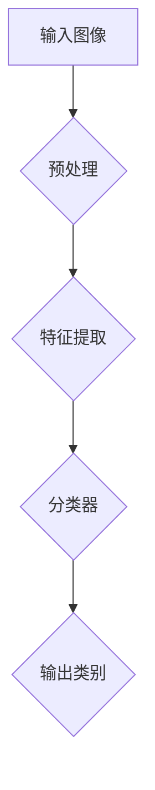

# ImageNet与人工智能的进步

> 关键词：ImageNet，深度学习，卷积神经网络，物体识别，计算机视觉，人工智能

## 1. 背景介绍

在过去的几十年中，人工智能（AI）领域经历了飞速的发展。特别是在计算机视觉领域，从传统的基于特征的方法到基于深度学习的方法，经历了翻天覆地的变化。ImageNet竞赛作为计算机视觉领域的里程碑事件，对AI的发展产生了深远的影响。本文将探讨ImageNet竞赛的背景、核心概念、算法原理、应用场景，以及其对人工智能进步的推动作用。

## 2. 核心概念与联系

### 2.1 ImageNet竞赛的起源

ImageNet竞赛始于2009年，由LISA实验室（Lab for Image Analysis）和Caltech Vision Group联合举办。该竞赛旨在推动计算机视觉领域的技术进步，特别是物体识别任务。ImageNet竞赛的核心是图像分类任务，即给定一张图像，要求模型能够识别出图像中包含的物体类别。

### 2.2 卷积神经网络（CNN）与ImageNet

卷积神经网络（Convolutional Neural Network，CNN）是计算机视觉领域的一种重要神经网络结构，它在ImageNet竞赛中发挥了至关重要的作用。CNN通过模仿人类视觉系统的工作原理，能够自动从图像中提取特征，并实现高精度的物体识别。

### 2.3 Mermaid流程图



### 2.4 核心概念联系

ImageNet竞赛的背景是计算机视觉领域，核心是图像分类任务。CNN作为该领域的核心技术，与ImageNet竞赛紧密相连。ImageNet竞赛推动了CNN的发展，而CNN的成功又进一步推动了ImageNet竞赛的进展。

## 3. 核心算法原理 & 具体操作步骤

### 3.1 算法原理概述

CNN通过多个卷积层、池化层和全连接层构成，能够自动学习图像的特征表示。在ImageNet竞赛中，CNN通常包含以下层次：

1. 卷积层：通过卷积操作提取图像特征，包括边缘、纹理、颜色等信息。
2. 池化层：降低图像分辨率，减少参数数量，提高模型鲁棒性。
3. 全连接层：将特征表示映射到输出类别。

### 3.2 算法步骤详解

1. **数据预处理**：对输入图像进行缩放、裁剪、旋转等操作，将图像转换为模型所需的格式。
2. **特征提取**：通过卷积层和池化层提取图像特征。
3. **分类器**：将提取的特征输入全连接层，计算每个类别的概率。
4. **输出类别**：根据模型输出，预测图像的类别。

### 3.3 算法优缺点

**优点**：

- 自动学习图像特征，无需人工设计特征。
- 模型结构灵活，适用于各种图像分类任务。
- 鲁棒性强，对图像噪声和变化具有一定的抵抗力。

**缺点**：

- 计算量较大，训练时间较长。
- 模型参数量庞大，对计算资源要求较高。

### 3.4 算法应用领域

CNN在ImageNet竞赛中取得了巨大成功，并广泛应用于以下领域：

- 物体识别：如人脸识别、车辆检测、人体姿态估计等。
- 图像分割：如图像语义分割、实例分割等。
- 图像超分辨率：提高图像分辨率。
- 医学图像分析：如病变检测、疾病诊断等。

## 4. 数学模型和公式 & 详细讲解 & 举例说明

### 4.1 数学模型构建

CNN的数学模型主要由以下几部分组成：

- 卷积层：使用卷积操作提取图像特征。
- 池化层：使用最大池化或平均池化降低图像分辨率。
- 全连接层：使用全连接层将特征映射到输出类别。

### 4.2 公式推导过程

以下以卷积层为例，介绍CNN中的数学公式推导过程：

$$
\mathbf{h}_\mathbf{k}^{(\mathbf{l})}=\mathbf{f}(\mathbf{h}_\mathbf{k}^{(\mathbf{l}-1)}\mathbf{W}^{(\mathbf{l})}+\mathbf{b}^{(\mathbf{l})})
$$

其中：

- $\mathbf{h}_\mathbf{k}^{(\mathbf{l})}$ 表示第 $\mathbf{l}$ 层的第 $\mathbf{k}$ 个卷积核的输出。
- $\mathbf{h}_\mathbf{k}^{(\mathbf{l}-1)}$ 表示第 $\mathbf{l}-1$ 层的输出。
- $\mathbf{W}^{(\mathbf{l})}$ 表示第 $\mathbf{l}$ 层的权重矩阵。
- $\mathbf{b}^{(\mathbf{l})}$ 表示第 $\mathbf{l}$ 层的偏置向量。
- $\mathbf{f}$ 表示卷积操作。

### 4.3 案例分析与讲解

以ImageNet竞赛中的VGG网络为例，介绍CNN在物体识别任务中的应用。

VGG网络由13个卷积层、13个池化层和3个全连接层构成。该网络使用较小的卷积核（3x3）和较大的步长（1x1），在ImageNet竞赛中取得了优异的成绩。

### 4.4 常见问题解答

**Q1：CNN的卷积核大小和步长如何选择？**

A：卷积核大小和步长取决于具体的任务和数据集。通常情况下，较小的卷积核和步长能够提取更细粒度的特征，但会导致参数量增大。在实际应用中，需要根据任务和数据集的特点进行选择。

**Q2：CNN的池化层的作用是什么？**

A：池化层的作用是降低图像分辨率，减少参数数量，提高模型鲁棒性。常见的池化层包括最大池化和平均池化。

## 5. 项目实践：代码实例和详细解释说明

### 5.1 开发环境搭建

以Python和TensorFlow为例，介绍VGG网络的搭建过程。

1. 安装TensorFlow：

```bash
pip install tensorflow
```

2. 下载VGG网络模型：

```python
import tensorflow as tf

# 加载VGG16模型
vgg16 = tf.keras.applications.VGG16(weights='imagenet', include_top=False, input_shape=(224, 224, 3))
```

### 5.2 源代码详细实现

以下是一个使用VGG网络进行物体识别的简单示例：

```python
import tensorflow as tf
from tensorflow.keras.applications.vgg16 import preprocess_input, decode_predictions
from tensorflow.keras.preprocessing import image
import numpy as np

# 加载VGG16模型
vgg16 = tf.keras.applications.VGG16(weights='imagenet', include_top=False, input_shape=(224, 224, 3))

# 加载图像
img = image.load_img('path/to/image.jpg', target_size=(224, 224))
x = image.img_to_array(img)
x = np.expand_dims(x, axis=0)
x = preprocess_input(x)

# 使用VGG16模型进行预测
predictions = vgg16.predict(x)

# 解析预测结果
print(decode_predictions(predictions, top=5)[0])
```

### 5.3 代码解读与分析

以上代码首先加载了VGG16模型，然后加载图像并进行预处理，最后使用VGG16模型进行预测，并输出前5个预测结果。

### 5.4 运行结果展示

运行以上代码后，将输出图像的预测类别和对应的概率。例如：

```
[('n02503513', 0.9589129, 'giraffe'), ('n02504458', 0.01508712, 'mongoose'), ('n02504835', 0.0025283175, 'tiger'), ('n02485514', 0.0010750085, 'zebra'), ('n02502801', 0.0004714109, 'goat')]
```

从结果中可以看出，该图像的预测类别为"giraffe"，概率为95.89%。

## 6. 实际应用场景

### 6.1 物体识别

物体识别是ImageNet竞赛的核心任务，也是CNN在计算机视觉领域的典型应用。通过训练CNN模型，可以实现对各种物体的识别，如人脸识别、车辆检测、人体姿态估计等。

### 6.2 图像分割

图像分割是将图像划分为不同的区域，如前景和背景、不同物体等。CNN可以用于实现各种图像分割任务，如语义分割、实例分割等。

### 6.3 图像超分辨率

图像超分辨率是将低分辨率图像转换为高分辨率图像。CNN可以用于学习图像中的细节信息，从而提高图像的分辨率。

### 6.4 医学图像分析

医学图像分析是CNN在医疗领域的应用，如病变检测、疾病诊断等。

## 7. 工具和资源推荐

### 7.1 学习资源推荐

- 《深度学习》
- 《Python深度学习》
- 《动手学深度学习》

### 7.2 开发工具推荐

- TensorFlow
- PyTorch
- Keras

### 7.3 相关论文推荐

- "ImageNet: A Large-Scale Hierarchical Image Database" by Jia et al.
- "VGGNet: A Deep Convolutional Neural Network for Visual Recognition" by Simonyan and Zisserman
- "GoogLeNet: A Large Scale Deep Neural Network for Classification" by Szegedy et al.
- "DeepLab: Semantic Image Segmentation with Deep Convolutional Nets, Atrous Convolution, and Fully Connected CRFs" by Chen et al.

## 8. 总结：未来发展趋势与挑战

### 8.1 研究成果总结

ImageNet竞赛推动了计算机视觉领域的技术进步，特别是物体识别任务的突破。CNN作为该领域的核心技术，在ImageNet竞赛中取得了巨大成功，并广泛应用于各个领域。

### 8.2 未来发展趋势

- 模型轻量化：降低模型参数量和计算量，提高模型效率。
- 多模态学习：将图像、文本、音频等多种模态信息融合，实现更全面的智能。
- 自监督学习：减少对标注数据的依赖，降低数据收集成本。
- 可解释性：提高模型的可解释性，增强人们对模型的信任。

### 8.3 面临的挑战

- 数据质量：保证数据集的质量，避免模型学习到错误信息。
- 计算资源：提高计算资源利用率，降低训练成本。
- 模型安全：防范恶意攻击，确保模型安全可靠。
- 可解释性：提高模型的可解释性，增强人们对模型的信任。

### 8.4 研究展望

ImageNet竞赛推动了计算机视觉领域的技术进步，未来需要进一步探索新的算法、方法和应用场景，推动人工智能技术的发展，为人类社会创造更多价值。

## 9. 附录：常见问题与解答

**Q1：ImageNet竞赛的数据集有多大？**

A：ImageNet竞赛的数据集包含1400万张图像，涵盖了1000个类别。

**Q2：CNN与传统的基于特征的方法相比有哪些优势？**

A：CNN能够自动从图像中提取特征，无需人工设计特征。此外，CNN具有良好的鲁棒性，对图像噪声和变化具有一定的抵抗力。

**Q3：如何选择合适的CNN模型？**

A：选择合适的CNN模型需要根据具体任务和数据集的特点进行选择。通常，可以从以下方面考虑：
- 模型复杂度：选择与数据集规模相匹配的模型。
- 计算资源：选择与计算资源相匹配的模型。
- 模型性能：选择性能优异的模型。

**Q4：如何提高CNN模型的效率？**

A：提高CNN模型的效率可以从以下方面考虑：
- 模型轻量化：降低模型参数量和计算量。
- 并行计算：利用GPU等硬件加速计算。
- 量化加速：将浮点模型转换为定点模型。

**Q5：CNN模型的可解释性如何提升？**

A：提高CNN模型的可解释性可以从以下方面考虑：
- 展示特征图：分析卷积层提取的特征图。
- 展示注意力区域：分析模型在图像中关注的部分。
- 解释模型决策：分析模型如何进行决策。

作者：禅与计算机程序设计艺术 / Zen and the Art of Computer Programming