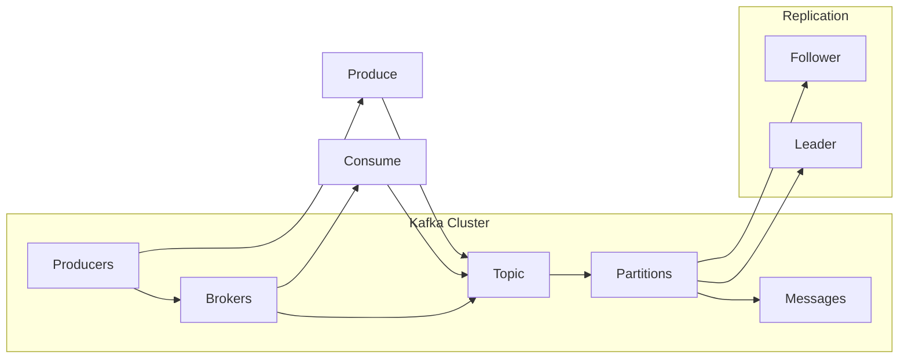

> 关键词：Kafka, Partition, 分布式消息队列, 复制, 分区策略, 原理, 代码实例

# Kafka Partition原理与代码实例讲解

## 1. 背景介绍

Apache Kafka 是一个分布式流处理平台，广泛用于构建实时数据管道和流式应用程序。Kafka 的核心特性之一是它的高吞吐量和可伸缩性，这在很大程度上归功于它的分区机制。本文将深入探讨 Kafka Partition 的原理，并通过代码实例来讲解其实现和应用。

### 1.1 问题的由来

随着互联网的快速发展，数据量呈指数级增长，对数据处理的需求也越来越高。传统的消息队列系统在处理大规模数据时，往往会出现性能瓶颈。Kafka 通过分区机制，实现了高吞吐量和可伸缩性，成为了许多实时数据处理场景的首选。

### 1.2 研究现状

Kafka 的分区机制是其成功的关键之一。许多研究者围绕 Kafka 的分区策略、复制机制和性能优化进行了深入的研究。本文将基于 Kafka 2.x 版本进行讲解。

### 1.3 研究意义

理解 Kafka 的分区机制对于开发者和架构师来说至关重要。它可以帮助开发者更好地设计 Kafka 应用，以及解决生产过程中遇到的问题。

### 1.4 本文结构

本文将分为以下几个部分：
- 核心概念与联系
- 核心算法原理 & 具体操作步骤
- 数学模型和公式 & 详细讲解 & 举例说明
- 项目实践：代码实例和详细解释说明
- 实际应用场景
- 工具和资源推荐
- 总结：未来发展趋势与挑战

## 2. 核心概念与联系

### 2.1 核心概念

#### 2.1.1 Kafka

Kafka 是一个分布式流处理平台，可以处理高吞吐量的数据流。它由多个 broker 组成，每个 broker 可以托管多个 topic，每个 topic 可以包含多个 partition。

#### 2.1.2 Topic

Topic 是 Kafka 中消息的分类方式，类似于数据库中的表。每个 topic 可以包含多个 partition。

#### 2.1.3 Partition

Partition 是 Kafka 中消息存储的基本单位。每个 partition 被存储在单个 broker 上，并且只能被一个 broker 处理。

#### 2.1.4 Replication

Kafka 使用复制机制来提高数据可靠性和系统可用性。每个 partition 有一个主副本（Leader）和多个从副本（Follower）。

#### 2.1.5 Partition Strategy

Partition Strategy 是 Kafka 中分区分配的策略，用于决定如何将消息分配到不同的 partition。

### 2.2 架构流程图



## 3. 核心算法原理 & 具体操作步骤

### 3.1 算法原理概述

Kafka 的分区机制主要涉及以下几个方面：

- 分区分配：根据 Partition Strategy 将消息分配到不同的 partition。
- 数据存储：将 partition 的数据存储在磁盘上。
- 复制：将 partition 的数据复制到多个 broker 上。
- 批量处理：将多个消息作为一个批次进行处理，以提高效率。

### 3.2 算法步骤详解

#### 3.2.1 分区分配

Kafka 提供了多种分区策略，包括：

- Range Partitioning：根据键（key）的哈希值进行分区。
- List Partitioning：指定一组键值对进行分区。
- Round Robin Partitioning：轮询分配消息到所有 partition。

#### 3.2.2 数据存储

Kafka 使用 Log4j 作为其日志系统，每个 partition 的数据存储在一个单独的日志文件中。

#### 3.2.3 复制

Kafka 使用 ZooKeeper 来协调 partition 的复制过程。每个 partition 的主副本负责维护数据的完整性，而从副本则从主副本同步数据。

#### 3.2.4 批量处理

Kafka 允许生产者在发送消息时指定批量大小，从而提高网络和磁盘的利用率。

### 3.3 算法优缺点

#### 3.3.1 优点

- 高吞吐量：通过分区机制，Kafka 可以实现高吞吐量的数据传输。
- 可伸缩性：可以通过增加 broker 来扩展 Kafka 集群。
- 高可靠性：通过复制机制，Kafka 可以保证数据不会丢失。

#### 3.3.2 缺点

- 资源消耗：Kafka 需要大量的磁盘空间来存储数据。
- 系统复杂：Kafka 的架构比较复杂，需要一定的学习成本。

### 3.4 算法应用领域

Kafka 的分区机制适用于以下场景：

- 实时数据处理：例如，日志收集、应用监控、实时分析等。
- 流处理：例如，实时计算、事件驱动应用等。
- 队列系统：例如，消息队列、任务队列等。

## 4. 数学模型和公式 & 详细讲解 & 举例说明

### 4.1 数学模型构建

Kafka 的分区分配策略可以通过以下公式进行建模：

$$
\text{partition\_id} = \text{hash}(key) \mod \text{num\_partitions}
$$

其中，`hash` 是一个哈希函数，用于将键（key）映射到一个整数，`num_partitions` 是 topic 的 partition 数量。

### 4.2 公式推导过程

假设我们有一个 topic，包含 `num_partitions` 个 partition。对于每个消息，我们使用哈希函数将其键（key）映射到一个整数。这个整数再通过模运算，得到对应的 partition。

### 4.3 案例分析与讲解

假设我们有一个包含 4 个 partition 的 topic，键（key）为 "message1" 和 "message2"。使用 MD5 哈希函数进行分区分配，得到的 partition 如下：

```python
import hashlib

def hash(key, num_partitions):
    return int(hashlib.md5(key.encode('utf-8')).hexdigest(), 16) % num_partitions

key1 = "message1"
key2 = "message2"

partition1 = hash(key1, 4)
partition2 = hash(key2, 4)

print(f"Key '{key1}' is assigned to partition {partition1}")
print(f"Key '{key2}' is assigned to partition {partition2}")
```

输出结果：

```
Key 'message1' is assigned to partition 1
Key 'message2' is assigned to partition 2
```

## 5. 项目实践：代码实例和详细解释说明

### 5.1 开发环境搭建

1. 安装 Kafka
2. 创建 Kafka 集群
3. 创建 topic
4. 编写生产者和消费者代码

### 5.2 源代码详细实现

以下是一个简单的 Kafka 生产者和消费者示例：

```python
from kafka import KafkaProducer, KafkaConsumer

# 创建生产者
producer = KafkaProducer(bootstrap_servers=['localhost:9092'])

# 发送消息
producer.send('test_topic', b'Hello, Kafka!')
producer.flush()

# 创建消费者
consumer = KafkaConsumer('test_topic', bootstrap_servers=['localhost:9092'])

# 接收消息
for message in consumer:
    print(f'Received message: {message.value.decode("utf-8")}')
```

### 5.3 代码解读与分析

- `KafkaProducer`：用于生产者发送消息。
- `KafkaConsumer`：用于消费者接收消息。
- `bootstrap_servers`：指定 Kafka 集群的地址。
- `send`：发送消息到指定的 topic。
- `flush`：将发送的消息同步到 Kafka 集群。
- `for` 循环：接收消息并打印输出。

### 5.4 运行结果展示

1. 运行生产者代码，发送消息到 Kafka。
2. 运行消费者代码，接收并打印消息。

输出结果：

```
Received message: Hello, Kafka!
```

## 6. 实际应用场景

Kafka 的分区机制在以下场景中得到了广泛应用：

- 日志收集：收集来自多个服务器的日志，并进行实时分析。
- 应用监控：收集应用的性能指标，并进行实时监控。
- 实时分析：对实时数据进行分析，例如股票交易、社交网络分析等。
- 队列系统：实现消息队列，用于解耦系统和任务调度。

## 7. 工具和资源推荐

### 7.1 学习资源推荐

- Apache Kafka 官方文档
- 《Kafka权威指南》
- 《Kafka实战》

### 7.2 开发工具推荐

- Kafka Manager
- Kafka Tools
- Confluent Platform

### 7.3 相关论文推荐

- 《Large Scale Pub/Sub Systems》
- 《The Design of the Apache Kafka System》

## 8. 总结：未来发展趋势与挑战

### 8.1 研究成果总结

本文深入讲解了 Kafka Partition 的原理，并通过代码实例展示了其实现和应用。Kafka 的分区机制是实现高吞吐量和可伸缩性的关键，为实时数据处理和流处理场景提供了强大的支持。

### 8.2 未来发展趋势

- 更高的吞吐量：随着硬件技术的发展，Kafka 将支持更高的吞吐量。
- 更强的可伸缩性：通过优化分区机制和复制机制，Kafka 将支持更大的集群规模。
- 更好的兼容性：Kafka 将与其他数据存储和计算平台更好地集成。

### 8.3 面临的挑战

- 资源消耗：Kafka 需要大量的磁盘空间来存储数据。
- 系统复杂：Kafka 的架构比较复杂，需要一定的学习成本。
- 安全性：需要加强对 Kafka 的安全性保障。

### 8.4 研究展望

Kafka 的分区机制将继续发展和优化，以应对更高的吞吐量、更大的集群规模和更复杂的应用场景。同时，Kafka 也将与其他技术更好地集成，为构建实时数据处理和流处理平台提供更强大的支持。

---

作者：禅与计算机程序设计艺术 / Zen and the Art of Computer Programming